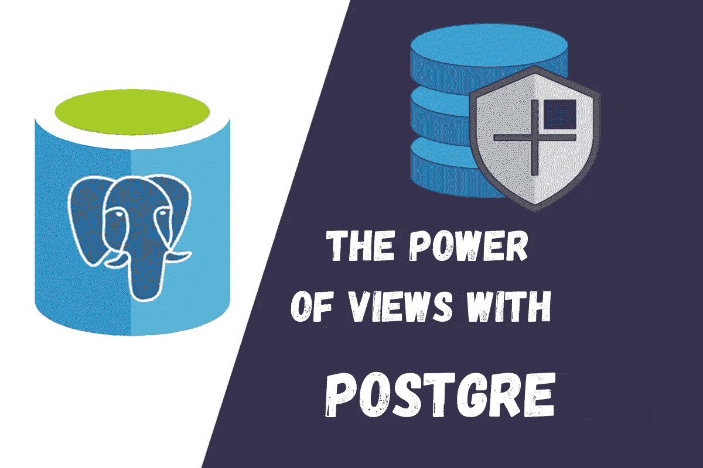
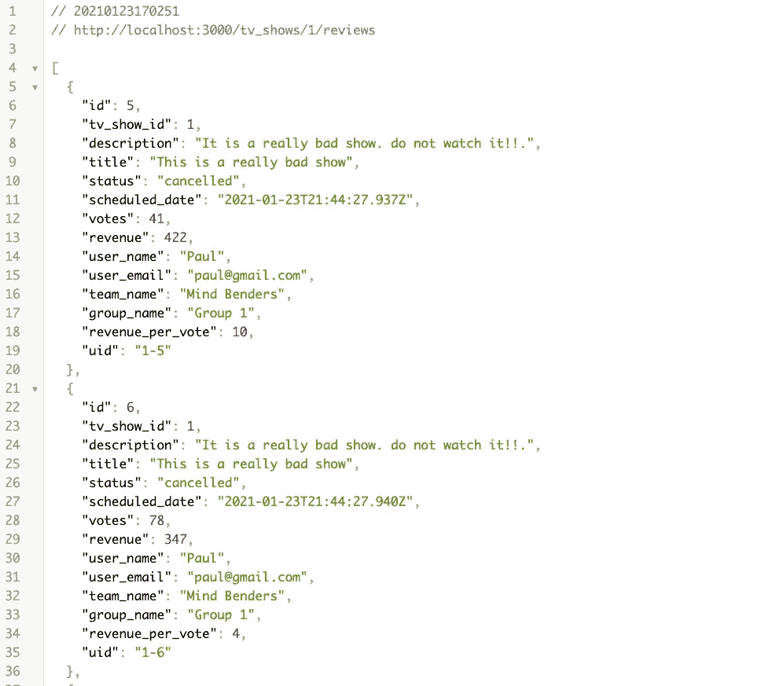

# 使用 Ruby on Rails 的 PostgreSQL 视图

> 原文：<https://levelup.gitconnected.com/postgresql-views-with-ruby-on-rails-78260cd6f021>

## 利用视图的力量封装复杂的查询。



Postgres 提供了两种类型的视图，普通视图和物化视图。两者都可以解决与封装、抽象和提高性能相关的类似问题。

值得一提的是，视图和物化视图不仅仅在使用 Postgres 作为数据库时可用，几乎所有的关系数据库都支持使用视图和物化视图。

让我们先定义一下 Postgres 中的视图是什么。

# 视图

视图是一组 SQL 查询，可以被视为一个表。您可以使用一个模型调用它，该模型将依次执行视图中定义的 SQL，并返回数据。

这是视图的简单定义，它就是 SQL。但是，使用视图有什么好处呢？。

它有助于封装和抽象复杂的 SQL 查询，这些查询可以存在于模型或服务对象中。它还简化了更改 SQL 查询的过程，因为只有一个地方可以执行一些更改。

想象一下，如果您在应用程序的许多地方使用相同的 SQL 查询，无论何时您需要重写查询并进行更改，您都必须找到您使用它的所有地方。那不太合适。

## 使用视图的优势

1.  封装复杂的查询。
2.  抽象联接、group by、where、order by 和任何其他 SQL 语句。
3.  在应用程序中重用复杂的查询。
4.  消除模型或服务对象中的 SQL 查询。
5.  让你的代码更整洁。

正如我提到的，视图是我们可以使用模型访问的表格。但是，我们只能查询视图，而不能执行创建、更新或删除操作，因为它不是一个真正的表，它只是一组每当我们访问模型时运行的 SQL。

现在，使用视图的定义和优点已经很清楚了，让我们创建一个 rails 应用程序。

# 项目描述

对于这个项目，我们将使用一个视图来封装一个复杂的 SQL 查询。这个查询将检索一个电视节目的评论。我将使用一个名为 [scenic](https://github.com/scenic-views/scenic) 的宝石来创建视图。

```
rails new tv_shows --api -d=postgresql -T
```

让我们创建数据库。

```
rails db:create
```

现在让我们生成模型。

```
rails g model TvShow name show_type
rails g model Group name contact email
rails g model Team name color description status:integer group:references
rails g model User name email status:integer team:references
rails g model ReviewType name code
rails g model Review description title scheduled_date:datetime votes:integer revenue:integer status:integer user:references review_type:references tv_show:references
```

由于应用程序允许用户选择属于某个团队，团队选择属于某个组，而审阅选择属于某个审阅类型或用户。对于每次迁移，请确保将这些外键上的 **null: false** 标志更改为 true。

你可以在这里查看[的迁徙。](https://github.com/YairFernando67/tv_shows/tree/master/db/migrate)

让我们迁移数据库。

```
rails db:migrate
```

模型间关联的定义如下:

我将使用一个种子文件向数据库中插入一些数据。从 repo 中复制 [seed.rb 文件的内容，并将其粘贴到您的种子文件中。](https://github.com/YairFernando67/tv_shows/blob/master/db/seeds.rb)

在我们播种 DB 之前，将 faker 添加到开发、测试组的 Gemfile 中。

```
gem "faker"
```

安装 gem，然后播种 DB。

```
bundle install
rails db:seed
```

我将创建一个端点来获取电视节目的评论。为此，让我们创建一个控制器。

```
rails g controller Reviews index
```

在 routes.rb 文件中，更改这个文件的路由。

```
get 'tv_shows/:id/reviews', action: :index, controller: :reviews
```

在控制器中放入以下代码:

在这里，我使用一个服务对象来构建评论，这样控制器只负责呈现评论，繁重的工作委托给服务对象。

在 app 文件夹下，创建一个 services 文件夹，并在其中创建一个新文件 reviews_service.rb

这个服务对象有一个接收参数并初始化类的类方法。这只是抽象初始化步骤的一种方式。然后服务调用 get_reviews 方法。

事情从这里开始变得更加复杂。这个方法有一个又长又复杂的 SQL 查询。最重要的是，它真的很难阅读，这使得服务看起来很丑。

暂时不要担心！。我们很快会修理它。

现在，如果我们启动服务器，点击端点，我们应该能够看到评论。

```
rails s[http://localhost:3000/tv_shows/1/reviews](http://localhost:3000/tv_shows/100/reviews)
```



复习

现在，让我们用一个视图来解决这个丑陋的问题。

在宝石文件里面，添加风景宝石。

```
gem 'scenic', '~> 1.5', '>= 1.5.4'
```

安装宝石

```
bundle install
```

生成一个新视图，我称之为 latest_reviews。

```
rails generate scenic:view latest_reviews
```

这将创建两个文件。

1.  **db/views/latest _ reviews _ v01 . SQL**
2.  **db/migrate/timestamp _ create _ latest _ reviews . Rb**

迁移文件包含在 Postgres 中创建视图的代码。我们不会修改这个文件。

SQL 文件是我们编写每次调用这个视图时要运行的查询的地方。

所以我们要做的是，把复杂的 SQL 查询转换成纯 SQL。最终的查询如下所示。

现在我们可以迁移视图了。

```
rails db:migrate
```

正如我提到的，要与这个视图交互，我们需要一个模型，所以让我们创建一个。在 models 文件夹中创建一个新文件。

```
touch latest_review.rb
```

模型是这样的。

关于这个模型有两点需要考虑。首先，这个模型是只读的，这意味着我们不能执行任何 CRUD 操作，其次，我们可以选择性地定义一个主键，在这个例子中，我将主键定义为审查的 id，但是我们可以分配任何我们想要的字段，只要它是唯一的值。

正如你所看到的，我也定义了一个属于关联，因为最近的评论应该属于一个电视节目。

现在，在 tv_show 模型中，我们也需要添加这种关联。

```
has_many :latest_reviews
```

在服务对象中，我们现在可以替换 SQL 查询，而只调用电视节目对象上的 latest_reviews 关联。

```
tv_show.latest_reviews
```

经过这一更改，服务对象看起来像这样。

这就是 PostgreSQL 中视图的强大之处。我们已经从服务对象中抽象出丑陋而复杂的 SQL 查询，而且现在我们可以在任何地方重用这个查询，因为它是一个关联。

这允许我们有一个更易维护的代码，因为如果我们想要修改这个查询，只有一个地方可以去，另外它还可以使我们的模型和服务对象避免长时间的 SQL 查询。

太好了！如果我们重启 rails 服务器并再次点击端点，我们应该会看到和之前一样的结果。

你可以在这里找到这个[项目的代码。](https://github.com/YairFernando67/tv_shows)

# 结论

在封装和抽象复杂的 SQL 操作时，视图确实非常强大，它还增加了应用程序的可重用性。我强烈建议在您的应用程序充满复杂的 SQL 时使用视图，这些 SQL 既不属于模型，也不属于应用程序级别的任何其他层。

有一种视图具有超能力，那就是物化视图。如果您想了解物化视图如何进一步提高性能，请查看本文， [**物化视图和使用 Rails 的 Sidekiq 作业**。](https://medium.com/swlh/materialized-views-and-sidekiq-jobs-with-rails-f83b1e950f20)

我希望你在应用程序中使用视图时感觉更舒服，谢谢你的阅读！