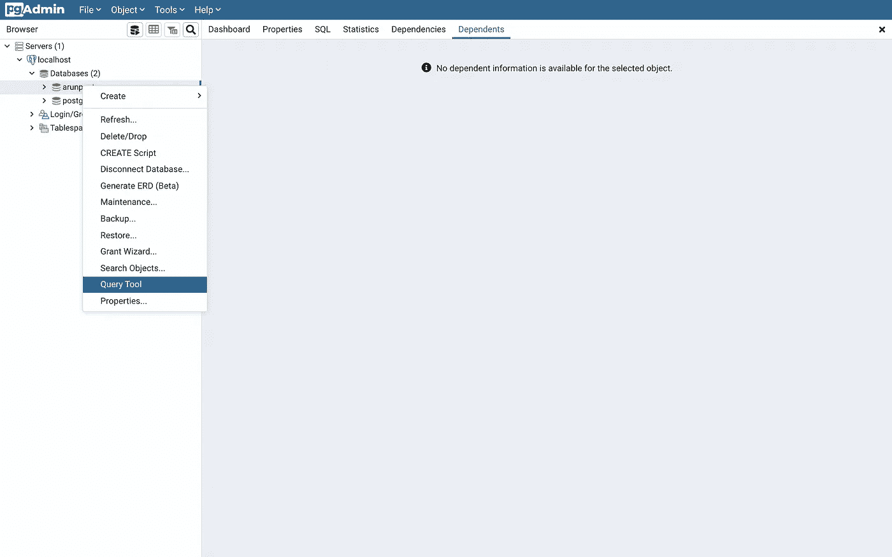
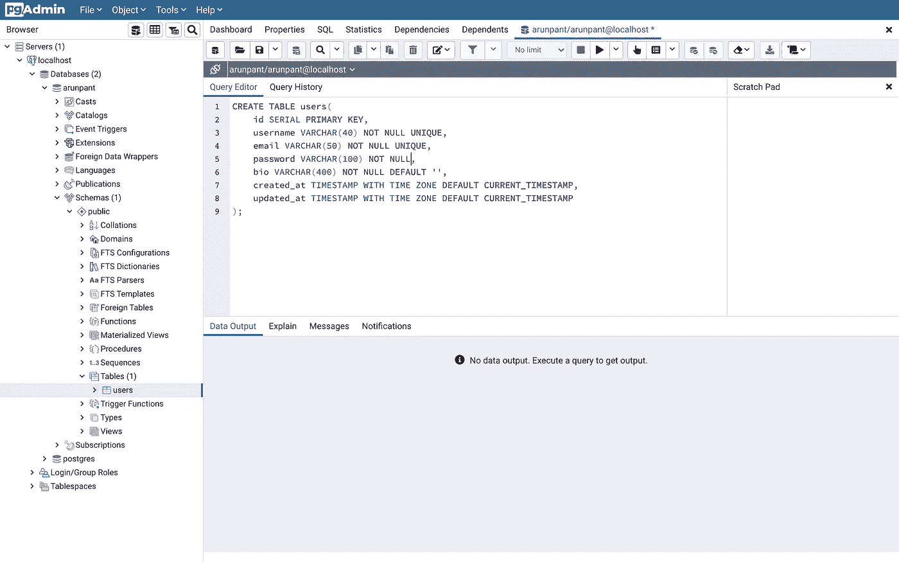
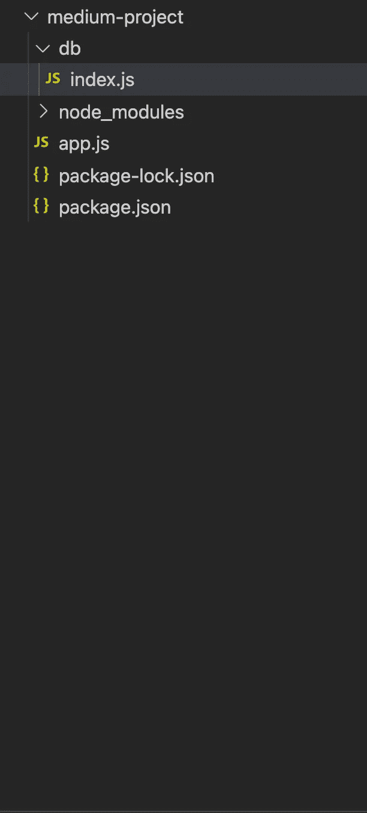
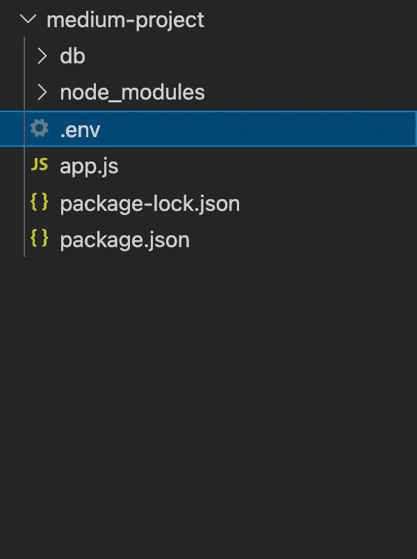
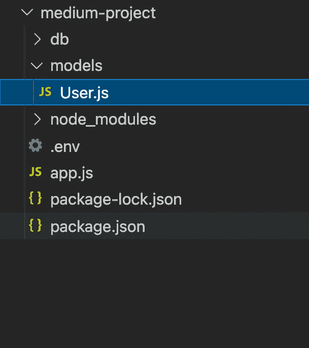
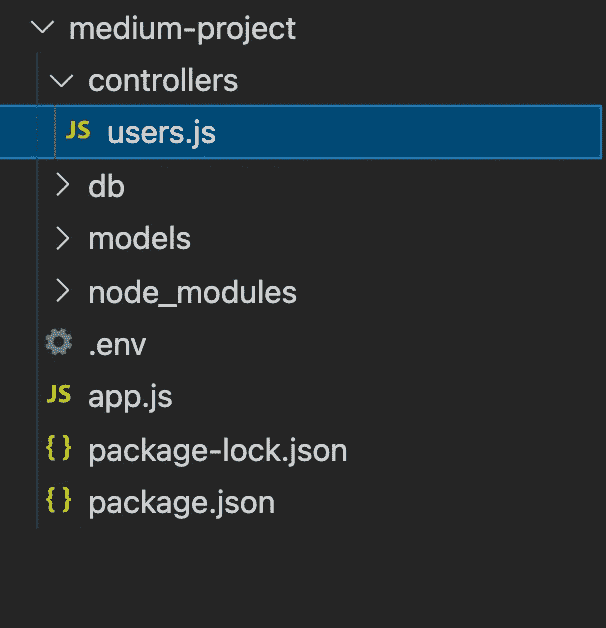
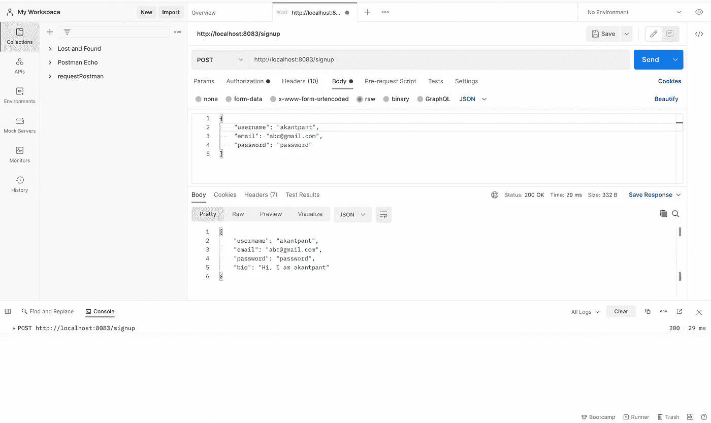

# 带有 Node.js 的 PostgreSQL

> 原文：<https://levelup.gitconnected.com/postgresql-with-node-js-198041f39ad1>

通过这篇博客，我将向您展示如何使用 **Node.js** 和 **PostgreSQL** 创建一个基本的 REST API。

我们将另外使用 **express** 和 **node-postgres** 。这个博客将**而不是**使用类似 Sequelize 的 ORM，这样我们可以更好地理解查询部分。

我们的应用程序将简单地注册用户，并将他们添加到我们的数据库中。

## 创建项目库

在您选择的目录中，生成一个空节点项目:

```
npm init -y
```

现在让我们安装 express:

```
npm install express
```

太好了，我们现在可以开始一个基本的服务器。我们将创建主 **app.js** 文件:

```
const express = require('express');
const app = express();app.use(express.json());// we will eventually use env variables
const **PORT** = **process.env.PORT** || 8080;app.listen(**PORT**, () => {
  console.log('Server Started');
});
```

现在让我们创建我们的**用户**表。为此，请确保您的系统上安装并运行了 PostgreSQL。我们还将使用 [pg-admin](https://www.pgadmin.org) 与该表进行交互。

让我们首先创建这个表。在 pg-admin 中，用您的用户名(或您选择的另一个数据库)右键单击数据库，并选择查询工具:



注册的用户应该有一个**用户名**、**电子邮件**、**密码**和一个可选的简历。我们可以写出并执行以下查询来创建该表:

```
CREATE TABLE users(
  id **SERIAL** **PRIMARY KEY**,
  username VARCHAR(40) **NOT NULL UNIQUE**, 
  email VARCHAR(50) **NOT NULL UNIQUE**,
  password VARCHAR(100) **NOT NULL**,
  bio VARCHAR(400) **NOT NULL DEFAULT ''**,
  created_at **TIMESTAMP** WITH TIME ZONE **DEFAULT CURRENT_TIMESTAMP**,
  updated_at **TIMESTAMP** WITH TIME ZONE **DEFAULT CURRENT_TIMESTAMP** );
```

请注意，**用户名和电子邮件应该始终是唯一的**。该表现在应该可以在 pg-admin 侧边栏中看到:



边栏中可见的用户表

# 开始开发我们的节点应用程序

## 添加节点-postgres

回到您的项目目录，让我们首先创建一个到数据库的连接。为此，我们将使用[节点-postgres](https://node-postgres.com) 模块。

```
npm i pg
```

接下来，创建一个名为 **db** 的新目录，并向其中添加一个 **index.js** 文件。



这个文件将保存我们的**连接池配置**，我们可以在整个项目中导入和使用它。

打开 **db/ index.js** 文件，添加以下几行:

```
const { **Pool** } = require('pg');
const pool = new **Pool**();
```

在这个博客中，我们将使用一个**连接池**来与我们的数据库进行交互。

我们使用 [**连接池**](https://node-postgres.com/features/pooling) 来代替单客户端连接，因为它提供了好处。但是我们如何将这个池连接到我们的数据库呢？

## 为我们的数据库连接添加配置

要建立数据库连接，我们需要以下信息:

*   数据库**用户**(默认为您的系统用户名)
*   数据库**主机**(数据库在哪里运行)
*   数据库**端口**(默认为 5432)
*   **数据库名称**(默认为您的 postgres 用户名)
*   **数据库密码**

对于您的本地配置，应该很容易找到这些信息。

现实世界的项目通常会使用环境变量来获取这些信息。因此，我们将创建一个**。env** 文件，所有这些信息都在项目的主目录中。



将以下条目添加到文件中，用您自己的本地数据库配置替换 **PGUSER** 、 **PGPASSWORD** 和 **PGDATABASE** 的密钥。其他条目在大多数情况下应该是相同的。

```
**PGUSER**='arunpant'
**PGHOST**='localhost'
**PGDATABASE**='arunpant'
**PGPASSWORD**='mySuperSecretPassword'
**PGPORT**=5432
PORT=8083
```

如果你记得我们的 **app.js** 文件:

```
const **PORT** = **process.env.PORT** || 8080;
```

为了确保像 PORT 这样的环境变量被拾取，我们将使用 [**dotenv**](https://www.npmjs.com/package/dotenv) npm 包。

```
npm i dotenv
```

而在 **app.js** :

```
const express = require('express');
const app = express();**require('dotenv').config();**...
```

## 创建查询生成器

让我们回到我们的 **db/index.js** 文件，处理剩下的内容。我们将制作一个**查询**功能，可以导出到我们的应用程序中的其他地方进行查询。

```
const { Pool } = require('pg');
const **pool** = new Pool();module.exports = {
    async query(**text**, **params**) {
      const res = **await pool.query(text, params);**
      return res;
    }
};// **text** will be something like '**SELECT * FROM $1**'
// **params** something like this array: **['users']** i.e. the table name
// **$1** => replaced by **users** in final query
```

**文本**将是我们的查询，**参数**将是这个查询的动态元素，它们被单独添加到**防止 SQL 注入攻击**中。

由于 **pool.query** 操作可能会由于多种原因而失败，比如违反约束，所以让我们添加一些基本的错误处理和日志记录:

```
const { Pool } = require('pg');
const pool = new Pool();module.exports = {
    async query(text, params) { // invocation timestamp for the query method
        const start = Date.now(); try {
            const res = await pool.query(text, params); // time elapsed since invocation to execution
            const duration = Date.now() - start; console.log(
              'executed query', 
              {text, **duration**, rows: res.rowCount}
            );
            return res;
        } catch (error) {
            console.log('error in query', {text});
            **throw error;**
        }
    }
};
```

我们将代码封装在 try catch 块中，并添加了一些基本的日志记录。

Node-postgres 会将错误元数据添加到抛出的错误中。我们将很快使用一个这样的错误代码来识别用户名的唯一约束违反。

我们现在可以导出这个查询方法，并传入查询文本及其参数来执行查询。

# 创建注册用户的流程

我们将在项目中创建一个**模型**文件夹，并向其中添加一个 **User.js** 文件。



让我们首先在这个文件中为我们的用户添加基本的构造函数:

```
function User ({
  username, 
  email, 
  password, 
  bio=`Hi, I am ${username}`
}) {
    **this.username** = username;
    **this.email** = email;
    **this.password** = password;
    **this.bio** = bio;
};
```

我们现在将向其原型**添加一个方法，用于实际的用户创建:**

```
const db = require('../db');//User constructor
function User ({
  username, 
  email, 
  password, 
  **bio=`Hi, I am ${username}`**
}) {
    this.username = username;
    this.email = email;
    this.password = password;
    this.bio = bio;
};// add a createUser method to the prototype
**User.prototype.createUser** = async function() {
    try {
        const **{ rows }** = await **db.query**( `INSERT INTO users(username, email, password, bio) 
            VALUES ($1, $2, $3, $4)`,
            [**this**.username, **this**.email, **this**.password, **this**.bio] ); return **rows**; 
    } catch (error) {
        throw error;
    }
};module.exports = User;// **db.query**: the query method we exported earlier from db/index.js
```

> 默认情况下，node-postgres 读取行并将它们收集到 JavaScript 对象中，这些对象的键与列名匹配，值与每列的相应行值匹配。

我们解结构的 **{ rows }** 对象将保存这些信息，如果有的话。它将为特定查询的所有匹配行保存一个对象数组。

这样，我们就有了基本的用户模型。

## 为用户注册创建控制器

让我们在项目中创建另一个名为 **controllers** 的文件夹，并向其中添加一个 **users.js** 文件。



让我们将控制器代码添加到这个文件中。

```
**const User = require('../models/User');****exports.postSignup** = async (req, res, next) => {
    //getting user data from request body
    const {**username, password, email, bio**} = req.body;
    try {
        const user = **new User({username, password, email, bio});**
        const result = **await user.createUser()**;
        res.send(user);
    } catch (error) {
        next(error);
    }
};Remember the **createUser** method we added to the User model **prototype**? It is therefore available on our **user model instance** above.
```

**用户**。 **createUser()** 将执行我们的用户插入查询。例如，在违反唯一约束的情况下，该查询可能会失败。我们对用户名有一个惟一的约束，如果有人试图用相同的用户名创建一个用户，createUser 方法将抛出一个错误。

该错误将保存特定类型的约束违反的元数据，包括我们可以用来识别它确实是唯一的约束违反的代码。

Postgres 带有特定的错误代码，您可以在这里查看这些代码的列表。

以下是一些违反完整性约束的错误代码片段:

```
Class 23 — Integrity Constraint Violation
23000 integrity_constraint_violation
23001 restrict_violation
23502 not_null_violation
23503 foreign_key_violation
**23505 unique_violation**
23514 check_violation
23P01 exclusion_violation
```

鉴于这篇博客的范围，我们不会涵盖所有的错误场景，所以让我们只添加一个违反**唯一**约束的情况。

回到控制器中，按如下方式修改代码:

```
...exports.postSignup = async (req, res, next) => {
    const {username, password, email, bio} = req.body;
    try {
        const user = new User({username, password, email, bio});
        const result = await user.createUser();
        res.send(user);
    } catch (error) { **const errorToThrow = new Error();
        switch (error?.code) {
            case '23505':
                errorToThrow.message = 'User already exists';
                errorToThrow.statusCode = 403;
                break;
            default:
                errorToThrow.statusCode = 500;
        }** **//pass error to next()
        next(errorToThrow);** }
};
```

当查询操作遇到错误时，特定的 **postgres 错误代码(本例中为 23505)**被添加到错误对象中。

请记住，我们正在检查是否违反了这个特定的代码:

```
**23505 unique_violation**
```

我们的 catch 块将简单地 **next()** 这个错误，并且我们可以添加熟悉的快速错误处理程序来捕获**这样的错误，在主 **app.js** 文件中有一个消息和 statusCode** 属性:

```
...**app.use((err, req, res, next) => {
    if(err.statusCode) {
        res.status(err.statusCode).send(err.message);
    } else {
        console.log(err);
        res.status(500).send('Something unexpected happened');
    }
});**const PORT = process.env.PORT || 8080;...
```

我们现在将创建一个使用这个控制器的路由，这非常简单。

在您的项目中创建一个名为 **routes** 的文件夹，并向其中添加一个 **users.js** 文件:

```
const express = require('express');
const router = express.Router();const usersController = **require('../controllers/users')**;router.post('/signup', **usersController.postSignup**);module.exports = router;
```

我们可以在我们的 **app.js** 文件中注册这条路线:

```
...**const usersRoute = require('./routes/users');****app.use(usersRoute);**...
```

有了这个，我们现在可以使用 Postman 检查我们的 API 是否按预期工作。

## 验证 API 行为

让我们首先开始这个项目:

```
node app.js
```

让我们使用 postman 向'/signup '路由发出 POST 请求，请求一个新用户:



我们的帖子请求在起作用

如您所见，我们向[http://localhost:8083/sign up](http://localhost:8083/signup)发出了一个请求，其中包含了我们的用户名、电子邮件和密码。

如果您还记得，在我们的用户模型中，我们添加了一个默认的生物值，以防没有提供。

现在让我们看看是否可以用相同的用户名创建另一个用户。


行动中的错误处理

如果一切正常，您应该会看到上面的响应，带有一个 **403** 状态代码和我们添加的“用户已经存在”消息。您的终端日志也会包含错误信息。

我希望有了这个基本的 API 设置，您也可以继续创建更高级的 API。例如，接下来验证登录流。

希望这个博客对你有所帮助，哪怕是一点点。祝你未来的编码之旅一切顺利！