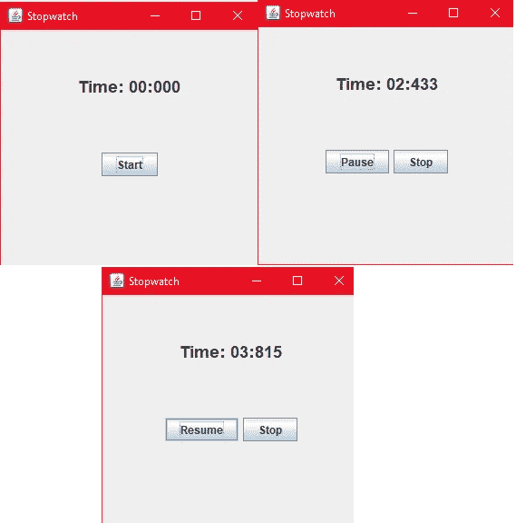
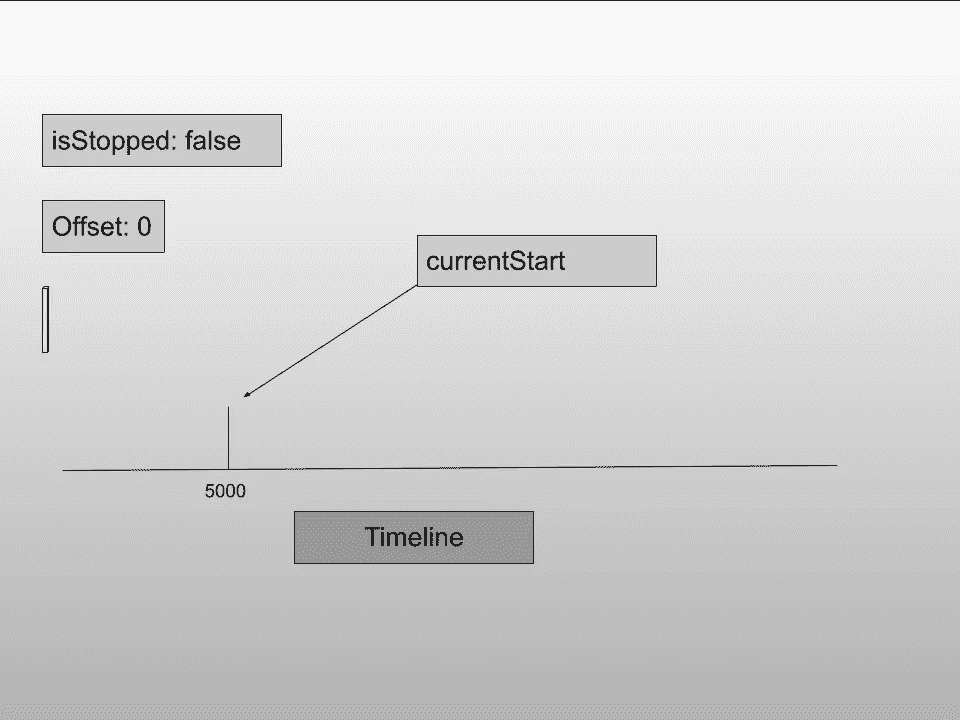
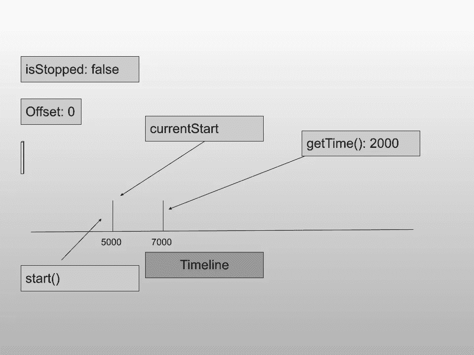
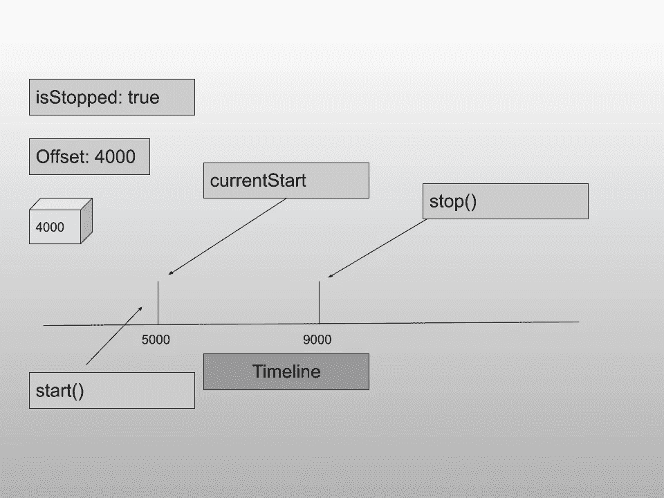
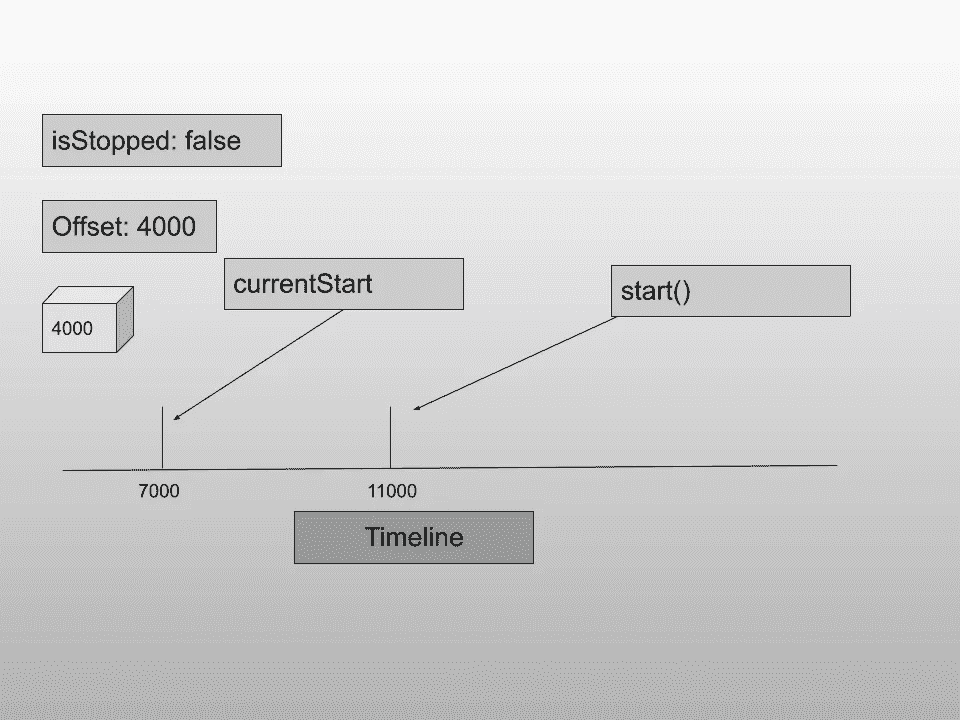
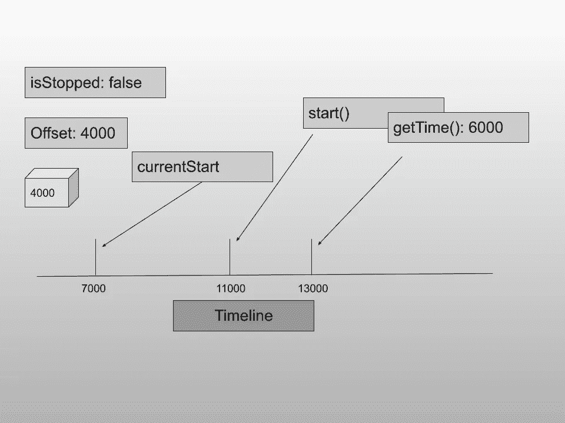
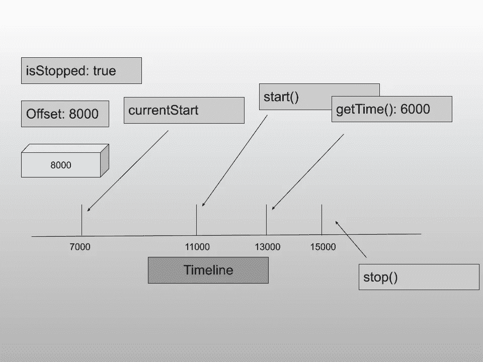
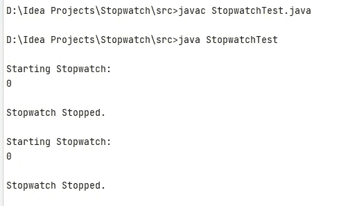
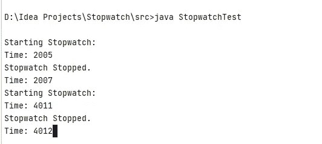

# 强大的设计模式来创建一个惊人的秒表应用程序(第 1 部分)

> 原文：<https://levelup.gitconnected.com/powerful-design-patterns-to-create-an-amazing-stopwatch-app-part-1-b408addedc79>


礼貌:timeanddate.com

回答我一个问题。你认为写程序容易吗？嗯，这取决于问题(也取决于程序员的心情)。你认为编写**结构化**程序容易吗？在这个问题上加一个词就有了很大的变化。首先，你说的结构化程序是什么意思？而你如何编写程序，让其他人容易理解，甚至不需要阅读你的代码注释？这是一项相当困难的任务，面向对象编程的概念试图通过使用四个原则来解决它:抽象、封装、多态和继承。随着设计模式的出现，人们编写结构化代码变得越来越容易。这很简单，只要按照模式。你是如何学习这些模式的？让使用它的应用程序变得简单。

> 这个系列“创建一个惊人的秒表应用程序的强大设计模式”将让你感受到如何应用普通的设计模式，如 Observer 和 State，来创建易于理解的结构化程序。我们还将使用线程的概念，给这个应用程序一个更平滑的 UX。

我们将使用 Java Swing 创建秒表应用程序(您将很快获得完整应用程序的预览)。我们之所以使用 Swing，是因为其他平台上的应用程序需要花费大量时间来设置它们的环境。除了 JDK 之外，Swing 不需要任何东西，而且很容易编写 GUI 程序，不需要任何 HTML 代码。我已经把这个系列分成了**六个**部分，从零开始慢慢构建，这是第一部分。在前 3 部分，我们将专注于使我们的核心秒表类越来越好，在接下来的 3 部分，我们将制作我们的 Swing 应用程序。所有代码都可以从 Github 下载。

让我们预览一下我们将要构建的应用程序。完整的代码可以在 [**这里**找到。](https://github.com/rajtilakls2510/Stopwatch/tree/S6_Implementing_the_state_pattern)



看起来很老派，对吧？但这就是 Swing 应用程序的样子。我们在这里的目标不是拥有一个非常漂亮的用户界面的应用程序，而是以这样一种方式构建后端，以便它是强大的，并且可以被每个人容易地理解。我们的主要焦点是注入设计模式。

但是我们不会一开始就采用任何模式。让我们首先弄清楚我们的核心秒表类是如何工作的。

这个“秒表”将是一个普通的类(Stopwatch.java)，它的内部值(internal time)应该初始化为零。我们可以启动秒表，我们应该能够暂停它，恢复它，我们应该能够停止它。对吗？你对秒表还有什么期望！

但是为了使我们的生活更简单，我们将只实现暂停和恢复方法。这意味着我们将只能从我们离开的地方恢复秒表，并随时暂停它。将使用这个秒表的类可以负责实现开始、暂停、恢复和停止的所有功能。从技术上讲，您可以在秒表类中实现所有四个特性，但这是一项艰巨的工作，只实现暂停和恢复就可以了。

注意:暂停和恢复功能将使用秒表类的 stop()和 start()方法来实现。此外，将有一个 getTime()方法来获取秒表当前的时间。

让我们对将要发生的事情有一个更清晰的了解:

*   首先，我们将创建一个“秒表”对象。它的内部时间将被初始化为零，并且它将处于停止状态。
*   当我们单击 start()方法时，秒表应该考虑内部时间并更新内部时间，从而恢复计时。
*   当我们单击 stop()方法时，秒表应该暂停计数。

就是这样。这就是我们秒表类要做的全部工作。

现在让我们弄清楚内部时间在我们的类中存储的逻辑。这可能有点令人困惑，但坚持到最后。我会尽力让你明白。

在这一点上，我想鼓励你找出其中的逻辑，因为 java 有一个方便的方法来给系统时间。

```
System.currentTimeInMillis(); // Gives system current time in Miliseconds
```

让我们开始吧:

我们需要在秒表类中存储的只是

*   “偏移”是秒表已经运行的总时间，
*   秒表的状态(“停止”)，以及
*   “当前启动”。

第一次创建秒表时，偏移量首先初始化为 0。isStopped 设置为 true，表示秒表处于暂停/停止状态。“currentStart”存储最后一次调用 Start()方法时的时间戳。

现在，每当我们点击 start()方法时，我们将通过存储当前系统时间来记下 currentStart。然后，我们将从 currentStart 中减去失调。并通过将“false”放入 isStopped 布尔值来使秒表处于运行状态。

每次我们点击 stop()方法时，我们只注意到偏移量是“当前系统时间-当前开始”。然后我们让停止布尔值为真。

getTime()方法为我们提供秒表运行的时间(毫秒)(显示时间)。当我们调用 getTime()时，我们返回“当前系统时间-当前开始”。(我们现在不编写任何格式化逻辑，但是我们可以在以后添加它)

所有这些逻辑可能第一次有点难以理解，所以让我们看一个例子。

假设我们刚刚创造了秒表。偏移量为零，秒表处于停止状态。当我们启动它时，考虑当前系统时间是 5000 毫秒(这是极不可能的，但考虑它作为一个例子)，它存储在 currentStart 中(因为 5000 - 0 = 5000)。秒表的状态是这样。



现在，2000 毫秒后，我们调用 getTime()来知道时间。在这个时间点，系统当前时间是 7000 ms，秒表已经运行了 2000 ms。因此，返回给我们的时间将是 current time - currentStart，即 7000 - 5000 = 2000。



现在，在 2000 毫秒之后，我们调用 stop()方法来暂停秒表。“偏移量”变为“当前时间-当前开始时间”= 9000 - 5000 = 4000。



现在，当我们调用 getTime()时，它应该返回偏移量而不是当前系统时间——current start，因为秒表处于停止状态。让我们再经历一次同样的过程。

2000 ms 后，我们再次调用 start()。请注意，start 方法是在 11000 ms 时调用的，而 currentStart 是在 7000 ms 时调用的，这说明了秒表最初是在 5000 ms 时启动的，到目前为止，在其整个生命周期中暂停了 2000 ms。



2000 毫秒后，当我们调用 getTime()时，我们得到 6000 毫秒，这是秒表到现在为止已经运行的时间。



最后，在 2000 ms 后，当我们按 stop()时，总运行时间存储在 offset 中，并帮助秒表随后正确恢复。



每次按 start()和 stop()分别恢复和暂停秒表时，都会出现这一序列。

既然我们已经弄清楚了我们的秒表将遵循什么逻辑，让我们把这个东西编码出来。首先，我们制作一个新的 java 文件“Stopwatch.java”并制作 Stopwatch 类。

```
public class Stopwatch
{
}
```

让我们添加类变量:offset (long)、currentStart (long)和 isStopped (boolean)并在构造函数中初始化它们。

```
public class Stopwatch
{
    private long offset, currentStart;
    private boolean isStopped;

    public Stopwatch()
    {
        offset = 0L;
        currentStart = System.*currentTimeMillis*();
        isStopped = true;
    }}
```

offset 设置为零，currentStart 现在可以是任何值，is stop 为 true，表示秒表处于停止状态。然后，我们添加 start()方法来启动/恢复秒表。

```
public class Stopwatch
{
    ....

    public void start()
    {
        if(isStopped)
        {
            currentStart = System.*currentTimeMillis*() - offset;
        }

        isStopped = false;
    }
}
```

请注意“如果”语句。这意味着只有当秒表处于停止状态时，我们才会启动它。否则，什么都不会发生。接下来，我们创建 stop()方法来停止/暂停秒表。

```
public class Stopwatch
{
   ...

    public void stop()
    {
        if(!isStopped)
        {
            offset = System.*currentTimeMillis*() - currentStart;
        }
        isStopped = true;
    }
}
```

如前所述，还创建了 getTime()方法，它给出秒表的当前时间。

```
public class Stopwatch
{
    ...

    public long getTime()
    {
        if(!isStopped)
            return System.*currentTimeMillis*() - currentStart;
        else
            return offset;
    }
}
```

请注意“如果”语句。这表示当秒表处于停止状态时，返回偏移量。否则，为秒表的当前时间。

这些都在我们的“Stopwatch.java”类中。现在让我们来测试一下。创建另一个文件“StopwatchTest.java ”,并在 main 方法中创建一个秒表，调用几次 start()、stop()、getTime()方法，我们就完成了。

```
public class StopwatchTest {
    public static void main(String[] args) {
        Stopwatch sw = new Stopwatch();

        System.*out*.println("\nStarting Stopwatch: ");
        sw.start();
        System.*out*.println(sw.getTime());
        sw.stop();
        System.*out*.println("\nStopwatch Stopped. ");

        System.*out*.println("\nStarting Stopwatch: ");
        sw.start();
        System.*out*.println(sw.getTime());
        sw.stop();
        System.*out*.println("\nStopwatch Stopped. ");

    }
}
```

输出可能不令人满意。你可能会看到这样的东西。



很明显，我们没有给秒表任何运行的时间，这就是为什么当我们在 start()之后调用 getTime()时，我们得到 0。我们可以通过注入 Thread.sleep()引入时间延迟，使当前线程休眠一段时间。由于 Thread.sleep()方法需要一个 try-catch 来处理 InterruptedException，我们将创建一个名为 sleep()的方法。

```
public class StopwatchTest {
   ...

    public static void sleep(int time)
    {
        try {
            Thread.*sleep*(time);
        } catch (InterruptedException e) {
            e.printStackTrace();
        }
    }
}
```

现在，我们可以写了

```
public class StopwatchTest {
    public static void main(String[] args) {
        Stopwatch sw = new Stopwatch();
System.*out*.println("\nStarting Stopwatch: ");
        sw.start();
        *sleep*(2000); // 2 sec time delay
        System.*out*.println(sw.getTime());
        *sleep*(2000);
        sw.stop();
        System.*out*.println("\nStopwatch Stopped. ");

        *sleep*(2000);

        System.*out*.println("\nStarting Stopwatch: ");
        sw.start();
        *sleep*(2000);
        System.*out*.println(sw.getTime());
        *sleep*(2000);
        sw.stop();
        System.*out*.println("\nStopwatch Stopped. ");

    }

    ...
}
```

一旦您运行这个，您将会看到在调用 start()之后 2000 ms 的时间。

但这是我们真正想要的吗？这个不满意看这个秒表工作正常不正常(至少对我来说不是)。我想看到秒表在跑。知道我们该怎么做吗？我们可以创建另一个线程，在那个线程上显示时间，而控制逻辑在主线程上。

注意:如果你不习惯使用线程，你一定要尝试一下。

这就是我们将要做的。我们将创建一个新线程，并在该线程上打印秒表时间。

```
public class StopwatchTest {
    public static void main(String[] args) {
        Stopwatch sw = new Stopwatch();

        Thread observerThread = new Thread(new Runnable() {
            @Override
            public void run() {}
        });
        observerThread.start();

        ...

    }
```

注意，我们正在创建一个名为“observerThread”的新线程，并向它传递一个 Runnable。您在 run()方法中编写的代码将在不同的线程上运行。创建线程后，我们编写 observerThread.start()来启动线程。在 run 方法中，我们将使用它的 getTime()方法无限打印出秒表时间(我们将在接下来的教程中修改它)。

```
...
Thread observerThread = new Thread(new Runnable() {
    @Override
    public void run() {
        while (true)
        {
            System.*out*.print("\rTime: "+ sw.getTime());
            *sleep*(10);
        }

    }
});
...
```

我们运行一个无限循环，每隔 10 毫秒连续打印出秒表的时间，注意 print 语句中的“\r”。“\r”代表回车。它的工作是将光标返回到当前行的开头，以便新的内容可以打印在同一行上。它类似于在新的一行打印消息的“\n”。我想我们都明白“\r”比“\n”更重要，否则我们所有的打印语句都会出现在新的一行，从而使整个命令行变得垃圾。剩下的最后一项工作是清理 getTime()方法和额外的 sleep 语句，我们编写这些语句是为了查看 start()被调用后的时间。

```
public static void main(String[] args) {
    Stopwatch sw = new Stopwatch();

    ...

    System.*out*.println("\nStarting Stopwatch: ");
    sw.start();
    *sleep*(2000);
    sw.stop();
    System.*out*.println("\nStopwatch Stopped. ");

    *sleep*(2000);

    System.*out*.println("\nStarting Stopwatch: ");
    sw.start();
    *sleep*(2000);
    sw.stop();
    System.*out*.println("\nStopwatch Stopped. ");

}
```

就是这样。现在，当您运行这段代码时，您将看到时间每 10 毫秒更新一次，秒表将恢复并暂停 2 次。我将附上输出的截图，但它将无法显示时间更新。



这里您可能会注意到的一个问题是，即使主线程的所有代码都已完成，程序也不会完全停止执行。您可以通过按 CTRL+C 来强制它停止执行。我希望您找出为什么会发生这种情况。我们将在下一个教程中修正这个问题。

这仅仅是开始。到目前为止，我们使用在客户端创建的不同线程来查看秒表更新。但是我们可以通过将线程逻辑封装在秒表类中来做得更好。我的意思是，秒表每次启动时都会在不同的线程上运行。这将使客户的生活更加轻松，因为他不再需要创建不同的线程来查看秒表。这是我们在下一个教程中要做的事情。

# 下一个教程:

[封装线程逻辑。](https://rajtilakls2510.medium.com/encapsulating-the-thread-logic-in-stopwatch-part-2-746d2e051abd)

# **全码**

[本教程的完整代码](https://github.com/rajtilakls2510/Stopwatch/tree/S1_Making_the_core_stopwatch)。

Stopwatch.java

```
public class Stopwatch
{
    private long offset, currentStart;
    private boolean isStopped;

    public Stopwatch()
    {
        offset = 0L;
        currentStart = System.*currentTimeMillis*();
        isStopped = true;
    }

    public void start()
    {
        if(isStopped)
        {
            currentStart = System.*currentTimeMillis*() - offset;
        }

        isStopped = false;
    }

    public void stop()
    {
        if(!isStopped)
        {
            offset = System.*currentTimeMillis*() - currentStart;
        }
        isStopped = true;
    }

    public long getTime()
    {
        if(!isStopped)
            return System.*currentTimeMillis*() - currentStart;
        else
            return offset;
    }
}
```

StopwatchTest.java

```
public class StopwatchTest {
    public static void main(String[] args) {
        Stopwatch sw = new Stopwatch();

        Thread observerThread = new Thread(new Runnable() {
            @Override
            public void run() {
                while (true)
                {
                    System.*out*.print("\rTime: "+ sw.getTime());
                    *sleep*(10);
                }

            }
        });
        observerThread.start();

        System.*out*.println("\nStarting Stopwatch: ");
        sw.start();
        *sleep*(2000);
        sw.stop();
        System.*out*.println("\nStopwatch Stopped. ");

        *sleep*(2000);

        System.*out*.println("\nStarting Stopwatch: ");
        sw.start();
        *sleep*(2000);
        sw.stop();
        System.*out*.println("\nStopwatch Stopped. ");

    }

    public static void sleep(int time)
    {
        try {
            Thread.*sleep*(time);
        } catch (InterruptedException e) {
            e.printStackTrace();
        }
    }
}
```

# **参考文献:**

*   书籍: [Head First 设计模式](https://www.oreilly.com/library/view/head-first-design/0596007124/)，作者埃里克弗里曼、伊丽莎白罗布森、伯特贝茨、凯西塞拉。