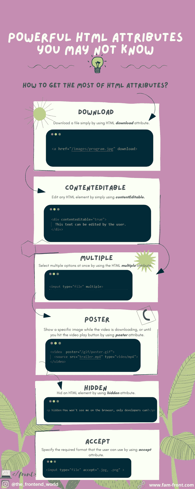

# 你可能不知道的强大的 HTML 属性

> 原文：<https://levelup.gitconnected.com/powerful-html-attributes-you-may-not-know-f549b12a1ff3>

## 如何充分利用 HTML 的属性？

由 [FAM](http://www.fam-front.com)

通过使用 HTML 属性，我们可以简单地做很多事情。本文涵盖了这些强大的属性，它们将使您的生活更加轻松，并让您从 HTML 中获得最大收益。

准备好了，我们走！

# 1-下载

`download`属性指定当用户点击超链接时，目标(在`href`属性中指定的文件)将被下载。

## 示例:

# 2-内容可编辑

在 HTML 中，任何元素都是可编辑的。使用一些 JavaScript 事件处理程序，您可以将您的 web 页面转换成一个完整而快速的富文本编辑器。当一个 HTML 元素的`contenteditable`设置为`true`时，`[document.execCommand()](https://developer.mozilla.org/en-US/docs/Web/API/Document/execCommand)`方法就可用了。这允许您运行[命令](https://developer.mozilla.org/en-US/docs/Web/API/Document/execCommand#commands)来操作可编辑区域的内容。

## 示例:

# 3 倍

`multiple`属性是一个布尔属性。如果存在，它指定用户可以一次选择多个选项。

示例:

# 四柱海报

`poster`属性指定在视频下载时或用户点击播放按钮之前显示的图像。如果不包括这一点，将使用视频的第一帧。

## 示例:

# 5-隐藏

`hidden`属性是一个布尔属性。如果存在，浏览器不会显示指定了`hidden`属性的元素。

# 6-接受

属性为用户从文件输入对话框中选择的文件类型指定了一个过滤器。`accept`属性只能与`<input type="file">`一起使用。

# 概述

由 [FAM](http://www.fam-front.com)

# 亲爱的读者，我希望这是明确和有用的。

我希望你和你的家人无论在哪里都平安无事！坚持住。明天会更好！

**联系一下** [**中**](https://medium.com/@famzil/)**[**Linkedin**](https://www.linkedin.com/in/fatima-amzil-9031ba95/)**[**脸书**](https://www.facebook.com/The-Front-End-World)**[**insta gram**](https://www.instagram.com/the_frontend_world/)**，或者**[**Twitter**](https://twitter.com/FatimaAMZIL9)**。********

****🔗[www.fam-front.com](http://www.fam-front.com/)****

******FAM******