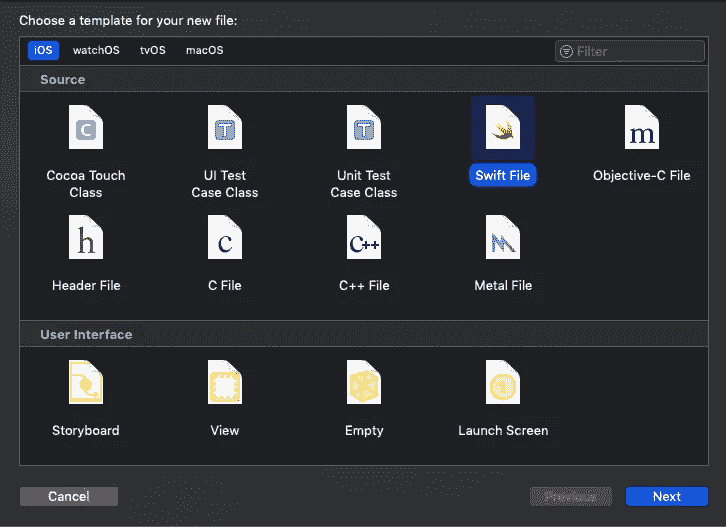
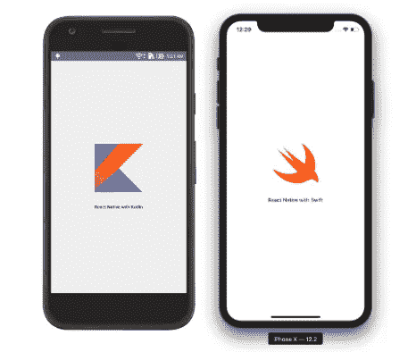
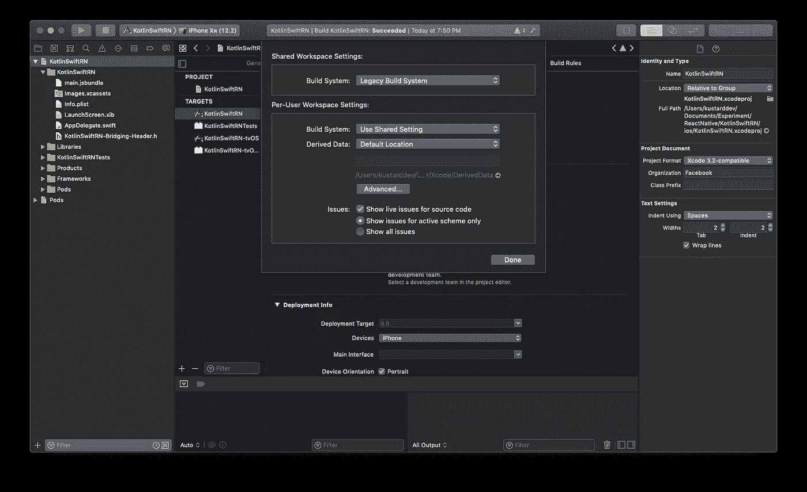

# 用科特林和斯威夫特给原生反应提供动力

> 原文：<https://levelup.gitconnected.com/powering-react-native-with-kotlin-swift-support-e5c1210a4e25>

React Native 虽然进步不少，但还是缺乏对 Kotlin 和 Swift 的内置支持。它仍然附带了用于本机代码的 Java 和 Objective-C 模板。既然 Android 和 iOS 都已经下定决心将重心从遗留语言转移到 Kotlin 和 Swift，那么开发者就应该转向最新的趋势。


由于 Android 和 iOS 分别为 Kotlin 和 Swift 提供一流的支持，它们已经为这两种语言建立了良好的文档。然而，它们仍然可以使用 Java 和 Objective-C，而且仍然没有计划放弃对它们的支持。

当 React 本地开发人员需要使用桥构建本地实现时，Kotlin 和 Swift 都很方便。因此，如果你已经在使用桥接或者计划学习/使用桥接，这篇文章将对你有所帮助。

## 集成 Kotlin 对 Android 的支持

1.  打开并编辑`android/build.gradle`

添加科特林版本

```
buildscript {    
  ext {  
        kotlin_version = '1.3.61'
        ...
  }
```

确保`google()`在`buildscript.repositories`和`allprojects.repositories`中

更新`build.tools`并将`kotlin-grade-plugin`类路径添加到依赖项中。

```
dependencies {             
  classpath("com.android.tools.build:gradle:3.4.2")        
  classpath("org.jetbrains.kotlin:kotlin-gradle-
            plugin:$kotlin_version")
}
```

最后，我们的`android/build.gradle`将是:

2.在`android/app/build.gradle`中添加导入

```
apply plugin: "kotlin-android"
apply plugin: "kotlin-android-extensions"
```

3.删除`MainApplication.java`并创建一个新文件`MainApplication.kt`

4.删除`MainActivity.java`并创建一个新文件`MainActivity.kt`

## 集成对 iOS 的 Swift 支持

1)在 Xcode 中打开工作空间项目

2)删除这些文件:

*   `AppDelegate.h`
*   `AppDelegate.m`
*   `main.m`

3)创建一个名为`AppDelegate`的新 Swift 文件，点击“下一步”，同时点击创建桥接标题



4)在`AppDelegate.swift`中复制以下内容

用您的项目名称替换文本`*REPLACE_WITH_YOUR_PROJECT_NAME*` 。对我来说是`KotlinSwiftRN`。

5)将以下代码复制到`Bridging`头文件中

在 React Native 方面，我们将保持我们的 UI 简单，使用特定于平台的`Image`和`Text`。



> **注意**:如果构建失败，尝试切换到遗留构建系统，方法是转到文件菜单→工作区设置，然后选择遗留构建系统



你可以参考我的 GitHub Repo 获得完整的代码库:

[](https://github.com/KPS250/ReactNative_Kotlin-Swift) [## KPS 250/react national _ kot Lin-Swift

### 此时您不能执行该操作。您已使用另一个标签页或窗口登录。您已在另一个选项卡中注销，或者…

github.com](https://github.com/KPS250/ReactNative_Kotlin-Swift)