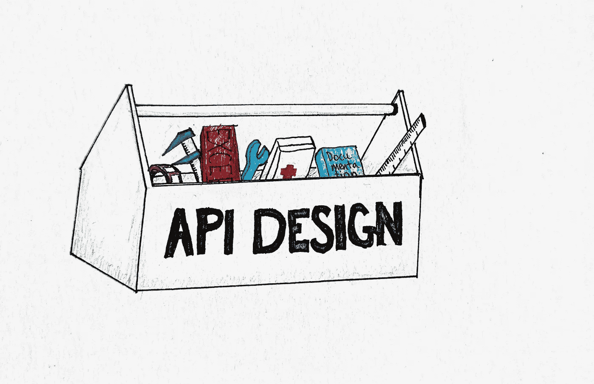

# 良好 API 设计的实用建议

> 原文：<https://levelup.gitconnected.com/practical-advice-to-good-api-design-fa857fa569a1>



图片来源:我

在一次罕见的卓有成效的 youtube 会议上，我看到了 Joshua Bloch(《有效的 Java》的作者)关于如何构建好的 API 以及为什么它很重要的演讲。看完之后，我知道我必须做笔记，因为这个演讲太精彩了，我无法忘记。事实上非常好，所以我想和你分享。

Joshua 设法将许多主题压缩到一个小时内，触及了好的 API 的高级特征、构建 API 的过程以及构建 API 的一些实用技巧。所以让我们直接开始吧。

首先，让我们快速回顾一下什么是 API。这在视频中没有涉及，所以如果你已经知道了，可以随意跳过这一部分。

一个 API ( *【应用编程接口】*可以认为是一个如何与 API 背后的软件进行通信的契约。它定义了您可以获取的数据、数据的格式以及可以对这些数据执行的操作。这意味着 API 可以是完全成熟的 REST API，也可以是可以调用来操作列表的一组方法。

根据 Bloch 的说法，要设计一个好的 API，你可以瞄准某些特征。

# 好的 API 的特征

*   简单易学
*   易于使用，即使没有文档
*   难以误用
*   易于阅读和维护使用它的代码
*   足够强大以满足需求
*   容易进化
*   适合观众

虽然这些特征很抽象，很难实现，但它们可以用作指导原则。如何实现这些特征是这篇文章剩下的内容。

# 构建 API 的过程

构建 API 的第一步是从需求开始。然而，小心涉众提出的解决方案，尝试提取用例。弄清楚你试图解决的确切问题，而不是用户希望如何解决。

一旦你有了合适的需求，就从小事做起。写一份最多一页的说明书。

任何比这更大的事情，你的自我就会被投资。沉没成本谬论开始起作用，你不会放心放弃它。

做出改变并不费力，一旦你开始得到反馈，重写就很容易了。只有当你开始更好地理解你试图解决的问题时，你才应该更加充实这个规范。

虽然听起来很不直观，但是您应该立即开始针对您的 API 进行编码。创建接口，不要为实现而烦恼，直到你把一切都计划好了。即使这样，也要继续对 API 进行编码，以确保它的行为符合您的预期。这可以让你澄清和防止意外。

这些代码片段可能是您将为 API 编写的一些最重要的代码。他们可以作为例子继续存在，你应该在这些方面花很多时间。一旦您的 API 投入使用，就需要复制示例代码。**有好的例子意味着很好地使用了你的 API，所以它们应该成为典范。**

然而，构建 API 时最重要的事情是

> 当有疑问时，不要去想它。

尤其是如果你正在构建一个公共 API，一旦用户开始使用它，就几乎不可能删除它的功能。

# 实用技巧

注意，这些例子中有许多是基于 Java 和 OOP(面向对象编程)的。尽管如此，它的大部分仍然适用于 Java 和 OOP 之外。

**一个 API 应该做一件事并且做好**

该功能应该易于解释。如果很难命名，一般是不好的征兆。一个好的 API 读起来应该像散文。

当你想在一个地方做太多事情的时候，可以把事情分开，或者当你在做类似的事情的时候，把事情放在一起。

**一个 API 应该尽可能的小，但是不能更小**

满足要求，其他都不考虑。您可以随时添加，但不能删除。

考虑学习理解 API 的概念数量。您应该考虑必须学习 API 的概念权重，并尽量将其保持在最低水平。

一种方法是尽可能重用接口。通过重用接口，用户只需学习一次接口。

**不要把实现细节放在 API 里**

您不应该向客户端公开实现细节。如果你想改变实现，这使得 API 更难改变。

一个例子是抛出异常。您可能会抛出一个 SQL 异常，但在以后的版本中还想实现另一种形式的数据存储。现在你必须抛出一个 SQL 异常，即使你正试图写一个文件，因为用户正在期待和处理 SQL 异常。

**最小化所有东西的可访问性**

尽可能保持私密。它为您提供了更改名称和实现的灵活性，而不会影响客户的实现。

**名字很重要**

这些名字应该是不言自明的，你应该把一个 API 当成一个小型语言。这意味着它的命名应该是一致的。同样的词应该表示同样的事情，同样的意思应该用来描述同样的事情。

```
// Does the same thing, but different names are usedfun remove()
fun delete()
```

**文件事宜**

记录良好的 API 组件更有可能被重用。虔诚地记录，尤其是在处理状态或副作用时。文档越好，用户遇到的错误就越少。

**永远不要为了性能而扭曲 API**

好的 API 设计通常与好的性能一致。像使类型可变或使用实现类型而不是接口这样的事情会限制性能。

通过改变你的 API 来获得更好的性能，你冒着破坏 API 的风险。例如，通过创建一个不可变的类，使其可变以使用更少的内存。虽然潜在的性能问题将被修复，但令人头疼的问题将永远存在。

**最小化可变性**

除非有非常好的理由，否则类应该是不可变的。如果可变性是必要的，保持状态空间尽可能小。

**仅在有意义的地方划分子类**

只有当你能一本正经地说子类的每个实例都是超类的一个实例时，你才需要子类。如果答案不是响亮的“是”,那就用作文来代替。公开的类不应该仅仅为了重用实现代码而子类化。

**为传承而设计并记录，否则禁止**

这适用于 OOP。避免[脆弱的基类问题](https://en.wikipedia.org/wiki/Fragile_base_class)，当对基类的更改可能破坏子类的实现时，就会出现这种问题。

如果不可避免，彻底记录方法如何相互使用。尽管尽可能地限制对实例变量的访问，并使用 getters 和 setters 来控制基类的实现。

**不要让客户端做模块可以做的任何事情**

让 API 做那些总是需要做的事情。为客户避免样板文件。

```
// DON'T
val circle = CircleFactory.newInstance().newCircle()
circle.radius(1)
circle.draw()// DO
val circle = CircleFactory.newCircle(radius = 0.5)
circle.draw()
```

**避免最小惊讶原则**

API 用户不应对这种行为感到惊讶。要么避免副作用，要么使用描述性的名称来描述副作用是什么。

**快速失败**

错误发生后应尽快报告。编译时是最好的，所以利用泛型/静态类型。

**提供对字符串形式的所有可用数据的编程访问**

如果你只使用字符串，格式和内容就会成为 API 的一部分，所以你永远不能改变它。所以通过一个对象提供对字符串内容的访问。这样你就不用对字符串的格式和内容做任何承诺了。

**小心超载**

仅当方法的行为相同时才重载它们。以 Java TreeSet 构造函数为例，`TreeSet(Collection)`忽略顺序，而`TreeSet(SortedSet)`尊重顺序。

**使用合适的参数和返回类型**

对于输入，优先使用接口而不是类，但是使用最具体的输入参数类型。如果存在更好的类型，就不要使用 string。例如，对于货币值，应该使用 BigDecimal 而不是 floats。

**跨方法使用一致的参数排序**

尤其是当参数类型相同时，因为您可能会意外地交换参数。

```
fun copy(source: String, destination: String)
fun partialCopy(destination: String, source: String, numberToCopy: Int)
```

**避免长参数列表**

三个或更少的参数是理想的。相同类型参数的长列表可能是有害的，并且非常容易出错。如有必要，分解函数或使用助手类来保存参数。

**避免需要异常处理的退货类型**

用户会忘记编写特例代码，这可能会导致错误。在非异常流量也足够的情况下，应避免这种情况。例如，返回零长度数组或集合，而不是空值。

最后，您应该准备好犯错误，这就是为什么这么多要点是关于能够容易地改变事情，而不是从一开始就构建完美的 API。

也请看看这篇演讲，他比我在这里讲得更详细。

我希望你觉得这些有用，并在评论中分享你的想法或经历！

感谢你阅读❤️