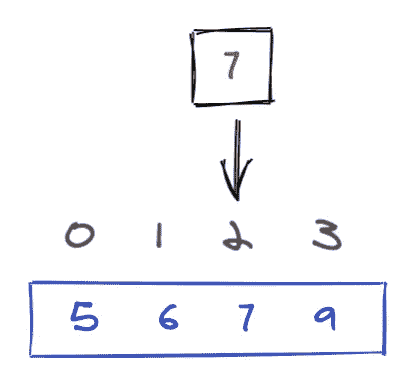
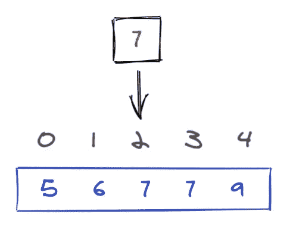
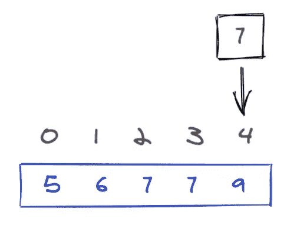

# 实用算法第 0 层:二分搜索法

> 原文：<https://levelup.gitconnected.com/practical-algorithms-tier-0-binary-search-99508cc62fe4>

二分搜索法是一个基本的，但功能强大，经常使用的算法。它有几个有趣的变体，通常在大学计算机科学课上被跳过或者“留给读者做练习”。


照片由 [@felipepelaquim](https://unsplash.com/@felipepelaquim?utm_source=medium&utm_medium=referral) 在 [Unsplash](https://unsplash.com?utm_source=medium&utm_medium=referral) 上拍摄

在一次编码竞赛中，我意识到花时间拥有二分搜索法的全部能力和所有漂亮的变化是值得的，同时是“实用的”而没有正式的数学证明(以及数学证明中一些可怕的 1 索引数组，或与二叉树相关的不必要的抽象)。

1.基本格式

给定一个由**唯一**整数和一个**目标**整数组成的**排序**数组，如果在数组中找到目标，则返回索引，如果没有找到，则返回-1。

这个简单的例子对于检查一个目标值是否在一个有序数组中非常有用，例如[c++标准库中的 binary_search 函数](http://www.cplusplus.com/reference/algorithm/binary_search/)。

例如，在下面的测试用例中，结果应该是 **2** :

```
arr = [5, 6, 7, 9]
target = 7
```



2.[平分 _ 左](https://docs.python.org/3/library/bisect.html)

给定一个**排序的**整数数组和一个**目标**整数，返回第一个元素的索引**等于目标的**，或者如果没有相等的元素存在，返回目标的**插入位置**。

与基本格式相比，该算法有两个宽松的条件:

*   在数组中允许重复，而不是唯一
*   如果目标不存在，则返回插入位置，而不是 sentinel 值-1

例如，在下面的测试用例中，结果应该是 **2** :

```
arr = [5,6,7,7,9]
target = 7
```



平分 _left 的诀窍是循环不变量`low`。`low`左侧的所有元素严格小于`target`。所以当循环退出时，`low`处的元素是第一个大于或等于`target`的元素。`low`也是数组中目标的`rank`。

这是最常用的二进制搜索算法。

3.[对分 _ 右](https://docs.python.org/3/library/bisect.html)

给定一个**排序的**整数数组和一个**目标**整数，返回目标**最后一个**插入位置**的索引。**

该算法本质上返回第一个严格大于 target 的元素的索引。例如，在下面的测试用例中，结果应该是 **4** :

```
arr = [5,6,7,7,9]
target = 7
```



平分 _right 的诀窍是循环不变量`high`。位于`high`右侧的元素严格大于`target`。

对于二分搜索法的迭代实现，时间复杂度为 O(lgN)，空间为 O(1)，其中`N`是阵列的长度。

对于递归实现，留给读者作为练习，时间复杂度是 O(lgN ),但是由于函数调用的堆栈，空间是 O(lgN)。

神盾局。

参考资料:

[https://en.wikipedia.org/wiki/Binary_search_algorithm](https://en.wikipedia.org/wiki/Binary_search_algorithm)https://docs.python.org/3/library/bisect.htmlhttp://www.cplusplus.com/reference/algorithm/binary_search/