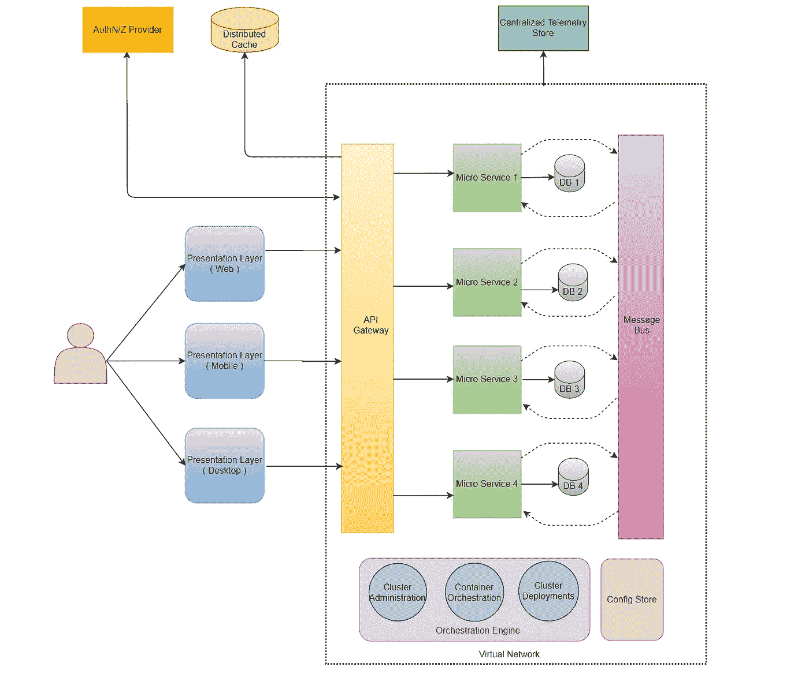
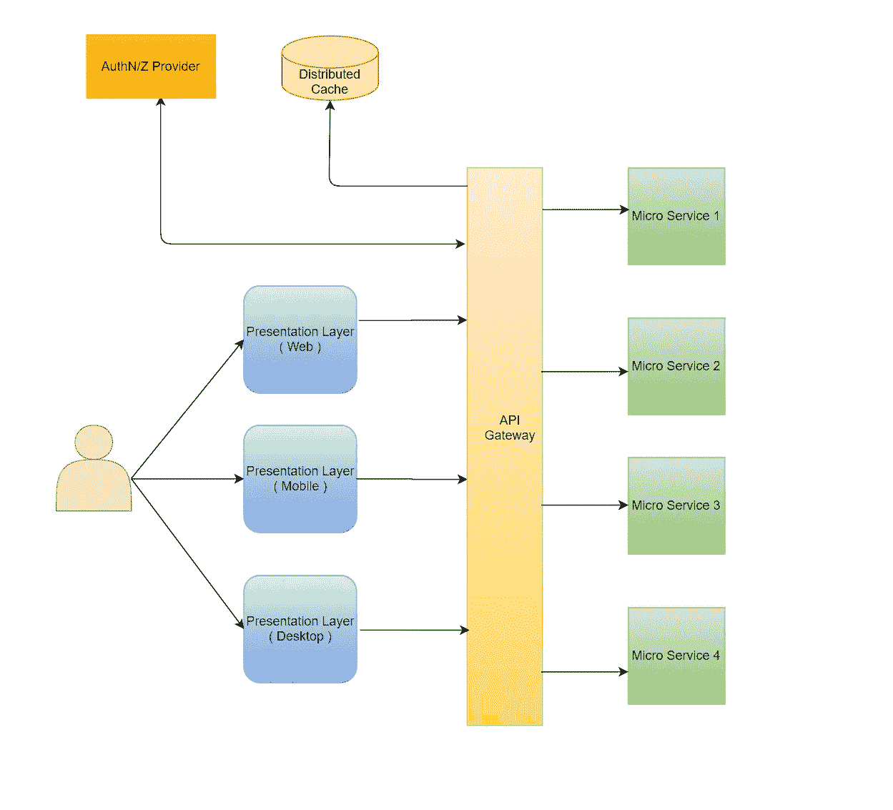
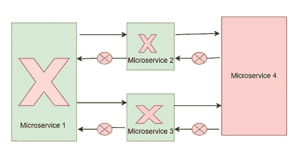
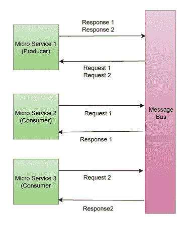
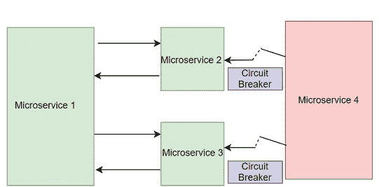

# 微服务架构的实用方法—第 1 部分

> 原文：<https://levelup.gitconnected.com/practical-approach-to-microservices-architecture-part-1-52488c32df58>

## 理解基本微服务模式

照片由 Unsplash 上的 Clay Banks 拍摄

考虑采用微服务架构的复杂大规模应用程序应该遵循一套模式来实现其全部优势。我将分享这些最佳实践，以及它们如何提高应用程序的效率，这是一个由两部分组成的系列。

如果你的团队仍在决定微服务是否是你的应用的正确架构，我强烈推荐你阅读我之前的文章。

让我们来看看每个采用微服务的团队都必须解决的一般问题列表:

1.  客户端应用程序的开销增加，因为它们必须了解多个频繁更新的微服务。
2.  对团队生产力的影响，因为他们必须解决交叉问题(如授权、缓存、日志记录等。)在每个微服务中保持一致。
3.  对应用可靠性的影响，因为每个客户端请求都必须经过多个微服务才能得到处理。
4.  由于无法跟踪和观察请求流，增加了调试和故障排除问题的复杂性。
5.  对开发运维工作效率的影响，因为他们必须部署多个微服务，监控每个微服务的运行状况，并解决停机时间、流量突发和规模问题。
6.  随着配置更改和秘密轮换需要在每个微服务中一致处理，开发运维工作量增加。

为了保持这篇文章的简洁，我将在这里解决前 3 个问题，剩下的 3 个将在后续文章中解决。

微服务应用的高级架构

这是一个高级应用程序架构，我看到大多数团队都采用它来解决这些问题，下面让我们深入了解每个关键领域

## 抽象内部集群复杂性

在大多数应用程序中，单个 UX 页面从多个微服务获取数据是非常常见的。为了建立与这些服务的通信，客户端需要了解所有细节，如端口、协议以及资源是如何划分的。除此之外，对这些服务的任何更新都可能需要更改客户端。此外，还需要支持给定 API 的多个版本。例如，一个用于 web \桌面版本的 API 和一个用于移动版本的轻量级 API。所有这些变动的结果是，应用程序最终形成了类似这样的架构。

没有 API 网关的微服务应用

这给我们带来了一个问题，基于微服务的客户端如何在满足所有这些需求的同时访问单独的服务(API)。

客户端应该从这些内部复杂性中抽象出来，这就是 API 网关发挥重要作用的地方。API 网关是所有客户端请求的单一入口点。它就像一个反向代理，为集群中的微服务提供所有客户端流量。

具有 API 网关的微服务应用

以下是使用 API Gateway 修改架构的优势

1.  每个客户端不需要知道所有的微服务和它需要与之对话的端点。这使得应用团队能够灵活地最终迁移出微服务、修改现有服务或创建新的微服务。
2.  我们可以将认证、日志记录和缓存等任何交叉问题卸载到该网关层。例如，只允许经过认证和信任的客户端流量通过网关流向微服务。此外，服务之间的内部通信可以在可信的专用网络上进行，而不必担心处理额外的开销，如验证请求和保护 SSL 上的通信。
3.  它还可以通过查询多个微服务并结合结果来生成最终的聚合响应，从而有助于 API 合成。
4.  它还可以充当速率限制器，对来自进入不良状态的客户端的请求进行节流，这有助于提高集群的容错能力。

## 处理微服务之间的内部通信

微服务必须处理来自应用程序客户端的请求，同时相互协作来处理它们。同步通信期望客户端和相关服务在整个请求期间都是可用的。如果可能的话，通常最好避免服务之间的同步通信，因为这样可以减少请求发送者和请求消费者同时进行处理的依赖性。它还避免了一些常见的陷阱，如您在下面的场景中看到的级联故障。

在这个场景中，微服务 1 依赖于微服务 2、微服务 3 和微服务 4(通过微服务 2 和微服务 3)。

具有同步通信的级联故障

如果微服务 4 在客户端请求时关闭，将导致整个请求失败。如果处理不当，微服务 4 的这些通信故障将逐渐使微服务 2 和微服务 3 过载，使它们停机，进而使微服务 1 停机，从而使整个系统停机。

**消息总线**

只要有可能，我们应该确保微服务之间的通信使用消息服务(在架构中我称之为消息总线)以异步方式进行。市场上有许多异步消息传递技术，如 Azure service bus、Apache Kafka、RabbitMQ。

使用消息总线的异步通信

虽然这比直接的服务对服务通信更复杂，但是使用消息总线进行微服务之间的通信具有以下优点:

1.  实现请求生产者与请求消费者的分离，使他们能够灵活地按照自己的规模处理请求。
2.  为每个微服务提供了灵活性，可根据流量突发情况进行扩展和缩减。生产者和消费者都不需要担心请求节流。
3.  提高系统的整体可用性和容错能力，因为生产者不太关心如何处理消费者的故障。消费者可以放心，只要适当的消息有效负载被发布到消息总线，它最终会被处理。

在异步通信不可能且服务必须依赖直接通信的情况下，通常最佳做法是结合使用断路器模式和指数回退重试来应对级联故障。

**断路器**

这类似于电路断路器。按照这种模式，当服务 4 的故障率在给定的时间窗口内超过阈值时，服务 2 和 3 将断开电路(连接)并返回默认的预定义响应，而不是调用服务 4。在此期间，除了一小部分请求之外，不调用有故障的服务。如果这些呼叫成功，则连接将为其余流量恢复，从而为服务 4 提供充足的恢复时间。

用于弹性通信的断路器

**CQRS(命令查询响应分离)**

大多数致力于最终一致的系统的团队，用一种叫做 CQRS 的模式来分离读和写。在这种模式中，读取(或获取)请求通过直接的服务到服务通信来实现，而写入(POST、PUT、PATCH 或 DELETE)请求通过异步通信来实现。在响应读取请求时，服务主要从数据源的缓存或只读副本中读取。这有助于将查询从命令中分离出来，并提供独立扩展、缓存和发展的灵活性。

在我的下一篇[文章](/practical-approach-to-microservices-architecture-part-2-7337c0444086)中，我将介绍集群编排、集中式遥测和配置管理等模式，这些模式将有助于解决开头讨论的其他问题