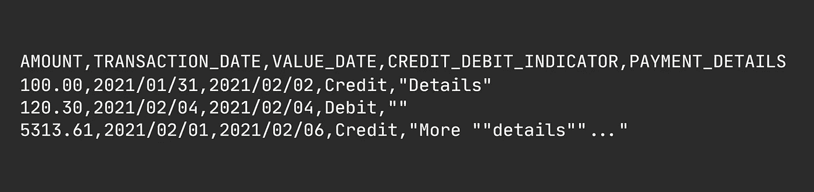

# 初学者和中级开发人员的实用 C#属性

> 原文：<https://levelup.gitconnected.com/practical-c-attributes-for-beginners-and-intermediate-developers-cf916bfd1194>

## C#教程

## 了解如何使用属性编写简单、干净且易于维护的代码。


图片由[学习 C#属性的最好方法就是深入研究如何使用它们的真实例子。

## 我们将构建一个基于属性的 CSV 生成器。

但是，在一头扎进代码之前，让我花一点时间做一下准备。

CSV 生成器并不是最令人兴奋的东西，但是我相信您会从下面的例子中学到一些东西。

我选择 CSV 生成器，因为在某些时候，您很可能需要以某种方式生成或解析 CSV。此外，CSV 很容易理解，因此，理解代码的意图是最小的开销。

在我们的示例中，我们需要生成一个包含财务交易的 CSV 文件，如下图所示，但不应用属性——我们将在一分钟内创建并应用它。


简单的交易模型。

我们对 CSV 文件的外观有一些要求。

1.  标题必须大写，单词之间用下划线分隔。
2.  我们希望在将属性写入 CSV 输出之前对其进行格式化。

例如，`TransactionDate`变成了`TRANSACTION_DATE`，应该格式化为`yyyy/MM/dd`。

任何熟悉 C#的人都知道，简单地读取属性名和值不会允许这种转换…

在本文的最后，使用上面的`TransactionRow`模型生成一个 CSV 应该会给我们这样的结果。



金融交易 CSV 输出。

## 让我们创建属性。

创建属性就像创建一个继承自`Attribute`的类一样简单，仅此而已。

对于我们的示例，我们将赋予属性一些自己的属性，比如我们希望标题字段被称为什么，它应该出现在哪个索引处，以及所需的格式。

此外，我们定义了一个`Format`方法，它将按照指定的方式格式化传递给它的任何值。

花几秒钟时间通读代码。


简单的自定义属性。](https://medium.com/u/7c7a43b3d9de#中非常有用，因为它们提供了一种简单的方法来将元信息附加到类、属性、方法甚至程序集。此外，属性通常可以代替标记接口——你知道，那些接口只是用来表示某种东西——其中没有声明方法或属性。</p><p id=) 

[任何熟悉我的写作的人都知道我支持使用](https://medium.com/u/7c7a43b3d9de#中非常有用，因为它们提供了一种简单的方法来将元信息附加到类、属性、方法甚至程序集。此外，属性通常可以代替标记接口——你知道，那些接口只是用来表示某种东西——其中没有声明方法或属性。</p><p id=)[多态](/if-else-is-a-poor-mans-polymorphism-ab0b333b7265)而不是 [if-else 和 switch cases](https://medium.com/swlh/stop-using-if-else-statements-f4d2323e6e4) 。但是，因为我们只看属性，[我将做一些快速和肮脏的分支，这有时是没问题的。](/write-shameless-garbage-code-ba6f79d46ed9)但是，一旦你发现自己不得不添加更多的分支——在本例中是格式化选项——我强烈建议你使用面向对象的方法进行重构。

使用我们的新属性非常简单。我们所做的就是将它应用到我们希望包含在 CSV 输出中的每个属性。提供给`FieldInfo`属性的值充当它所修饰的属性的元信息。


应用了属性的事务记录。

您可能已经发现了记录所继承的`StorageBase`。我们一会儿就会谈到这个问题。

## 消耗属性并使其工作的时间。

读取我们应用于每个属性的属性只需要使用一点点反射。


这段代码真的没什么，但是，如果你是反射的新手，这就像第一次看到火一样。

因此，本质上，这个小代码片段只是获取 T 的类型，读取它自己的属性，并只选择那些应用了我们的自定义属性的属性。最后，返回包含属性信息和自定义属性的元组列表。

## 最后，生成 CSV 输出。

把这些放在一起，我们得到了这个最后的类，它接受了一个必须继承`StorageBase`的对象列表。

同样，花一些时间来正确地浏览代码。


我们基本上只是遍历对象列表，然后遍历每个对象的所有属性来获取相应的 FieldInfo，并将属性值传递给 FieldInfo `Format(object)`方法。

下面我们的同事会这样使用我们的类。


最后的`csvResult`包含我们想要的 CSV，如本演示开始时所示。

# 离别词。

现在，您应该对如何创建您自己的定制属性、如何使用它们以及它们带来的价值有了一个初步的、相当好的理解。

当有意识地创建和应用自定义属性时，您可以用其他专门化类可能使用的元信息来修饰您的类。

```
**Resources for the curious**
-------------------------
[Attributes (C#) in Microsoft Docs](https://docs.microsoft.com/en-us/dotnet/csharp/programming-guide/concepts/attributes/)
```

**Nicklas Millard** 是一名软件开发工程师，供职于一家发展最快的银行，负责构建关键金融服务基础设施。

此前，他是 Big4 的高级技术顾问，为商业客户和政府机构开发软件。

> [新的 YouTube 频道(@Nicklas Millard)](https://www.youtube.com/channel/UCaUy83EAkVdXsZjF3xGSvMw)
> 
> *连接上* [*LinkedIn*](https://www.linkedin.com/in/nicklasmillard/)