# 熊猫的实用数据分析

> 原文：<https://levelup.gitconnected.com/practical-data-analysis-with-pandas-c40fbd2955fa>

## 使用 Pandas 和真实数据集进行动手数据分析。

尼克·莫里森在 [Unsplash](https://unsplash.com?utm_source=medium&utm_medium=referral) 上拍摄的照片

真实世界的数据是肮脏的。在分析数据之前，您需要清理这些数据。Pandas 是清理数据使用最多的 Python 库。Pandas 也是一个非常强大的数据分析库。在这篇文章中，我将向你展示如何使用真实数据集分析熊猫的数据。

在开始之前，不要忘记关注[我的 youtube 频道](https://youtube.com/c/tirendazacademy)，在那里我创建了关于人工智能、数据科学、机器学习和深度学习的内容。

让我们开始吧！

# 加载数据集

首先，让我们进口熊猫。

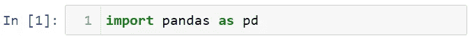

接下来，让我使用 read_csv 方法导入数据集。

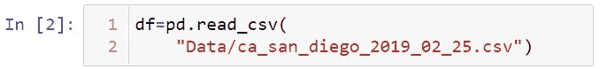

# 了解数据集

你可以从[这里](http://Real world data is dirty. You need to clear this data before analyzing it. Pandas is the most used Python library to clean data. With Pandas, you can both clean and analyze data. In this article, I will show you how to analyze data with Pandas using a real dataset.)下载这个数据集。数据集是关于加州圣迪亚戈市警察在路上拦下的车辆。该数据集包括停车时间、驾驶员年龄、停车原因和逮捕状态等数据。让我们看看这个数据集的前 5 行。

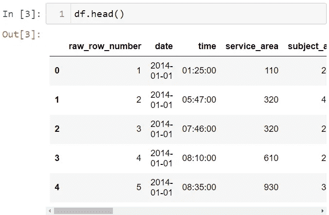

让我们看看最后 3 行。

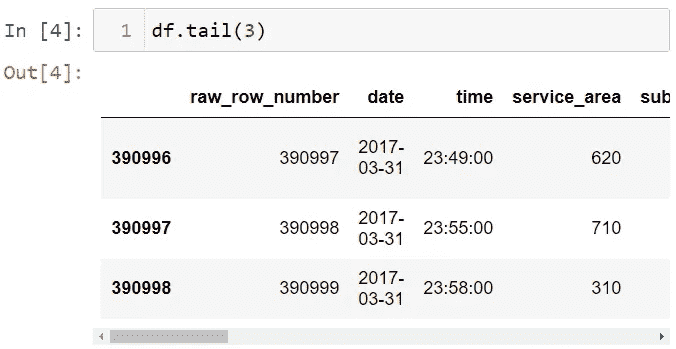

让我向你展示数据集的形状。

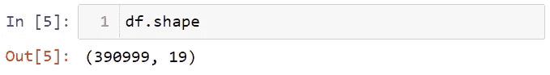

现在让我们看看数据集中列的数据类型。

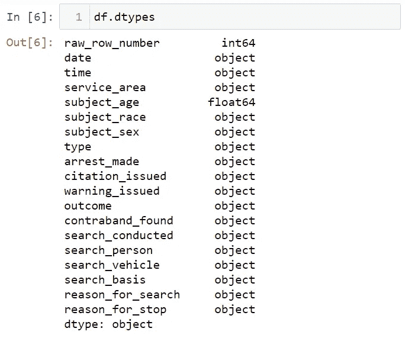

您可以使用 isnull 方法来查看数据集中缺少的数据。此方法返回一个布尔值。False 表示没有缺失数据，true 表示有缺失数据。让我们看看每一列中缺失数据的总数。

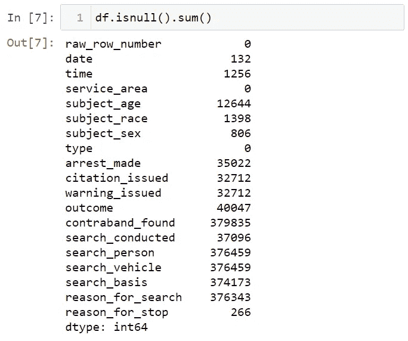

Pandas 中有三个重要的数据结构；系列、数据框和索引。该数据集是一个数据框。数据框的每一列都是一个系列。让我在这个数据框中显示一列。

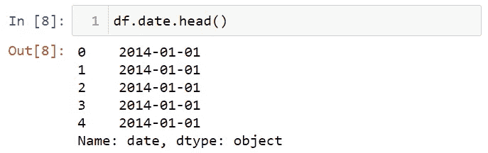

您可以使用 columns 属性查看数据集中的列。

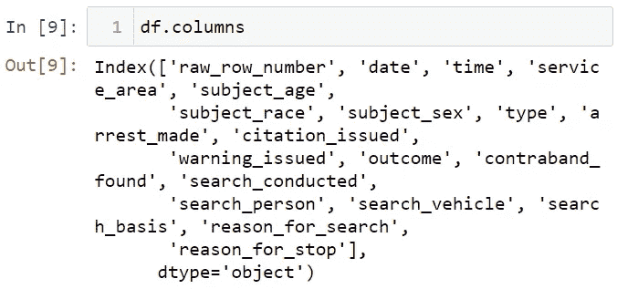

# 选择熊猫

您可以在数据集中选择一列。例如，让我们选择列日期。

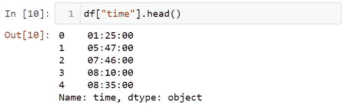

您可以使用两个方括号来选择多列。

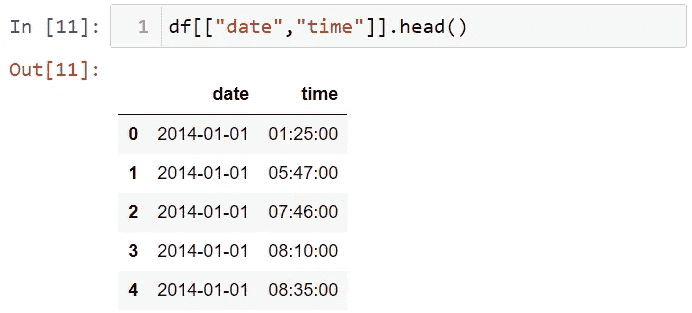

您可以使用 rename 方法更改列的名称。

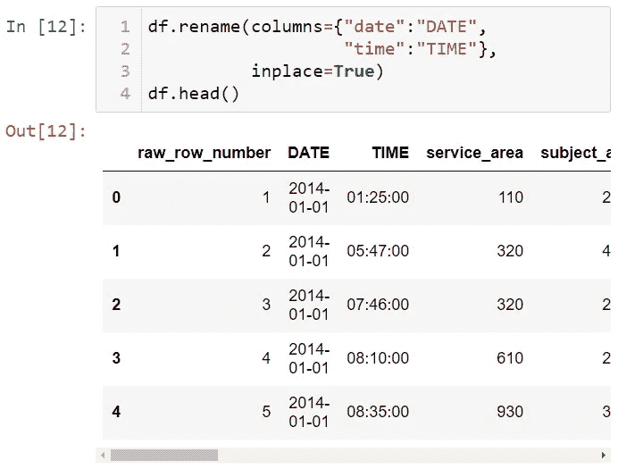

还可以使用 loc 或 iloc 方法来选择列或行。对于 iloc 方法，您需要利用行和列名，而对于 loc 方法，您需要传递行和列索引。例如，让我们选择第一行:

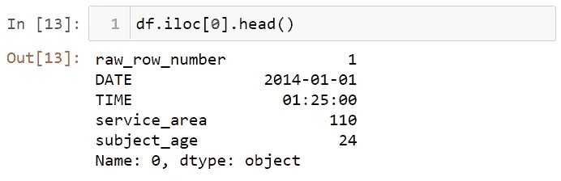

让我选择第一行和第一列的值。

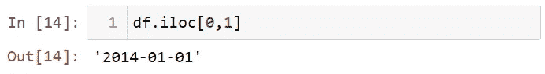

您可以选择多个列。

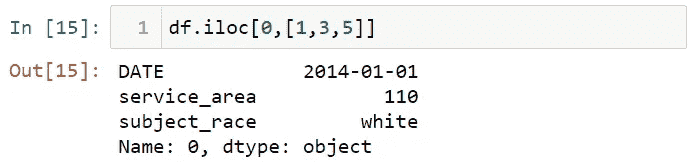

您可以将行切片。

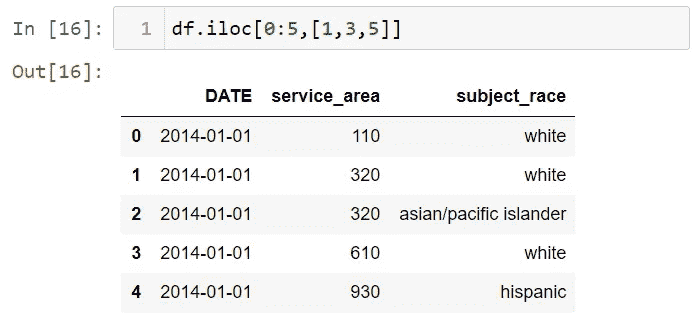

您可以对行和列进行切片。

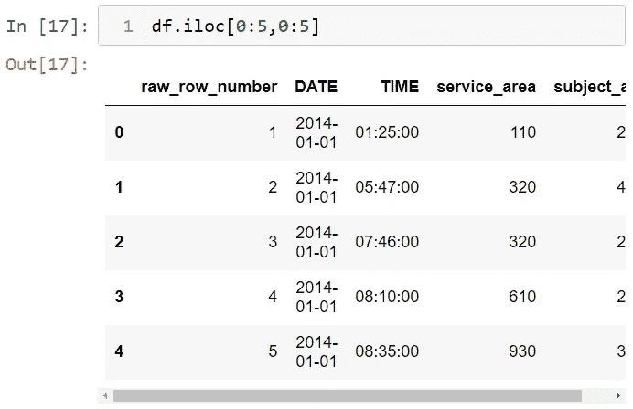

您需要在 loc 方法中使用该名称。让我给你看看这个。

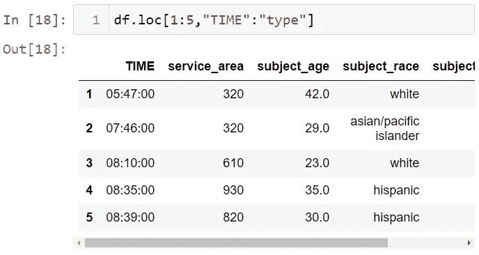

您还可以对列进行切片。

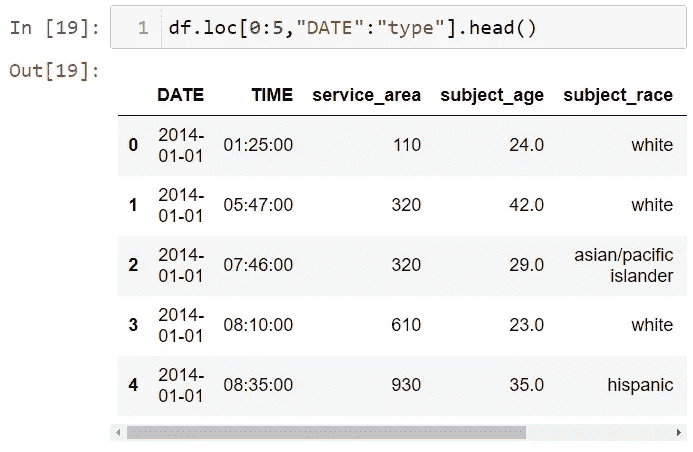

# 处理熊猫丢失的数据

您可以使用 dropna 方法来处理缺失数据。首先，让我们再次看看数据集的形状。

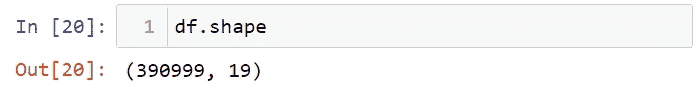

您可以使用 how = "all "删除所有只包含缺失值的列，

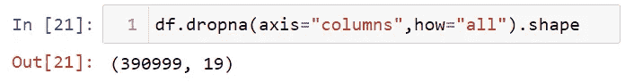

您可以使用 how = "any "删除包含任何缺失值的所有列，

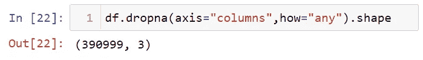

# 以熊猫为例的简单分析

我要检查男性或女性是否因为更多的违规行为而被拦下。现在，我们来看看停驶车辆的原因和数量。

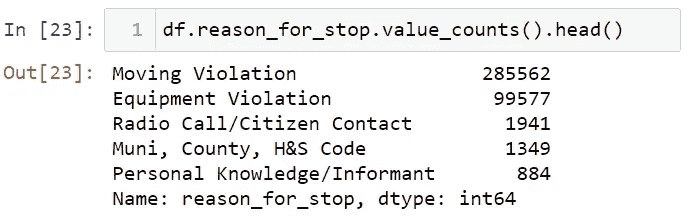

车辆被拦下主要是因为超速。让我们看看因超速而被拦下的男女人数。首先，我将根据移动违例值进行过滤。之后，让我选择 subject_sex 列，并使用 value_counts 函数来查找总数。

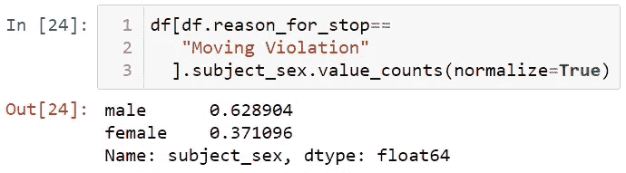

可以用 normalized = True 来看男女比例。

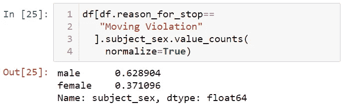

我们来看看让女性止步的理由占百分比。为此，我将按女性筛选性别列。

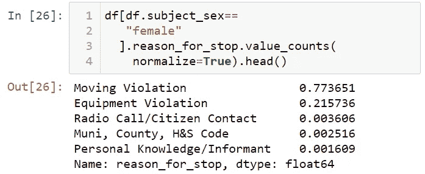

77%的女性因违反交通规则而被拦下。现在，让我们来看看停止使用 groupby 方法的原因。

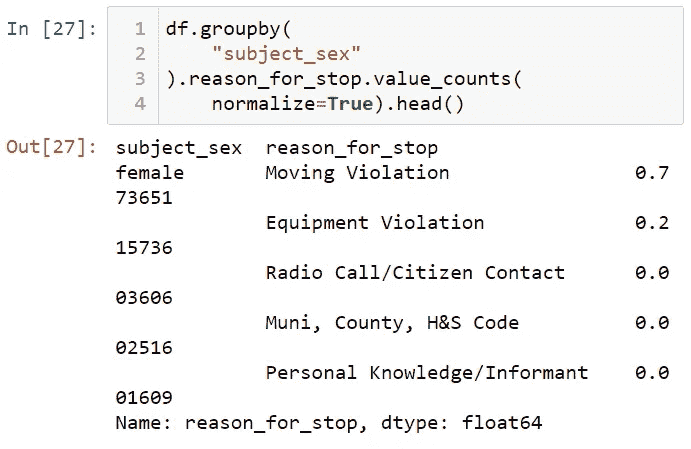

让我们把这些数据转换成表格。

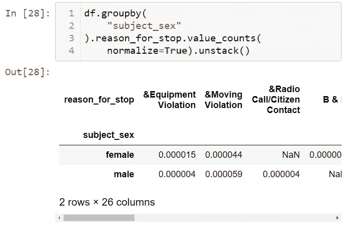

现在，让我们来看看性别对被捕情况的影响。首先，让我找到被捕人数。

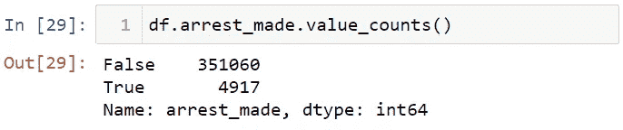

之后让我们看看被捕人数的百分比。

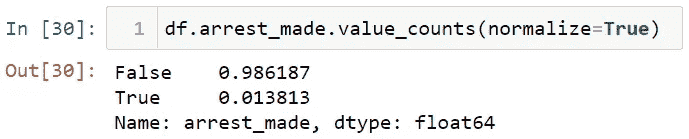

接下来，让我们来看看按性别分列的被捕百分比。

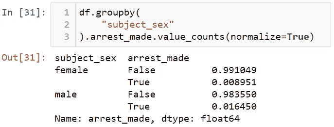

男性被捕人数是女性的两倍。让我们看看按种族和性别分列的被捕百分比。

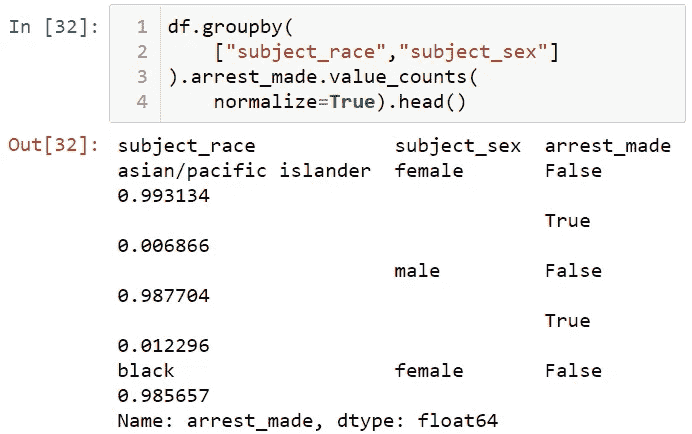

请注意，黑人男性和女性比其他人被捕更多。让我们找出哪一年停的次数少。为此，让我找到日期列的前 4 年的值。

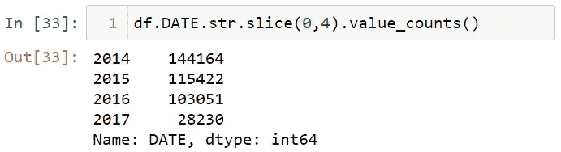

让我们将日期和时间变量结合起来，并把它们放到 datetime 结构中。首先，我要结合日期和时间变量。

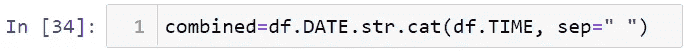

现在让我们将这个日期变量转换成 Pandas 中的 datetime 结构，并将这个变量添加到数据集。

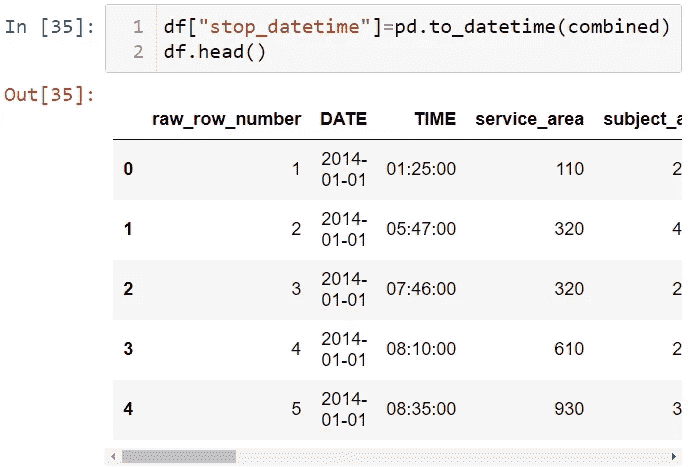

让我们看看数据集中变量的结构。

酷毙了。我们创建了 stop_datetime 列。让我们以月份为例来看看。

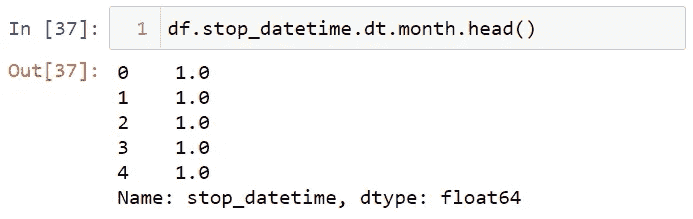

让我们检查一下一天中逮捕情况的变化。首先，我们来看看《逮捕 _ 制造》专栏。

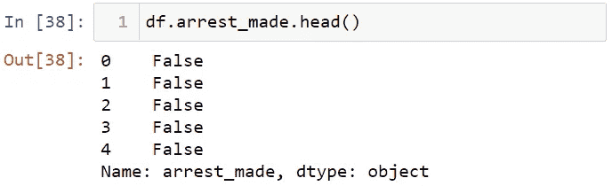

让我将这个 arrest_made 列转换成布尔数据结构。

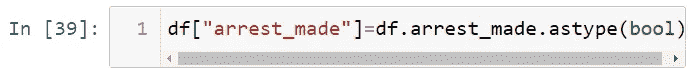

让我们看看逮捕的人数。

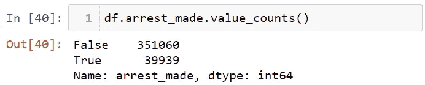

让我们来看看逮捕的百分比。

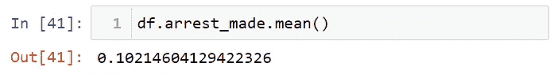

大约 1%的人被捕。现在让我们看看一天中的平均逮捕人数。

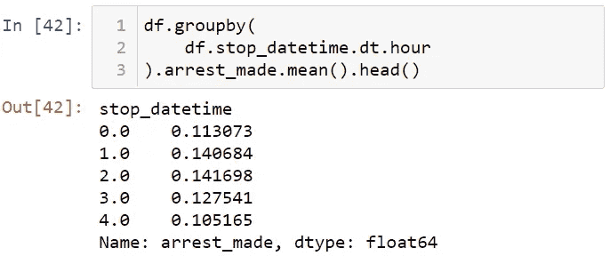

让我们绘制这些数据。要内联查看图形，让我使用% Matplotlib inline 命令。

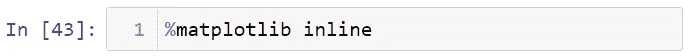

让我们绘制图表。

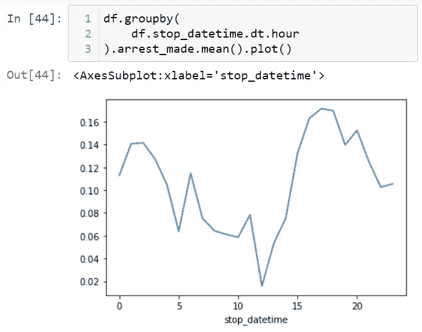

让我们看看停止时间。

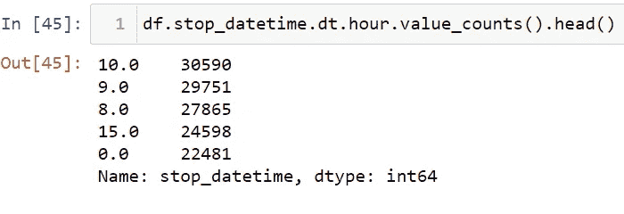

让我整理一下这些数据。

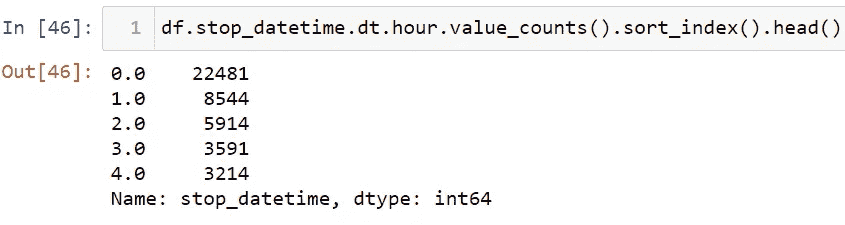

让我们现在绘制图表。

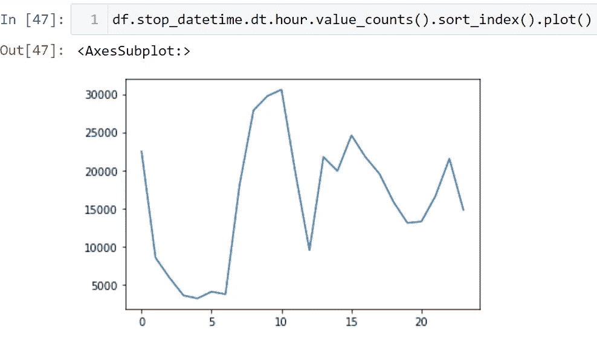

我可以说上午十点停的比较多。

就是这样。我希望你喜欢它。你可以在 [***我们的 GitHub 页面***](https://github.com/TirendazAcademy/PANDAS-TUTORIAL) 找到笔记本。

如果你还没看过，我强烈推荐你看下面这些关于熊猫的文章。👇👇👇

*   [熊猫简介](https://ai.plainenglish.io/introduction-to-the-pandas-library-a3a557c8d094?source=your_stories_page-------------------------------------)
*   [熊猫的索引-选择-过滤](https://ai.plainenglish.io/indexing-selection-filtering-in-pandas-library-20d3fe4a6d71?source=your_stories_page-------------------------------------)
*   [熊猫的重要方法](https://ai.plainenglish.io/important-methods-in-pandas-2d4c774fcac9?source=your_stories_page-------------------------------------)
*   [熊猫的算术运算](https://ai.plainenglish.io/arithmetic-operations-in-pandas-7ef32226e41c?source=your_stories_page-------------------------------------)
*   [熊猫的排序和排名](https://ai.plainenglish.io/sorting-and-ranking-in-pandas-701f99aa918e?source=your_stories_page-------------------------------------)
*   [汇总和计算大熊猫的描述性统计数据](https://medium.com/nerd-for-tech/summarizing-and-computing-descriptive-statistics-in-pandas-7320a1fec371?source=your_stories_page-------------------------------------)
*   [在熊猫中读写数据](https://ai.plainenglish.io/reading-and-writing-in-pandas-2d83dc538aff?source=your_stories_page-------------------------------------)
*   如何修复熊猫丢失的数据
*   [熊猫的数据转换](https://ai.plainenglish.io/data-transformation-in-pandas-29b2b3c61b34?source=your_stories_page-------------------------------------)
*   [熊猫的层次索引](/hierarchical-indexing-in-pandas-94ff198b7f35?source=your_stories_page-------------------------------------)
*   [合并熊猫数据集](https://tirendazacademy.medium.com/combining-and-merging-datasets-in-pandas-8e71e11b76fa?source=your_stories_page-------------------------------------)
*   [熊猫的重塑和旋转](https://tirendazacademy.medium.com/reshaping-and-pivoting-in-pandas-a41678e72d68?source=your_stories_page-------------------------------------)
*   [大熊猫群](https://medium.com/star-gazers/groupby-in-pandas-5df348e293f8?source=your_stories_page-------------------------------------)
*   [与《熊猫》中的 Groupby 合作](/working-with-groupby-in-pandas-7e7823414537?source=your_stories_page-------------------------------------)
*   [熊猫的数据透视表](/pivot-tables-in-pandas-7b672e6d8f47?source=your_stories_page-------------------------------------)
*   [熊猫的分类数据](https://tirendazacademy.medium.com/categorical-data-in-pandas-9eaaff71e6f3?source=your_stories_page-------------------------------------)
*   [在 Pandas 中处理文本数据](https://tirendazacademy.medium.com/working-with-text-data-in-pandas-f78aa368e1a?source=your_stories_page-------------------------------------)
*   [熊猫实用数据分析](/practical-data-analysis-with-pandas-c40fbd2955fa?source=your_stories_page-------------------------------------)
*   [大熊猫多重选择-筛选](https://tirendazacademy.medium.com/multiple-selecting-filtering-in-pandas-68d710087a22?source=your_stories_page-------------------------------------)

请鼓掌👏如果你喜欢这篇博文。另外，别忘了关注我们的 [*蒂伦达兹学院 YouTube*](https://www.youtube.com/channel/UCFU9Go20p01kC64w-tmFORw) 📺， [*碎碎念*](https://twitter.com/TirendazAcademy) 😎*[*中等*](https://tirendazacademy.medium.com/) 📚，[*LinkedIn*](https://www.linkedin.com/in/tirendaz-academy)*👍**

**下一篇文章再见…**