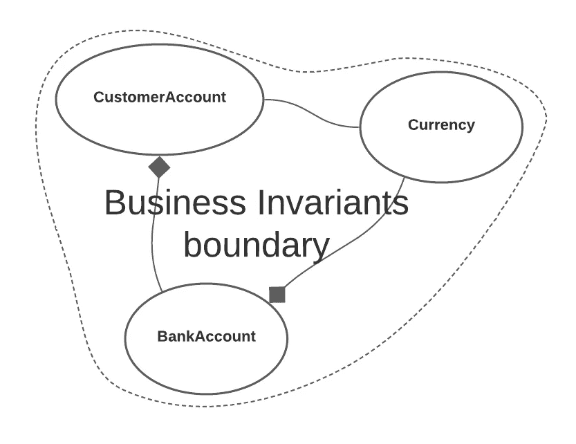
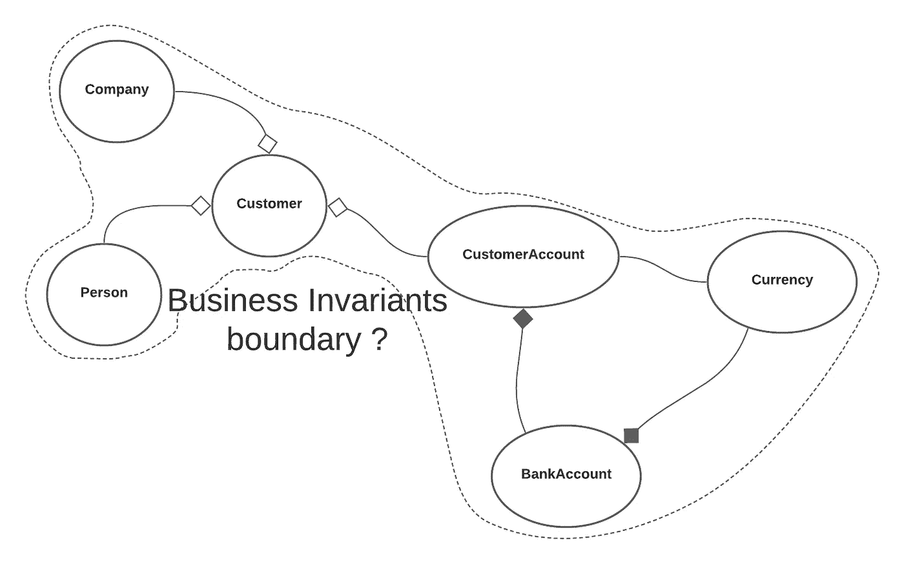
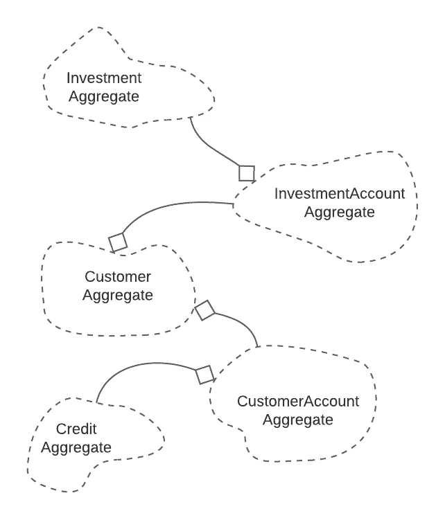

# 戈朗实用 DDD:骨料

> 原文：<https://levelup.gitconnected.com/practical-ddd-in-golang-aggregate-de13f561e629>

## 领域驱动设计

## 一个 DDD 模式来统治他们。


拉斐尔·比斯卡尔迪在 [Unsplash](https://unsplash.com?utm_source=medium&utm_medium=referral) 上拍摄的照片

我花了几年时间理解和实践 DDD 方法。大多数原则都易于理解并在代码中实现。然而，有一个引起了我的特别注意。

我必须说，聚合是 DDD 最关键的模式，没有它，整个战术领域驱动的设计可能没有意义。它将业务逻辑绑定在一起。

在阅读过程中，您可能会发现 Aggregate 更像是一组模式，但这是一种误解。聚合是域层的中心点。没有它，就没有使用 DDD 的理由。

```
Other articles from DDD series:**1\.** [**Practical DDD in Golang: Value Object**](/practical-ddd-in-golang-value-object-4fc97bcad70)**2\.** [**Practical DDD in Golang: Entity**](/practical-ddd-in-golang-entity-40d32bdad2a3)**3\.** [**Practical DDD in Golang: Domain Service**](/practical-ddd-in-golang-domain-service-4418a1650274)**4\.** [**Practical DDD in Golang: Domain Event**](/practical-ddd-in-golang-domain-event-de02ad492989)**5\.** [**Practical DDD in Golang: Module**](/practical-ddd-in-golang-module-51edf4c319ec)
```

[](https://blog.ompluscator.com/membership) [## 通过我的推荐链接加入媒体——马尔科·米洛耶维奇

### 作为一个媒体会员，你的会员费的一部分会给你阅读的作家，你可以完全接触到每一个故事…

blog.ompluscator.com](https://blog.ompluscator.com/membership) 

# 商业不变量

在真实的商业世界中，有些规则是灵活的。例如，如果你从银行贷款，你需要支付一些利息。利息总额是可以调整的，这取决于你的投资资本和偿还债务的期限。

在某些情况下，银行可能会给你一个宽限期。或者因为你过去的忠诚而给你一个更好的整体报价。或者给你一生一次的机会，或者强迫你抵押一所房子。

所有这些来自商业世界的灵活规则，在 DDD，我们实现了策略模式(我将在下面的文章中讨论这一点)。它们依赖于许多特定的情况，为此，它们要求更复杂的代码结构。

> 在现实的商业世界中，有一些不变的规则。无论我们如何努力，我们都无法改变它们，也无法改变它们在我们业务中的应用。每当物体从一个状态转移到另一个状态时，这些规则仍然必须适用。它们被称为业务不变量。

例如，任何人都不应该被允许删除银行中的客户帐户，如果与该客户相关联的任何银行帐户有钱或有债务。

在许多银行，一个客户可能有多个相同货币的银行账户。但是，有些银行不允许客户持有外币，也不允许客户在同一个银行开立多个账户。

当这样的业务规则发生时，它们就成为业务不变量。它们从我们创建对象的那一刻起就存在，直到我们删除它。破坏它们意味着破坏应用程序的整个目的。

业务不变量的例子

在上面的例子中，我们可以在 Go 中看到一些代码结构，用`CustomerAccount`作为一个实体和集合。除此之外，还有`BankAccount`和`Currency`作为实体。

另外，这三个实体都有自己的业务规则。有些是灵活的，有些是不变的。尽管如此，当它们相互作用时，一些不变量会影响所有的元素。这就是我们放置骨料的地方。

我们有一个`BankAccount`创造的逻辑，它依赖于特定`CustomerAccount`的所有`BankAccounts`。在这种情况下，一个`Customer`不能有多个`BankAccounts`具有相同的`Currency`。

此外，如果连接到`CustomerAccount`的所有`BankAccounts`都不处于干净状态，我们也不能删除`CustomerAccount`。他们不应该假装或拥有任何钱。



商业不变量应用领域

上图显示了我们已经讨论过的三个实体的集群。它们都与业务不变量联系在一起，确保 Aggregate 始终处于可靠的状态。

如果任何其他实体或值对象属于相同的业务不变量，那么这些新对象将成为相同聚合的一部分。

如果在同一个集合中，我们没有一个单一的不变量将一个对象与其余的对象绑定在一起，那么这个对象就不属于这个集合。

# 分界线

我多次使用 DDD，有一个关于如何定义总边界的问题。在游戏中加入每一个新的实体或价值对象，这个问题总是会出现。

到目前为止，很清楚，聚合不仅仅是一些对象的集合。这是一个领域概念。其成员定义了一个逻辑集群。如果不对它们进行分组，我们就不能保证它们处于有效状态。

客户总数

在上面的代码片段中，您可以看到`Customer`聚合。不仅在这里，在许多应用程序中，您都将拥有一个名为`Customer`的实体，而且几乎总是，它也将是一个集合。

这里我们有一些定义特定`Customer`合法性的业务不变量，这取决于我们谈论的是`Person`还是`Company`。应该有更多的业务不变量，但是现在，一个就足够了。

当我们处理一个银行的申请时，困难在于`CustomerAccount`和`Customer`是否属于同一个集合。它们之间是有联系的，一些业务规则把它们绑定在一起，但是它们是不变的吗？



领域层中的新实体

一个`Customer`可以有多个`CustomerAccounts`(或者没有)。我们可以看到`Customer`周围的对象和`CustomerAccount`周围的对象有一些业务不变量。

从不变量的确切定义出发，如果我们找不到任何把`Customer`和`CustomerAccount`联系在一起的不变量，那么我们应该把它们分割成集合。我们带入画面的任何其他集群都需要同样对待——它们是否与已经存在的聚集共享一些不变量？



多个聚合连接

使聚合尽可能小始终是一个好的做法。聚合成员一起保存在存储中(就像数据库一样)，在一个事务中添加太多的表并不是一个好的做法。

在这里，我们已经看到，我们应该在聚合级别上定义存储库，并只通过该存储库持久化其所有成员，如下例所示。

整个聚合的存储库示例

我们可以将`Person`和`Company`定义为实体(或者值对象)，但是即使它们有自己的标识，我们也要用`CustomerRepository`从`Customer`开始更新。

直接使用`Person`或`Company`工作，或者在没有`Customer`和其他对象的情况下持久化它们会破坏业务不变量。我们希望确保所有的事务一起被传递，或者是否有必要回滚所有的更改。

除了持久化之外，聚合的删除必须同时发生。这意味着，通过删除`Customer`实体，我们也必须删除`Person`和`Company`实体。它们没有单独存在的理由。

如你所见，一个集合不能太小也不能太大。它必须用业务不变量精确界定。边界内的一切我们必须一起使用，边界外的一切属于其他集合。

# 关系

正如您在本文前面看到的，聚合之间存在关系。那些关系应该总是在代码中，但是它们必须尽可能简单。

为了避免复杂的连接，我们应该首先避免引用集合，而是对关系使用标识——下面的代码片段就是一个例子。

使用标识避免引用。

另一个问题可能是关系的方向。最好的情况是当它们之间有一个单向连接时，我们避免任何双向连接。

这不是一个容易决定的过程，它取决于我们在有限环境中的用例。如果我们为 ATM 编写软件，其中用户通过使用借记卡与`CustomerAccount`交互，那么我们有时会通过在`CustomerAccount`中拥有其身份来访问`Customer`。

在另一种情况下，我们的有界上下文可能是一个从一个`Customer`管理所有`CustomerAccounts`的应用程序。用户可以对所有`BankAccounts`进行授权和操作。在这种情况下，`Customer`应该包含一个与`CustomerAccounts`相关联的身份列表。

# 聚集根

本文中的所有聚合都与一些实体同名，比如`Customer`实体和聚合。这些唯一的实体是聚合根和聚合内部的主要对象。

聚合根是访问所有其他实体、值对象和集合的网关。我们不应该直接更改聚合的成员，而应该通过聚合根来更改。

聚合根公开了表示其丰富行为的方法。它应该定义访问内部属性或对象的方法，以及操作这些数据的方法。即使聚合根返回一个对象，它也应该只返回它的一个副本。

丰富行为的示例

由于 Aggregate 包含多个实体和值对象，因此其中会出现许多不同的标识。在这些情况下，有两种类型的身份。

聚合根具有全局标识。该标识在全球范围内是唯一的，在应用程序中没有任何地方可以找到具有相同标识的实体。我们可以从聚合的外部引用聚合根的身份。

聚合中的所有其他实体都有本地标识。此类身份仅在聚合内部是唯一的，但在聚合外部可能会重复。只有 Aggregate 保存关于本地身份的信息，我们不应该在 Aggregate 之外引用它们。

全球和本地身份

# 结论

聚合是由业务不变量定义的领域概念。业务不变量定义了在应用程序的任何状态下都必须有效的规则。它们代表一个集合体的边界。

聚合必须一起保存和删除。聚合根是聚合的其他成员的网关。只能通过聚合根来访问它们。

```
Other articles from DDD series:**1\.** [**Practical DDD in Golang: Value Object**](/practical-ddd-in-golang-value-object-4fc97bcad70)**2\.** [**Practical DDD in Golang: Entity**](/practical-ddd-in-golang-entity-40d32bdad2a3)**3\.** [**Practical DDD in Golang: Domain Service**](/practical-ddd-in-golang-domain-service-4418a1650274)**4\.** [**Practical DDD in Golang: Domain Event**](/practical-ddd-in-golang-domain-event-de02ad492989)**5\.** [**Practical DDD in Golang: Module**](/practical-ddd-in-golang-module-51edf4c319ec)
```

# 有用的资源:

*   [https://martinfowler.com/](https://martinfowler.com/)
*   [https://www.domainlanguage.com/](https://www.domainlanguage.com/)