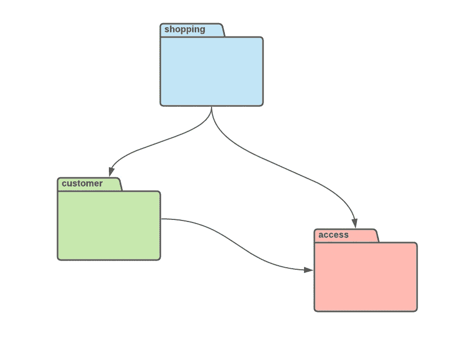

# 戈朗实用 DDD:模块

> 原文：<https://levelup.gitconnected.com/practical-ddd-in-golang-module-51edf4c319ec>

## 领域驱动设计

## 围棋中关于 DDD 的旅程把我们带到了高度内聚的结构群——模块。


照片由[阿莫斯·巴泽夫](https://unsplash.com/@amosbarzeev?utm_source=medium&utm_medium=referral)在 [Unsplash](https://unsplash.com?utm_source=medium&utm_medium=referral) 上拍摄

乍一看，这个模块看起来不像一个模式，至少，我们认为是软件开发中的[模式](https://refactoring.guru/design-patterns)。这是可以理解的，因为有人可能更多地将模块视为项目结构，而不是模式。

当我们考虑 [Go 模块](https://go.dev/blog/using-go-modules)时，额外的麻烦就来了。他们将 [Go 包](https://www.callicoder.com/golang-packages/)的集合耦合在一起，一起版本化并发布。我们使用这些模块作为 Go 中的依赖管理。

因此，如果 Go 模块和包都影响项目结构，那么它们似乎应该与 DDD 模式模块有一些联系。事实也的确如此。

```
Other articles from DDD series:**1\.** [**Practical DDD in Golang: Value Object**](/practical-ddd-in-golang-value-object-4fc97bcad70)**2\.** [**Practical DDD in Golang: Entity**](/practical-ddd-in-golang-entity-40d32bdad2a3)**3\.** [**Practical DDD in Golang: Domain Service**](/practical-ddd-in-golang-domain-service-4418a1650274)**4\.** [**Practical DDD in Golang: Domain Event**](/practical-ddd-in-golang-domain-event-de02ad492989)
```

# 该结构

在 Go 中，我们使用包对代码进行分组。包遵循我们项目中的文件夹结构，尽管它们在命名上可能有所不同。这些变化是因为我们可以用不同于实际文件夹的方式调用我们的包。

文件夹名和包名之间的区别

在上面的例子中，我们可以看到文件夹和包命名之间的细微差别。有时，如果我有很多`model`包，我会给它们加上我的 DDD 模块的前缀，以便容易地引用同一个文件中的多个`model`包。

现在我们可能已经对前面例子中的 DDD 模块有了一些了解。在这里，模块是`access`包，以及它所有的子包。

```
project
|--cmd
   |--main.go
|--internal
   |--module1
      |--infrastructure
      |--presentation
      |--application
      |--domain     
         |--service    
         |--factory    
         |--repository    
         |--model  
      |--module1.go
   |--module2
      |--...
   |--...
|--pkg
   |--module3
      |--...
   |--module4
      |--...
   |--...
|--go.mod
|--...
```

上面方案中的文件夹结构代表了我最喜欢的项目结构，它在 Go 中实现了领域驱动设计。有时我会对一些文件夹做不同的改动，但我总是试图让 DDD 模块保持相同的形式。

在我的项目中，每个模块最多有四个基础包:`infrastructure`、`presentation`、`application`和`domain`。如你所见，我喜欢遵循[分层架构](https://www.oreilly.com/library/view/software-architecture-patterns/9781491971437/ch01.html)的原则。

在这里，我将`infrastructure`包放在顶部。这是因为通过遵循鲍勃大叔的 T21 依赖性反转原则，我的来自 T1 层的低级服务实现了来自其他层的高级接口。

使用这种方法，我确保将端口定义为`domain`层上的`UserRepository`接口。实际的实现在`infrastructure`层，它可以是多个适配器，比如`UserDBRepository`，或者`UserFakeRepository`。

端口和适配器

关于端口和适配器的故事并不新鲜，它属于[六边形架构](https://medium.com/ssense-tech/hexagonal-architecture-there-are-always-two-sides-to-every-story-bc0780ed7d9c)的原理。这是我在设计 DDD 模块时使用的第二个原则，对我来说，这是至关重要的一个原则。

回到模块内部的包的结构，每一层都知道下面所有层的一切，没有人知道它们的任何事情。因此，`infrastructure`层可以依赖于所有层，而`domain`层不依赖于任何层。

在`infrastructure`层的正下方是`presentation`层。我们也可以称之为`interface`层，但它是 Go 中的保留字，所以`presentation`看起来没问题。最后，在`presentation`和`domain`之间，还有`application`层。

Go 中这种分层的好处在于，它帮助我们避免了循环依赖，循环依赖会在编译时破坏我们的代码。通过遵循这些分层规则和依赖性方向，我们可以将自己从痛苦的代码重构中拯救出来。

最后，你注意到了`domain`层里面的一些文件夹(或者包):`model`、`service`等。我偶尔会把它们放在那里，以使我的包尽可能简单。

有时，我在`domain`中使用那个子结构来避免 Go 中的循环依赖。我选择将`model`放在底部，将`service`放在顶部，但这取决于个人选择他们喜欢的方式。

# 逻辑集群

DDD 模块不仅仅是一些文件和文件夹的组合。这些文件和文件夹中的代码必须代表某种内聚的结构。不仅如此，两个不同的模块应该是松散耦合的，它们之间的依赖性最小。

```
project
|--...
|--pkg
   |--access
      |--infrastructure
         |--...
      |--presentation
         |--...
      |--application
         |--service
            |--authorization.go
            |--registration.go
      |--domain     
         |--repository
            |--user.go
            |--group.go
            |--role.go    
         |--model
            |--user.go
            |--group.go
            |--role.go
      |--access.go
   |--shopping
      |--infrastructure
         |--...
      |--presentation
         |--...
      |--application
         |--service
            |--session_basket.go
      |--domain     
         |--service 
            |--shopping.go 
         |--factory 
            |--basket.go 
         |--repository
            |--order.go   
         |--model
            |--order.go
            |--basket.go
      |--shopping.go
   |--customer
      |--infrastructure
         |--...
      |--presentation
         |--...
      |--application
         |--...
      |--domain 
         |--repository
            |--customer.go 
            |--address.go    
         |--model
            |--customer.go 
            |--address.go 
      |--customer.go
   |--...
|--...
```

上面的文件夹结构是 DDD 模块的一个简单例子。在那里，我们有三个模块(可能更多)，叫做`access,` `shopping,`和`customer`。它们都有自己的层和子层。

`access`模块与授权和注册过程相关。它包含了在会话中处理一个`User`的全部逻辑。此外，它拥有每个用户的访问权限，并决定他们是否可以访问特定的对象。

`customer`模块包含关于`Customers`及其`Addresses`的信息。尽管它可能看起来与`User`相同，但它代表了生成`Orders`的业务实体，其中`User`是会话中的一个实体。另外，一个`User`可以有多个`Customers`进行交付，就像我们已经在很多平台上做的那样。

最后，`shopping`模块是一个完整逻辑的集群，包括`Basket`的创建和保持会话状态，以及`Orders`的进一步创建。这个`shopping`模块看起来比其他两个更复杂，事实上，它依赖于这两个模块。

而且，就像层一样，我们也应该跟踪模块之间的依赖关系，并确保它们是单向的。否则编译器可能会哭。



模块依赖图

如上图所示，`shopping`模块使用`customer`模块找出`Order`的主人是谁。从那里，它可以使用`Address`来定义交付。它还依赖于`access`模块来检查特定`Baskets`和`Items`的访问权限。

`customer`模块只依赖于`access`模块。它为会话中的用户提供了一个连接，并提供了一个已分配的`Customers`列表，以决定将`Order`发送给谁。

`customer`和`shopping`可以一起定义一个单一的[有界上下文](https://martinfowler.com/bliki/BoundedContext.html)。单个模块不需要表示一个有界的上下文。我喜欢将一个有界的上下文分割成多个模块。

`access`模块可能看起来像一个不同的有界上下文的候选者，将来，我们可以考虑把它放在别的地方。稍后，其他有界上下文可能依赖于访问有界上下文。

虽然`shopping`和`customer`可能看起来是耦合在一起的，但是在我们的应用程序中，我们决定将它们分开。原因是作为一个`Customer`，我们可能会独立于`Orders`做很多不同的事情。

我们可能会更改我们的`Addresses`，查看我们的历史，跟踪我们的交付，联系客户支持。`Customer`细节的变化不应影响一个订单。此外，一个`Order`的变化不会影响`Customer`。我们可以独立地与他们合作。

# 命名

谈论命名可能看起来令人惊讶，但不幸的是，事实并非如此。根据我的经验，我见过 DDD 模块糟糕的名字，我还创造过更糟糕的名字。

```
project
|--...
|--pkg
   |--shoppingAndCustomer
      |--...
   |--utils
      |--...
   |--events
      |--...
   |--strategy
      |--...
   |--...
|--...
```

上面的例子包含许多不同的坏名字。我总是避免在模块名中使用“和”这个词，就像这里的`shoppingAndCustomer`。如果我不能避免“和”这个词，可能我是在处理两个独立的模块。

“utils”这个词是软件开发中最糟糕的名字。我不能忍受它作为结构名、文件名、函数名、包或模块名。“垃圾收集器”这个名字可能更合适，因为它最恰当地描述了存储在`utils`模块中的代码。

拥有一个包含来自任何地方的小部件的模块也是没有用的。`events`模块就是这样一个例子——它包含来自整个应用程序的域事件。

以某种设计模式命名一个模块也不是很好的做法，比如`strategy`模块。也许我们应该在应用程序的很多地方使用[策略](https://refactoring.guru/design-patterns/strategy)模式，所以制作多个`strategy`模块是没有意义的。

我们的模块应该有来自真实商业世界的名字。它应该是[无处不在的语言](https://martinfowler.com/bliki/UbiquitousLanguage.html)的一部分，属于商业和软件开发领域的一些术语，描述了同样的事情。它应该是该业务逻辑集群的唯一名称。

# 依赖注入

您可能会注意到，第一个项目结构在每个 DDD 模块的根中引入了单独的 Go 文件。我总是把它们的名字放在`module.go`或者与模块相同的地方。

在这些文件中，我定义了模块中的依赖项，以及端口的不同适配器(如果有的话)。在许多情况下，我编写简单的 Go 容器，存储我在应用程序中使用的对象。

具有依赖关系的简单模块

在上面的例子中，我已经创建了`AccessModule`结构。在初始化过程中，它接受配置，该配置定义了它是否应该依赖于数据库或某些用于`UserRepository`的虚假实现。稍后，所有其他模块都可以使用这个容器来获取它们的依赖项。

我们还可以通过使用我们现有的许多框架中的一个来解决 Go 中的依赖注入。其中使用最多的是一个名为 [Wire](https://github.com/google/wire) 的库，但我个人最好的是 [Dingo](https://github.com/i-love-flamingo/dingo) 。

Dingo 库依赖于反射，这对于许多 go 开发者来说是一个痛苦的话题。虽然我不喜欢 Go 中的反射，但根据我的经验，Dingo 被证明是一个简单而稳定的解决方案，提供了许多不同的特性。

Dingo 库的例子

# 结论

DDD 模块是我们代码的逻辑簇。它将许多结构耦合在一起，形成一个共享一些业务规则的有凝聚力的团体。在模块内部，我们可以引入不同的层。

层和模块都应该遵循单向通信，以避免循环依赖。模块的名称应该代表商业领域的术语。

```
Other articles from DDD series:**1\.** [**Practical DDD in Golang: Value Object**](/practical-ddd-in-golang-value-object-4fc97bcad70)**2\.** [**Practical DDD in Golang: Entity**](/practical-ddd-in-golang-entity-40d32bdad2a3)**3\.** [**Practical DDD in Golang: Domain Service**](/practical-ddd-in-golang-domain-service-4418a1650274)**4\.** [**Practical DDD in Golang: Domain Event**](/practical-ddd-in-golang-domain-event-de02ad492989)
```

[](https://blog.ompluscator.com/membership) [## 通过我的推荐链接加入媒体——马尔科·米洛耶维奇

### 作为一个媒体会员，你的会员费的一部分会给你阅读的作家，你可以完全接触到每一个故事…

blog.ompluscator.com](https://blog.ompluscator.com/membership) 

# 有用的资源:

*   [https://martinfowler.com/](https://martinfowler.com/)
*   【https://www.domainlanguage.com/ 号