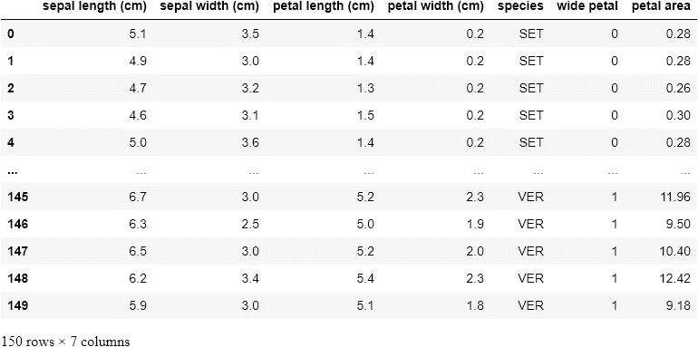

# 使用 Python 的数据分析和机器学习实用指南

> 原文：<https://levelup.gitconnected.com/practical-guide-into-data-analysis-and-machine-learning-using-python-7e8ce4081dfc>

掌握构建机器学习应用的第一步实践指南。


来源: [Pixabay](https://pixabay.com/photos/abacus-count-mathematics-learn-4167869/)

机器学习在不断进化。伴随着这种演变而来的是需求和重要性的激增。企业和初创公司现在比以往任何时候都更需要数据科学家和机器学习工程师，将这些数据转化为有用的智慧。可能没有比现在(除了 5 年前)更好的时间来钻研机器学习了。当然，没有比 Python 更好的工具来开发这些应用程序了。Python 有一个充满活力和活跃的社区。它的许多开发者来自科学界，因此为 Python 提供了大量用于科学计算的库。

在本文中，我们将讨论 Python 关键科学库的一些特性，并在适当的数据分析和机器学习工作流中使用它们。

你将学到什么；

*   了解熊猫是什么，为什么它是你工作流程中不可或缺的一部分。
*   如何使用 Pandas 检查数据集
*   如何准备熊猫的数据和特征工程
*   理解为什么数据可视化很重要。
*   如何用 Matplotlib 和 Seaborn 实现数据可视化？
*   如何用 Statsmodel 建立统计模型？
*   如何用 Scikit-Learn 的算法建立一个 ML 模型？
*   如何对模型的特征重要性进行排序并执行特征选择。

如果你想直接看代码，可以在 GitHub 上找到[。](https://github.com/SteveKola/Python-ML-Blueprints/blob/master/1.-Baby-Steps-into-Data-Analysis-and-Machine-Learning/Baby%20steps%20into%20ML.ipynb)

**免责声明:**本文假设

*   您至少掌握了 Python 和
*   你已经熟悉[数据科学/机器学习工作流程](https://steventure.hashnode.dev/the-data-sciencemachine-learning-workflow-ckdslw7ps00egb6s1gla942wv)。

## 熊猫

Pandas 是一个非凡的数据分析工具，旨在成为任何语言中最强大、最灵活的开源数据分析/操作工具。让我们来看看熊猫的能力:

## 数据采集

```
import numpy as np
import pandas as pd
from sklearn import datasetsiris_data = datasets.load_iris()iris_data.keys()# THIS IS THE OUTPUT FOR 'iris_data.keys()'
dict_keys(['data', 'target', 'frame', 'target_names', 'DESCR', 'feature_names', 'filename'])iris_data['target_names']# THIS IS THE OUTPUT FOR 'iris_data['target_names']'
array(['setosa', 'versicolor', 'virginica'], dtype='<U10')df_data = pd.DataFrame(iris_data['data'], columns=iris_data['feature_names'])df_target = pd.DataFrame(iris_data['target'], columns=['species'])df = pd.concat([df_data, df_target], axis=1)df
```


在上面的单元格中，您会注意到我已经使用 Scikit-learn 导入了经典数据集[Iris 数据集(我们稍后将探讨 Scikit-learn)。然后，我将数据传递到 Pandas DataFrame 中，同时还包括列标题。我还创建了另一个数据帧来包含鸢尾物种，它们的代码分别为`0`代表`setosa`、`1`代表`versicolor`、`2`代表`virginica`。最后一步是将两个数据帧连接成一个数据帧。](https://scikit-learn.org/stable/modules/generated/sklearn.datasets.load_iris.html)

当处理可以放在一台机器上的数据时，Pandas 是终极工具。它更像 Excel，但却是类固醇。就像 Excel 一样，操作的基本单位是行和列，其中数据列是系列，系列的集合是数据帧。

## 探索性数据分析

让我们执行一些常见的操作；

## 数据切片

```
df.head()
```


```
df['sepal length (cm)']# OUTPUT
0      5.1
1      4.9
2      4.7
3      4.6
4      5.0
      ... 
145    6.7
146    6.3
147    6.5
148    6.2
149    5.9
Name: sepal length (cm), Length: 150, dtype: float64
```

`.head()`命令将返回前 5 行。第二个命令是通过引用列名从数据帧中选择一个列。

执行[数据切片](https://whatis.techtarget.com/definition/slice-and-dice)的另一种方式是使用`loc`和`iloc`方法。

要使用`iloc`，我们必须指定我们想要通过它们的整数索引进行切片的行和列，而对于`loc`，我们必须指定我们想要过滤掉的列的名称。

`loc`从索引中获取带有特定标签的行(或列)**，而`iloc`获取索引中特定位置**的行(或列)位置**(因此它只接受整数)**

```
df.iloc[:3, :2]
```


使用`.iloc`，我们只选择了数据帧的前 3 行和前 2 列。让我们试试更难的；

```
df.loc[:3, [x for x in df.columns if 'width' in x]]
```


这里我们遍历`df.columns`，它将返回一个列列表，并且只选择名称中带有“width”的列。这个看似很小的函数在用于大得多的数据集时是一个非常强大的工具。

接下来，让我们使用另一种方法，通过指定要满足的条件来选择一部分数据。我们将查看`species`的唯一列表，然后从中选择一个。

```
# Listing all the available unique classesdf['species'].unique()# OUTPUT FOR 'df['species'].unique()'
array([0, 1, 2])df[df['species'] == 2]
```


注意，我们的数据帧只包含了几行`Iris-virginica`物种(用 2 表示)。事实上，大小是 50，而不是原来的 150 行。

```
df.count()# OUTPUT
sepal length (cm)    150
sepal width (cm)     150
petal length (cm)    150
petal width (cm)     150
species              150
dtype: int64df[df['species'] == 2].count()# OUTPUT
sepal length (cm)    50
sepal width (cm)     50
petal length (cm)    50
petal width (cm)     50
species              50
dtype: int64
```

您还会注意到左边的索引保留了原始的行号，这可能会在以后引起问题。因此，我们可以将它保存为一个新的数据帧，并重置索引。

```
virginica = df[df['species'] == 2].reset_index(drop=True)
virginica
```


我们通过指定一个条件来选择这个新的数据帧。现在让我们添加更多的条件。我们将在原始数据帧上指定两个条件。

```
df[(df['species'] == 2) & (df['petal width (cm)'] > 2.2)]
```


作为练习，您可以自己重置这个新数据帧的索引。

## 描述统计学

现在让我们试着从我们的数据集中获取一些描述性统计数据；

```
df.describe()
```


使用`.describe()`方法，我得到了每一列的描述性统计的细目分类。我可以发现所有列的计数，并且很容易注意到是否有丢失的值。我可以看到平均值、标准差、中值、众数，还可以注意到数据是否有偏差。如果我想要更详细的信息，我也可以传递我自己的百分位数；

```
# Passing in custom percentilesdf.describe(percentiles=[.2, .4, .8, .9, .95])
```


现在让我们通过调用 DataFrame 上的`.corr()`方法来检查特性之间是否有任何相关性；

```
# Checking for correlations between the featuresdf.corr()
```


我发现令人惊讶的是`sepal length`和`sepal width`的相关性最低，得分为 **-0.117570** 。

现在，我们已经了解了如何选择数据帧的子集以及如何汇总其统计数据，让我们尝试并直观地检查我们的数据。

## 数据可视化

你可能想知道为什么我们还要为可视化而烦恼。事实是，数据可视化使数据更容易被人脑理解，我们可以通过执行视觉检查来轻松检测数据中的趋势、模式和异常值。

现在我们已经理解了可视化的重要性，让我们来看看在这方面做得最好的两个 Python 库。

## Matplotlib 库

Matplotlib 是所有 Python 绘图库的始祖。它最初是为了模仿 MATLAB 的绘图功能而创建的，后来它凭借自己的力量成长为一个巨人。

```
import matplotlib.pyplot as plt
plt.style.use('ggplot')
```

第一行导入 Matplotlib，而第二行将我们的绘图风格设置为类似于 [R 的 ggplot 库](https://ggplot2.tidyverse.org/reference/ggplot.html)。

现在，让我们在常规数据集上使用以下代码生成第一个图表；

```
# Plotting an histogram of the petal width featureplt.figure(figsize=(6,4))
plt.hist(df['petal width (cm)'], color='black')
plt.xlabel('Width', fontsize=12)
plt.ylabel('Count', fontsize=12)
plt.title('Iris Petal Width', fontsize=14,)Text(0.5, 1.0, 'Iris Petal Width')
```


让我们一行一行地检查代码:

*   第一行创建一个宽 6 英寸、高 4 英寸的绘图空间。
*   第二行创建了花瓣宽度列的直方图，我们还将条形颜色设置为黑色。
*   我们分别用“宽度”和“数量”标记 x 和 y 轴，同时将字体大小设置为 12。
*   最后一行创建标题“鸢尾花瓣宽度”，字体大小为 14。

所有这些给了我们一个很好的花瓣宽度数据直方图！

现在让我们对此进行扩展，并为 Iris 数据集的每一列生成直方图；

```
# Plotting subplots of the 4 features (NOTE: THIS IS NOT IDEAL!)fig, ax = plt.subplots(2, 2, figsize=(6,4))ax[0][0].hist(df['petal width (cm)'], color='black')
ax[0][0].set_xlabel('Width', fontsize=12)
ax[0][0].set_ylabel('Count', fontsize=12)
ax[0][0].set_title("Iris Petal Width", fontsize=14)ax[0][1].hist(df['petal length (cm)'], color='black')
ax[0][1].set_xlabel('Length', fontsize=12)
ax[0][1].set_ylabel('Count', fontsize=12)
ax[0][1].set_title("Iris Petal Length", fontsize=14)ax[1][0].hist(df['sepal width (cm)'], color='black')
ax[1][0].set_xlabel('Width', fontsize=12)
ax[1][0].set_ylabel('Count', fontsize=12)
ax[1][0].set_title("Iris Sepal Width", fontsize=14)ax[1][1].hist(df['sepal length (cm)'], color='black')
ax[1][1].set_xlabel('Length', fontsize=12)
ax[1][1].set_ylabel('Count', fontsize=12)
ax[1][1].set_title("Iris Sepal Length", fontsize=14)plt.tight_layout()
```


很明显，这不是最有效的方法，但是演示 Matplotlib 的工作方式非常有用。在前面的例子中，这几乎是不言自明的，除了我们现在有四个可以通过 ax 数组访问的子情节。另一个附加功能是`plt.tight_layout()`调用，我们很好地自动分隔了我们的支线剧情以避免拥挤。

现在让我们来看看 Matplotlib 中可用的其他类型的绘图。一个是**散点图**。这里我们绘制了花瓣宽度与花瓣长度的关系；

```
# A scatterplot of the Petal Width against the Petal Lengthplt.scatter(df['petal width (cm)'], df['petal length (cm)'], color='green')
plt.xlabel('Petal Width')
plt.ylabel('Petal Length')
plt.title('Petal Scatterplot')
```


另一个图是简单的线形图。这是花瓣长度的线图；

```
# A simple line plot of the Petal Lengthplt.figure(figsize=(6,6))
plt.plot(df['petal length (cm)'], color='blue')
plt.xlabel('Specimen Number')
plt.ylabel('Petal Length')
plt.title('Petal Length Plot')
```


我们可以在这里看到，在这个图中有三个不同的集群，大概是每一种物种。这告诉我们，如果我们建立分类器模型，花瓣长度很可能是表示物种的有用特征。

最后，我们来看条形图。在这里，我们将为三种鸢尾的每个特征的平均值绘制一个条形图。此外，我们将使它成为一个堆叠的条形图，以增加趣味。

```
# A Bar-chart of the mean of each feature for the 3 classes of irisesfig, ax = plt.subplots(figsize=(6,6))
labels = [x for x in df.columns if 'length' in x or 'width' in x]ver_y = [df[df['species'] == 0][x].mean() for x in labels]
vir_y = [df[df['species'] == 1][x].mean() for x in labels]
set_y = [df[df['species'] == 2][x].mean() for x in labels]
x = np.arange(len(labels))plt.bar(x, vir_y, bottom=set_y, color='darkgrey')
plt.bar(x, set_y, bottom=ver_y, color='white')
plt.bar(x, ver_y, color='black')plt.xticks(x)
ax.set_xticklabels(labels, rotation=-70, fontsize=12);
plt.title('Mean Measurement by Class')
plt.legend(['Setosa', 'Versicolor', 'Virginica'])
```


为了生成条形图，我们需要将 x 和 y 值传入`.bar()`。这里，x 值是我们感兴趣的特征长度的数组。我们还调用了，并传入了要显示的首选列名。

为了正确排列 x 标签，我们还调整了标签的间距。这就是为什么我们将 xticks 设置为 x 加上 bar_width 大小的一半。

y 值来自每个物种的每个特征的平均值，我们通过调用`.bar()`来调用每个特征。我们还为每个系列传入一个底部参数，以设置其下系列的最小 y 点和最大 y 点。这就是产生堆叠棒线的原因。

最后，我们添加了一个描述每个系列的图例。这些名称按照条形从上到下的排列顺序插入到图例列表中。

## 锡伯恩图书馆

我们要看的下一个可视化库是 Seaborn。Seaborn 构建于 Matplotlib 之上，它是为统计可视化而构建的。这意味着它是为结构化数据(行和列中的数据)量身定制的。

现在让我们领略一下 Seaborn 的力量。只用两行代码，我们会得到如下结果:

```
import seaborn as snssns.pairplot(df, hue='species')<seaborn.axisgrid.PairGrid at 0x28fe2953430>
```


刚刚经历了(我希望不是)理解 Matplotlib 的复杂性的艰难时期，你会欣赏我们生成这个图的简单和容易。我们所有的功能都是用两行代码创建并正确标记的。

你可能会想，当 Seaborn 如此容易使用时，为什么还要使用 Matplotlib。正如我前面说过的，Seaborn 是建立在 Matplotlib 之上的，为了修改，有时你必须将 Seaborn 的功能与 Matplotlib 的功能结合起来。让我们尝试下一个可视化；

```
sns.set(style='white', palette='muted')
features = [col for col in df.columns if '(cm)' in col]plt.figure(figsize=(7, 7))
for n in range(len(features)):
    plt.subplot(2, 2, n+1)
    sns.violinplot(x='species', y=features[n], data=df)

plt.suptitle('Violin Plots', fontsize=16)
plt.tight_layout()
```


我们已经为四个特征中的每一个生成了一个小提琴图。小提琴图显示了特征的分布。比如你很容易看到`setosa` **(0)** 的花瓣长度在 1 厘米到 2 厘米之间高度聚集，而`virginica` **(2)** 则分散得多，从近 4 厘米到超过 7 厘米。

您还会注意到，我们使用了许多与构建 matplotlib 图时相同的代码。主要区别是增加了`sns.plot()`呼叫，取代了之前的`plt.plot()`和`ax.plot()`呼叫。

你可以用 [Seaborn](https://seaborn.pydata.org/) 和 [Matplotlib](https://matplotlib.org/3.1.1/api/_as_gen/matplotlib.pyplot.html) 创建各种各样的图形，我强烈推荐你深入研究这两个库的文档。

我们在这里讨论的方法应该对帮助您可视化和理解后续数据大有帮助。

## 数据准备

了解了如何检查和可视化我们的数据，下一步是学习如何处理和操作我们的数据。在这里，我们将使用熊猫的`map()`、`apply()`、`applymap()`和`groupby()`功能。它们在处理数据方面非常有用，对于要素工程(创建新要素的艺术)也非常有用。

## 地图

`map`函数只对 series 有效，所以我们将使用它来转换 DataFrame 的一列，这是一个熊猫系列。假设我们已经厌倦了使用物种代码？我们可以使用带有 Python 字典的`map`来实现这一点。键将是代码数字，而值将是替换

```
# Replacing each of the unique Iris typesdict_map = {0: 'SET', 
            1: 'VIR', 
            2: 'VER'}
df['species'] = df['species'].map(dict_map)
df
```


这里，我们已经传入了字典，`map`函数遍历了我们的整个数据，在遇到代码编号时，将它们替换为代码编号。

如果我们为我们的列选择了另一个名称，比如说`better names`，我们将有一个名为`better names`的新列追加到我们的数据帧中，并且我们仍然有带有新`better names`列的`species`列。

我们也可以将一个序列或一个函数传递给我们的`map`函数，但是我们也可以使用`apply`函数来完成这个任务(我们很快就会看到)。使`map`函数与众不同的是能够传入字典，因此`map`成为大多数单列转换的首选函数。

## 应用

与`map`不同，`apply`既适用于系列(单列)，也适用于数据框架(系列的集合)。现在，让我们使用花瓣宽度的平均值(1.3)作为决定因素，创建一个基于花瓣宽度的新列。

如果`petal width`大于平均值，我们将`wide petal`设置为 1，而如果它小于平均值，我们将`wide petal`设置为 0。

```
# Creating a new feature via petal widthdf['wide petal'] = df['petal width (cm)'].apply(lambda x: 1 if x>=1.3 else 0)
df
```


这里，我们对`petal width`列运行了`apply`，返回了`wide petal`列中的相应值。`apply`函数通过遍历`petal width`列的每个值来工作。如果该值大于或等于 1.3，则该函数返回 1，否则返回 0。

这种类型的转换是机器学习中相当常见的特征工程技术，因此熟悉如何执行它是很好的。

现在，让我们看看如何在整个数据框架中使用 apply，而不仅仅是在单个系列上。我们将基于花瓣区域创建一个新列。

```
# creating a new column via petal length & petal widthdf['petal area'] = df.apply(lambda row: row['petal width (cm)'] * row['petal length (cm)'], axis=1)
df
```



注意，我们在这里对整个数据帧调用了`apply`，我们还传入了一个新的参数`axis=1`，以便按顺序选择列并按行应用函数。如果我们将`axis`设置为 0，那么函数将按列操作并抛出一个错误。

因此，对于数据帧中的每一行，我们将它的`petal width`乘以它的`petal length`，从而创建一个结果序列`wide petal`。

这种能力和灵活性使得 Pandas 成为数据操作不可或缺的工具。

## 应用地图

当我们想要操作数据帧中的所有数据单元格时，可以使用`applymap`函数。让我们来看看这个。

```
# Getting the log values of all the data cellsdf.applymap(lambda x: np.log(x) if isinstance(x, float) else x)
```


这里，我们对整个数据执行了一次对数转换(使用 Numpy ),规定的条件是数据单元必须属于一个 **float** 实例。

`applymap`的常见应用包括基于满足多个条件来转换或格式化每个单元格。

## 分组依据

现在，让我们来看看一个非常有用的工具，但是一个熊猫新用户难以理解的工具。为了说明它的通用功能，我们将研究一些例子。

`groupby`函数确实如其名:它根据您选择的一个或几个类对数据进行分组。让我们试试第一个例子；

```
df.groupby('species').mean()
```


这里，每个物种的数据被划分，并提供了每个特征的平均值。现在让我们迈出更大的一步，获得每个物种的描述性统计数据；

```
# T for transposedf.groupby('species').describe().T
```


现在我们有了总的统计细目。当视觉化时，我们注意到有一些界限将每个物种的`petal width`和`petal length`分开。因此，让我们探索如何使用`groupby`来看到这一点；

```
# Group the classes by the petal width they are associated withdf.groupby('petal width (cm)')['species'].unique().to_frame()
```


所以在这里，我们通过`petal width`将`species`分组，我们可以尝试的另一个步骤(作为练习)是使用`apply`将数据划分到括号中。

最后，让我们来看看一个自定义的聚合函数。

```
df.groupby('species')['petal width (cm)'].agg(lambda x: x.max() - x.min())# OUTPUT
species
SET    0.5
VER    1.1
VIR    0.8
Name: petal width (cm), dtype: float64
```

这里，我们将`petal width`按`species`分组，并使用一个`lambda`函数来获得最大值`petal width`和最小值`petal width`之间的差值。

请注意，我们已经触及了`groupby`和其他熊猫函数的表面。我非常鼓励你去查阅文献资料，了解更多关于熊猫的工作原理。

## 建模和评估

既然您已经对如何操作和准备数据有了坚实的理解，我们将进入下一步，即建模。

在这里，我们将讨论用于机器学习的主要 Python 库。

## 统计模型

Statsmodels 是一个 Python 包，用于探索数据、估计模型和运行统计测试。在这里，我们将使用它来建立一个简单的线性回归模型，用于描述物种`setosa`的`sepal length`和`sepal width`之间的关系。

让我们创建一个散点图来直观地观察这种关系；

```
plt.figure(figsize=(7,7))
plt.scatter(df['sepal width (cm)'][:50], df['sepal length (cm)'][:50])
plt.xlabel('Sepal Width')
plt.ylabel('Sepal Length')
plt.title('Setosa Sepal Width vs. Length', fontsize=14, y=1.02)
```


我们可以看到这两个特征之间存在正线性关系。萼片宽度随着萼片长度的增加而增加。下一步是使用`statsmodels`对数据进行线性回归，以估计关系的强度。

```
import statsmodels.api as smy = df['sepal length (cm)'][:50]
x = df['sepal width (cm)'][:50]
X = sm.add_constant(x)results = sm.OLS(y, X).fit()
results.summary()
```

OLS 回归结果部。变量:萼片长度(cm) R 平方:0.551 模型:OLS 调整 R 平方:0.542 方法:最小二乘 F 统计:58.99 日期:2020 年 8 月 18 日星期二概率(F 统计):6.71e-10 时间:18:57:12 对数似然:1.7341 数量观察:50 AIC: 0.5319 Df 残差:48 BIC: 4.356 Df 模型:1 协方差类型:非稳健协№34.3

警告:
[1]标准误差假设误差的协方差矩阵是正确指定的。

这是我们简单回归模型的结果。由于这是一个线性回归，模型采用`Y = B0+ B1X`的格式，其中`B0`是常数(或截距)，而`B1`是回归系数。在这里，公式应该是`Sepal Length = 2.6447 + 0.6909 * Sepal Width`。我们还可以看到，该模型的`R2`是相当可观的 0.558，而`p-value`(Prob)非常显著。

```
plt.figure(figsize=(7,7))
plt.plot(x, results.fittedvalues, label='regression line', color='r')
plt.scatter(x, y, label='data point')
plt.ylabel('Sepal Length (cm)')
plt.xlabel('Sepal Width (cm)')
plt.title('Setosa Sepal Width vs. Sepal Length', fontsize=14,)
plt.legend(loc=0)
```


绘制结果。fittedvalues 从我们的回归中获得结果回归线。

statsmodels 包中还有其他几个统计函数和测试，但这是目前最常用的测试。

现在让我们转到 Python 机器学习包的核心部分；所有欢呼 sci kit-学习！

## sci kit-学习

Scikit-learn 是一个非常棒的 Python 库，拥有出色的文档，旨在为数十种算法提供一致的 API。它建立在 Python 科学堆栈的核心组件之上，本身也是，Python 科学堆栈包括 NumPy、SciPy、Pandas 和 Matplotlib。以下是 scikit-learn 涵盖的一些领域:分类、回归、聚类、降维、模型选择和预处理。

现在，让我们用虹膜数据构建一个分类器，然后我们看看如何使用 scikit-learn 的工具来评估我们的模型:

1.  数据应分为预测值和目标值；预测值(独立变量)应该是一个数字`n * m`矩阵 X，目标值(因变量)y，一个`n * 1`向量。
2.  然后这些被传递到所选分类器的`.fit()`方法中。
3.  然后我们可以使用`.predict()`方法对新数据进行预测。

这是使用 scikit-learn 的最大好处:每个分类器尽可能利用相同的方法。这使得它们的进出交换变得轻而易举。我们将很快看到这一点。

```
from sklearn.model_selection import train_test_split as ttsy = df.pop('species')
X_train, X_test, y_train, y_test = tts(df, y, test_size=.3)from sklearn.ensemble import RandomForestClassifierclf = RandomForestClassifier(max_depth=5, n_estimators=10)clf.fit(X_train, y_train)
y_pred = clf.predict(X_test)rf = pd.DataFrame(list(zip(y_pred, y_test)), columns=['predicted', 'actual'])
rf['correct'] = rf.apply(lambda x: 1 if x.predicted == x.actual else 0, axis=1)
rf
```


现在让我们运行这行代码；

```
# accuracy percentagerf['correct'].sum() / rf['correct'].count()# OUTPUT
0.9333333333333333
```

在前面的代码行中，我们在 iris 数据集上构建、训练和测试了一个准确率为 93%的分类器。现在让我们一个接一个地经历每一个步骤；

*   我们从 scikit-learn 导入了`train_test_split`，它被简化为`sklearn`import 语句。`train_test_split`是一个将数据分成训练集和测试集的模块。这是一个非常重要的建模实践。我们用训练集训练我们的模型，并用测试集验证我们的模型的性能。
*   在第二行中，我们将目标变量`species`与预测变量分开。(在数学语言中，我们创建了 X 矩阵和 y 向量)
*   然后我们使用`train_test_split`来分割数据。正如您所注意到的，我们将`test_size`设置为 0.3，这意味着测试集应该是整个数据的 30%。`train_test_split`模块也打乱了我们的数据，因为订单可能包含我们不想让模型知道的偏差。
*   移动到下一个单元格，我们从`sklearn`模块导入了一个随机森林分类器。我们在下一行中使用 10 棵决策树实例化了我们的森林分类器，每棵树的最大分裂深度为 5，以避免过度拟合。
*   接下来，使用训练数据来拟合我们的模型。在训练了我们的分类器之后，我们在分类器上调用了 predict 方法，并传入了我们的测试数据。请记住，测试数据是分类器尚未看到的数据。
*   然后，我们创建了实际标签与预测标签的数据框架。之后，我们合计了正确的预测，并将其除以实例的总数，这给了我们一个非常高的准确度。

现在让我们来看看给我们最高预测能力的特征；

```
# Feature Selectionf_names = df.columns
f_importances = clf.feature_importances_
f_std = np.std([tree.feature_importances_ for tree in clf.estimators_], axis=0)zz = zip(f_names, f_importances, f_std)
zzs = sorted(zz, key=lambda x: x[1], reverse=True)labels = [x[0] for x in zzs]
imps = [x[1] for x in zzs]
errs = [x[2] for x in zzs]plt.figure(figsize=(10,4))
plt.bar(range(df.shape[1]), imps, color='r', yerr=errs, align='center')
plt.xticks(range(len(f_importances)), labels)
```


正如我们所预期的，基于我们早期的视觉分析，当区分虹膜类别时，花瓣长度和宽度具有更强的辨别能力。

正如我提到的，当我们检查我们特征之间的相关性时，萼片长度和萼片宽度似乎对我们模型的准确性贡献很小。

我们是怎么得到这个的？随机森林有一个名为`.feature_importances_`的方法，该方法返回在树叶处进行分割的特性的相对性能。如果一个特性能够一致且清晰地将一个组划分为不同的类，那么它将具有很高的特性重要性。

你会注意到我们包括了标准差，这有助于说明每个特性的一致性。这是通过对十棵树中的每一棵树的每个特征取特征重要性，并计算标准偏差而生成的。

现在让我们看看另一个使用 Scikit-learn 的例子。我们现在将切换我们的分类器，并使用**支持向量机(SVM)** :

```
from sklearn.multiclass import OneVsRestClassifier
from sklearn.svm import SVCclf = OneVsRestClassifier(SVC(kernel='linear'))clf.fit(X_train, y_train)
y_pred = clf.predict(X_test)svc = pd.DataFrame(list(zip(y_pred, y_test)), columns=['predicted', 'actual'])
svc['correct'] = svc.apply(lambda x: 1 if x.predicted == x.actual else 0, axis=1)
svc
```


现在让我们执行下面一行代码；

```
svc['correct'].sum() / svc['correct'].count()# OUTPUT
0.9333333333333333
```

这里，我们使用 SVM 代替随机森林分类器，除了导入支持向量分类器和实例化模型的部分，没有改变任何代码。这只是对 Scikit-learn 所提供的无与伦比的能力的一个尝试。

我强烈建议你去 [Scikit-learn 文档](https://scikit-learn.org/)看看 Scikit-learn 提供的其他一些 ML 算法。

## 最终注释

这样，我们就完成了数据分析和机器学习的入门指南。

在本文中，我们学习了如何通过数据分析和机器学习的每个阶段逐步获取数据。我们还学习了 Python 科学堆栈中每个主要库的关键特性。

这里是 GitHub 上代码和解释的[链接](https://github.com/SteveKola/Python-ML-Blueprints/blob/master/1.-Baby-Steps-into-Data-Analysis-and-Machine-Learning/Baby%20steps%20into%20ML.ipynb)。

在后续文章中，我们将利用这些知识，并开始应用它们来创建独特而有用的机器学习应用程序。敬请期待！

同时，如果你觉得这篇文章很有见地，请喜欢并分享它。也可以在 [Twitter](https://twitter.com/steveddev) 和 [LinkedIn](https://www.linkedin.com/in/steven-kolawole-80/) 上跟我打招呼。玩得开心！

注意:这篇文章的灵感主要来自 Alexander T. Combs 的 Python 机器学习蓝图。