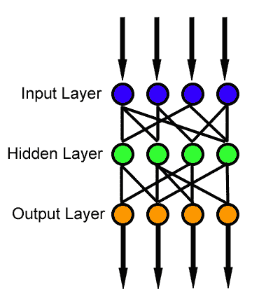
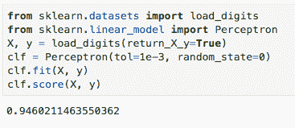

# 神经网络实用指南

> 原文：<https://levelup.gitconnected.com/practical-guide-to-neural-networks-8b81186d56d4>

## 让我们学习机器学习。

神经网络是机器学习的基石。每当你听到人工智能，你就会听到伪装的神经网络。但是它们是什么，你如何使用它们？

神经网络实用指南

# 神经网络:历史

最初是对人脑工作方式的类比，现在变成了一个完全独立的概念。

在 20 世纪 50 年代，随着计算机的发展进入婴儿期，开始对有关人类思维的理论基础进行建模成为可能。IBM 研究实验室的 Nathanial Rochester 领导了模拟神经网络的第一次尝试。第一次尝试失败了。但是后来的尝试成功了。

“思维机器”的倡导者继续为他们的案例辩护。1956 年，关于人工智能的达特茅斯夏季研究项目推动了人工智能和神经网络的发展。这一过程的成果之一是刺激了智能方面的研究，即业内所知的人工智能，以及大脑中更低级的神经处理部分。在达特茅斯项目之后的几年里，约翰·冯·诺依曼建议通过使用电报继电器或真空管来模仿简单的神经元功能。

这将是第一次人工智能革命，然后是冬天，因为结果远不令人满意。

我们已经看到了人工智能在 90 年代的复兴，但由于基础设施不足，它再次失败。过去十年，一切都变了。

Ciresan 和他的同事在 2010 年表明，GPU 使多层前馈神经网络的反向传播变得可行。2009 年至 2012 年间，神经网络开始获奖，在各种任务上接近人类水平的表现，最初是在[模式识别](https://en.wikipedia.org/wiki/Pattern_recognition)和[机器学习](https://en.wikipedia.org/wiki/Machine_learning)中。

Ciresan 和他的同事们建立了第一个模式识别器，以在基准测试中实现人类竞争/超人的性能，如交通标志识别，它于 2012 年发表，通常被视为我们今天所知的人工智能革命的开端。

# 什么是神经网络

神经网络从感知器开始，以人脑中的单个神经元为模型。你可以把它想象成一个接一个的函数。有了输入数据，然后应用一个激活函数，可以是线性函数、ReLu 或 sigmoid 函数或任何其他函数，然后将数据传递到下一个节点，并在给定节点再次应用激活函数。这一切都是分层进行的(这是更一般的前馈网络描述):

# 前馈神经网络

所以让我们从一个感知器的例子开始。我们看看它们是如何用 sklearn 实现的，然后我们切换到 [Keras](https://keras.io/) 框架。 [Keras](https://keras.io/) 是一个高级神经网络 API，用 Python 编写，能够运行在 TensorFlow 之上。 [TensorFlow](https://github.com/tensorflow/tensorflow) 是一个机器学习的端到端开源平台。它有一个全面、灵活的工具、库和社区资源生态系统，让研究人员推动 ML 的最新发展，开发人员轻松构建和部署 ML 驱动的应用程序。

这里有一个关于 sklearn 的简单例子，我们尝试使用感知器来拟合数字:

如你所见，代码简短而简单，但是细节在数学中。在这一点上，你应该回到一些线性代数，以了解发生了什么。

以下段落更具技术性，但我尝试将所有术语放在一起(通过链接，您可以了解每个概念的更多信息):

形式上，多层感知器是一类前馈神经网络。[前馈](https://en.wikipedia.org/wiki/Feedforward_neural_network)神经网络是其中节点之间的连接不形成循环的神经网络。[反向传播](https://en.wikipedia.org/wiki/Backpropagation)是一种为监督学习训练前馈神经网络的算法。反向传播针对单个输入/输出示例计算损失函数相对于网络权重的梯度。在这种情况下，理解[梯度下降](https://en.wikipedia.org/wiki/Gradient_descent)也很重要，这是一种用于寻找函数局部最小值的算法。

让我在这里指出，深度学习是机器学习，但我们使用至少 3 层神经网络的神经网络。

# 摘要

虽然神经网络的概念是古老的，但作为一个实用领域，人工智能是非常新的，如果我们从 2008 年左右开始计数，那时大多数当今时代的成果开始出现，人工智能才刚刚达到 10 岁。

这使得神经网络作为一个研究和应用领域非常迷人——我们只是在学习我们可以在哪里应用它们以及如何应用。数据科学和机器学习都在成长为计算机科学中最大和最热门的领域，还有许多应用有待发现。

最后，如果你想对成为一名[数据科学家](http://datasciencerush.com)有个大概的了解，那么看看我的书[数据科学工作:如何成为一名数据科学家](https://amzn.to/3aQVTjs)，它将指导你完成这个过程。