# NBA 球员网络抓取实用介绍

> 原文：<https://levelup.gitconnected.com/practical-introduction-to-web-scraping-in-r-nba-players-15393a3a0f78>

## 理解 web 抓取的基础知识，它在什么时候以及为什么有用，以及如何用 R 实现它

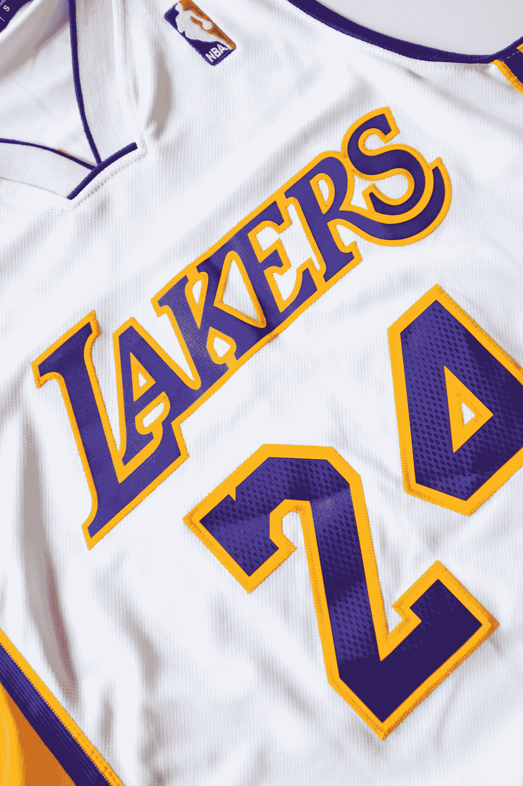

奥利维尔·科莱在 [Unsplash](https://unsplash.com?utm_source=medium&utm_medium=referral) 上拍摄的照片

数据并不总是以一种简洁的表格形式出现，我们可以很容易地用它来分析和获得洞见。有时，我们可能会发现自己需要从其他来源提取数据，例如互联网。

一些公司甚至使用网络抓取，通过访问大多数人忽略的数据来获得对竞争对手的优势。如果使用得当，网络抓取使我们能够从任何网站获取数据，并将其转换为可用的形式，以补充分析或项目。

> 网络抓取是一种自动从网站提取数据的方法。它省去了手动下载或复制数据的麻烦，而是从头到尾自动完成整个过程。

web 抓取的一些有趣的使用案例包括分析客户或产品评论、获取航班或酒店的实时票价，甚至是汇总公开招聘信息。

通用编程语言中有许多现有的包是为了解析 HTML 文档而构建的。例如，Python 中的 Beautiful Soup 被广泛用于网络抓取。

然而，在今天的练习中，我们将使用 [rvest](https://rvest.tidyverse.org/) ，一个 R 中用于从网页中获取数据的包。此外，我们将学习如何应用网络搜集技术从 ESPN [网站](https://www.espn.com/nba/teams)获取关于国家篮球协会(NBA)当前球员的信息。

# 玩家档案

执行 web 抓取时要记住的一件重要事情是检查您打算抓取的网页的一致性。具体来说，我们可以跨多个页面自动抓取的唯一方法是，数据的结构是否存在某种模式。

例如，让我们仔细看看[波士顿凯尔特人](https://www.espn.com/nba/team/roster/_/name/bos/boston-celtics)和[纽约尼克斯](https://www.espn.com/nba/team/roster/_/name/ny/new-york-knicks)的名册页面。

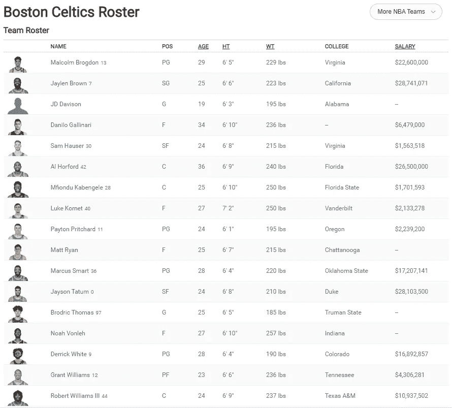

波士顿凯尔特人队的队员名单。

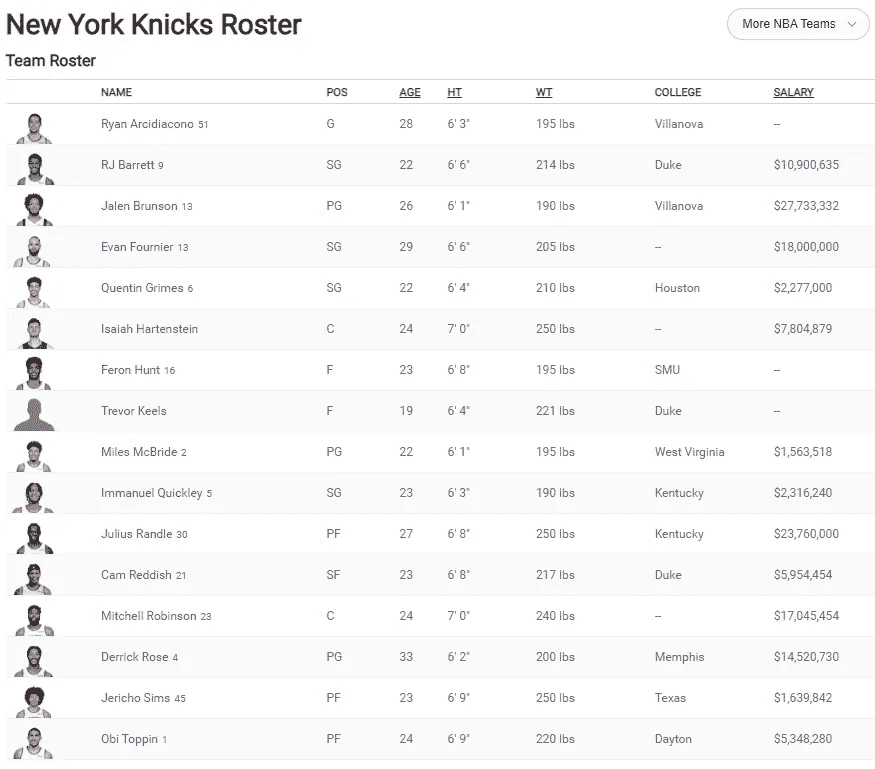

纽约尼克斯队的队员名单。

正如您所看到的，两个队都以表格格式设置了他们的花名册，其中包含每个球员的姓名、位置、年龄、身高、体重、大学和年薪等信息。此外，您可能还会注意到 URL 的结尾根据球队名称的变化:`../bos/boston-celtics`代表波士顿凯尔特人队，`../ny/new-york-knicks`代表纽约尼克斯队。这个以后会派上用场的。

在我们了解如何收集每个 NBA 球队的数据之前，让我们暂时只关注一个球队。一旦我们成功了，我们可以很容易地编写一个 for 循环来为其他团队重复整个过程。

传统上，为了抓取网页，你最好对 HTML 和 CSS 有一些基本的了解，这是构建和设计网页的两种基本技术。

HTML 用于创建内容并为网页提供结构。另一方面，CSS 用于设计、布局和样式，以使网页看起来更光滑、更美观。

我们将通过一个名为 [SelectorGadget](https://chrome.google.com/webstore/detail/selectorgadget/mhjhnkcfbdhnjickkkdbjoemdmbfginb?hl=en) 的 Chrome 扩展来稍微欺骗一下这个过程，你可以将它添加到你的浏览器中并立即开始使用。它有助于在网页上生成元素的 CSS 选择器，只需突出显示您感兴趣的元素。

在这里，我们将突出显示包含波士顿凯尔特人队每个球员的姓名、职位、年龄、身高、体重、大学和工资的元素，并随后将它们存储在各自的变量中。然后，我们将整理它们以创建数据框。

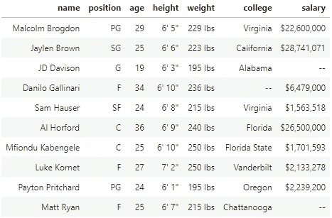

# 球员常规赛统计

让我们更进一步，好吗？

你可能已经注意到了每个球员名字上的超链接，点击它会把你带到一个单独的网页，里面有每个球员在最近 NBA 常规赛中的表现。

比如我们来看看[杰森·塔图姆](https://www.espn.com/nba/player/_/id/4065648/jayson-tatum)和[德里克·罗斯](https://www.espn.com/nba/player/_/id/3456/derrick-rose)。

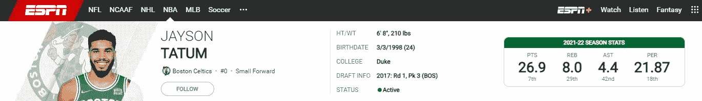

杰森·塔图姆场均 26.9 分，8.0 个篮板，4.4 次助攻，在 2021-22 赛季的效率评分为 21.87。

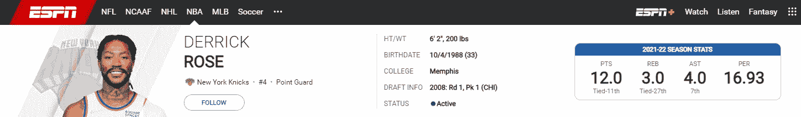

德里克·罗斯场均得到 12.0 分，3.0 个篮板，4.0 次助攻，在 2021-22 赛季的 NBA 赛季中，他的效率为 16.93。

作为本练习的一部分，假设我们希望将这些信息与之前的原始数据框相结合。

为此，我们必须编写一个函数来获取球队花名册上每个球员的赛季统计数据。

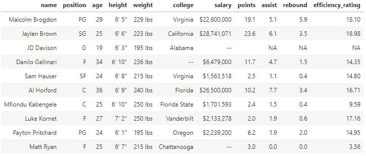

# 为所有 NBA 球队实现自动化

既然我们已经了解了波士顿凯尔特人队的运作过程，我们可以对所有 30 支 NBA 球队重复这一过程。

我们只需要使用 for 循环来改变每个团队的 URL 名称的结尾。整个过程花了我的电脑将近 9 分钟来完成。还不错。

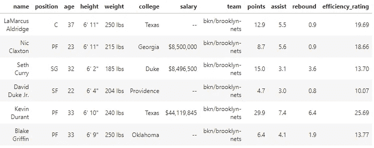

在一些进一步的数据清理之后，比如将球员身高和体重分别改为厘米和千克(我不是英制的最大粉丝)，数据类型，以及重命名值，我们得到了一个最终的数据框，如下所示。

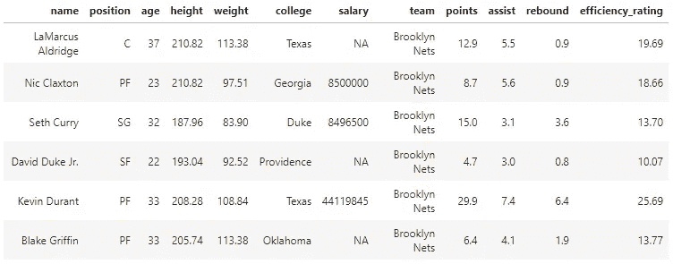

# 额外收获:探索性数据分析

博客文章的这一部分更多的是为了我自己的娱乐，而不是关于网络抓取。实际上，我已经使用了一些基本的数据可视化来从我们准备的关于当前 NBA 球员的数据中收集见解。

虽然这不是最突破性的分析，但我还是在下面每个图表的标题中加入了我的评论。

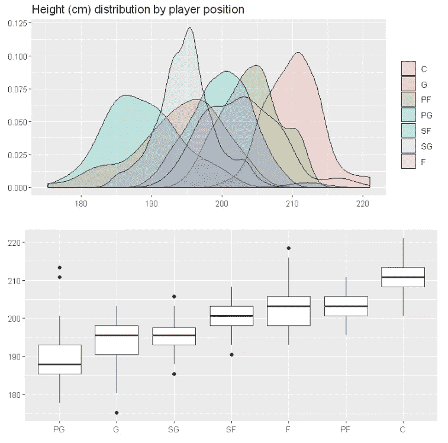

控卫是最矮的球员，中锋是最高的球员。

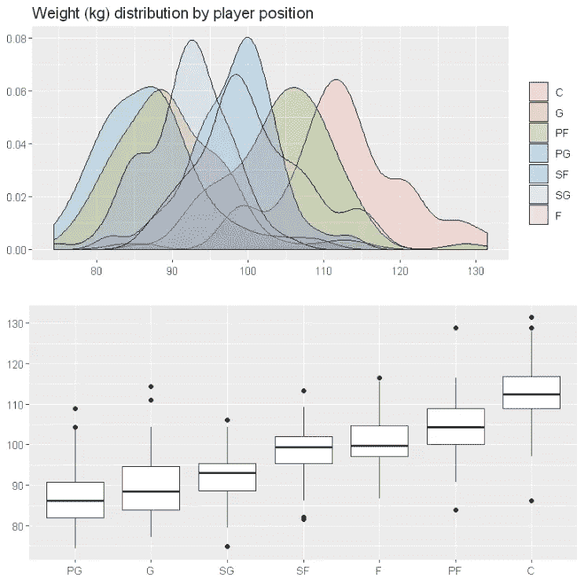

控卫最轻，中锋最重。

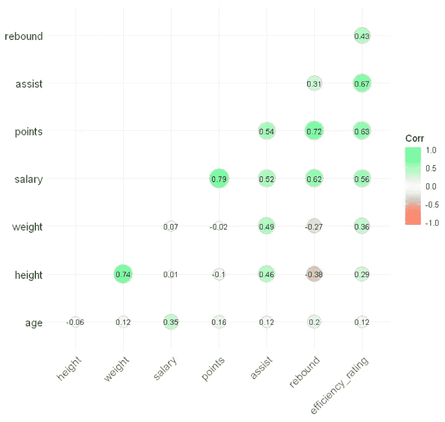

场均得分与薪资高度正相关。身高和场均篮板负相关。

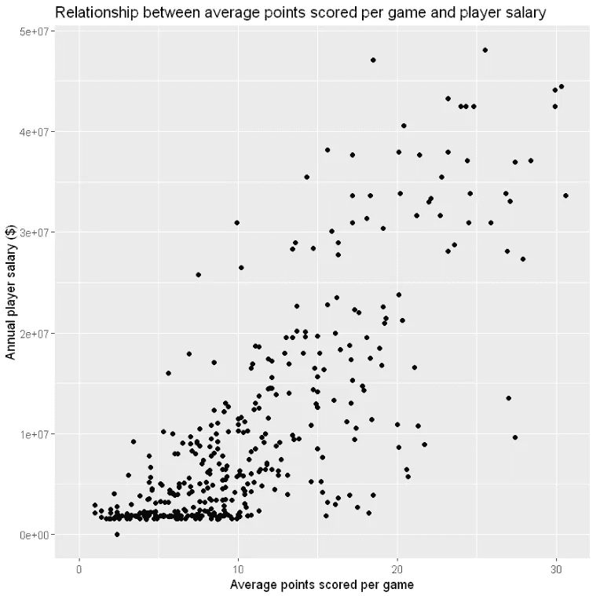

平均每场得分越高，球员的薪水越高。

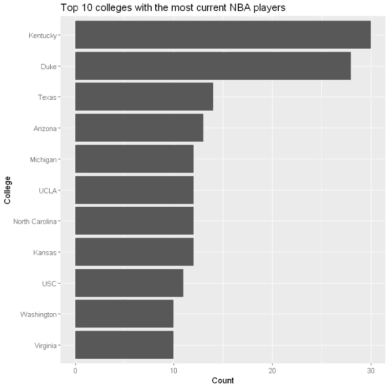

肯塔基大学和杜克大学是目前为止最受 NBA 前景的大学。

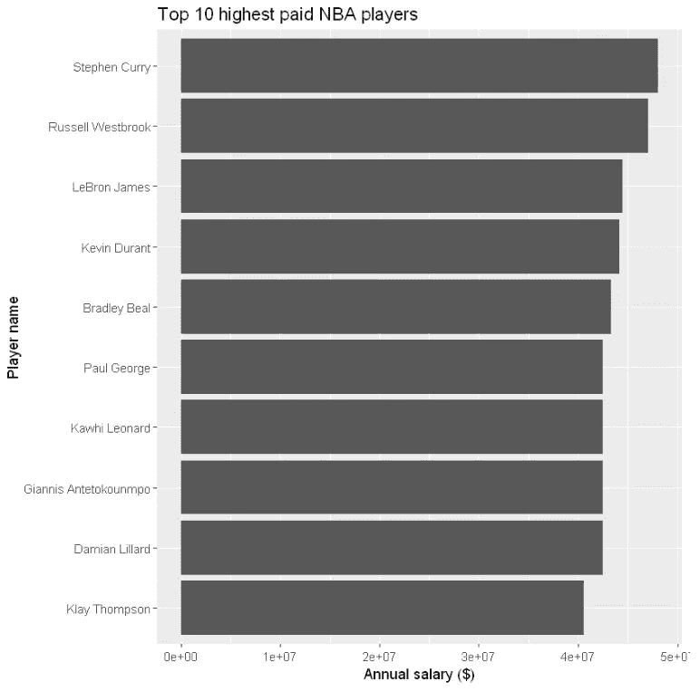

收入最高的前 10 名球员的年薪总和约为 4.38 亿美元。这太疯狂了。

感谢您的阅读，我希望您在 r 中带走了一些关于 web 抓取基础的新知识。我还鼓励您在我的 GitHub [这里](https://github.com/chongjason914/nba-web-scraping)看一下这个练习的练习册。它包含了这个项目从头到尾的所有代码。

如果你从这篇文章中发现了任何价值，并且还不是一个媒体会员，如果你使用下面的链接注册会员，这对我和这个平台上的其他作者来说意义重大。它鼓励我们继续推出像这样的高质量和信息丰富的内容——提前感谢您！

 [## 通过我的推荐链接-杰森·庄加入媒体

### 阅读杰森·庄的每一个故事(以及媒体上成千上万的其他作家)。您的会员费直接支持…

chongjason.medium.com](https://chongjason.medium.com/membership) 

不知道接下来要读什么？这里有一些建议。

 [## 每个数据分析师都需要知道的 10 个最重要的 SQL 命令

### 从数据库中查询数据并不复杂

towardsdatascience.com](https://towardsdatascience.com/10-most-important-sql-commands-every-data-analyst-needs-to-know-f0f568914b98)  [## 解决机器学习中的“黑箱”问题

### 在模型预测中创造更多透明度和可解释性的 4 个必须知道的技术

towardsdatascience.com](https://towardsdatascience.com/addressing-the-issue-of-black-boxes-in-machine-learning-f86429acbb2a)  [## 数据科学家的职业发展是什么样的？

### 理解大公司中初级与高级数据科学家角色的指南

towardsdatascience.com](https://towardsdatascience.com/what-does-the-career-progression-look-like-for-a-data-scientist-70bdd27f3fab)