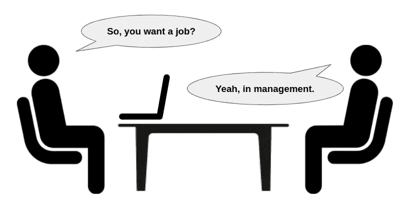

# 工程经理面试的实用准备技巧

> 原文：<https://levelup.gitconnected.com/practical-preparation-tips-for-engineering-manager-interviews-459997d8712b>

不管你是否在积极面试，给工程经理的有用建议和给有抱负的工程师的有趣见解。

如果你看到这篇博文，很可能你已经浏览了一堆关于 10 个、20 个或者更多工程经理面试中常见问题的在线资料。如果你正在寻找另一个常见问题的列表和一些普通的答案，这篇博文不适合你。

在这篇博文中，我提供了一些如何准备工程经理面试的实用技巧。希望和大家分享一些如何反思自己经历的策略，如何提炼出有用的例子，如何呈现给面试官。我按照这些策略为自己的面试做准备，结果颇有收获——今年年初，方和一些顶级初创公司向我提供了(高级)经理职位。

旁注:我也从朋友和我的职业网络那里收到了对这篇博文的积极反馈，尽管他们并没有积极地寻找新工作。事实证明，这些要点有利于管理者回顾他们的日常管理工作，并有助于那些希望培养管理者思维的个人贡献者。

在我们开始之前，最后一件事:我谦卑地承认，我的方法不是唯一的方法，当然也不是在每种情况下都是最好的方法。这篇博文并不打算向你传授最佳解决方案，而只是分享一个我和其他人都觉得有帮助的观点。

图片来源:作者

> **所谓的管理哲学是什么？**

这个问题可以换成其他形式:你对管理有什么看法，你的管理风格是什么，等等。它真正问的是管理者应该扮演的角色，管理者应该关心的事情，管理者给组织带来的价值，以及你是如何行使这些价值的。根据你的情况，你可能在不同的时间关注不同的领域。当你感觉到团队中缺少高级技术领导时，你可以戴上技术领导的帽子。当您的组织没有为您的团队指定专门的项目经理时，您可能拥有项目管理。当您团队的产品管理覆盖率落后时，您可能会严重影响产品思维。或者，当团队中的个人需要大量持球时，你可能会专注于指导。

回想一下你担任经理的不同工作组合，反思一下你为什么需要这样分配时间，想想你在这些时间里对公司的贡献，评估一下你最喜欢的组合是什么。这个问题没有对错之分。不同的环境或文化可能喜欢这种或那种方式。重要的是要知道自己是什么样的管理者。一旦你自己发现了这一点，忠实地向面试官展示真实的你，让你的个性闪耀。

> 我们都知道真实的例子是最好的，但是如果我没有呢？

老生常谈*“有实例就用实例，没有实例就谈方法论”*。面试的时候是这样，但是在准备阶段你可以做的更多。我建议在管理感兴趣的每个领域写下一两个故事:优先排序、协作、冲突解决、职业辅导、绩效管理、招聘、资源配置、战略等。如果你已经管理了几年，努力搜索你的记忆和笔记，我相信你可以找到大量的故事。其中一些故事可能没那么有趣，但这是一个很好的起点。

对于每一个不那么有趣的故事，试着改变参数，想象你会有什么不同的做法。例如，您可能有这样一个例子，您的报告在一次困难的谈话中接受了反馈。但如果他没有，你会怎么回应？您可能有这样一个例子，由于您的主要客户对功能优先级有共同的看法，因此优先级的确定非常简单。但是，如果他们的要求两极分化，你会如何处理优先顺序？你可能有这样一个例子，两个冲突的报告自己达成了一致。但是如果那两个人拒绝让步，你会怎么做呢？

通过这个练习，你可以极大地丰富你的范例库。现在，当你需要谈论方法时，你的方法可以植根于现实环境，听起来会更有说服力。例如，当被问及资源配置时，你可以说*“我的团队人员严重不足。幸运的是，领导批准了我的人数请求。如果没有他们，我会做[…]来维持它"*或*"我们有一个积极的招聘计划来为项目 x 配备人员。我们能够填补所有的空缺。如果不是这样，我会做[…]来继续推进项目 X "*。

> **神话般的优先顺序**

商业，消费者或企业，大公司或创业公司，都有自己的传统和限制，当谈到优先次序。让我们面对现实吧，无论是年度自上而下的规划还是季度团队特定 OKR，在优先级划分方面都有很多猜测和领导偏好。

这里的关键是展示你有一个系统——尽可能科学的——来确定优先顺序:

*   谁是你的利益相关者；
*   你评估请求的紧迫性和重要性的标准是什么；
*   你如何计算带宽；
*   你如何估计工程任务；
*   你如何管理积压的项目；
*   你多久进行一次不同级别的优先级排序？
*   您如何回应带外请求；
*   如果你需要打乱你的路线图，你会怎么做？

你可能不是优先级的唯一拥有者。但是你的角色是至关重要的，因为最终，是你的团队需要执行优先任务。反思你自己的优先化经验，尝试阐明你的框架，并给出具体的例子，说明当你周围的世界自然地想把你拉向各个方向时，它如何使你的团队保持专注。

> **陈腐的团队文化**

*“团队文化是关于使命、价值和信念的，……”*别说了。太脱离实际了。对作为管理者的你来说，团队文化就是你的团队如何沟通，你的团队如何协作，你的团队如何决策，你的团队如何解决冲突。每一点都是脚踏实地，在行动。

准备好支持你对团队文化的主张，用具体的日常活动来锻炼和展示这种文化。例如，如果你说你的团队文化是协作的，提供具体的证据来阐述你的团队是如何协作的。团队成员共享或保留信息吗？即使不在他们的直接范围之内，他们是否会付出额外的努力去帮助对方？他们会祝贺同龄人的成就吗？他们会因为失误而责怪同伴吗？如此等等。

作为后续，你在团队中做了什么来创造这种文化？你是否以身作则，与你的同级经理合作愉快？你是否实施了任何促进团队合作的流程？您是否向团队中的个人提供了任何反馈以鼓励协作？

> **令人苦恼的绩效管理**

这个主题包含了很多内容。对话可能会有不同的方向:组织中的绩效评估流程、设定期望值、提供反馈、职业指导、管理等。

但是回到根本，都是为了发展人。举几个例子

*   你认为你的报告有哪些优点和缺点；
*   你如何帮助他们探索和发现他们想要的东西；
*   你如何为他们的成长找到或创造机会；
*   你如何设定明确的期望并提供及时的反馈，包括积极的和纠正性的；
*   你如何评价他们的进步；
*   当他们偏离轨道时，你如何帮助他们纠正航向；
*   您如何指导他们在您的组织中浏览绩效评估系统；
*   当你认为他们不适合这个团队的时候？

理想情况下，这些例子应该包括初级、中级和高级工程师的组合，包括成功和失败的结果，无论是哪种情况，如果你再做一次，你会有什么不同的做法。

> **进程的爱与恨**

有人说过程剥夺了我们的智力思考。这话有些道理，但不是全部。流程之所以存在，是因为在我们之前的先驱者已经一次又一次地完成了工作，以至于他们能够标准化做事的方式。过程是解决方案收据，它使过程形式化并避免已知的地雷。有了好的流程，我们可以无所畏惧地向前推进，因为我们知道我们已经做了尽职调查。的确，在遵循既定流程时，我们需要少思考一些。但是那些毕竟是被人走过的路。因此，如果我们把脑力用在其他事情上，可能更划算。另一方面，流程需要发展。我们需要对流程中的低效率和差距保持警惕，并对与流程所有者进行修改持开放态度。盲目地遵循流程最终会导致有害的结果。

你需要在采访中传达的关键信息是，过程是服务于产品和人的工具。一方面，你不会仅仅因为它们是“规则”就盲目地跟随它们。另一方面，你不会因为想快速行动或减少繁文缛节而急于反抗他们。作为经理，你需要关注许多流程:技术设计、项目跟踪、发布评审、资源分配、跨职能沟通等。

在你的日常工作中挑选几个过程，检查它们为什么存在，它们为团队服务得如何，列出它们做得好的地方和需要修改的地方，并思考你已经或将要如何改进它们。将这些作为你如何为你的团队拥有和优化流程的例子。

> **你需要有多专业？**

几乎所有的公司都有针对工程经理候选人的系统设计环节。有些还有额外的编码回合。作为一名工程经理，你可能不知道如何解决一个特定的技术问题，但你必须有一双慧眼，从次优方案中分辨出一个好的解决方案。有许多资源详细说明了为什么优秀的工程经理应该是技术型的。我就不重复论证了。归结起来就是拥有领导团队的技术敏锐性。因此，除了完善你的系统设计和编码技能，你还需要展示你是如何利用你的技术直觉和经验来帮助团队的，尤其是在你的报告不知道选择哪个选项或者有竞争的提议需要你仲裁的情况下。

你想给面试官留下的印象不是你确实知道一个选项比其他选项更好，因此你做出了最后的决定。你有很好的技术能力，这很好。但这从来不是关于你的技术技能是否优于他人。而是你能不能正确使用它们。理想情况下，您应该提出问题，并对其他人可能忽略的领域进行压力测试:

*   用户体验，
*   性能特征，
*   复杂性和可维护性，
*   依赖性，
*   对隐私、安全性和合规性的影响，
*   时间和资源的限制等等。

目标是促进技术讨论，帮助团队构建问题，探查团队以更彻底地检查解决方案，并指导团队发现和同意在考虑所有因素后最有意义的解决方案。

> **夸张还是不夸张？**

我是诚实的忠实粉丝，不仅因为从诚实的角度来看这是正确的事情，还因为毫无根据的夸张在有经验的人眼里无处可藏。然而，在某些情况下，一定程度的自夸是可以接受的，也是有益的。作为管理者，我们需要提前做好计划，做大量的前期工作。但结果只有随着时间的推移才会落地。特别是官方的地位认可或奖励，只有在我们的影响完全实现之后才会到来。

例如，你已经为他们的晋升小心翼翼地处理了你的报告。校准/推广委员会的反馈是积极的。现在，你就等着副总统正式批准这些案子。或者，你努力重组团队。你已经仔细平衡了所有利益相关者的需求。您已经完成了所有困难的对话，并且所有受影响的各方都已被告知该变更。现在，您只需等待预定的公告和生效日期的到来。

在上述情况下，你应该在面试中完全吹嘘那些经历和成就，就好像它们已经完全着陆了一样。官方认可是否已经盖章无关紧要。你已经做了所有的艰苦工作，你知道这些几乎是成功的。为什么不在面试中获得荣誉呢？总的来说，有点前瞻性，预测未来几个月可能的结果，并在采访中无耻地吹嘘它们。

> **不要逆潮流而动**

最后但同样重要的是，我想承认我碰巧在一个好时间面试。市场很火爆。人才竞争非常激烈。感觉每个公司都有数不清的空缺。如果我在不同的时间做这件事，结果可能会不同。所以如果你觉得宏观经济对你不利，就不要逆势而为。面试准备需要大量的时间和精力。你必须决定它是否值得。在经济低迷时期，你仍然可以得到一些工作机会。但他们可能不会给人留下深刻的印象，你也没有多少谈判的筹码。在这种情况下，你最好留在原地。