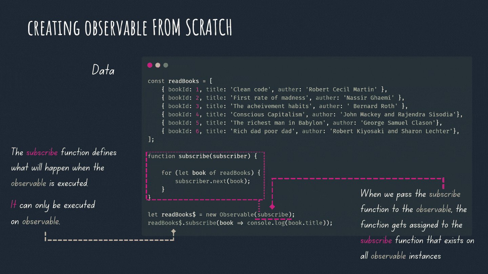
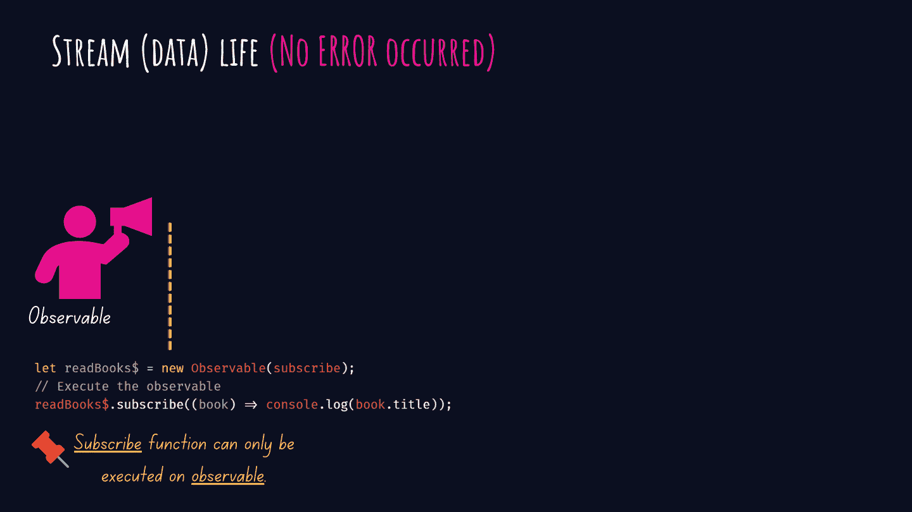
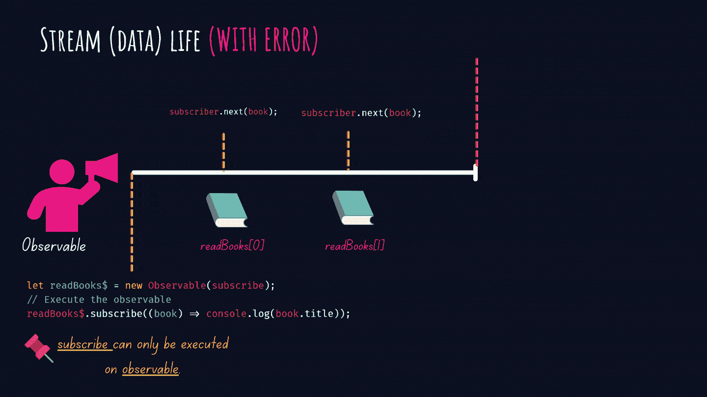
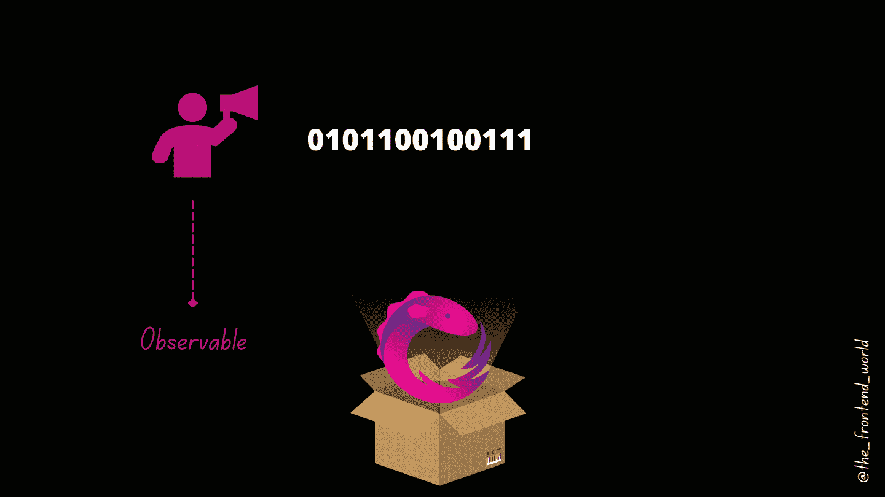

# 一级:实用 RxJS 指南终身学习 RxJS！

> 原文：<https://levelup.gitconnected.com/practical-rxjs-guide-to-learn-rxjs-for-life-part-i-63645a10100f>

## 第 1 级:深入理解 RxJS 模式和可观察性

作者:FAM

如约而至。这篇文章是我在上一篇文章中为 RxJS 打下良好基础之后的实践指南:

 [## 如果 RxJS 这个词让你不舒服，这篇文章送给你！

### RxJS 模式综合指南——什么是 RxJS，为什么使用它，什么时候使用，如何使用？

javascript.plainenglish.io](https://javascript.plainenglish.io/if-the-word-rxjs-makes-you-uncomfortable-this-article-is-for-you-b27780240b28) 

这篇文章将从技术上看事情是如何工作的。

> ***/！\要求:如果你不知道 RxJS 是关于什么的，我鼓励你在开始编码之前先看看上面的文章。深入了解会让你终身获得 RxJS 技能！***

我假设你知道 RxJS 的好处，以及为什么 RxJS 是当今 web 开发领域的一个著名词汇。我就跳着练！

在这篇文章中，我需要你的全部注意力。我们的重点将是 RxJS 的第一个支柱。

订阅和观察支柱，以及运营商，将在下一篇文章中出现(*耳语:否则，这篇文章将有五页左右，对于我们的大脑来说太长了。因此，完全没有生产力*

**路线图:**

*   进入 RxJS 框
*   对可观察事物的深刻理解
*   创建可观测量的场景和方法
*   *奖金*

# I-进入 RxJS 框…

RxJS 的诞生就是为了解决一个问题。它的目标是为你提供一个很好的处理同步和异步数据的抽象层，这样**开发者就可以使用一个 API 在他们的应用中检索和处理数据**。

让我带你走进 RxJS 盒子，里面有反应式编程的 3 个主要基础支柱。

作者:FAM

RxJS 的构建是为了用一系列通常被称为数据流的可观察数据来处理所有类型的数据。

让我们潜得更深！

# II-了解 n 1 RxJS 支柱……可观察项

> 当使用 RxJS 时，可观察对象是我们将要处理的最重要的类型

*   **你需要知道的事情&记住关于可观测量的事情**

可观察对象的工作是接收和处理随着时间的推移到达你的应用程序**的多个值(数据)。直到有人(一个对象)订阅了它，它才被执行。因此，如果没有任何东西在观察它(观察者)，可观察的东西就没有真正的用处。**

我相信深入理解可观测量的最好方法是从使用可观测量构造函数从头创建一个开始。

作者:FAM

当我们调用`subscribe`函数时。我们实际上是在执行上面定义的`subscribe(subscriber){...}`函数。

> `new Observable(function subscribe(subscriber) {...})`中的`observable.subscribe`和`subscribe`同名并非巧合。在库中，它们是不同的，但出于实用目的，您可以认为它们在概念上是相等的。— RxJS 文件

因为我们用最后一行代码执行可观察的。它将从给定的源(在本例中，一个简单的书籍数组)中检索数据，并在浏览器控制台中显示每本书的标题，如最后一行代码所示。

对了，上面的代码也可以写成(比较常用的):

`subscriver.next()`方法是可观察对象传递给其观察者的通知之一。

还有`error()`通知和`complete()`。

没有错误的流程:

作者:FAM

有错误的流:

作者:FAM

当被观察对象发出`complete()`通知时，即意味着 ***“结束”。*** 下列值不会被传送(见下面的例子):

# 三、创造可观测量的情景和方法

有各种方法来创造可观的。您可以使用 Observable 构造函数从头开始创建它们(正如我们前面看到的)。您还可以通过使用 RxJS `create`函数来创建它们，或者通过使用 RxJS 的内置函数从其他数据结构(如数组或承诺)中创建它们…等等。

## **方式一:从零开始创造**

## **方式二:用创建静态函数创建**

## **方式 3:从内置 RxJS 函数的其他结构创建**

这种方式经常在项目中使用，因为我们通常从一个承诺或另一个可观察的(HTTP 调用)或从我们已经拥有的数据中获得数据。

*   `**of**`:当你有单独的值时很有用(对你的代码进行单元测试的快速方法)
*   `**from**`:当你有一个已经分组了你想要的值的数组时很有用。

## **方式 4:从组合的可观察值中创造可观察值**

当我们有两个或更多的数据源需要收集、处理并交付给观察者时，这也是一种重要的创造可观测量的方法。这个例子显示了可观察的力量。我们不必尊重数据结构。它接受任何东西！这使得 RxJS 成为一个惟一的、足以检索流的 API(也可以处理/整形流，但我们将在后面看到)。

## **方式 5:从事件中创造可观测量**

这是一个点击事件的用例。假设你有一个 GIS 应用程序。在地图上点击，我们需要显示一些信息弹出。一个很好的方法是使用 RxJS `fromEvent`内置函数订阅 click 事件。下面是一个简单的例子，它是如何用一个按钮来显示我要读的以下书籍的:

HTML

在这里看它的行动[。](https://9gkchi--run.stackblitz.io/)

## **方式 6:可从 AJAX 调用中观察到**

开发应用程序时可能会遇到的另一种情况是，数据源没有返回 HTTP 响应。在这种情况下，可以使用 AJAX。(*窃窃私语:是的，AJAX 函数随 RxJS 一起提供，这就是我说 RxJS 是为了成为您检索数据的唯一 API 而构建的意思。不需要额外的层数*。

# 奖金

你会在下面的[链接](https://stackblitz.com/edit/rxjs-bbzvha?file=index.ts)中找到所有这些有价值的例子。

作者:FAM

随便玩吧。评论其他函数，一个一个试。享受它😉

> 如果你成功了，那么你应该给自己一个鼓励。你成功了！

我们 RxJS 电影的下一集😆，将涵盖:

*   **了解 n 2 RxJS 支柱…观察员**
*   **管理订阅(n 3 RxJS 支柱)**
*   **使用运算符(处理可观测量的结果，并根据您的应用程序的确切需求制作/调整数据)**
*   **创建您自己的操作员**

## [等级](https://famzil.medium.com/practical-rxjs-guide-to-learn-rxjs-for-life-part-ii-8e7b2fd84de7) 2，已出！这是一个简短的预告片😉

FAM(保留所有权利)

## [**三级**](https://javascript.plainenglish.io/practical-rxjs-guide-to-learn-rxjs-for-life-88f2ee508d5c?source=your_stories_page-------------------------------------) **正出****短预告:**

FAM(保留所有权利)

## **最后，** [**四级**](https://famzil.medium.com/practical-rxjs-guide-to-learn-rxjs-for-life-58cd5c7f2b68)

 [## 实用 RxJS 指南终身学习 RxJS！

### 第 4 级:深入理解 RxJS 模式(高级++)

javascript.plainenglish.io](https://javascript.plainenglish.io/practical-rxjs-guide-to-learn-rxjs-for-life-58cd5c7f2b68) 

亲爱的读者，感谢你在我生命中的存在。

**让我们在** [**上取得联系**](https://medium.com/@famzil/)**[**Linkedin**](https://www.linkedin.com/in/fatima-amzil-9031ba95/)**[**脸书**](https://www.facebook.com/The-Front-End-World)**[**insta gram**](https://www.instagram.com/the_frontend_world/)**[**Youtube**](https://www.youtube.com/channel/UCaxr-f9r6P1u7Y7SKFHi12g)**或**********

******参见我的新电子书[关于网络要素和一般文化。](http://www.fam-front.com/)******