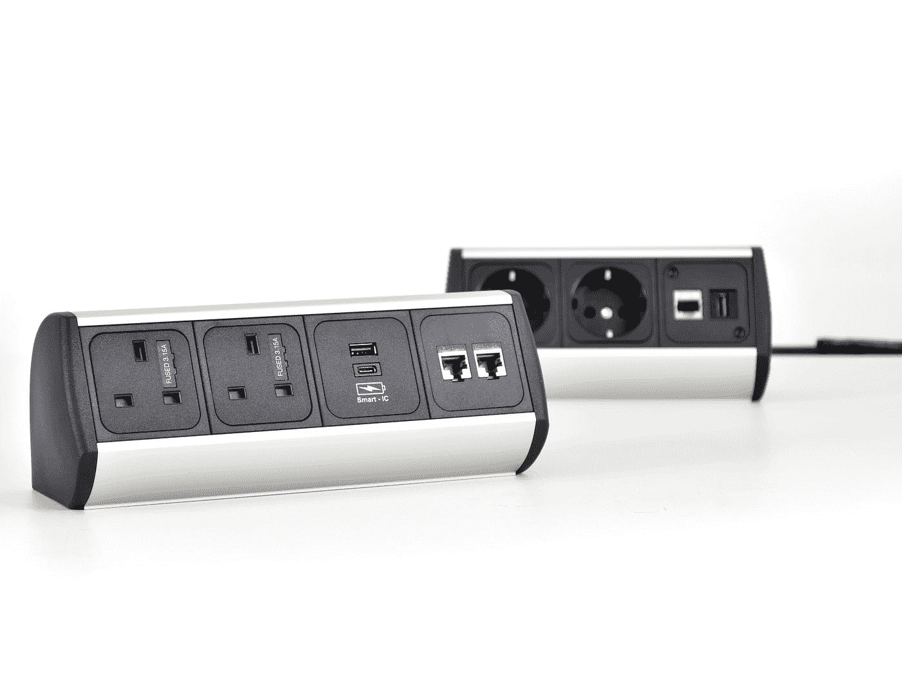

# 戈朗实用固体:界面分离原理

> 原文：<https://levelup.gitconnected.com/practical-solid-in-golang-interface-segregation-principle-f272c2a9a270>

## 坚实的原则

## 我们通过介绍对代码设计影响最大的原则——接口分离原则，继续我们坚实的原则之旅。



由[迈克·温克勒](https://unsplash.com/@ahmeyer?utm_source=medium&utm_medium=referral)在 [Unsplash](https://unsplash.com?utm_source=medium&utm_medium=referral) 上拍摄

每当有人开始第一次编程课程时，程序总是相似的:在最初的几周甚至几个月，都是关于算法和重新连接大脑以接受这种思维方式。

在某个时候，我们开始介绍面向对象编程。如果教师对这种转换等待太久，可能很难切断与函数式编程的联系。

但是，在某些时候，我们接受使用对象。我们开始在需要的地方使用它们，当然，在不需要的地方。然后我们开始学习抽象以及如何让我们的代码越来越可重用。

然后，我们可能开始以错误的方式使用抽象，将它们添加到任何地方。为了使我们的代码更加通用，我们进行了泛化，这减缓了我们未来的开发。

或早或晚，我们开始意识到我们应该为这么多的概括划一条线。幸运的是，已经有人做到了——通过引入接口分离原理，它代表单词 *SOLID* 中的字母 *I* 。

```
Other articles from the SOLID series:**1\.** [**Practical SOLID in Golang: Single Responsability Principle**](/practical-solid-in-golang-single-responsibility-principle-20afb8643483)**2\.** [**Practical SOLID in Golang: Open/Closed Principle**](/practical-solid-in-golang-open-closed-principle-1dd361565452)**3\.** [**Practical SOLID in Golang: Liskov Substitution Principle**](/practical-solid-in-golang-liskov-substitution-principle-e0d2eb9dd39)Some articles from the DDD series:**1.** [**Practical DDD in Golang: Value Object**](/practical-ddd-in-golang-value-object-4fc97bcad70)**2\.** [**Practical DDD in Golang: Entity**](/practical-ddd-in-golang-entity-40d32bdad2a3)**3\.** [**Practical DDD in Golang: Aggregate**](/practical-ddd-in-golang-aggregate-de13f561e629)**4\.** [**Practical DDD in Golang: Repository**](/practical-ddd-in-golang-repository-d308c9d79ba7)**5\. ...**
```

[](https://blog.ompluscator.com/membership) [## 通过我的推荐链接加入媒体——马尔科·米洛耶维奇

### 作为一个媒体会员，你的会员费的一部分会给你阅读的作家，你可以完全接触到每一个故事…

blog.ompluscator.com](https://blog.ompluscator.com/membership) 

# 当我们不尊重界面分离时

> 保持小界面，这样用户就不会依赖他们不需要的东西。

鲍勃叔叔创造了这个原则，你可以在他的博客上找到更多的细节。这个原则清楚地定义了它的要求，可能是所有其他坚实的原则中最好的。

保持接口尽可能小的简单声明我们不应该仅仅理解为一个方法接口，而应该更多地考虑接口所拥有的特性的内聚性。

让我们检查下面的代码:

假设我们想要交付一个购物应用程序。其中一种方法是定义一个接口`User`，就像我们在代码示例中所做的那样。这个界面拥有用户可以拥有的许多特性。

我们平台上的一个`User`可以给`ShoppingCart`加一个`Product`。他们可以买。他们可以在特定的`Product`上获得折扣。唯一的问题是，只有一个特定的`User`可以做到这一切。

这个接口的实际实现是三个结构。第一个是`Guest`结构。应该是一个没有登录我们系统的`User`，但至少他们可以在`ShoppingCart`上加一个`Product`。

第二个实现是`NormalCustomer`。它能做任何`Guest`能做的事情，外加买一个`Product`。第三个实现是`PremiumCustomer`，它可以使用我们系统的所有特性。

现在，看看这三个结构。只有`PremiumCustomer`需要所有三种方法。也许我们可以将它们全部分配给`NormalCustomer`，但肯定的是，我们几乎不需要超过两个给`Guest`。

方法`HasPremium`和`HasDiscountFor`对`Guest`没有任何意义。如果该结构表示未登录的`User`,我们为什么还要考虑实现折扣的方法呢？

在这里，我们甚至可以调用 panic 方法，并显示错误“*方法未实现*”—这在这段代码中会更真实。在通常的场景中，我们甚至不应该从`Guest`中调用方法`HasPremium`。

我们所做的一切都是为了在 UserService 中添加泛化功能，以便在同一个地方用相同的代码处理所有类型的`Users`。但是，正因为如此，我们需要实现一堆未使用的方法。

因此，为了更好地概括，我们得到:

1.  许多结构有未使用的方法。
2.  我们需要以某种方式标记的方法，以便其他人不使用它们。
3.  单元测试的许多额外代码。
4.  不自然的多态性。
5.  …

所以，让我们来重构这个混乱。

# 我们如何尊重界面隔离

> 围绕最小内聚的功能组构建接口。

我们不需要在这里发明一些空间科学。唯一需要的是定义一个最小的接口来提供一套完整的特性。让我们检查下面的代码:

现在，我们有三个界面，而不是一个。`PremiumUser`嵌入`LoggedInUser`，后者嵌入`User`。此外，他们每个人都介绍了一种方法。

`User`现在只代表那些在我们的平台上还没有被认证的客户。对于这样的类型，我们知道他们可以使用`ShoppingCart`的特性。

新的`LoggedInUser`界面代表我们所有经过认证的客户，而`PremiumUser`界面代表所有拥有付费高级账户的经过认证的客户。

注意:我们确实增加了两个接口，但是我们删除了两个方法:`IsLoggedIn`和`HasPremium`。那些方法不是我们接口签名的一部分。但是没有他们我们怎么工作呢？

正如您在`UserService`中看到的，我们没有使用带有布尔结果的方法，而是澄清了`User`接口的子类型。如果`User`实现了`LoggedInUser`，我们知道我们谈论的是经过认证的客户。

同样，如果`User`实现了`PremiumUser`，我们知道我们谈论的是具有高级帐户的客户。因此，通过造型，我们已经检查了一些业务规则。

除了这两个方法之外，以前的所有结构现在都更加轻量级了。他们不是每个人都有五个方法，其中许多根本没有被使用，现在他们只是有他们真正需要的方法。

# 更多的例子

尽管提供小而灵活的接口总是好的，但是我们应该考虑它们的用途来引入它们。添加小接口使它们更简单，但仍然在同一个结构中一起实现它们没有太大意义。

让我们看看下面的例子:

这就是我们把界面分割得太多的情况。是的，我们可以为每个方法提供一个接口，现在将它们定义为角色接口。这种单一方法接口有时是好的，但在这里不是。

显然，如果客户在我们的平台上注册，他们将需要提供他们的名字和姓氏，以便计费。因此，我们的`User`将同时需要`FirstName`和`LastName`两种方法，自然也就需要`FullName`。

在这种情况下，将这三个方法分成三个接口是没有意义的，因为这三个方法总是在一起。所以，这不是一个单一方法接口的正确例子。

但是，有什么好的例子呢？

Go 中最完美的例子就是 [IO](https://pkg.go.dev/io) 包。它提供了许多处理 I/O 操作的代码和接口，可能所有的 Go 开发者都至少使用过这个包一次。

提供接口`Reader`、`Writer`、`Closer`、`Seeker`。它们中的每一个都只定义了一个方法，`Read`、`Write`、`Close`和`Seek`。我们使用它们来读取、写入、搜索特定源的一部分字节，并关闭该源。

为了让这些资源更加灵活，所有的功能都放在它们的接口中。后来，他们一起构建更复杂的接口，像`WriteCloser`、`ReadWriteCloser`等等。

# 摘要

界面分离原理是第四个立体原理，它代表单词*立体*中的字母 *I* 。它教会我们把界面做得尽可能小。

每当我们想要覆盖更多的类型时，我们应该用不同的接口来保护它们。我们应该避免把界面做得太小，但是要提供完整的功能。

```
Other articles from the SOLID series:**1\.** [**Practical SOLID in Golang: Single Responsability Principle**](/practical-solid-in-golang-single-responsibility-principle-20afb8643483)**2\.** [**Practical SOLID in Golang: Open/Closed Principle**](/practical-solid-in-golang-open-closed-principle-1dd361565452)**3\.** [**Practical SOLID in Golang: Liskov Substitution Principle**](/practical-solid-in-golang-liskov-substitution-principle-e0d2eb9dd39)Some articles from the DDD series:**1.** [**Practical DDD in Golang: Value Object**](/practical-ddd-in-golang-value-object-4fc97bcad70)**2\.** [**Practical DDD in Golang: Entity**](/practical-ddd-in-golang-entity-40d32bdad2a3)**3\.** [**Practical DDD in Golang: Aggregate**](/practical-ddd-in-golang-aggregate-de13f561e629)**4\.** [**Practical DDD in Golang: Repository**](/practical-ddd-in-golang-repository-d308c9d79ba7)**5\. ...**
```