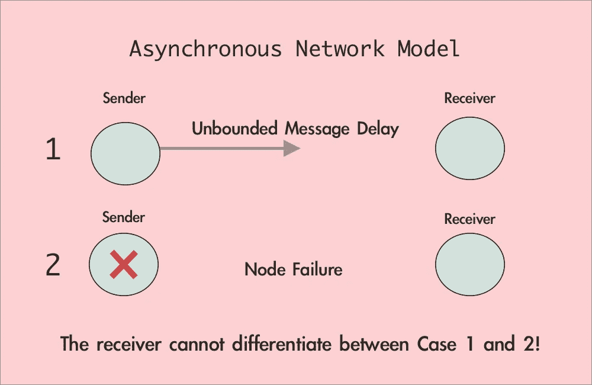
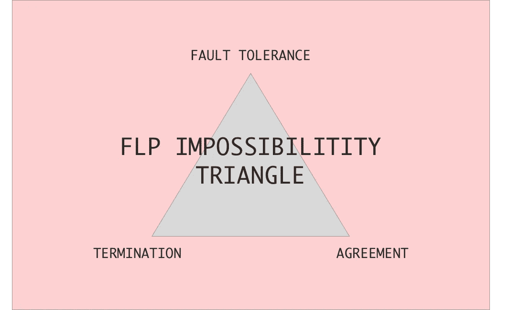
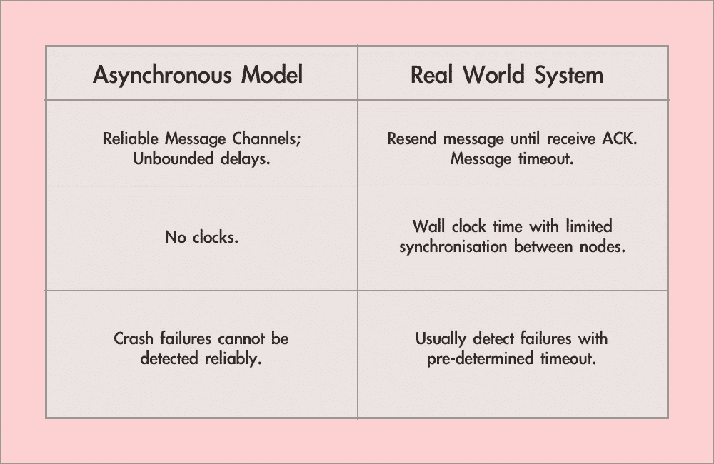

# 分布式共识的 FLP 不可能性的实践理解

> 原文：<https://levelup.gitconnected.com/practical-understanding-of-flp-impossibility-for-distributed-consensus-8886e73cdfe5>

## 尽管存在 FLP 定理，分布式一致性算法(如 Raft)在现实世界中是如何实现的？

照片由[古伊列梅·特谢拉](https://unsplash.com/@guilhermevt?utm_source=medium&utm_medium=referral)在 [Unsplash](https://unsplash.com?utm_source=medium&utm_medium=referral) 上拍摄

F LP ( **F** ischer， **L** ynch， **P** aterson)不可能性是分布式系统中最基本的结果之一，在很多计算类本科课程中都有讲授。考虑到数据和计算的规模，分布式系统(用更多的机器来扩展服务)本质上是今天用来构建可扩展系统基础设施的默认模式。分布式共识变得至关重要，因为机器需要就一致的状态达成一致，以提供一致的服务。

FLP 定理回答了以下关于共识的基本问题:

*在异步分布式系统中，是否存在一个确定性的一致性算法，能够满足一致性、有效性、终止性和容错性？*

正如定理中的“不可能”一词所暗示的那样，Fisher、Lynch 和 Paterson 已经证明，实现容许甚至单个节点故障的一致算法是不可能的。

鉴于 Raft 和 Zookeeper 等现有共识算法目前普遍用于大型分布式系统，在这些系统中，节点故障不仅常见，而且预计会发生，因此 FLP 结果可能违反直觉，甚至令人困惑。当我了解 Raft 时，我也面临着理论上的 FLP 结果和现实世界的共识算法之间的脱节。写这篇文章我希望能阐明

*   **FLP 定理**在现实世界系统中的实际应用前景。
*   业界公认的共识算法(如 Raft)如何克服 FLP 不可能性结果。

# 分布式共识的同义问题

那么我们为什么要关注分布式共识问题呢？在分布式系统中，不同的机器(节点)通常需要保持某种形式的状态一致。事实上，分布式共识有多种形式— **在分布式系统中，面对这些共识的变体之一是不可避免的**。已经证明与共识同义的问题的例子有:

1.  领导者选举(用于选举节点成为领导者/主节点，例如在 Raft 中)
2.  共享日志(在复制日志系统中)
3.  原子广播(例如，在主/辅助复制中，主节点将向辅助节点广播操作)

要了解有关主/辅助复制的更多信息，请访问:

 [## 深入研究主/辅助复制以实现容错

### 你真的了解复制是如何工作的吗？

levelup.gitconnected.com](/deep-dive-into-primary-secondary-replication-for-fault-tolerance-6ba203b06901) 

# 理解 FLP 不可能定理

在我们从实际的角度重新定义 FLP 定理之前，我们必须首先理解不可能性定理的主张以及该定理的背景。

## 异步网络模型

FLP 不可能性定理最基本的前提是异步网络模型。异步模型的特征是什么？它与同步模型有什么不同？

在异步网络模型下，我们没有准确的节点故障检测。

在异步模型中，从一个节点到另一个节点的消息传播延迟是有限的，但没有限制。这意味着，如果一个节点没有收到消息，它就不能准确判断发送方节点是崩溃了还是消息被延迟了。换句话说，我们不能根据超时机制准确地确定一个节点是否崩溃。相反，在同步网络模型中，消息延迟是有限的，并且可以可靠地检测到节点崩溃。

在异步网络设置下，FLP 定理还假设 I)消息通道不会丢弃消息 ii)非拜占庭故障(没有恶意方)。

## 不可能三角

FLP 定理:在异步网络模型下，我们不能同时拥有这三个属性。

在异步网络模型下，FLP 定理声称我们不能实现终止性、一致性和容错性这三个属性。我们将这三个属性描述如下:

1.  终止(活跃度):所有节点(没有失败)最终决定。
2.  协议(安全):所有决定的节点(甚至是决定后失败的节点)应该决定相同的值。如果所有节点都有相同的初始输入，则该值应该是唯一可能的决策值。
3.  容错:所有节点都要求协议在节点故障的情况下也必须有效。

**注意，FLP 定理并没有宣称:**

*   分布式共识一般是不可能的。
*   我们不能拥有上面列出的三个属性中的任何一个。事实上，Raft 已经表明，我们可以同时拥有协议和容错，但不能终止。

**相反，FLP 定理声称:**

*   在异步网络模型下，我们不能同时拥有这三种属性。
*   特别是在同步网络模型下(其中消息延迟是有限的)，存在满足所有三个期望属性的算法。

**言外之意:**在现实世界中，我们可以**做出牺牲(三个属性中的一个)或者放松约束(例如在异步模型上)**提出一个符合业务需求的共识算法。我们将在下一节讨论现代共识算法如何做出这些权衡。

# 交叉检查现实世界系统中的约束

既然我们已经理解了 FLP 定理的主张，我们终于可以把我们的实际镜头，并检查我们如何可以应用这些知识到现实世界的系统！在上一节中，我们已经看到，我们通常可以放松异步模型的约束。下表交叉分析了异步模型对现实世界分布式系统的约束。

现实世界的系统支持部分同步的网络模型，在这种模型中，可以通过超时机制非常可靠地检测到故障。

有趣的是，在现实世界中，我们通常有一个更宽松的异步模型版本，可以通过超时机制充分检测到故障。因此，在这种部分同步网络模型中，预定超时充当用户可配置的消息延迟界限。

此外，在实践中，共识算法往往选择牺牲不可能性三角形的三个属性之一。在分布式系统中，节点故障几乎是不可避免的。因此，必须考虑容错。FLP 不可能性意味着任何共识协议除了容错之外只能具有终止性或协议性。

以 Raft 为例，牺牲终止性来实现容错和协议属性(理论上 Raft 的领袖选举有可能经历无限次分裂投票，从而永不终止)。为了减少协议没有终止从而没有进展的几率，Raft 使用了随机选举超时。事实上，随机化算法是许多共识算法中的常见策略。

总之，我们已经看到，在实践中，我们可以放松 FLP 定理的约束，也可以牺牲协议或终止来实现满足我们业务需求的分布式共识。

如果您有兴趣了解更多关于大型分布式系统的知识，请查看我以前的一些帖子:

 [## Google 文件系统:Google 构建的分布式文件系统

### 从分布式文件系统中学到的经验是，像 BigTable、MapReduce 这样的 Google 应用程序都是建立在分布式文件系统之上的。

levelup.gitconnected.com](/the-google-file-system-the-distributed-file-system-that-google-built-68463670ac57)  [## 在生产中扩展 Memcached 的经验教训

### 为业务用例构建高可用性缓存解决方案的主要考虑事项和策略

levelup.gitconnected.com](/lessons-learnt-from-scaling-memcached-in-production-86778ab616c7)  [## MapReduce:大型集群上的简化数据处理

### 从谷歌建立的分布式大规模计算管道中吸取的教训。

levelup.gitconnected.com](/paper-summary-mapreduce-simplified-data-processing-on-large-clusters-58dac068462e) 

# 参考

[1][http://www . cs . Cornell . edu/courses/cs 6410/2016 fa/slides/18-distributed-systems-FLP . pdf](http://www.cs.cornell.edu/courses/cs6410/2016fa/slides/18-distributed-systems-flp.pdf)

[2][https://www . Alibaba cloud . com/blog/from-distributed-consensus-algorithms-to-the-区块链-consensus-mechanism_595315](https://www.alibabacloud.com/blog/from-distributed-consensus-algorithms-to-the-blockchain-consensus-mechanism_595315)

[3][https://medium . com/pyro fex/on-FLP-不可能性-c0280bb965da](https://medium.com/pyrofex/on-flp-impossibility-c0280bb965da)