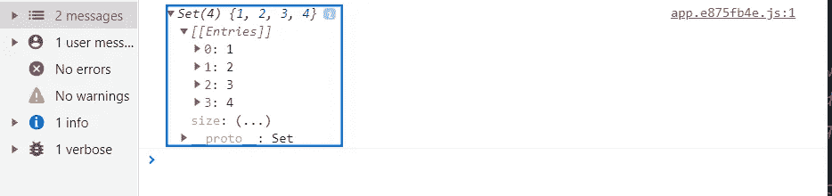
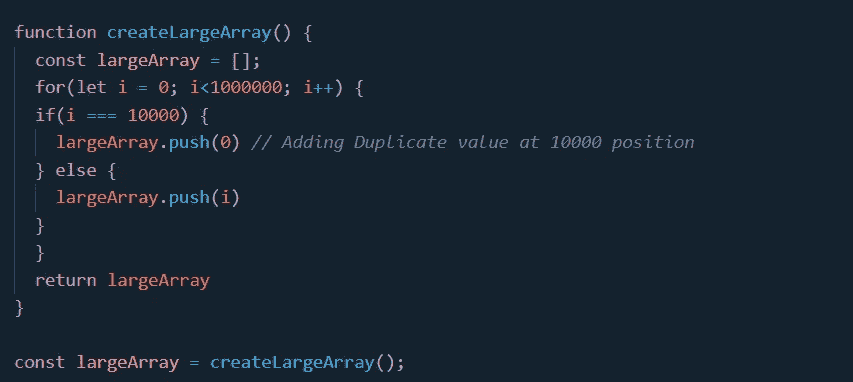
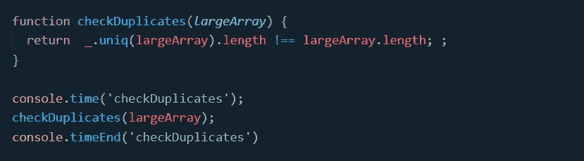
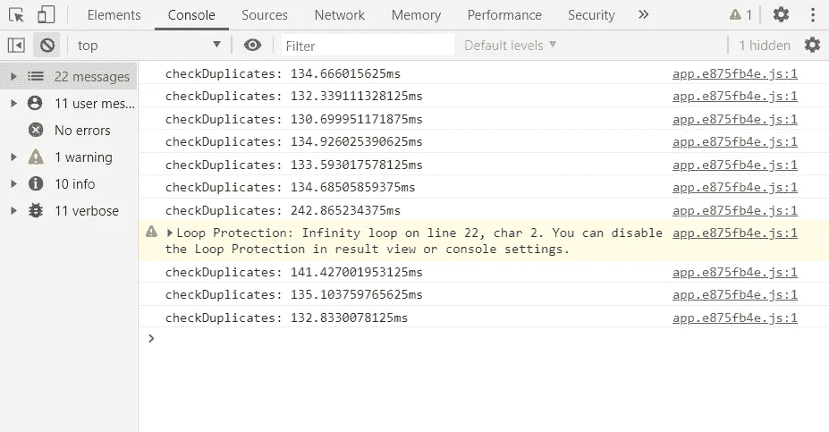
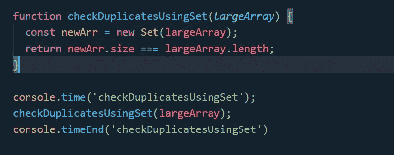
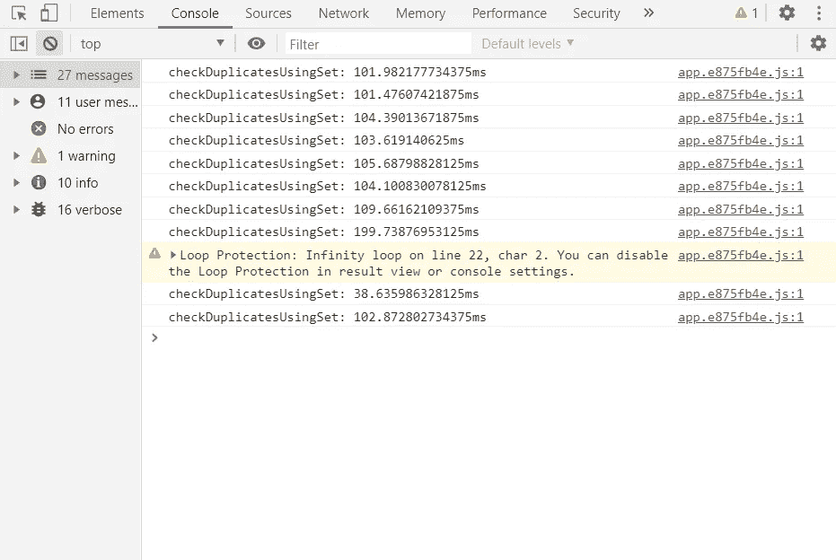
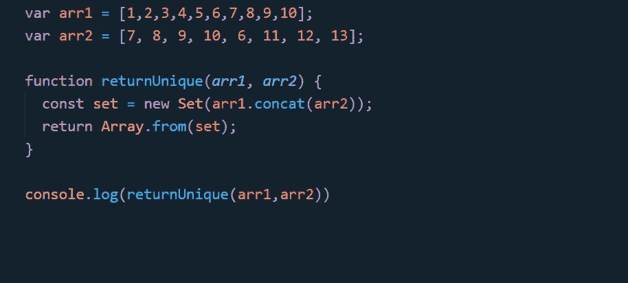
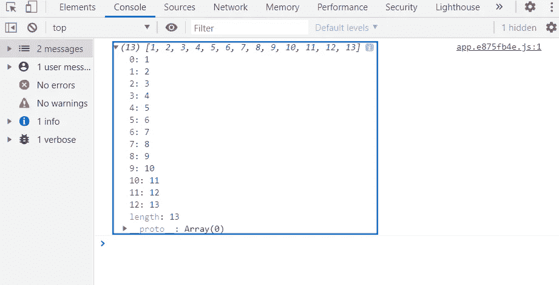

# Javascript 中集合的实际用例

> 原文：<https://levelup.gitconnected.com/practical-use-cases-of-sets-in-javascript-bb0a3309675>


对于不熟悉`Set`的开发人员来说，它只是一组明确的、不同的对象。通俗地说，集合就是一组无序的唯一元素。把`Set`想象成一个数组，但是只包含唯一的值。

*由于集合的实现是基于哈希表的，所以它们具有 O(1)的常数时间运算。*

*用 Javascript 创建集合:*

```
*let arr = [1,2,3,4,4];
const set = new Set(arr)*
```



所以我们看到 set 从数组中删除了重复项(这本身就是一个非常方便的用例)。

现在我们来看我自己已经多次使用过的实际用例。

**用例 1** : *你有一个 1000000 个元素的数组。检查数组是否包含重复项？*

首先，让我们创建一个包含 1000000 个元素的数组。



现在我们的`largeArray`变量包含了一个由 1000000 个原语组成的数组。我们还在 10000 点索引处添加了一个副本。

我们有我们的数据，我们需要确定是否有任何重复存在。我们将讨论两种方法(有和没有器械包),并检查哪种方法花费的时间更多。第一种方法我们将使用 lodash 的 [**_。uniq**](https://lodash.com/docs/4.17.15#uniq) 方法**。**

我们还将使用`console.time()`来记录这个函数所花费的时间。



该功能执行 10 次后的`console.time()`结果如下:



现在是我们第二种方法的时候了:



所以看起来 10 次中有 10 次`Set`打败了`uniq`。

**用例 2:** *给定两个数组，返回第三个数组中包含的两个数组的所有唯一值。*

听起来很熟悉对吧。您可能在面试环境中听说过它，甚至在合并两个列表并从一个数组中删除重复项时发现了它的必要性。

这是使用集合的解决方案。



我们得到的结果看起来像这样。



`Set`对象支持插入、删除、包含检查，时间复杂度均为 O(1)。使用这些内置方法，可以实现其他基本设置。这些将使我们能够实现具有快速唯一性的算法。

[](https://skilled.dev) [## 编写面试问题

### 掌握编码面试的过程

技术开发](https://skilled.dev)