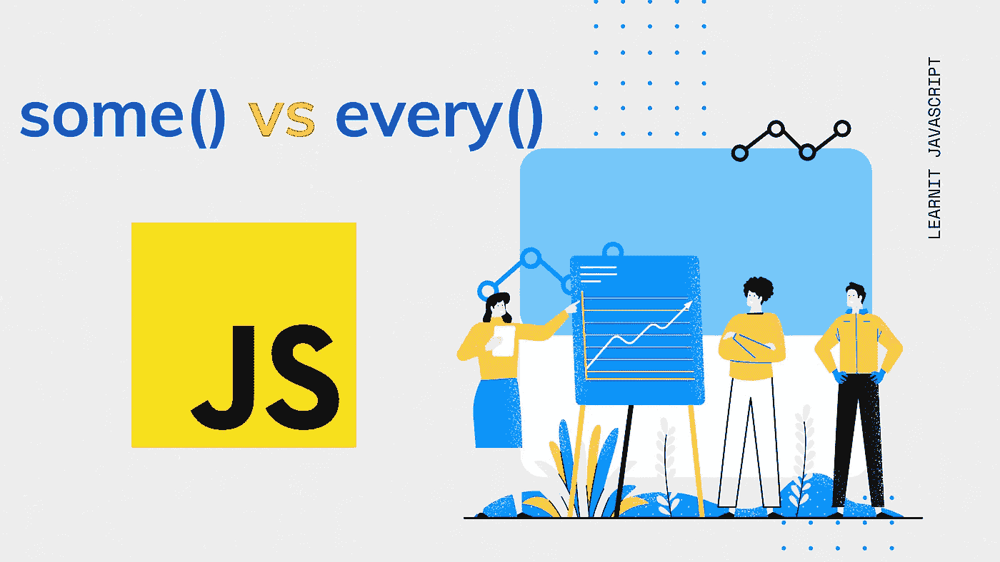
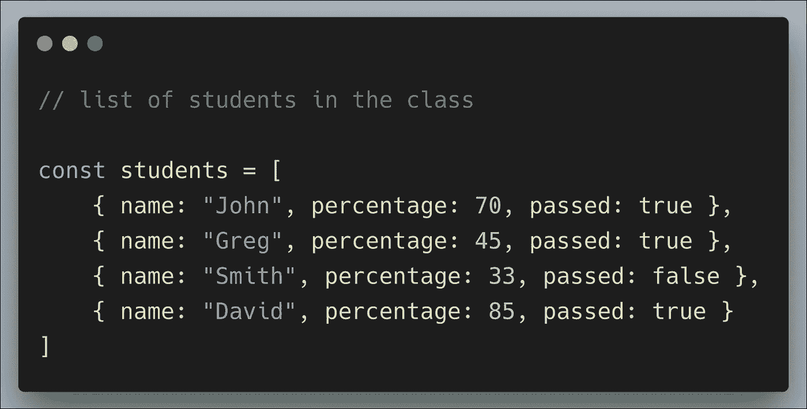
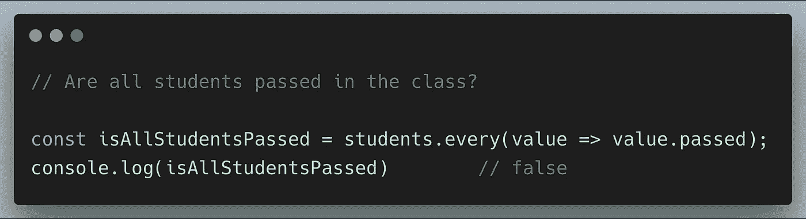
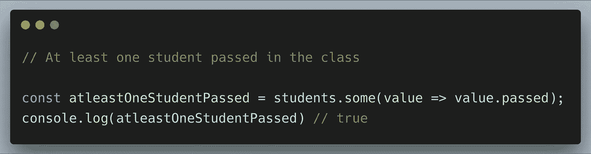

# JavaScript 中 some()和 every()方法的实际使用

> 原文：<https://levelup.gitconnected.com/practical-uses-of-some-and-every-method-in-javascript-cd93a4bf28d6>

在本文中，我将解释 Javascript 中`some()`和`every()`数组方法的常见用例。

让我解释一个简单的例子——我们有包含班上学生名单的数据。

## 这里我们有两个场景

1.  所有学生都通过了这门课吗？
2.  班上至少有一个学生及格了吗？

## 每隔( )

`every()`方法检查数组中的所有元素是否满足条件，它将对每个元素执行一次条件。结果是一个布尔值。

在我们的例子中，`every()`方法用于检查第一个场景，即 ***是否所有学生都通过了课程？***

只有当所有元素都满足给定条件时，该方法才会返回 **true** 。

## 一些()

`some()`方法检查至少一个元素满足给定的条件。它将对数组中的每个元素执行一次函数。

在我们的例子中，将使用`some()`方法来检查 ***至少有一名学生通过了课程。***

如果至少有一个元素通过了给定的条件，此方法将返回 true。

`every()`和`some()`的返回值是布尔值，它不会改变原始数组。

`some()`和`every()`只在 ES5 中发布，它拥有广泛的浏览器支持。

感谢阅读:)