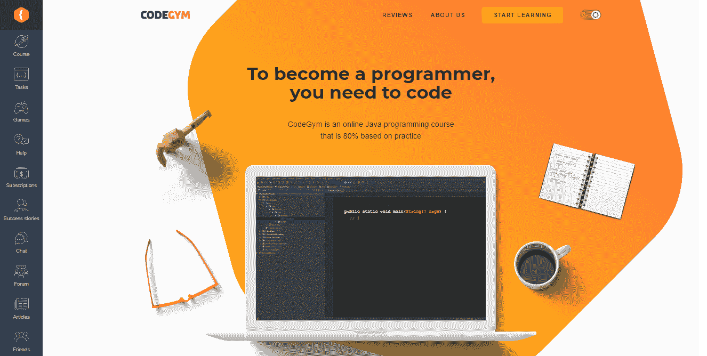
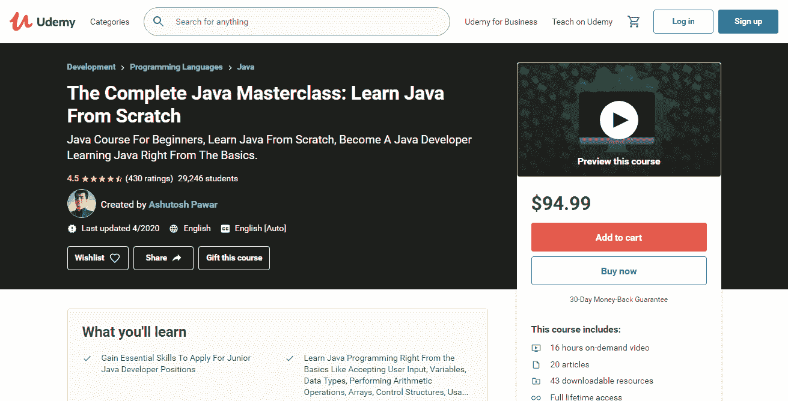

# Java 学习中的实践与理论方法

> 原文：<https://levelup.gitconnected.com/practical-vs-theoretical-approach-in-java-learning-b7fb60d1455d>

[斯科特·格雷厄姆](https://unsplash.com/@sctgrhm?utm_source=unsplash&utm_medium=referral&utm_content=creditCopyText)在 [Unsplash](https://unsplash.com/?utm_source=unsplash&utm_medium=referral&utm_content=creditCopyText) 上拍照

任何学习过程都是由实践和理论组成的。在编程中，一切都是完全一样的——两种方法:实践的和理论的。两者各有利弊。在这篇文章中，你将会对它们中的每一个有更多的了解，并决定用什么方法来学习 Java。你决定吧。

那么，我们开始吧。

# 理论方法

顾名思义，你将从这种方法的理论开始，假设从非常基础的东西开始学习 Java，从非常复杂的主题开始，比如 JVM 和编译器工作，然后到 Java 的语法(变量到循环、方法、类、OOP 概念等等)。这种自底向上的方法经常被用于专门针对大学或其他机构的正式编程课程中。这个想法是给你一个坚实的基本编程技能的基础，这些技能是将来开始制作东西和在现实世界的项目中实践所需要的。

# 优势

*   当你对基本概念有一个清晰的理解时，当你学习更高级的主题时，你很可能不会有知识上的空白。我的一个在培训中使用这种方法的朋友，在采取每一个后续步骤之前，阅读大量关于前面主题的书籍，以避免错过一些东西，并充分理解每个主题。
*   虽然从最开始到你的第一个实施项目通常需要时间，但从长远的角度来看，你的知识广度最终会加速你的过程。除此之外，它将帮助你在编码时更加关注细节，以避免可能的陷阱。

# 不足之处

*   学生发现很难理解他们所学的东西是如何联系在一起的。一整天都没有编写函数的问题，直到学生必须构建超出个人函数或类的软件。这是主要问题的开始。
*   完全的初学者很难理解如何实现所有学到的知识。如果不马上付诸实践，大量的理论可能会一闪而过，而不会在你的脑海中挥之不去。这是编程更注重实践的另一个证明——许多事情在理论上很难解释。就像游泳一样——除非你尝试，否则你不会明白如何游泳。
*   理论方法是缓慢的。你可能要花很长时间才能掌握所有的基本技能，我仍然对 OOP 概念有时会在你的学习过程中改变这一事实保持沉默，所以你需要从头再来。当你不得不花几个月甚至几年的时间在理论上，而在此期间没有创造出一些令人兴奋的东西时，你会感到厌倦，失去动力，更有可能放弃它。

# 实用方法

实践方法的主要思想是通过做来学习，或者换句话说，开发真实项目的片段。许多独立学习者使用实用的方法，所以他们从开始学习编程的那一刻起就开始创造东西，无论是游戏还是交互式网页。这就是其他开发人员在 YouTube 上发布的教程可以提供帮助的地方——当遵循这些指导时，你可以最终创造出一些有意义的东西。

# 优势

*   实用的方法允许你在眨眼之间创建一些真正的软件。你创造东西越快，你就越兴奋。
*   编码本身让你从实践中了解不同的组件，它们不一定会写在书中或在课程中提到。就你对他们的了解而言，你清楚地了解到你想进一步学习什么和不想学习什么，你对什么感兴趣，什么不感兴趣。在此基础上，你做出明智的选择，并按照你的选择继续学习。

# 不足之处

*   动手的方法不强调基础，所以热衷于尽快创造东西的学生常常跳过基础。由于这个原因，他们最终创建了自己的项目，却不清楚他们的代码是如何工作的。实践方法的另一个缺陷是，许多教程缺乏足够的细节——学生必须自己填补空白，但他们做不到这一点。与说明的微小偏差可能会导致项目中断，并给问题诊断带来困难。
*   没有获得基础知识，学生们就看不到全局，也不明白他们实际上在做什么。

# 哪一个是赢家？

所以，你已经读到这一段，找到了值得选择的方法。但是，关键是一种方法并不排斥另一种方法。换句话说，不存在纯粹的实践或理论方法——这些方法被认为是向一个或另一个方向倾斜的方法。但是，在学习编码和以正确的比例混合它们时，将它们结合起来仍然很重要。鉴于编程是一项实践活动，我建议投入不超过 80%的时间进行实践，而理论将占用 20%。

如果以后想从事真正的项目，单纯学习 Java 概念或者理论是没有意义的。你需要基本的编程技能来开始创造东西，就像你需要保持学习的动力一样，这是可以通过成就感获得的。除此之外，基本技能将帮助你理解和调试代码，不管是你自己的代码还是其他程序员写的代码。重要技能的坚实基础也将帮助你在非标准情况下编程，而不必阅读教程。

结合自底向上和自顶向下的方法，您可以随时在它们之间切换。如果你觉得你不知道你的代码在做什么，回到基础，填补你知识中的空白。如果你对这个理论感到厌倦，试着做些小东西，可以是一个简单的网页或者一个游戏。把学到的知识付诸实践，锻炼学到的概念，会给你那种成就感。

我的观点是，每个开始学习编程的学生都应该坚持 80/20 的方法。知识很容易学习，但是技能需要反复练习，这样你才能在实际项目中使用它们。

# 理论与实践平衡的 Java 课程

因此，考虑到理论和实践相结合的重要性，我决定给你一个来源列表，在那里你可以学习理论，在那里你可以实践。为了提高你的技能，你需要这两者。从专注于 Java 语言基础的课程开始，然后进入动手程序，将你将学到的一切付诸实践。

# 获得实践经验的来源

## CodeGym

我发现 [CodeGym](https://codegym.cc) 对于希望更多关注自顶向下学习的程序员新手来说很有用。这是一门基于 Java 的课程，80%基于实践。它包含 1200 个实际操作任务，所以你将不得不写大量的代码，这实际上有利于将你以前获得的知识付诸实践。该课程有一个代码自动验证器和帮助解决问题的提示。但是，不要被学习过程中如此多的实际工作所拖累——该公司实施了最新的教学方法，包括可视化、讲故事和游戏化，以使你对培训保持兴奋。

## 极客论坛

[GeeksforGeeks](https://www.geeksforgeeks.org) 是一个学习平台，在这里你可以掌握主要编程语言的技能，如 C、C++、Java 和 Python。在这里，您可以在允许操作代码的交互式 IDE 中工作，并在之后立即进行测试。除此之外，你将能够针对选定的问题得到精心编写、深思熟虑、解释清楚的解决方案，并为与招聘人员或公司老板的面试做好准备，最终获得一份程序员的工作。

## 代码集

[Codecademy](https://www.codecademy.com/?utm_source=rakuten&utm_medium=affiliate&utm_campaign=adgoal.net&utm_content=10-1&ranMID=44188&ranEAID=a1LgFw09t88&ranSiteID=a1LgFw09t88-iLosEuznKryG3EsESfMPAQ) 是代码学习中的新词。该公司发明了一个很棒的系统，允许你选择任何你想学的东西，从建立网站到分析数据。本课程旨在指导您了解不同的技术，包括 Java、HTML、CSS 和 JavaScript。如果你不确定从哪里开始，你会被建议参加测验，然后指出正确的方向。除了创建交互式网页之外，您还将能够掌握后端开发，成为全栈专家。

# 获取理论知识的来源

## Java 基础知识

这个[理论课程](https://www.pluralsight.com/paths/java)专注于 Java 的基础，给完全的初学者一个坚实的基础，然后他们才能接触到更高级的概念。这门入门课程将教你如何有效地使用 Java，并迫使你掌握 Java 中的控制流、面向对象、集合以及语法和流。因此，您将最终掌握构建自己的 Java 应用程序所需的技能。

## 完整的 Java masterclass

如果你是 Java 编程的初学者，如果你知道其他语言并想学习 Java，或者如果你想找一份 Java 开发人员的工作，Udemy 的这个[课程是完美的。它将从最基础的开始教你，然后转向更高级的主题，比如 Lambda 表达式、多线程、泛型等等。结构遵循循序渐进的教学方法，所以学习过程会比较顺利。课程结束后，你将能够阅读和编写 Java 程序，并在任何工作面试中充满自信。](https://www.udemy.com/course/java-programming-course/?ranMID=39197&ranEAID=a1LgFw09t88&ranSiteID=a1LgFw09t88-SjBET6PDzUXPKLV3.jvdDQ&LSNPUBID=a1LgFw09t88&utm_source=aff-campaign&utm_medium=udemyads)

# 结束语

让我们面对现实吧:生活是一个永无止境的学习过程。编程也不例外。理解编码中的一切是相当不可能的——至少由于高度发展的环境，总是有新的东西要学。在编程中，像在许多其他领域一样，有两种方法:理论和实践。当然，你可以根据你的目的和以往的经验选择其中之一。然而，我建议在训练时将两者结合起来，并坚持最佳的 20/80 比例，其中理论将占你时间的 20%，实践占 80%。