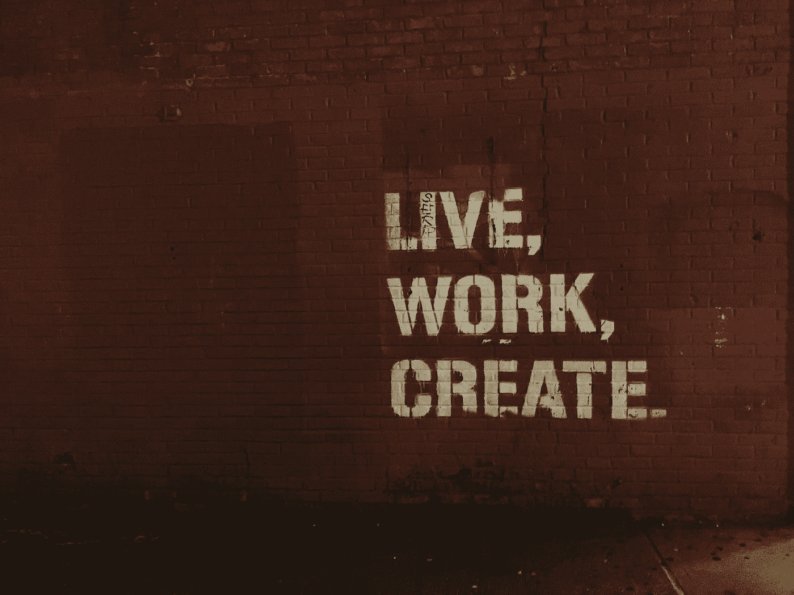

# 实践项目想法来提高我们的 Web 开发技能

> 原文：<https://levelup.gitconnected.com/practice-project-ideas-to-sharpen-our-web-development-skills-5390ac47157f>

由 [Unsplash](https://unsplash.com?utm_source=medium&utm_medium=referral) 上的[absolute vision](https://unsplash.com/@freegraphictoday?utm_source=medium&utm_medium=referral)拍摄

在软件开发领域，熟能生巧。所以要尽可能多的找方法练习编程。

在这篇文章中，我们将看看一些提高我们编码技能的实践项目想法。

# 会员网站

我们可以建立一个网站，让用户在注册账户和登录时查看内容。

通过这种方式，我们练习构建具有用户管理和认证的应用程序，这在几乎所有的应用程序中都有使用。

一旦用户登录，我们可以使用它来显示我们选择的项目。

为了让它更花哨，我们可以添加一个用户管理门户来让我们管理用户。

Cookies 和令牌可用于身份验证，以保存身份验证数据。

# 产品登录页面

登陆页面用漂亮的页面推广产品。我们可以建立登录页面，以实践我们的设计印章，使前端好看。

此外，我们可以了解 flexbox 和 grid 的布局。

# 答问比赛

我们可以做一个问答游戏，加载问题，让玩家回答。问题可以硬编码在我们的应用程序中，使用现有的 API，如 [Open Trivia](https://opentdb.com/api_config.php) 来加载问题，或者构建我们自己的 API，将问题加载到数据库中并从那里读取它们。

我们的应用程序将让人们选择或输入答案，然后我们检查他们对我们的问题。

此外，我们可以添加一个计时器，以便人们有有限的时间来回答问题。

# 电子书应用

显示电子书的应用程序很有用。内容可以从本地数据库或 API 加载。

我们甚至可以从用 Markdown 或 HTML 编写的文件中加载它。

有很多方法可以制作电子书应用程序，包括 Gridsome 和 Gatsby 这样的静态网站生成器，或者我们可以坚持使用传统的动态应用程序来动态加载内容。

# 调查表

调查表单对于练习构建动态表单非常有用。我们可以构建一个 UI 来管理调查问题并让人们回答问题。

为了更容易地创建动态表单，我们可以使用 React、Angular 和 Vue 这样的框架。

问题可以存储在 API 中。

我们可以让用户使用各种控件添加问题，如文本输入、复选框、单选按钮等。

# 待办事项列表

待办事项应用是一个实践应用非常受欢迎的项目。我们可以让用户添加、编辑和删除任务。

此外，我们必须让用户检查他们已经完成的任务。

为了让它更好，我们可以添加提醒功能，这是大多数练习或教程待办事项列表应用程序所没有的。

# 滑动 JavaScript 抽屉

滑动抽屉菜单需要一些技巧来构建。它从屏幕的一边打开，以覆盖网页的方式减慢速度。

乔恩·泰森在 [Unsplash](https://unsplash.com?utm_source=medium&utm_medium=referral) 上的照片

# 个人投资组合网站

如果我们想作为开发者获得各种机会，个人投资组合总是需要的。

因此，我们应该制作一个看起来不错的，并在其中有一些样本项目。

要制作一个作品集网站，我们可以制作一个静态网站，用整洁的布局、大量的图片和精心设计的图形来展示我们的项目。

此外，我们应该确保我们的网站加载速度快，这样人们就可以立即看到我们的内容。

# 食谱应用

一个菜谱 app 不仅有用，我们还可以用它来练习自己的编码技能。

它有许多可移动的部分，包括用 UI 管理食谱。此外，我们必须添加一个页面，让人们看看我们的食谱，并翻阅它们。

让人们添加食谱的形式应该让人们输入标题，内容，一个或多个图像，甚至视频。

因此，一个看起来简单的食谱应用程序实际上有很多我们可以做的事情来使它比其他应用程序更具功能性。

我们还可以添加不同的类别，让用户用类别来标记它们。

# 结论

我们可以开发很多应用来练习编程技能。看起来简单的项目，如食谱应用程序，待办事项列表和会员网站都有很多小的移动部件，我们必须实现。

为了练习构建动态表单，调查应用程序是一个很好的构建工具。