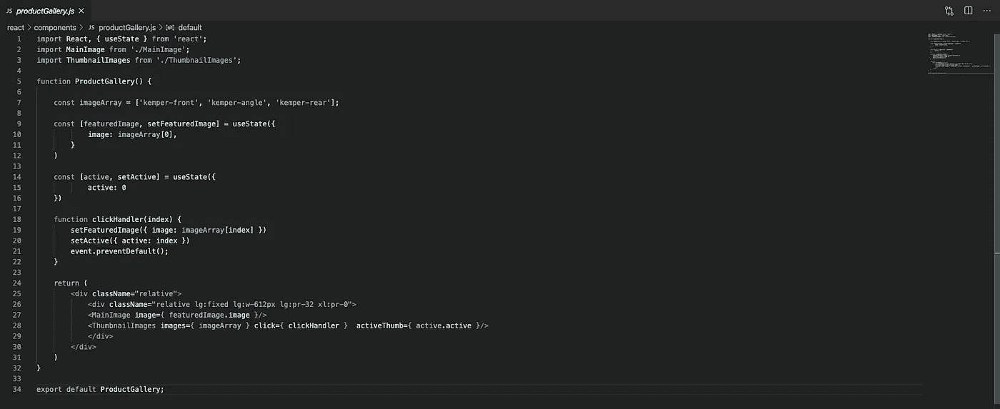
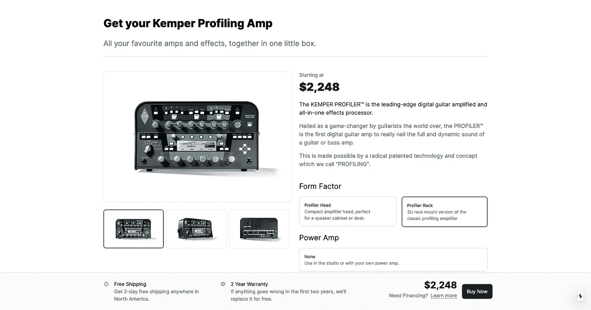
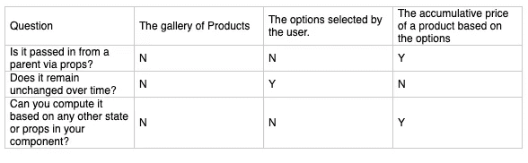

# 使用 TailwindCSS UI 带回家测试练习 React 挂钩

> 原文：<https://levelup.gitconnected.com/practicing-react-hooks-using-the-tailwindcss-ui-take-home-test-89ce27ef34c9>

我最近读到了 [TailwindCSS](https://tailwindcss.com) 的[招聘流程](https://blog.tailwindcss.com/from-900-to-1-how-we-hired-robin-malfait)。这个过程的一部分包括一个[带回家的测试](https://github.com/adamwathan/tailwind-take-home-project)，候选人需要在两周的时间内完成。

厌倦了构建待办应用程序，并且越来越欣赏基于类的 Tailwinds 系统，该系统允许你在不使用任何定制 CSS 的情况下设计组件，我决定尝试实践我在 **React Hooks** 中学到的一些东西。

产品布局界面截图

在下面的文章中，我主要展示了如何使用 React 钩子来操作*状态*和实现程序的交互功能(包括样式的改变)。

在 [GitHub](https://github.com/peteraiello/TailwindTakeHomeTestReact) 上查看项目。我的解决方案的实时 URL 是这里的。

# 为画廊构建功能

用于确定状态的元素表

我分解了不同的部分，以决定哪些部分需要交互，哪些部分需要反应，检查概念的元素，看看它们是否符合文档中列出的标准。**图像库**会根据用户输入随时间改变数据，因此符合使用**状态**的标准。

更具体地说，图库的特色图片的 URL 将使用 React 钩子更新到用户单击的缩略图。

活动缩略图的边界实现起来有点棘手，因为我不确定设计模式是什么。例如，如果我们只需要给被点击的缩略图添加一个边框，而不需要它来切换，那么这个功能就简单多了！

我使用的解决方案是通过查看选项卡组件上的[教程找到的，并涉及为`active`创建一个新状态，该状态将更新到单击的缩略图(使用`clickHandler`函数)。然后，`thumbnailSelect`函数将使用一个三进制表达式](https://www.digitalocean.com/community/tutorials/react-tabs-component)[将活动缩略图与缩略图索引进行比较，当该表达式解析为真时，将使用一个轮廓更粗的边框。](https://developer.mozilla.org/en-US/docs/Web/JavaScript/Reference/Operators/Conditional_Operator)

缩略图组件示例

# 更新不同组件的价格

使用 React 挂钩的另一个功能是针对产品**价格**的，它会根据表单的用户输入在**和**两个地方发生变化，包括产品描述组件和页脚。我创建了一个状态来管理价格的变化(`ampPrice`)。

最初，我决定通过将表单选项分成三个独立的组来解决这个问题，并专注于根据一个组的输入来更新价格作为测试。

除了`ampPrice`的状态之外，我还为`active`创建了一个状态(与画廊的缩略图相同)，它会更新到所选择的表单选项。我还为与选项(`costState`)相关联的成本创建了一个状态，该状态将被添加到价格中。`updatePrice`函数综合了所有组中所有选项的总成本。

组数据示例

# 反射

我认为，虽然我使用 React Hooks 构建图库的解决方案相当健壮，但我更希望将表单组组织成单独的组件，使它们更易于重用。这样做，可能需要更新两三层子组件的状态，这可能需要我们在程序中实现 [redux](https://redux.js.org/basics/usage-with-react/) 。

不过，总的来说，我认为 React 挂钩是构建交互式 web 应用程序的一种很好的方式，React 组件与 Tailwind CSS 配合得很好。现在已经使用了 React 和 Vue，我可以诚实地说，它们都是可行的选择，并且我认为了解这两者是很好的，因为趋势总是在变化。

感谢您的阅读，如果这篇文章对您有任何帮助，请在评论中告诉我。