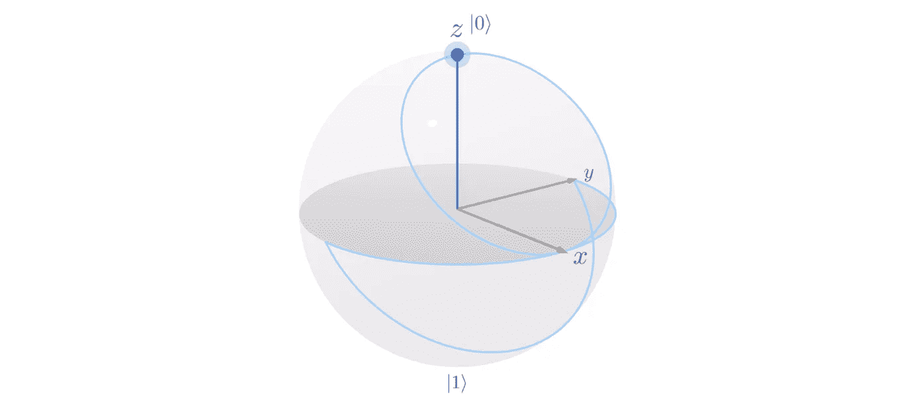
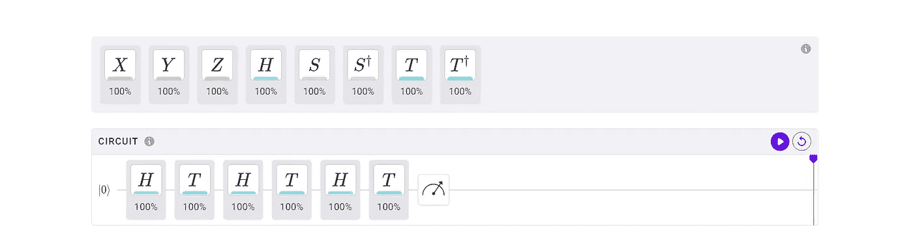
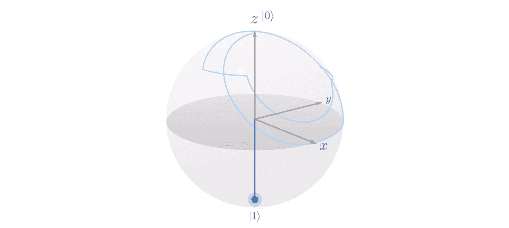

# 用 Q-Ctrl 的黑欧泊练习

> 原文：<https://levelup.gitconnected.com/practicing-with-q-ctrls-black-opal-9d819ea71558>

请继续阅读这篇文章的挑战！

# 通过动画实现量子门掌握

Q-Ctrl 的黑欧泊包括一个单量子比特的练习电路。有了它，你可以从八个最基本的量子门中进行选择，将它们拖放到电线上，点击“播放”，然后观看每个转换，一个接一个，慢慢地在布洛赫球体上制作动画。

从|0 >开始，X 和 Y 有什么区别？

哈达玛到底是做什么的？

S 向哪个方向旋转，S 匕首向哪个方向旋转？

您可以“提问”并查看这些问题的答案以及更多内容。

虽然所有的 Bloch 球体都将向您展示最终状态，但这里的附加值是动画。这在早期对 X、Y 和 Z 门很有用，但对 Hadamards 尤其有用。阿达玛仍然经常被介绍为从|0 >旋转到|+>，但是它不遵循直线。它围绕两个轴旋转，你可以清楚地看到，使用黑色蛋白石的这种“练习”功能。

顺便说一下，这是我正在进行的系列第五次黑蛋白石审查。要了解最新情况，请查看以下文章:

1.  [回顾:Q-Ctrl 的黑蛋白石教程](/review-q-ctrls-black-opal-tutorials-3e888ac76f84)(技能 1-3)
2.  [回顾:Q-Ctrl](/review-black-opal-circuits-by-q-ctrl-beaf01a7b5ce) (技能 4)黑蛋白石电路
3.  [回顾:Q-Ctrl](https://bsiegelwax.medium.com/review-black-opal-entanglement-by-q-ctrl-fb913447535c) (技能 5)黑欧泊“纠缠”
4.  [回顾:通过 Q-Ctrl](https://bsiegelwax.medium.com/review-black-opal-noise-by-q-ctrl-71439dad348b) (技能 6)获得黑色蛋白石“噪音”

[https://black.q-ctrl.com/practice/single-qubit](https://black.q-ctrl.com/practice/single-qubit)

## 随机量子态

这不是随机的，但是如果你想用半任意量子态做实验，你可以简单地把一系列哈达玛和 T 门串在一起。t 门绕 z 轴逆时针旋转 1/8 圈，因此，如果您被误导认为 Hadamards 从|0 >垂直旋转到|+>并返回，以及从|1 >垂直旋转到|->并返回，该电路将很快澄清这一点。

[https://black.q-ctrl.com/practice/single-qubit](https://black.q-ctrl.com/practice/single-qubit)

## 哈达玛揭示了

这就是上面 H-T-H-T-H-T 电路的结果。正如你所看到的，合成的量子态在我们对布洛赫球的二维描述的右上象限。我们的起点是|0 >。

它是怎么到那里的？单击“播放”后，会为您绘制一条浅蓝色的线因此，当围绕 x 轴和 z 轴旋转时，您将跟随从|0 >到|+>绘制的线。然后，当它围绕 z 轴逆时针旋转 1/8 时，您将跟随这条线。然后你会看到进一步的证据证明哈达玛不仅仅是上下旋转量子态。

作为比较，尝试在[https://javafxpert.github.io/grok-bloch/](https://javafxpert.github.io/grok-bloch/)实现相同的电路 H-T-H-T-H-T。布洛赫球又大又漂亮，所以你可以很容易地看到向量。但是，每次操作都会立即将向量从旧位置捕捉到新位置。我们看到第二个哈达玛把量子态从这里移动到那边，但是我们不知道它是怎么到达那里的。我们不像对黑蛋白石那样为哈达玛变换建立直觉。

独眼巨人吃豆人

## 挑战！

黑蛋白石可能从来没有打算生产“量子艺术”，但我还是向你展示了这个三维独眼巨人吃豆人。我挑战你去 https://black.q-ctrl.com/practice/single-qubit 的[看看你是否能复制它。最多可以用六个量子门(Q-Ctrl 的限制，不是我的)。如果你能做到这一点，可以肯定地说，你已经很好地“控制”了基本的量子门。](https://black.q-ctrl.com/practice/single-qubit)

通过完成这个挑战，你有望学到一些关于旋转的知识。如果没有，希望你至少会玩得开心。而且，如果你连起码的乐趣都没有…好吧…感谢你阅读这篇文章；我会在下一次挑战中尽量少失败。