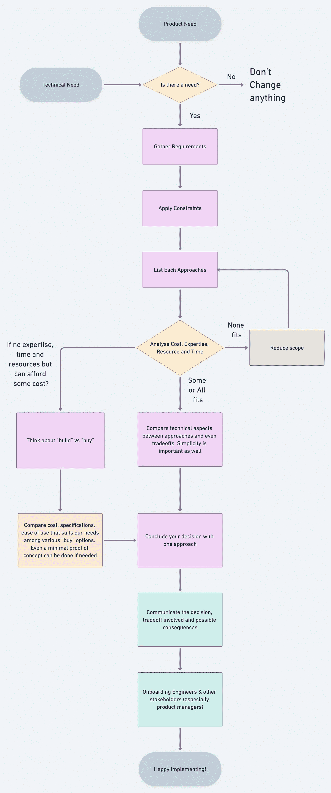

# 软件架构决策的实用方法

> 原文：<https://levelup.gitconnected.com/pragmatic-approach-to-software-architecture-decisions-ac8a365e461b>

> 为了做出一个好的决定，你实际上需要考虑它，轮廓和后果。
> 
> —斯泰西·艾布拉姆斯

做出软件架构决策是一项技能。制定严格的流程和法规需要几个月的时间来做出这样的决定。另一方面，一些团队只是继续开发，甚至没有花任何时间考虑问题陈述的各种其他解决方案。软件架构的决策将通过简单而有效的方法来进行。

Alexander Schimmeck 在 [Unsplash](https://unsplash.com/s/photos/decisions?utm_source=unsplash&utm_medium=referral&utm_content=creditCopyText) 上的照片

我将撰写一系列文章，讨论如何通过一些用例做出架构决策。在本文中，我将带您了解做出架构决策的实用方法，以及如何避免常见的陷阱。

# 从产品或技术需求开始

从真实的产品或技术需求开始。产品需求就像构建一个新的特性，给一个特性添加一个功能，构建一个全新的产品，等等。甚至有时不是每个产品需求都需要一个架构决策，比如添加一个新的字段，添加一个对现有字段的验证。这可能是一个小的变化，因此团队甚至可以排除架构决策，并可以继续实现。

与产品需求一样，可能存在技术需求，如重构、偿还技术债务、重新架构，以改善一些架构特征，如系统的可用性、可伸缩性、一致性或容错性。在大多数情况下，技术需求要求一个架构决策，即使它改变了一些基本参数和系统的性质。

> 如果你没有真正的产品或技术需求，就不要改变任何东西。当然也不需要架构决策。

架构决策流程图

# 收集需求

一旦你确定了产品或技术需求，就从各自的利益相关者那里收集需求。产品需求的要求来自于产品所有者。对于技术需求，技术所有者将定义需求。即使是产品需求，非功能性需求，如可伸缩性、可用性等。应该考虑。

# 应用约束

架构约束是规范，它使开发人员能够形式化架构应该遵守的设计规则，比如给定架构模式或风格的拓扑条件。这些约束可以作为更好地理解现有架构描述的文档，并且可以在应用架构更改后进行检查，以查看设计规则是否仍然有效。像任何规范一样，架构约束可以重用。此外，这些约束是在架构设计时指定和检查的。

每个需求都会有一些约束。在做架构决策时，忽略或不考虑约束是一个灾难的处方。如果没有正确处理约束，您可能会以错误的解决方案告终。

# 集体讨论方法

每个需求或问题陈述都可以通过多种方法实现。在很好地理解了需求和约束之后，是时候想出相同的不同方法了。在这个阶段，建议考虑可以在内部构建的方法，而不是依赖于“购买”选项。通过这种方式，你为你的团队提供了一个以多种可能的方式进行研究、提议和创新的机会。直接选择“购买”不会给你的团队思考的机会。

# 系统依赖性

做出架构决策时，需要分析和指定与系统和组件的其他部分的依赖关系。这有助于理解决策的影响以及如何使其与系统的其他部分兼容。

# 获得认证

**下一步是通过成本、专业知识、资源和时间获得认证。**通过这 4 个方面介绍所有可能的方法，了解它们如何适用于您的要求和情况。您的团队需要专业知识来构建内部解决方案并终生维护它。如果你的团队有这方面的专业知识，下一步就是大致了解一个方法需要多长时间。如果您的团队觉得他们没有专业知识，并且不确定他们是否能够完成，那么可以开发概念证明来获得对方法的一些信心。成本是衡量各种方法时需要考虑的另一个重要因素。如果一种方法的成本极高，我们真的要考虑替代方案。还必须考虑实施一种方法的可用人力资源。

想象一下，如果您盲目地选择一项没有通过认证流程的技术，最终会导致高成本、团队专业知识减少、耗费大量时间和资源，那么请做好最坏的打算！**这是炒作驱动发展的结果。**

> 工具和技术不应该定义你的架构。你的架构&需求应该要求先验。

如果所有通过认证的方面都失败了，这意味着你的团队还没有准备好完成整个项目。**到目前为止，建议缩小需求范围，重新进行认证流程，以了解缩小的范围是否可实现**。做一个 MVP 并在多个迭代中工作将会降低项目本身的风险，因为团队可以在他们发布一些迭代时获得一些概述，随着时间的推移，专业知识也将会建立。

# 构建与购买

如果团队没有任何方法的专业知识和资源，而组织有尽快发布的策略，现在是时候考虑“构建 vs 购买”了。随着购买路线，它再次迭代各种选项。比较每个供应商提供的规格和产品，并权衡我们能够承受的成本，最终会是一笔划算的买卖。甚至可以对各种购买选项进行最低限度的概念验证，以了解可能涉及的集成工作。

# 入职利益相关方

一旦做出决定，其他利益相关者可以参与进来，向他们提供项目时间表、所涉及的权衡和后果的清晰性。**软件架构中的每一个决定都涉及到一些权衡**。重要的是不要忽略这些，向利益相关者传达这一点将有助于他们设定对用户体验的期望。

# 记录决策

记录架构决策可以用尽可能简单的格式来完成。迈克尔·尼加德发明了一种记录架构决策的简单格式，叫做 [ADR](https://adr.github.io/) (架构决策记录)。对于决策，“为什么”部分是最重要的方面，因为人们可以在以后参考为什么做出某些架构决策，为什么忽略其他选择，涉及哪些约束和权衡，以及提到的后果是什么。

在上面显示的架构决策流程图中，**如果您直接得出一种方法，会发生什么？** —您可能会错过约束，不会分析任何参数，也不会考虑其他选项。**最坏的情况，甚至可能没有真正的产品或技术需求。记住这一点，并采取如上所述的务实方法，将使你远离炒作驱动的开发，减少交付的风险，而且只获得需求。**

目前就是这样——目标不是将制定架构决策的过程制度化。它仍然应该尽可能保持精简，优先考虑自主性和简单性，但同时有一些指导原则可供参考。上述方法在不同的团队中可能完全不同。根据您的需求和团队的情况进行定制。

我将会写一系列的文章，包括用例，以及我们如何应用上面的步骤来制定一个架构决策和一个 ADR。敬请期待🤞。

你在做架构决策时有什么经验？—我很想知道你的想法。

*阅读阿南特·拉玛钱德朗(以及媒体上成千上万的其他作家)的每一个故事:*【https://ananthanarayanan-r.medium.com/membership】*[——你的会员费直接支持阿南特·拉玛钱德朗和你阅读的其他作家。你也可以在媒体上看到所有的故事。](https://ananthanarayanan-r.medium.com/membership)*