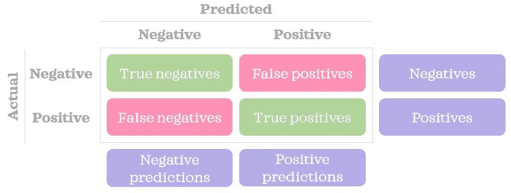
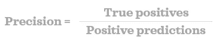
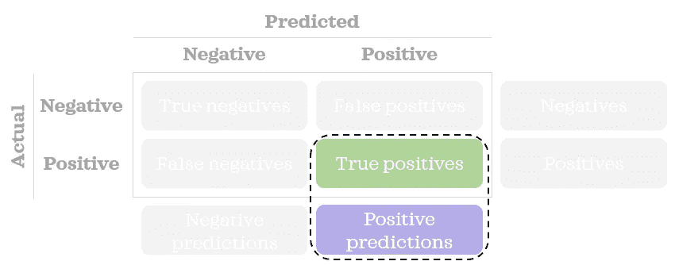
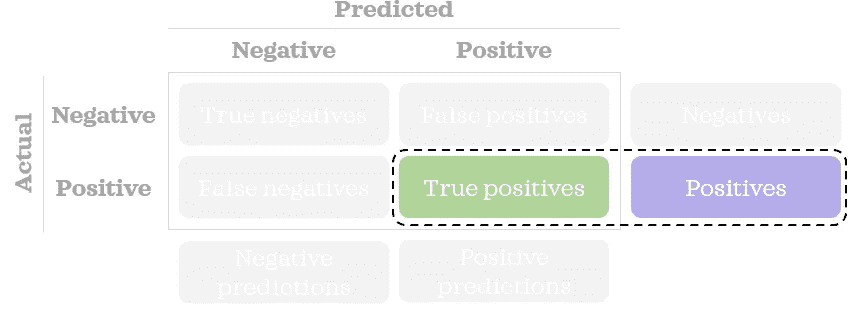
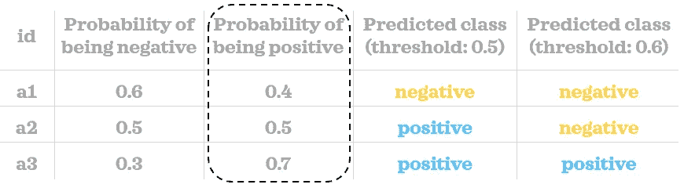
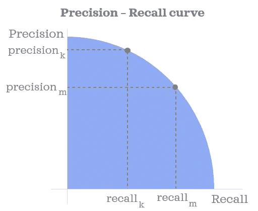
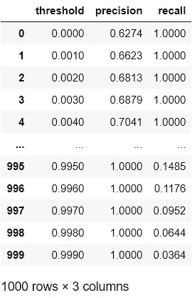
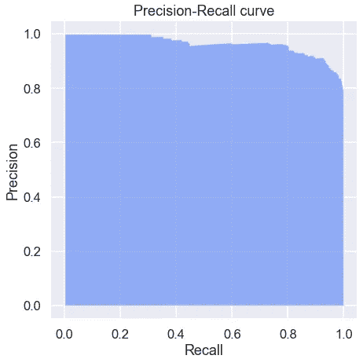
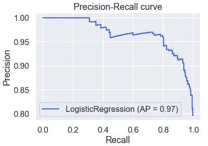
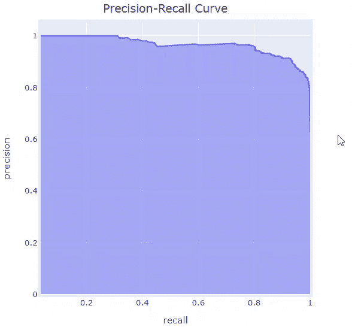

# 解释精确召回曲线

> 原文：<https://levelup.gitconnected.com/precision-recall-curve-explained-fabfe58fb52e>

## 数据科学基础

## 学习用 Python 可视化精确召回曲线

在本帖中，我们将了解如何从概念上构建精确召回曲线(一种评估监督分类模型的有用工具),并在 Python 中以静态和交互格式显示该曲线。


Elena Mozhvilo 在 [Unsplash](https://unsplash.com?utm_source=medium&utm_medium=referral) 上的照片

# 理解曲线

精确度-召回率(又名 PR)曲线向我们展示了在不同的*阈值*下*精确度*和*召回率*之间的关系。让我们来理解这三个术语的含义。

首先，让我们回顾一下混淆矩阵是什么样子的:



作者图片

刷新了我们对混淆矩阵的记忆后，让我们看看术语。

## 精确

我们可以使用下面的简单公式计算精度:



> 精确度告诉我们正确的正面预测的百分比。换句话说，它告诉我们积极的预测有多精确。精度越高，假阳性越低，反之亦然。



作者图片

## 回忆

我们可以使用下面的简单公式找到回忆:


> 回忆告诉我们正确预测的正面记录的百分比。这也被称为真阳性率或灵敏度。召回率越高，假阴性就越低，反之亦然。



作者图片

## 阈值

通常，分类模型可以预测给定记录成为某个类别的概率。通过将概率值与我们设置的阈值进行比较，我们可以将记录分类。换句话说，您需要定义一个类似如下的规则:

> 如果为正的概率大于或等于阈值，则记录被分类为正预测；否则，一个负面的预测。

在下面的小例子中，我们可以看到三个记录的概率得分。使用两个不同的阈值(0.5 和 0.6)，我们将每个记录分类到一个类中。正如您所看到的，预测的类根据我们选择的阈值而变化。



作者图片

当构建混淆矩阵和计算准确率和召回率时，我们需要预测的类别而不是概率分数。

## 精确回忆曲线

现在我们知道了什么是精度、召回率和阈值，一旦我们计算了多个阈值的精度和召回率，我们就在 x 轴上绘制召回率，在 y 轴上绘制精度-召回率曲线。就是这样！✨



作者图片

该曲线显示了不同阈值下精确度和召回率之间的权衡。你也可以认为这条曲线显示了*假阳性*和*假阴性*之间的权衡。如果您的分类问题要求您拥有预测的类别而不是概率，则应在考虑了*假阳性*和*假阴性*的相对误分类成本后，选择要使用的正确阈值。此外，在某些用例中(例如，当您有严重不平衡的数据时)，精确-召回曲线下的面积是 ROC 曲线下面积的一个很好的替代度量。

现在，是时候看看一些代码示例来巩固我们的知识了。

# 在 Python 中构建静态精确召回曲线

让我们首先导入本文剩余部分所需的库:

```
import numpy as np
import pandas as pd
pd.options.display.float_format = "{:.4f}".formatfrom sklearn.datasets import load_breast_cancer
from sklearn.linear_model import LogisticRegression
from sklearn.metrics import precision_recall_curve, plot_precision_recall_curveimport matplotlib.pyplot as plt
import seaborn as sns
import plotly.express as px
sns.set(palette='rainbow', context='talk')
```

现在，我们将构建一个函数，在给定正确类别、预测为阳性类别的概率和阈值的情况下，该函数将找到*真阳性*和*阳性预测*的数量:

```
def get_tp_pp(y, proba, threshold):
    """Return the number of true positives."""
    # Classify into classes
    pred = np.where(proba>=threshold, 1, 0)

    # Count true positives
    true_positives = np.sum((y==1) & (pred==1))
    positive_predictions = np.sum(pred==1)
    return true_positives, positive_predictions
```

*请注意，您将在现实中使用分区数据集(如培训、测试)。但是为了简单起见，我们不会在本文中对数据进行划分。*

我们将在玩具数据集上构建一个简单的模型，并获得这些记录为正的概率(用值 1 表示):

```
# Load sample data
X = load_breast_cancer()['data'][:,:2] # first two columns only
y = load_breast_cancer()['target']# Train a model
log = LogisticRegression()
log.fit(X, y)# Predict probability
proba = log.predict_proba(X)[:,1]
```

我们将使用 1000 个不同的阈值，从 0 到 1，增量为 0.001。换句话说，阈值看起来像 0，0.001，0.002，… 0.998，0.999。让我们找出阈值的精度和召回率。

```
# Find precision & recall for thresholds
positives = np.sum(y==1)columns = ['threshold', 'precision', 'recall']
inputs = pd.DataFrame(columns=columns, dtype=np.number)
thresholds = np.arange(0, 1, 0.001)for i, threshold in enumerate(thresholds):
    inputs.loc[i, 'threshold'] = threshold
    true_positives, positive_predictions = get_tp_pp(y, proba, threshold)
    inputs.loc[i, 'precision'] = true_positives/positive_predictions
    inputs.loc[i, 'recall'] = true_positives/positives
inputs
```



该地块的数据已准备好。让我们画出来:

```
def plot_static_precision_recall_curve(fpr, tpr):
    plt.figure(figsize=[7,7])
    plt.fill_between(fpr, tpr, alpha=.5)
    plt.ylabel("Precision")
    plt.xlabel("Recall")
    plt.title("Precision-Recall curve");

plot_static_precision_recall_curve(inputs['recall'], inputs['precision'])
```


虽然构建自定义函数有助于我们理解曲线及其输入，并更好地控制它们，但我们也可以利用 *sklearn 的*功能进行更优化。例如，我们可以用一个`precision_recall_curve()`函数得到精确度、召回率和阈值。我们可以使用自定义绘图功能以同样的方式绘制数据:

```
precision, recall, thresholds = precision_recall_curve(y, proba)
plot_static_precision_recall_curve(recall, precision)
```



Sklearn 还提供了一个`plot_precision_recall_curve()`函数，为我们完成所有的工作。您只需要一行代码(添加标题是可选的):

```
plot_precision_recall_curve(log, X, y)
plt.title("Precision-Recall curve"); # Add a title for clarity
```



# 用 Python 绘制交互式精确召回曲线

使用静态图时，很难看到曲线上不同点的相应阈值。一种选择是仔细检查我们创建的`inputs` 数据框架。另一个选项是创建图形的交互式版本，以便当我们将鼠标悬停在图形上时，可以看到精度和相应阈值旁边的回忆:

```
def plot_interactive_precision_recall_curve(df, precision, recall, thresholds):
    fig = px.area(
        data_frame=df, 
        x=recall, 
        y=precision,
        hover_data=thresholds, 
        title='Precision-Recall Curve'
    )
    fig.update_layout(
        autosize=False,
        width=500,
        height=500,
        margin=dict(l=30, r=30, b=30, t=30, pad=4),
        title_x=.5, # Centre title
        hovermode = 'closest',
        xaxis=dict(hoverformat='.4f'),
        yaxis=dict(hoverformat='.4f')
    )
    hovertemplate = 'Recall=%{x}<br>Precision=%{y}<br>Threshold=%{customdata[0]:.4f}<extra></extra>'
    fig.update_traces(hovertemplate=hovertemplate)

    # Add dashed line with a slope of 1
    fig.add_shape(type='line', line=dict(dash='dash'), x0=0, x1=1, y0=0, y1=1)
    fig.show()plot_interactive_precision_recall_curve(df=inputs, 
                           precision='precision', 
                           recall='recall', 
                           thresholds=['threshold'])
```



互动性挺有用的吧？

希望你喜欢学习如何建立和可视化精确召回曲线。一旦理解了这条曲线，就很容易理解另一条相关曲线: [*ROC 曲线* e](https://towardsdatascience.com/roc-curve-explained-50acab4f7bd8) 。


[Zoltan·塔斯](https://unsplash.com/@zoltantasi?utm_source=medium&utm_medium=referral)在 [Unsplash](https://unsplash.com?utm_source=medium&utm_medium=referral) 上拍照

*您想访问更多这样的内容吗？媒体会员可以无限制地访问媒体上的任何文章。如果您使用* [*我的推荐链接*](https://zluvsand.medium.com/membership) ，*成为会员，您的一部分会费将直接用于支持我。*

感谢您阅读这篇文章。如果你感兴趣，这里有我其他一些帖子的链接:

◼️ [在 Python 中使用标点符号的有趣方法](https://towardsdatascience.com/interesting-ways-to-use-punctuations-in-python-43205a0bd67d)
◼️ [从零开始学习 Python 的 5 个技巧](https://towardsdatascience.com/5-tips-to-learn-python-from-zero-e4f6a9106558)
◼️[python 虚拟环境数据科学入门](https://towardsdatascience.com/introduction-to-python-virtual-environment-for-data-science-3c216929f1a7)
◼️[git 数据科学入门](https://towardsdatascience.com/introduction-to-git-for-data-science-ca5ffd1cebbe?source=your_stories_page-------------------------------------)
◼️ [用这些技巧整理你的 Jupyter 笔记本](https://towardsdatascience.com/organise-your-jupyter-notebook-with-these-tips-d164d5dcd51f)
◼️ [6 个简单技巧让你在 Seaborn (Python)中的情节更漂亮、更定制](https://towardsdatascience.com/6-simple-tips-for-prettier-and-customised-plots-in-seaborn-python-22f02ecc2393)
◼️️

再见🏃💨