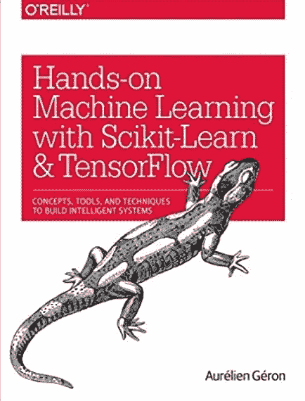

# 使用 Python 和线性回归预测波士顿房价

> 原文：<https://levelup.gitconnected.com/predict-boston-house-prices-using-python-linear-regression-90469e0a341>

## 使用机器学习算法预测房价


在这篇文章中，我将编写一个 Python 程序，使用一个名为**线性回归**的机器学习算法来预测波士顿的房价。线性回归是一种建模标量响应(或因变量)和一个或多个解释变量(或自变量)之间关系的线性方法。

# 线性回归优点:

1.  实现简单。
2.  用于预测数值。

# 线性回归缺点:

1.  容易过度拟合。
2.  当自变量和因变量之间的关系为非线性时，不能使用。

如果你不想读这篇文章，想要一个视频演示，你可以看看下面的 [**视频**](https://youtu.be/gOXoFDrseis) 。它以更详细的方式介绍了本文中的所有内容，即使您的计算机上没有安装编程语言 Python，它也会帮助您轻松地开始编写自己的线性回归机器学习模型。或者两者都可以作为学习线性回归的辅助材料！

# **开始编程:**

首先，我将导入依赖项，这将使这个程序更容易编写。我在导入机器学习库 **sklearn** 、 **numpy** 和**熊猫**。

```
**import** **pandas** **as** **pd**
**import** **numpy** **as** **np**
**from** **sklearn** **import** linear_model
**from** **sklearn.model_selection** **import** train_test_split
```

接下来，我将从 **sklearn.datasets** 中加载 Boston Housing 数据集，并在通过使用一个名为`load_boston()`的函数/方法将其存储到变量`boston`中后打印出来，但首先我将导入库`sklearn.datasets` **。**该方法将返回一个类似字典的对象，有趣的属性有:`data`要学习的数据，`target`回归目标，`DESCR`数据集的完整描述，`filename`Boston CSV 数据集的物理位置，以及`feature_names`列或特性的名称。请注意，此数据集已经是干净的，这意味着没有损坏、不准确或丢失的数据。

```
*#Load the Boston Housing Data Set from sklearn.datasets and print it*
**from** **sklearn.datasets** **import** load_boston
boston = load_boston()
print(boston)
```


**图 1:** 从 load_boston()返回的数据的部分图像，突出显示“数据”

上图**图 1，**看起来很乱，我很难读懂，所以我会用熊猫图书馆把数据转换成更容易管理的东西，比如数据框。当我这样做的时候，我会把数据分成自变量(X)和因变量(Y)数据集。数据将存储在因变量的`df_x`和因变量的`df_y`中。

```
*#Transform the data set into a data frame* 
*#NOTE: boston.data = the data we want,* 
*#      boston.feature_names = the column names of the data*
*#      boston.target = Our target variable or the price of the houses*
df_x = pd.DataFrame(boston.data, columns = boston.feature_names)
df_y = pd.DataFrame(boston.target)
```

我想从`df_x`数据集中获得一些统计数据，比如每列数据包含的行数、每列的最小值、每列的最大值以及每列的平均值。

```
*#Get some statistics from our data set, count, mean standard deviation etc.*
df_x.describe()
```


**图 2:** 对 df_x 数据集中几列的统计

我将继续初始化线性回归模型，将数据分为 67%的训练数据和 33%的测试数据，然后使用包含独立变量的训练数据集来训练模型。

```
*#Initialize the linear regression model*
reg = linear_model.LinearRegression()*#Split the data into 67% training and 33% testing data*
*#NOTE: We have to split the dependent variables (x) and the target or independent variable (y)*
x_train, x_test, y_train, y_test = train_test_split(df_x, df_y, test_size=0.33, random_state=42)*#Train our model with the training data*
reg.fit(x_train, y_train)
```

获取线性回归模型的估计系数

```
*#Print the coefecients/weights for each feature/column of our model*
print(reg.coef_)
```


**图 3:** 线性回归模型的系数

现在我们已经完成了线性回归模型的训练，并查看了描述线性函数的系数，让我们将模型的预测(它认为房屋的值将是什么)打印在测试数据上。

```
*#print our price predictions on our test data*
y_pred = reg.predict(x_test)
print(y_pred)
```


**图 4:** 预测值的小样本

我想知道那个测试数据集的实际值是多少，所以我将把这些值打印到屏幕上，但是首先我将打印模型预测中的至少一行，只是为了使比较数据更容易一些。

```
*#Print the the prediction for the third row of our test data actual price = 13.6*
y_pred[2]*#print the actual price of houses from the testing data set*
y_test[0]
```


**图 4.1:** 测试数据集第 3 行的打印预测值


**图 4.2:** 突出显示测试数据集的打印实际值

通过查看模型得出的预测值和测试数据集的实际值，看起来该模型非常擅长进行预测。这不确切，但它是非常接近的，比猜测好得多。但是我想用一种更数学的方法来检验模型的性能。

为了检查模型的性能/准确性，我将使用一个名为**均方差(MSE)** 的指标。这种测量方法实施简单，易于理解。MSE 是对估计量质量的一种度量，它总是非负的，越接近零的值表示越合适。通常，您还想用其他指标来评估您的模型，以真正了解您的模型执行得有多好。我将用两种不同的方式来做这件事，一种使用 **numpy** ，另一种使用 **sklearn.metrics** 。

```
*# Two different ways to check model performance/accuracy using,*
*# mean squared error which tells you how close a regression line is to a set of points.*

*# 1\. Mean squared error by numpy*
print(np.mean((y_pred-y_test)**2))

*# 2\. Mean squared error by sklearn* 
*# Resource: https://stackoverflow.com/questions/42453875/precision-score-and-accuracy-score-showing-value-error?rq=1*
**from** **sklearn.metrics** **import** mean_squared_error
print(mean_squared_error(y_test, y_pred))
```

均方误差函数返回值约为 **20.72。**这个真好！如果我们的模型预测了实际值的精确值，那么均方误差函数将返回值 0。

你可以在上面的视频中看到我是如何编写这个程序和代码的，还有一些更详细的解释，或者你也可以点击 YouTube 上的 [**链接这里的**](https://youtu.be/gOXoFDrseis) 。

如果您也有兴趣阅读更多关于机器学习的内容，以便立即开始处理问题和示例，那么我强烈建议您查看[使用 Scikit-Learn 和 TensorFlow 进行机器学习实践:构建智能系统的概念、工具和技术](https://www.amazon.com/gp/product/1491962291?ie=UTF8&tag=medium074-20&camp=1789&linkCode=xm2&creativeASIN=1491962291)。这是一本帮助初学者学习如何编写机器学习程序和理解机器学习概念的好书。

[](https://www.amazon.com/gp/product/1491962291/ref=as_li_tl?ie=UTF8&tag=medium074-20&camp=1789&creative=9325&linkCode=as2&creativeASIN=1491962291&linkId=b7cc2001f37665b84139089c59ef8571)

[使用 Scikit-Learn 和 TensorFlow 进行机器实践学习:构建智能系统的概念、工具和技术](https://www.amazon.com/gp/product/1491962291?ie=UTF8&tag=medium074-20&camp=1789&linkCode=xm2&creativeASIN=1491962291)

感谢你阅读这篇文章，希望对你有所帮助！如果你喜欢这篇文章，并发现它很有帮助，请留下一些掌声，以示感谢。坚持学习，如果你喜欢机器学习、数学、计算机科学、编程或算法分析，请访问并订阅我的 [YouTube](https://www.youtube.com/channel/UCaV_0qp2NZd319K4_K8Z5SQ) 频道([randers 112358](https://www.youtube.com/channel/UCaV_0qp2NZd319K4_K8Z5SQ)&[compsci 112358](https://www.youtube.com/channel/UCbmb5IoBtHZTpYZCDBOC1CA))。


波士顿住房公司

[](https://gitconnected.com/learn/python) [## 学习 Python -最佳 Python 教程(2019) | gitconnected

### 80 大 Python 教程-免费学习 Python。课程由开发人员提交并投票，使您能够…

gitconnected.com](https://gitconnected.com/learn/python)