# 用线性回归和逻辑回归预测 2020 年 NCAA 足球赛季

> 原文：<https://levelup.gitconnected.com/predict-the-2020-ncaa-football-season-with-linear-and-logistic-regression-in-r-9d870eff5f09>

这是一个高级的初级数据科学教程，在这里我们使用 R 编程语言建立了一个简单的预测模型来预测 NCAA 足球的传播和即将到来的比赛的获胜概率。

该模型准确预测了 2019 赛季 73%游戏的获胜者。

本教程中的数据集是免费和开源的，包含超过 25k 个可以追溯到 2000 年赛季的独特游戏。它每周更新一次最近比赛的结果，还包含当前赛季即将到来的比赛。

[在推特上关注我的未来预测](https://twitter.com/Matt_C_137)

[看看我在 YouTube 上的视频](https://www.youtube.com/channel/UCKwktLYYilL6nEnksseojRA)

[查看 GitHub 上的代码](https://github.com/MattC137)

# 必需的包

本教程只需要两个包， **dplyr** 用于清理和操作数据，而 **readr** 用于导入数据集。

我的 R 教程大量使用了 **dplyr** 和 **tidyverse** 包。如果这些功能对你来说有些陌生，可以看看我在 [**操作数据**](https://studio.youtube.com/video/IhTszOAA3EM/edit) 上的视频。或者，如果你真的想深入了解**潮流**套餐，我强烈推荐你报名参加 [**数据营**](https://tinylink.net/sFWrF) **。**

# 获取数据

我的教程的所有数据集都可以在我的 [GitHub](https://github.com/MattC137/Open_Data/tree/master/Data) 上的 **Open_Data** 存储库中找到，并且会在**中。csv** 格式，便于导入 R 和 Python 会话。

我们需要从这个存储库中导入两个数据集。将 **NCAAF_Level_One.csv** 数据集保存到名为 **NCAAF_L1** 的变量中，将 **Team_List.csv** 数据集保存到名为 **NCAAF_L1_Teams** 的变量中。

**NCAAF_L1** 数据帧包含从 2000 赛季到当前赛季 NCAA 足球比赛的所有**一级**数据的列表。**一级**数据是关于每场比赛的高级数据，包括参赛队、得分以及哪支球队主场。这个数据集不包括广泛的球队统计或个人球员统计。

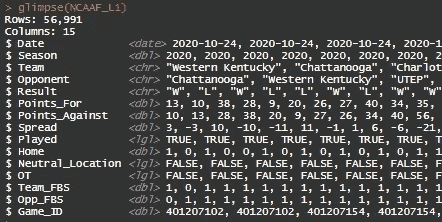

**注:**每款游戏上市上市两次。一次是主队列为**队**，一次是主队列为**对手**。即使游戏被列出两次，它们也会有相同的 **Game_ID** ，这是每个游戏的唯一标识符。这种结构使得计算每个团队的评分更容易，我们将在整个教程中看到。

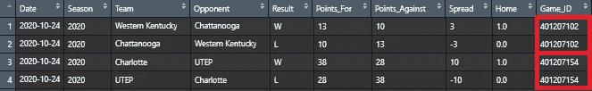

**NCAA _ L1 _ 团队**数据集包含一个超过 500 个团队的列表和一个虚拟变量 **FBS** ，如果团队在 FBS 中，该变量为 1，否则为 0。

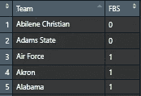

# 设置数据

为了进行预测，我们需要一个排名系统。Elo 是国际象棋中使用的排名系统，很容易实现。它只是根据一个队的输赢来奖励或扣分，而排名的变化是基于一个队的对手的相对实力。因此，如果一个排名高的球队击败了一个排名低的球队，两个排名都不会有太大的变化，因为这是预期的结果。然而，如果排名低得多的球队获胜，两支球队都将经历巨大的变化，以反映这种沮丧。

为了实现这个系统，首先我们需要添加两个变量 **ELO** 和**奥普 _ELO** 到 **NCAA_L1** 数据集。我们将两者都初始化为 0，当我们运行排序算法时，这些值将被覆盖。

我们还需要将**结果**列转换成数值。

接下来，我们需要将 ELO 列添加到数据集中。该数据集将作为每个团队当前评级的数据库。如果团队是 FBS，我们将初始化为 1500，如果不是，我们将初始化为 1200。

我们需要把没玩过的游戏和玩过的游戏分开。我们将用下面的 **filter()** 函数将即将到来的游戏保存在一个名为**NCAAF _ L1 _ 未来**的变量中。

现在我们将只选择在原始 **NCAAF_L1** 数据集中玩过的游戏。我们还需要按照**日期**和**游戏 ID 对数据集进行排序。**数据集按日期排序非常重要，这样 Elo 排名系统才能按时间顺序应用排名。

**创建 Elo 排名**

我们首先遍历 **NCAAF_L1** 数据集中的所有行。然而，我们只想在第**行是奇数**行时执行排名更新，因为，记住，在这个数据集中每场比赛都是双倍的。

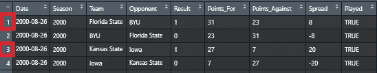

L1 NCAAF 的前两场比赛

循环后的第一行是一个 **if 语句**，以确保排名系统仅在 **i** 为奇数时更新。即使我们只在 **i** 为奇数时执行排名更新，我们也会通过用 **i+1** 对偶数行进行子集化来同时更新它们。

在循环内部，我们需要做的第一件事是将两个团队存储到变量 **Team_A** 和 **Team_B、**中，并将每个团队的结果存储到变量 **Result_A** 和 **Result_B.**

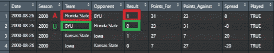

然后我们将当前 Elo 排名从 **NCAAF_L1_Teams** 数据集加载到 **ELO_A** 和 **ELO_B** 中。

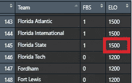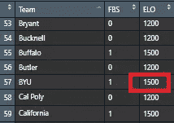

为了重新创建每个团队的 Elo 历史，我们需要将排名添加回**NCAA L1**数据集。

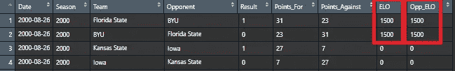

我不打算解释 Elo 的每个组件，但如果您感兴趣，这里有一个来源:

[https://metinmediamath . WordPress . com/2013/11/27/how-to-calculate-the-elo-rating-including-example/](https://metinmediamath.wordpress.com/2013/11/27/how-to-calculate-the-elo-rating-including-example/)

否则，我们可以运行下面的代码来更新每个团队的 Elo:

最后，用每个团队的新 Elo 更新 NCAAF _ L1 _ 团队数据集。

for 循环中的完整代码如下:

# 查看前 25 名排名

# 创建差价和盈利百分比模型

首先，我们需要在 **NCAAF_L1** 数据集中创建一些变量来建立模型。我们将把 **ELO** 和**奥普 _ELO** 重新转换为数字变量，以确保不会出现任何错误。然后我们再加上 **Elo_Difference** ，顾名思义，就是两队排名之差。这将是我们模型中的主要变量。

我们可以简单地通过比较 Elo 来简单地了解排名系统预测比赛的效果。为此，我们将创建一个变量 **Elo_Forecast_Pred** ，如果 **Elo** 大于 **Opp_Elo** ，我们将预测结果为赢。如果我们创建一个变量 **Elo_Forecast_Result** ，如果预测准确，我们可以通过将 1 放入其中来评估排名系统的准确性。

以下片段看了 Elo 排名对 2019 赛季的预测:

它预测游戏的 **~72%** 。考虑到我们只处理高水平的赢/输数据，这是非常好的。

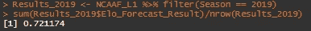

**采用线性回归的价差模型**

为了预测价差，我们将使用 **lm()** 函数来构建一个回归模型。我们将使用 **Elo_Difference** 和 **Home** 来预测 **Spread** ，我们将过滤 2013 至 2018 赛季的数据集。

一旦建立了模型，我们就可以通过使用 **predict()** 函数预测已经发生的游戏的价差来对其进行回溯测试。

**使用逻辑回归的获胜百分比**

为了预测获胜概率，我们将使用 **glm()** 函数。这类似于 **lm()** ，但是在如何运行我们的模型上给了我们更多的选择。我们将再次使用 **Elo_Difference** 和 **Home** ，但我们将预测**结果。**我们还需要将**族**设置为**二项式**，这样模型就知道它预测的是一个二进制结果(结果要么是 1，要么是 0)。这一次，为了预测结果，我们必须将**类型**参数设置为**响应**，这给了我们一个百分比估计值。另一种思考方式是，我们正在计算**结果**等于 1 的概率。

以下代码评估模型的准确性:

我们通过添加 **Home** 变量对天真的 Elo 方法进行了轻微的改进，现在可以准确预测游戏的 **~73%** 。

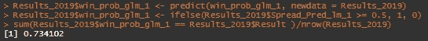

# 预测即将到来的游戏

我们已经创建了一个**NCAAF _ L1 _ 未来**数据集，其中包含了数据集中所有尚未进行的游戏。让我们筛选下一周的数据集，并将该数据集称为 **NCAAF_This_Week** 。截至本文撰写之时，该时间段为 2020 年 11 月 1 日至 2020 年 11 月 8 日。

该数据集不会有更新的 Elo 排名，因此我们需要确保它具有用于构建两个模型的相同列。要做到这一点，我们需要在对日期进行过滤后，选择下面代码中的变量:

我们需要将包含各队当前 Elo 排名的**NCAAF _ L1 _ 团队**数据集加入 **NCAAF_This_Week** 数据集两次。一次带来**团队**排名，一次带来**对手**排名。

现在我们可以为即将到来的游戏计算 **Elo_Difference** 。

我们可以将分布和获胜概率模型应用到新的数据集，为我们提供所有即将到来的游戏的预测。

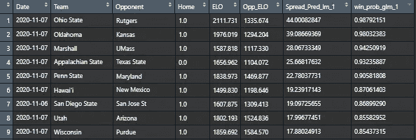

在这个例子中，我们可以看到俄亥俄州本周的获胜概率最高，为 98.7%，预计将以 44 个百分点的优势获胜。

感谢阅读！