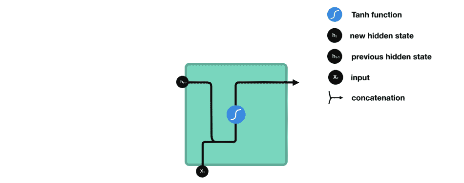

# 用递归神经网络预测比特币价格

> 原文：<https://levelup.gitconnected.com/predicting-bitcoins-price-with-recurrent-neural-networks-a27b4d2d839>


来源:https://cnbc.com

谁没听说过世界上最著名的数字货币，十年加密货币？没错，我说的是 [**比特币**](https://bitcoin.org/en/) 。所有人都在谈论比特币，谈论它创纪录的高价会发生什么，包括著名的金融品牌 [**摩根大通**](http://www.jpmorganchase.com) 和 [**摩根士丹利**](https://www.morganstanley.com) 。根据 CoinDesk 20 的数据，今年比特币在 2021 年 3 月报出了 61，556.59 美元的历史最高价格。

最大的问题当然是，这笔神奇货币的价格会发生什么变化。这是一个没有人有确定答案的问题，因为预测比特币或实际上任何其他金融工具的准确价格几乎是不可能的。然而，我们能做的是使用**数据科学**技术来高精度地预测比特币价格，这正是我们在本文中要做的。我们将建立一个**深度学习**模型，利用比特币的历史数据来预测其价格。

在本文结束时，您将了解到:

*   深度学习
*   数据预处理
*   比特币价格预测模型评估

# 关于比特币

[比特币](https://www.investopedia.com/terms/b/bitcoin.asp)在互联网上提供一种高效的货币交易，由一个拥有一套透明规则的去中心化网络控制，是央行控制的法定货币的替代物。这种加密货币背后的关键技术是 [**区块链**](https://www.blockchain.com) 现象，这是一个不断增长的记录列表(*块)*使用加密技术链接，其中每个块包含前一个块的加密哈希、时间戳和交易数据。


来源:ShamLatech

通过设计，区块链不能被修改，因为一旦它被记录，任何给定块中的数据在没有修改所有随后的[块](https://www.wikipedia.org)的情况下不能被修改。因此，单个块中的任何更改都将使区块链中的所有后续块无效，这显然表明原始数据已被操纵。

# 比特币历史价格数据

为了训练我们的定价模型，我们使用比特币在 2016-2020 年期间报告的公开价格数据，从 [**雅虎财经**](https://finance.yahoo.com) 下载的 5 年金融数据。为了评估我们的模型，我们使用了 2021 年 1 月至 2021 年 3 月期间的比特币价格数据。我们使用该模型预测这一时期的比特币价格，并将其与实际价格进行比较，以了解该模型预测价格的能力有多强。


2016 年至 2020 年期间的比特币价格

## 数据预处理

**步骤 1:** **归一化**我们的模型基于具有 LSTM 层的 RNN，其使用 Sigmoid 激活函数将输入向量转换为具有值在范围[0，1]内的条目的向量。因此，我们使用归一化来缩放模型特征，假设分母始终大于分母，则输出值将始终为 0 到 1 之间的数字。


向量的归一化

```
from sklearn.preprocessing import MinMaxScalersc = MinMaxScaler(feature_range=(0,1))
training_set_scaled = sc.fit_transform(training_set)
```

**第 2 步:数据转换**对于 RNN，我们假设模型需要回到过去的时间周期数，以了解当前时间周期。鉴于一个月通常有 30 天，3 个月，即 90 天，时间周期似乎是一个合理的假设，让我们的 RNN 模型从过去的比特币价格中学习。因此，对于每个价格，X_train 将包含过去 60 天的比特币价格，Y_train 将是当天的比特币价格，这适用于所有时间段。


90 天时间步长的 RNN 数据转换

```
import numpy as npX_train = []
y_train = []
X_test  = []for i in range(90,training_set_scaled.size):
    X_train.append(training_set_scaled[i-90:i, 0])
    y_train.append(training_set_scaled[i, 0])
X_train, y_train = np.array(X_train), np.array(y_train)for i in range(90,inputs.size):
    X_test.append(inputs[i-90:i, 0])
X_test = np.array(X_test)
```

**第三步:塑造数据**为模型增加额外维度，允许使用额外指标帮助预测价格(如引起公众焦虑的外部事件)。通过这种方式，我们将数据从 2D 转换到 3D。

```
X_train = np.reshape(X_train, [X_train.shape[0], X_train.shape[1], 1])
X_test = np.reshape(X_test, [X_test.shape[0], X_test.shape[1], 1])
```

**在此下载比特币训练和测试数据:**[https://github . com/tatev Karen/recurrent-neural-network-stock-price-prediction/tree/main/bit coin _ Data](https://github.com/TatevKaren/recurrent-neural-network-stock-price-predicition/tree/main/bitcoin_data)

# 深度学习

[**深度学习**](https://en.wikipedia.org/wiki/Deep_learning) 背后的整个想法是模仿人类大脑的功能能力。如果人工神经网络 [(ANNs)](https://en.wikipedia.org/wiki/Artificial_neural_network) 负责长期记忆，就像我们大脑的颞叶，如果卷积神经网络([CNN](https://en.wikipedia.org/wiki/Convolutional_neural_network))负责图像识别和视觉解释，就像我们大脑的枕叶，那么递归神经网络( [RNNs](https://en.wikipedia.org/wiki/Recurrent_neural_network) )负责短期记忆，就像我们大脑的额叶。


资料来源:昆士兰州卫生部

## 递归神经网络

一方面，信息从输入层流向输出层，另一方面，计算出的误差通过网络反向传播以更新权重。与 ANN 和 CNN 不同，在 RNN 的例子中，隐藏层不仅给出一个输出，还能自我反馈。


RNN 所做的是将提供的输入特征翻译成机器可读的向量。然后，系统逐个处理这个向量序列中的每一个向量，按顺序从第一个向量移动到下一个向量。在处理过程中，系统通过隐藏状态(内存状态)将信息传递到该序列的下一步。


[资料来源:迈克尔·菲](https://towardsdatascience.com/illustrated-guide-to-lstms-and-gru-s-a-step-by-step-explanation-44e9eb85bf21)

一旦隐藏状态从前面的步骤中收集了系统中的所有现有信息，它就准备好移动到下一个步骤，并将该信息与当前步骤的输入(xt)相结合，以形成新的信息向量。



[来源:迈克尔·菲](https://towardsdatascience.com/illustrated-guide-to-lstms-and-gru-s-a-step-by-step-explanation-44e9eb85bf21)

## **长短期记忆(**[](https://en.wikipedia.org/wiki/Long_short-term_memory)****)****

**当训练 RNN 模型时，在优化过程期间，在非常初始的时期，权重是随机选择的值，并且在这些选择的值非常小的情况下，将它们多次乘以相同的循环权重，梯度变得越来越小，并且在某个点上梯度消失。然后，梯度越低，就越难更新权重，这意味着优化过程将越慢。**

**此外，存在多米诺效应，一个不正确更新的权重会影响剩余权重的计算，并使它们不准确，因为所有权重都是相关的。这个问题在 RNNs 中被称为**消失梯度问题**和**长时短时记忆(**[**LSTMs**](https://en.wikipedia.org/wiki/Long_short-term_memory)**)**正在解决 RNNs 的这个问题。通常的 RNN 和 LSTM 之间的区别是在特定步骤中对传递的信息和输入值执行的一组操作。LSTMs 中的信息流经其入口:**

*   ****遗忘门:** *决定哪些信息应该丢弃或保留的门***
*   ****输入门:** *更新单元状态的门***
*   ****小区状态:** *将小区状态更新为网络发现相关的新值的门***
*   ****输出门:** *一个决定下一个隐藏状态应该是什么的门***

# **构建比特币定价模型**

**目标是预测股票价格，这是一个连续的输出值，因此我们有一个回归而不是分类问题。我们将该回归器初始化为具有连续层的对象，为此我们使用来自[**Keras**](https://keras.io)**的*连续*模块，该模块允许创建具有连续层的神经网络对象。然后，我们添加 LSTM 层，考虑到预测金融产品的价格是一项非常复杂的任务，我们希望有一个能够捕捉股价涨跌趋势的高维度模型，因此我们在每个 LSTM 层使用大量 LSTM 单位，并使用多个 LSTM 层。此外，我们添加了一个*脱落*层，用于正则化以忽略 LSTM 层中的部分神经元。最后，我们使用*密集*模块添加一个输出层****

```
**from keras.models import Sequential
from keras.layers import Dense
from keras.layers import LSTM
from keras.layers import Dropoutregressor = Sequential()# LSTM layer 1
regressor.add(LSTM(units = 50, return_sequences=True, input_shape = (X_train.shape[1], 1)))
regressor.add(Dropout(0.2))# LSTM layer 2,3,4
regressor.add(LSTM(units = 50, return_sequences=True))
regressor.add(Dropout(0.2))
regressor.add(LSTM(units = 50, return_sequences=True))
regressor.add(Dropout(0.2))
regressor.add(LSTM(units = 50, return_sequences=True))
regressor.add(Dropout(0.2))
regressor.add(LSTM(units = 50, return_sequences=True))
regressor.add(Dropout(0.2))# LSTM layer 5
regressor.add(LSTM(units = 50))
regressor.add(Dropout(0.2))# Fully connected layer
regressor.add(Dense(units = 1))# Compiling the RNN
regressor.compile(optimizer = 'adam', loss = 'mean_squared_error')#Fitting the RNN model
regressor.fit(X_train, y_train, epochs = 120, batch_size = 32)**
```

# ****比特币定价模型预测****

****一旦定价模型得到训练，我们就将其与测试数据结合使用，以生成测试期(2021 年 1 月至 2021 年 3 月)的比特币价格预测，然后与同一时期报告的真实比特币价格进行比较。****

****我们可以看到，基于多个 LSTM 层的 RNN 模型能够正确预测上涨和下跌趋势，因为我们看到，对应于预测比特币价格的蓝线与对应于实际比特币价格的黄线遵循相同的模式。****

********

```
**import matplotlib.pyplot as pltpredicted_stock_price= regressor.predict(X_test)
predicted_stock_price= sc.inverse_transform(predicted_stock_price)plt.plot(real_stock_price, color = '#ffd700', label = "Real Price January - March 2021")
plt.plot(predicted_stock_price, color = '#4782B4', label = "Predicted Price January - March 2021")
plt.title("Bitcoin Price Prediction")
plt.xlabel("Time")
plt.ylabel("Bitcoin Price")
plt.legend()
plt.show()**
```

## ****资源****

******代码**:[https://github . com/tatev Karen/recurrent-neural-network-stock-price-prediction/blob/main/bit coin _ Pricing _ model . py](https://github.com/TatevKaren/recurrent-neural-network-pricing-model/blob/main/Bitcoin_Pricing_Model.py)****

******数据**:[https://github . com/tatev Karen/recurrent-neural-network-stock-price-prediction/tree/main/bit coin _ Data](https://github.com/TatevKaren/recurrent-neural-network-stock-price-predicition/tree/main/bitcoin_data)****

******RNN 的谷歌股票定价模型**:[https://github . com/tatev Karen/recurrent-neural-network-price-prediction](https://github.com/TatevKaren/recurrent-neural-network-stock-price-predicition)****

******人工神经网络客户流失预测模型:**[https://github . com/tatev Karen/artificial-neural-network-business _ case _ study](https://github.com/TatevKaren/artificial-neural-network-business_case_study)****

******CNN 的图像识别模型:**[https://github . com/tatev Karen/convolutionary-neural-network-Image _ Recognition _ case _ study](https://github.com/TatevKaren/convolutional-neural-network-image_recognition_case_study)****

# ****如果你喜欢这篇文章，这里有一些你可能喜欢的其他文章:****

****[](https://towardsdatascience.com/fundamentals-of-statistics-for-data-scientists-and-data-analysts-69d93a05aae7) [## 数据科学家和数据分析师的统计学基础

### 数据科学或数据分析之旅的关键统计概念

towardsdatascience.com](https://towardsdatascience.com/fundamentals-of-statistics-for-data-scientists-and-data-analysts-69d93a05aae7) [](https://towardsdatascience.com/simple-and-complet-guide-to-a-b-testing-c34154d0ce5a) [## 简单完整的 A/B 测试指南

### 为您的数据科学实验进行端到端 A/B 测试，面向非技术和技术专家，提供示例和…

towardsdatascience.com](https://towardsdatascience.com/simple-and-complet-guide-to-a-b-testing-c34154d0ce5a) [](https://towardsdatascience.com/monte-carlo-simulation-and-variants-with-python-43e3e7c59e1f) [## 蒙特卡罗模拟和 Python 变种

### 蒙特卡洛模拟指南，必须了解 Python 实现的统计抽样技术

towardsdatascience.com](https://towardsdatascience.com/monte-carlo-simulation-and-variants-with-python-43e3e7c59e1f) [](https://towardsdatascience.com/how-to-crack-spotify-data-science-technical-screen-interview-23f0f7205928) [## 如何破解 Spotify 数据科学技术屏面试

### 要了解 Spotify 技术屏幕，您应该知道的确切 Python/SQL 命令和实验主题列表

towardsdatascience.com](https://towardsdatascience.com/how-to-crack-spotify-data-science-technical-screen-interview-23f0f7205928) [](https://tatev-aslanyan.medium.com/bias-variance-trade-off-in-machine-learning-7f885355e847) [## 机器学习中的偏差-方差权衡

### 机器学习和统计模型中偏差-方差权衡的介绍

tatev-aslanyan.medium.com](https://tatev-aslanyan.medium.com/bias-variance-trade-off-in-machine-learning-7f885355e847) [](https://tatev-aslanyan.medium.com/data-sampling-methods-in-python-a4400628ea1b) [## Python 中的数据采样方法

### 使用不同的数据采样技术创建 Python 中的随机样本的现成代码

tatev-aslanyan.medium.com](https://tatev-aslanyan.medium.com/data-sampling-methods-in-python-a4400628ea1b) [](https://medium.com/analytics-vidhya/pyspark-cheat-sheet-big-data-analytics-161a8e1f6185) [## PySpark 备忘单:大数据分析

### 这里是基本 PySpark 命令和函数的备忘单。在 PySpark 中开始您的大数据分析。

medium.com](https://medium.com/analytics-vidhya/pyspark-cheat-sheet-big-data-analytics-161a8e1f6185) 

***感谢阅读***

*我鼓励你* [***加入 Medium today***](https://tatev-aslanyan.medium.com/membership) *拥有* *完整访问所有跨媒体发布的伟大锁定内容，并在我的 feed 上发布关于各种数据科学、机器学习和深度学习主题的内容。*

*关注我* [***中***](https://medium.com/@tatev-aslanyan)**阅读更多关于各种数据科学和数据分析主题的文章。更多机器学习的动手应用，数学和统计概念查看我的*[***Github***](https://github.com/TatevKaren)**账号。
我欢迎反馈，可以联系*[***LinkedIn***](https://www.linkedin.com/in/tatev-karen-aslanyan/)*。***

*****快乐学习！*********