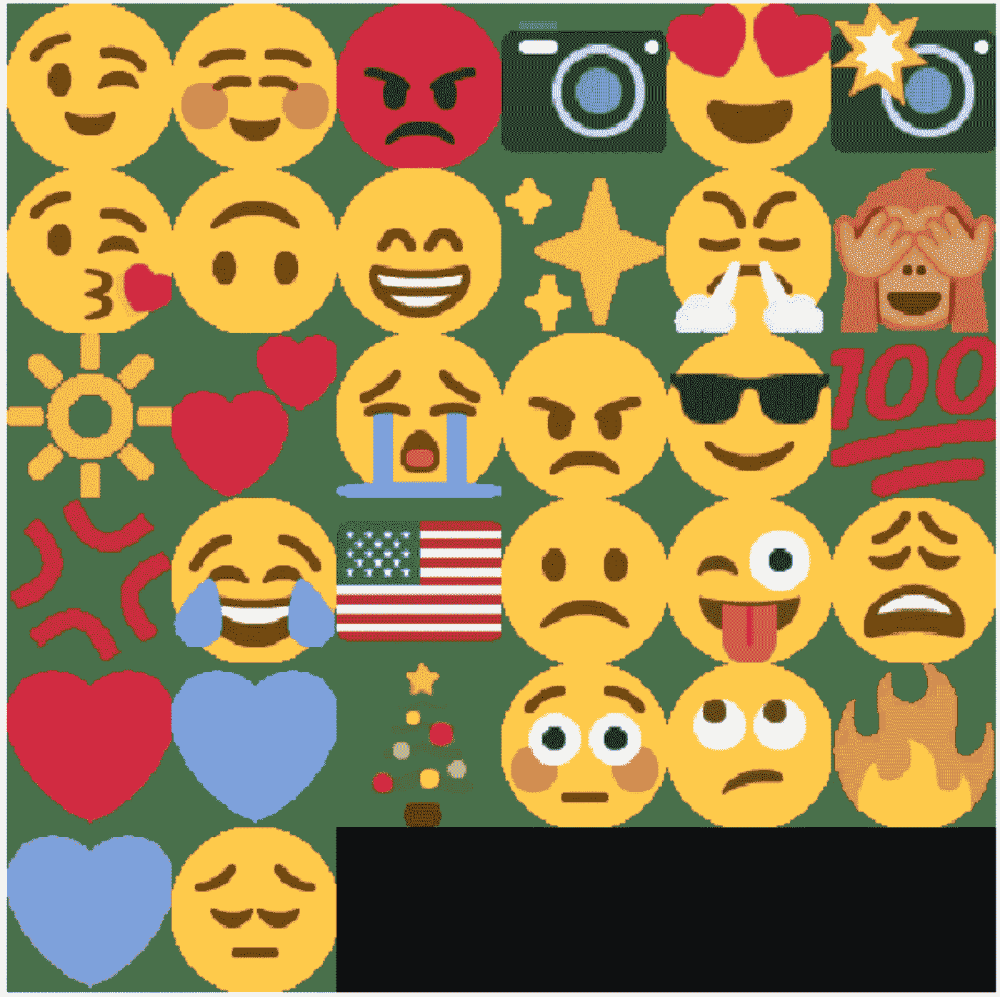
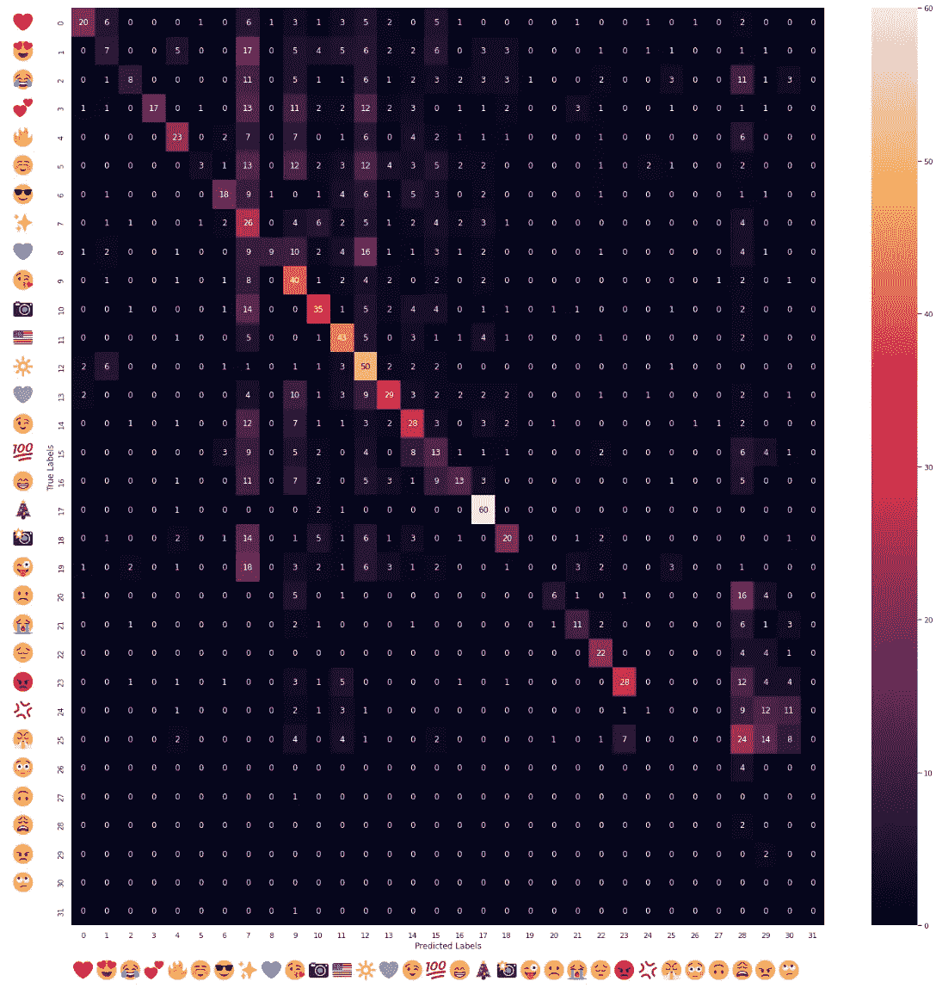
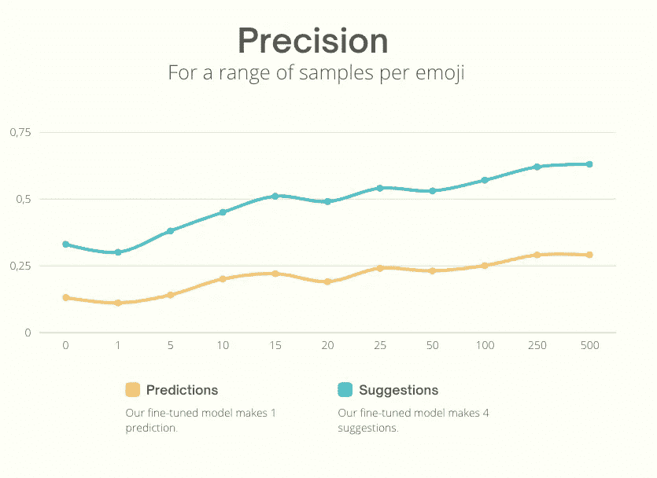
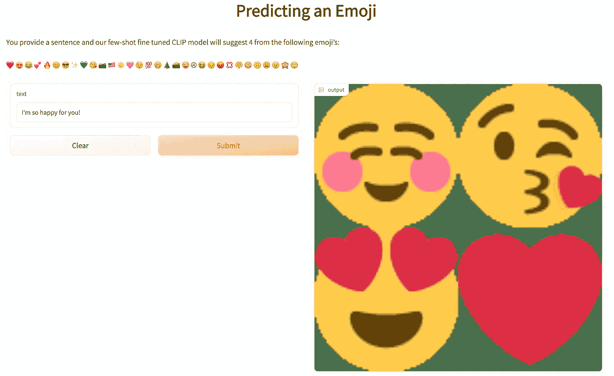

# 借助 OpenAI 预测表情符号

> 原文：<https://levelup.gitconnected.com/predicting-emojis-with-the-help-of-openai-331a3a91f27b>

## 我如何使用 OpenAI 的 CLIP 深度学习模型来预测给定推文的表情符号。检查有无训练数据的表现，并亲自与模型打交道！

我们数据集中的 32 个表情符号。

表情符号是一种给句子带来情感的方式。由于表情符号是图像，
我想知道 Open AI 的 CLIP 模型预测一条推文的表情符号有多好。我们从预测表情符号的片段开始。后来，我们对每个表情符号的 1、5…多达 500 个样本进行微调。

> 向下滚动到**试用型号**！👇
> 对**码感兴趣？**留下评论直接联系我！

# 🤖—什么是 CLIP？

[OpenAI 的 CLIP](https://openai.com/blog/clip/) (对比语言-图像预训练)是在互联网上找到的 4 亿个图像-描述组合上进行训练的，擅长选择最能描述一句话的图像。

**CLIP 与**不同，因为它采用两种数据格式作为输入:语言和图像。而“传统方法”使用一种类型的数据格式；文本、图像或音频…

采用两种或两种以上数据格式或模态作为输入的模型也被称为*多模态模型*。

# 🧑‍🔬—有什么新内容？

网上很多模型都试图根据一句话来预测一个表情符号。表情符号是一个标签，由一个数字描述，而不是表情符号的图像。

这种方法的新特点是我们给了模型文本和表情图像。它将试图找到文本和图像中的模式，并将它们结合起来，找出最能描述文本中情感的表情符号。

# 📈—数字

*   没有微调的情况下，CLIP 有多好？
*   有几个样本呢？
*   我们能走多远？

## 在我们开始之前…

我们使用 **precision** 作为模型性能的 KPI。精度是介于 0 和 1 之间的数字，其中 0 表示所有预测都是错误的，1 表示所有预测都是正确的。

我们用于微调的 [**数据集**](https://huggingface.co/datasets/vincentclaes/emoji-predictor) 有两列；

*   有原始推文的专栏；
*   带有数字的标签列，该数字连接到表情符号的图像。

与标签编号相对应的图像可以在这里找到[。](https://public-assets-vincent-claes.s3.eu-west-1.amazonaws.com/emoji-precitor/emojis.zip)

## 零射击学习

我们从架子上取下[剪辑预训练模型](https://huggingface.co/openai/clip-vit-base-patch32)，并将其应用于[测试数据集](https://huggingface.co/datasets/vincentclaes/emoji-predictor/viewer/vincentclaes--emoji-predictor/test)。这被称为“零射击”学习，因为我们没有采取任何训练数据来微调剪辑。

**1 预测**
通过零镜头学习，我们得到预测正确表情符号的精度为 0.13。相比之下，随机选择一个表情符号的精度为 1/32 或 0.0325。不错吧？

下面是一个片段，展示了如何使用 zero-shot 进行预测:

由于对于一条推文的正确表情符号可能存在一些困惑，我也尝试提出了 4 条建议。如果 4 个建议中有一个与标签相同，我认为这是一个有效的预测。

当提供 4 个建议时，我们得到的精度是 0.33，其中4/32 或 0.12 是随机选择 4 个建议的精度。

下面你会看到这些建议的混乱矩阵。对角线上的瓷砖越亮，我们的模型对表情符号的预测就越好。

用于建议表情符号的混淆矩阵(精度为 0.33)。

> 我们从中学到了什么？
> 
> CLIP 无需从数据集中学习模式，就可以识别推文中的情绪，并将其分配给正确的表情符号。CLIP 在如此大量的图像-标题组合上进行了预训练，看起来它学会了识别快乐或悲伤的推文，并可以识别表情图像中的这些情绪。

## 少拍和多拍

如果我们让 CLIP 有机会学习我们数据集中的模式会怎么样？我们获取训练数据集，并逐步向片段提供数据。

在零射击旁边，你有“一次射击”和“几次射击”学习，这意味着你在一个或几个样本上训练。
我们从 1 个样本开始微调，逐渐将样本增加到 5 个、10 个、15 个……每个表情符号最多 500 个。

*   我们用的是原始推文(不清洗)；
*   不调音；
*   批量大小为 32，因为我们有 32 个表情符号；
*   训练了 4 个时代。

下图显示了一系列样本的预测和建议的精确度:

每个表情符号的一系列样本的预测和建议的精确度。

*   😅1 次拍摄比 0 次拍摄效果差。
*   🚀从 5 个样本开始，精确度开始上升。
*   ⚠️:在 15 个样本中，建议值开始稳定在 0.51。
*   🐌精度逐渐增加到最大值 0.63。

# 📢—带走

在看不到任何训练数据的情况下，CLIP 已经表现得很好了。它可以识别句子中的情绪，并将其与表情符号联系起来。

微调 CLIP 进一步提高了性能，每个表情符号只有 15 个样本，性能显著提高。

这很好，因为组装一个小数据集相对便宜！像 CLIP 这样的深度学习神经网络可以为没有任何或没有大量数据进行训练，或者没有资源收集大量训练数据的企业普及人工智能。

如果你想推荐图像、图画或绘画等视觉效果，CLIP 是一个很好的开始。如果你需要帮助，你可以[联系我](https://www.linkedin.com/in/vincent-claes-0b346337/)。

## ⚡️Try 自己拿出了模型！

【https://huggingface.co/spaces/vincentclaes/emoji-predictor】→****↓****

****

**我的 huggingface 空间上 gradio 应用程序的标题。**

# **链接**

*   **型号:[https://huggingface.co/vincentclaes/emoji-predictor](https://huggingface.co/vincentclaes/emoji-predictor)**
*   **数据集:[https://hugging face . co/datasets/Vincent claes/e moji-predictor](https://huggingface.co/datasets/vincentclaes/emoji-predictor)**

# **文森特·克拉斯**

**👋在 [Medium](https://medium.com/@vincentclaes_43752) 、 [Linkedin](https://www.linkedin.com/in/vincent-claes-0b346337/) 和 [Twitter](https://twitter.com/VincentClaes1) 上关注我，阅读更多关于 ML 工程和 ML 管道的内容。**

## **来源**

*   **[1]:打开艾的剪辑首页:[https://openai.com/blog/clip/](https://openai.com/blog/clip/)**
*   **[2]:文章描述剪辑:[https://towards data science . com/open ais-Dall-e-and-CLIP-101-a-brief-introduction-3a 4367280 d4e](https://towardsdatascience.com/openais-dall-e-and-clip-101-a-brief-introduction-3a4367280d4e)**
*   **[3]:什么是精度:[https://developers . Google . com/machine-learning/crash-course/classification/precision-and-recall](https://developers.google.com/machine-learning/crash-course/classification/precision-and-recall)**