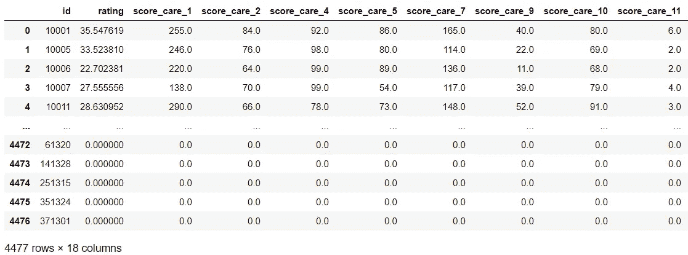
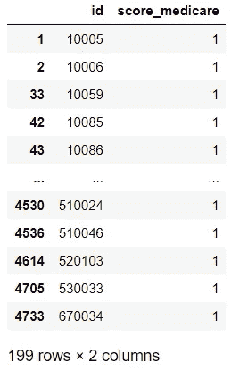
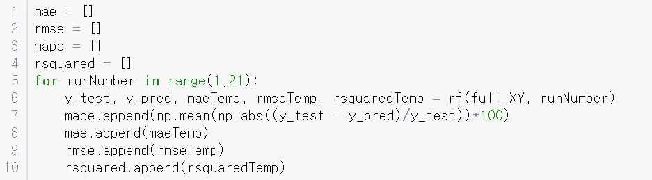

# 用随机森林回归预测医院得分

> 原文：<https://levelup.gitconnected.com/predicting-hospital-scores-with-random-forest-regression-9108b8ac666f>

所有代码在 https://github.com/seho0808/rf_hospital_medium[整齐地归档](https://github.com/seho0808/rf_hospital_medium)

您可以自由地复制和使用本文中我的任何代码。

# 一、这篇文章讲的是什么？

> *假设您正在尝试选择一家离您最近的医院。你在谷歌地图上看到三家医院，但其中只有一家有评级。你会怎么做？*

这篇文章主要基于我的医院评级预测模型，该模型来自于由 Booze Allen Hamilton 赞助的弗吉尼亚理工大学的数据竞赛。这个分析获得了第三名。

从本文中，您可以了解到:

1.  如何通过 Scikit-Learn 库使用和调整 Random Forest。
2.  大型数据集的特征提取和数据清洗的基本示例。我们将合并许多包含具有相同医院 id 的解释变量(X)的文件。
3.  医疗保健行业使用机器学习的一个例子。

如果你想要第一条，我推荐你阅读第二和第四部分。

如果你想要第二个，我推荐你阅读第二和第三部分。

# 二。资料组

所有的数据集都来自 https://data.medicare.gov/data/hospital-compare。使用的文件列表包括:

```
Hvbp_tps_11_07_2017.csvHvbp_hcahps_11_07_2017.csvTimely and Effective Care — Hospital.csvMedicare Hospital Spending per Patient — Hospital.csvOutpatient Imaging Efficiency — Hospital.csvPayment and Value of Care — Hospital.csvComplications and Deaths — Hospital.csvAmbulatory Surgical Measures-Facility.csvReadmission Reduction.csvHealthcare Associated Infections — Hospital.csv
```

我们将尝试预测分数的两个度量。它们是列`total_performance_score`和`overall_hospital_performance_rating`。这两个小节分别来自`Hvbp_tps_11_07_2017.csv`和`Hvbp_hcahps_11_07_2017.csv`。我们将使用**所有其他数据集**作为我们的预测变量，用于预测 Y 变量，在本例中是`total_performance_score`和`overall_hospital_performance_rating` 。

由于我们想要预测两个不同的度量，**我们需要运行两个独立的随机森林**模型。为了更容易理解，我们将重点预测`total_performance_score` *。*姑且把这个措施简称为`tps`。这两种方法的结果将在后面的结论部分给出。

那么我们要如何预测`tps`？先来先睹为快`Hvbp_tps_11_07_2017.csv` 数据集。


“Hvbp_tps_11_07_2017.csv”的前五行

您可以看到数据集给出了提供者编号，即医院 ID。我们将使用这个列作为**枢纽列，**，这意味着我们将使用医院 ID 合并不同的数据集。我们还可以在最右边的一栏中找到总绩效分数，如下所示。你可以看到以 35.54 开始的列…这个列恰恰是我们将要尝试预测的`tps` 列。


“Hvbp_tps_11_07_2017.csv”的前五行

下面是另一个数据集的前五行，我们将使用它来提取**预测变量**，也称为**解释变量**。注意，其他数据集也有类似命名的列，在第一列上表示医院 id。


前五行“及时有效的护理— Hospital.csv”

这里需要注意的重要一点是，每个数据集都有不同的评分方法。让我们以及时有效的护理数据集为例。下图和上图显示了相同的行但不同的列。从上面可以看到，有多行具有相同的医院 id。有多行是因为有许多衡量医院及时有效护理的指标。看下图。列`measure_id`告诉我们`score`列指的是哪个得分指标。例如，此处医院 ID 10001 的 ED1 测量值为 255，ED2 测量值为 84。


事实上，对于这个数据集，似乎有 21 种独特的方法来评价医院及时有效的护理。如果有十家医院，将有 210 行。我们将在第三节中尝试合并来自不同数据集的所有这些不同的度量。然后，我们将使用合并后的数据集训练我们的随机森林模型来预测我们的 Ys。我们后来在合并的数据集中得到了 101 列，这些都是来自各种评估医院的方法。


用于及时有效护理的唯一测量 id

# 三。特征提取/数据清理

这部分相当繁琐，因为有很多列需要合并。然而，我没有包括执行这个过程的所有代码，所以浏览这一部分应该相对容易。代码都在我的 GitHub 库中，就在本文标题的下面。

让我们从提取*m*的特征开始这个文件包含了每家医院的及时有效的护理措施，有 21 种不同的措施。


21 种不同的措施与 TPS

上图显示了每个不同的测量值与`tps`测量值的对比。看一眼就知道几乎没有一个是线性特征。我们可以在多维空间中对数据进行聚类，以执行线性/非线性回归，但我们在这里将使用随机森林方法。许多其他机器学习算法也将对该数据集执行。无论如何，如果我们回头看上面的图，我们可以看到一些功能是无用的，以至于它们可能对我们的模型有害。随机森林模型会忽略不提供信息的列，但是无用的特征仍然会增加模型知道它们无用的计算时间。因此，我们不会从一开始就包含无用的特性。


删除无用的列

从支线剧情中，我们看到第三支线剧情(在支线剧情矩阵中的(1，3)处的剧情)显示了一条直线。这说明了什么？直线意味着所有的 x 值都是常数。其实所有的值都是零。因此，我们将从数据集中删除这个无用的列。我们还排除了以下位置的其他测量值:(2，1)、(2，3)、(3，5)、(5，1)。子情节是从左到右、从上到下录制的，所以按小节顺序分别是 6、8、15、21。我们说这些措施没用，是因为大部分点都是零。它们提供的信息少得多，对我们的模型几乎没有帮助。这些措施几乎不会减少我们的模型后来的残差。删除无用的列后，full_XY 合并数据集中现在只剩下有用的列，如下所示。



“full_XY”数据集

我们现在转向一个新的数据集。现在我们来看一下`Medicare Hospital Spending per Patient — Hospital.csv`数据集。



医疗保险数据集已清理

只有 199 家医院可用于医疗保险数据，并且只有一种评分方法。我们忽略了整个数据集。

对于大多数其他数据集，我们执行与及时有效的护理数据相同的程序。我们提取有用的特征，并将它们合并到主数据集中。

一个例外是`Ambulatory Surgical Measures-Facility.csv`数据集。我们必须忽略整个数据集，因为它的医院 id 和名称与其他数据集不匹配。

最后一步，我们将清理后的数据集作为新的。csv 文件。


# 四。随机森林模型的拟合与调整

# 拟合随机森林模型

构建模型的代码在 GitHub 的一个单独的 Jupyter 笔记本文件中。我强烈建议你先看看 GitHub 中的原始文件。我们将使用已经调整的参数来拟合随机森林模型。我将在本节的后面告诉您更多关于调优的内容。


使用 Scikit-Learn 的随机森林函数

我们将为随机森林的一次运行定义我们的函数。第 4 行和第 5 行将所有解释变量划分为 X，将我们试图预测的列划分为 y。这是第 9 行的一行代码。我们设置`test_set=0.05`，这意味着 95%的数据将是训练数据，5%将是测试数据。由于我们随机设置了`random_state`，所以每次运行都会形成不同的训练和测试数据子集。然而，你可以通过设置一个额外的`shuffle=false`选项来关闭`random_state`，这将完全忽略你在`random_state`选项中输入的任何内容。保持一定数量的`random_state`(即`random_state = 5`)可以让你随机洗牌，但是每次运行都保持顺序。


从上图中截取的第 11~15 行

从第 11 行到第 15 行，我们建立一个模型并预测我们的测试集。`max_depth` 参数限制所有决策树的深度。`n_estimator` 参数设置我们要从多少棵决策树中进行打包。这里我将重点介绍参数的调整。如果你不了解随机森林的基础知识，[https://towardsdatascience . com/understanding-Random-Forest-58381 e 0602d 2](https://towardsdatascience.com/understanding-random-forest-58381e0602d2)是了解基础知识的绝佳来源。

预测完我们的测试集后，我们用预测值(橙色)、实际值(蓝色)和误差值(绿色)构建一个图，如下图所示。


预测数字完全是随机的，以防你们任何人担心。然而，运行一次模型是不够的。我们必须做交叉验证。有些人认为我们不需要对随机森林进行交叉验证，但我强烈建议这样做，因为我们的训练/测试分割数据中可能存在偏差。



自举 20 次

对于这个例子，我们将不使用 k-fold 交叉验证，但是我们将使用 bootstrapping。他们的结果几乎相似，但唯一的区别是交叉验证耗尽了数据集(使用数据集中的每个数据点至少一次作为训练数据，至少一次作为测试数据)。我们已经根据随机森林函数代码将测试/训练分割设置为随机的，因此我们必须多次运行该函数以进行引导。如果要做 k 重交叉验证或者其他的事情，就需要更改拆分部分(随机森林函数中的第 7~9 行)。然后，我们存储模型中的所有指标。


所有引导模型的平均指标

我们打印出所有自举模型的平均值，看看结果。如果你不熟悉上面的指标，我建议你去查一下。最容易也是最重要的一个解释就是 MAE metric (Mean 平均误差)，它表明我们每次预测，都有大约 6.712 的误差。


如果我们对 HCAHPS 分数而不是`tps`分数进行同样的分析，我们会得到这个结果。这个 HCAHPS 分数就是我在第一节中提到的分数，是我们要预测的第二个评级标准。分数的分布似乎与`tps`大相径庭。我们在分布中有一个更小的方差。


结果表

HCAHPS 测量中较小的方差使得我们的 MAE 值相对小于预测的`tps`值，但这并不意味着我们擅长预测 HCAHPS 分数。仅用 HCAHPS 评分的纯平均值进行预测，对 HCAHPS 给出了类似的预测结果。这意味着 HCAHPS 分数本身不包含太多信息。

# 调整随机森林模型

**限制最大深度是我在五个大项目中使用随机森林所学到的最重要的事情。这叫做**修剪**。随机森林非常容易过度拟合，因为在最坏的情况下，分支可能会分裂到完全过度拟合到单个值的终端节点(也称为叶节点)。Scikit-Learn 的默认参数尽可能地防止用户试图过度拟合模型。然而，`max_depth`选项默认设置为最大值。你必须修剪你的树，让它更适合你。不修剪该树将使其更适合您的训练数据。然而，对于测试数据，您的准确性指标将会受到影响。**

那么，你如何修剪一棵树呢？很简单。让我们比较一下`max_depth=8`和`max_depth=40`。对于`max_depth=8`，我们得到 MAE 预测`tps`的 6.7 左右。不过，`max_depth=40`给出的是 6.8 左右。在我们的例子中，这是一个稍微好一点的结果。

然而**，数据的方差越大，修剪就变得越重要。**`tps`与大多数数据集相比，评级值的差异并不大。一个极端的情况是数据集有许多高异常值，这些异常值有足够的数据点，会使随机森林过拟合。我的经验是挖掘数据。含金量高的景点不多。对于该数据集，将最大深度削减至 12 会显著降低 MAE 指标。

其他参数呢？我说第二个最重要的是`n_estimator` 这是要做装袋的决策树的数量。对于较大的数据集，您可能希望增加估计量。这种方法很容易调整，因为估计器数量越多，情况越糟。你只需要达到最低值，此时精度不再变高。我见过很多人对`max_features`感到困惑。这个参数主要是为了计算速度。我建议将其作为默认选项，除非您的数据集非常大，并且模型需要很长时间才能运行。

# 动词 （verb 的缩写）结论/考虑

关于我们经历过的模式，有很多要考虑的。以下是重点。

1.  我们的模型只偏向于有 TPS 措施的医院。
2.  我们的模型的一个强大部分是，我们将所有 NA 值设为 0，随机森林将它们分支为不可用。这可能导致对 0 和实际值之间的几个分界点的奇怪解释。但是，我们仍然会获得比排除所有 n a 行更好的结果。
3.  我们可以分析异常值。(哪些医院很难预测？)
4.  我们可以利用特征重要性。(我将在第六节中作为一个额外的部分介绍这一点。)

这是一条很长的路，但是我希望您从这篇文章中获益匪浅。如有任何关注，请留言评论，我会尽量及时回答。谢谢你。

# 不及物动词特征重要性


通过调用`regressor.feature_importances_`,其中回归量是我们拟合的模型，我们可以获得一个具有所有特性重要性的 numpy 数组。如果我们将这些值从最高到最低排序，我们会得到下图。


我们可以看到，有几个点对于预测总的绩效得分非常重要。如果我们使用 full_XY 数据集的 99 个测量值中的 20 或 30 个最重要的测量值，我们可以获得几乎相同的精度。通过 1-MAE/Average 度量，我们在 30 个最重要的度量上损失了大约 1%的准确性，在 20 个最重要的度量上损失了 2%的准确性。但是，注意**任何共线的点都可以代替那些重要的点**。理解这一点至关重要。如果我们从该图中排除最重要的列，最共线的列将取代它的位置，并显示为新的最重要的点。我们如何计算所有的共线点？可惜我不知道最好的方法。我通常会通过数百个模型来找到所有共线的点。如果只有几列，我们需要尝试的组合就只有十几种。然而，对于这个数据集，我们有 99 列来测试所有的组合，这是很多的。对于线性回归，我们可以使用许多措施，如 VIF(方差膨胀因子)，但对于随机森林，它更具经验性。在[https://towards data science . com/explaining-feature-importance-by-example-of-a-random-forest-d 9166011959 e](https://towardsdatascience.com/explaining-feature-importance-by-example-of-a-random-forest-d9166011959e)中给出了使用蛮力的各种方法。

# 七。额外资源

> ***Scikit-Learn RandomForestRegressor***[*https://Scikit-Learn . org/stable/modules/generated/sk Learn . ensemble . RandomForestRegressor . html*](https://scikit-learn.org/stable/modules/generated/sklearn.ensemble.RandomForestRegressor.html)
> 
> ***随机森林简介***[*https://towardsdatascience . com/understanding-Random-Forest-58381 e 0602d 2*](https://towardsdatascience.com/understanding-random-forest-58381e0602d2)
> 
> ***更多关于特征重要性****[*https://towardsdatascience . com/explaining-Feature-Importance-by-example-of-a-random-forest-d 9166011959 e*](https://towardsdatascience.com/explaining-feature-importance-by-example-of-a-random-forest-d9166011959e)*