# 使用机器学习预测房屋销售价格

> 原文：<https://levelup.gitconnected.com/predicting-house-sale-prices-using-ml-30b829fd9556>

## 使用机器学习预测房屋销售价格的数据科学方法


我通过退休一直在哥伦比亚工程学习[应用机器学习](https://online-exec.cvn.columbia.edu/applied-machine-learning)。这是一个为期 5 个月的课程，我真的很喜欢，并会推荐。

教练都很好，很有帮助，尤其是罗伯特·曼里克兹和普内特·萨拉斯瓦特。他们举办“办公时间”网络研讨会，帮助完成复杂的作业，同时也提供我们所学内容的实际演练。

有一个很棒的数据科学和机器学习资源叫做 [Kaggle](https://www.kaggle.com/) 。他们为数据科学家提供免费的数据集进行实践。还有比较机器学习的分析和建模的比赛。

在一些“办公时间”网络研讨会中，Robert 向我们介绍了“[房价—高级回归技术](https://www.kaggle.com/c/house-prices-advanced-regression-techniques/data)”数据集。目标是预测爱荷华州埃姆斯市的房屋销售价格。

我将提供数据科学和机器学习的实用介绍，而不是深入幕后的数学(数学很复杂！).虽然这些名字听起来很花哨，但实际上它们分别是统计学家和统计学的现代名称。我们不要在这里自欺欺人，这主要是复杂的数学。

## 步骤 1:确定项目范围

这个项目的目标是确定爱荷华州埃姆斯市的房屋销售价格。那将是我们的"**决定因素**"变量(我们正试图预测的)。我们将使用一个或多个"**不确定的**变量或"**特性**is 输入。

理解我们的数据很重要。除了实际数据，Kaggle 还提供了数据集的描述。这对于分析和特征工程来说肯定会派上用场。

## 数据字段

*   **销售价格** —以美元计算的房产销售价格。这是你试图预测的目标变量。
*   **MSSubClass** :建筑类
*   **MSZoning** :通用分区分类
*   **地段临街面**:与物业相连的街道的直线英尺
*   **LotArea** :以平方英尺为单位的批量
*   **街道**:道路通道类型
*   **小巷**:小巷通道类型
*   **LotShape** :物业的大致形状
*   **土地等高线**:房产的平整度
*   **实用程序**:可用的实用程序类型
*   **LotConfig** :批次配置
*   **陆坡**:房产的坡度
*   **街区**:艾姆斯城范围内的物理位置
*   靠近主干道或铁路
*   条件 2 :靠近主干道或铁路(如果有第二条)
*   **建筑类型**:住宅类型
*   **住宅风格**:居住风格
*   **整体质量**:整体材料和表面质量
*   **总体条件**:总体条件评级
*   **建造年份**:原建造日期
*   年改装日期:改装日期
*   **屋顶样式**:屋顶的类型
*   **屋顶材料**:屋顶材料
*   **外部第一层**:房屋外部覆盖物
*   **外部第二层**:房屋外部覆盖物(如果不止一种材料)
*   **MasVnrType** :圬工贴面类型
*   MasVnrArea :以平方英尺为单位的砌体饰面面积
*   **外观质量**:外观材质
*   **外部**:外部材料的现状
*   **基础**:基础类型
*   **BsmtQual** :地下室的高度
*   **第二次**:地下室概况
*   **BsmtExposure** :步行或花园水平地下室墙
*   **BsmtFinType1** :地下室完工面积质量
*   **bsmtfinsf 1**:1 型成品平方英尺
*   **BsmtFinType2** :第二个完工区域的质量(如果存在)
*   bsmtfinsf 2:2 型成品平方英尺
*   BsmtUnfSF :未完工的地下室面积平方英尺
*   TotalBsmtSF :地下室总面积平方英尺
*   **加热**:加热类型
*   **加热 QC** :加热质量和条件
*   **中央空调**:中央空调
*   **电气**:电气系统
*   第一层平方英尺
*   2ndFlrSF :二楼平方英尺
*   低质量成品平方英尺(所有楼层)
*   GrLivArea :地面以上居住面积平方英尺
*   BsmtFullBath :地下室全浴室
*   bsmt 半浴室:地下室半浴室
*   全浴室:地面以上的全浴室
*   **半浴室**:地面以上的半浴室
*   **卧室**:地下室层以上的卧室数量
*   **厨房**:厨房数量
*   **厨房质量**
*   **TotRmsAbvGrd** :地上客房总数(不包括卫生间)
*   **功能**:家庭功能评级
*   **壁炉**:壁炉数量
*   **壁炉质量**
*   **车库类型**:车库位置
*   **车库建造年份**
*   **车库饰面**:车库内部饰面
*   **GarageCars** :车库容量的大小
*   车库面积:车库的面积，平方英尺
*   **GarageQual** :车库质量
*   **车库状态**:车库状态
*   **铺装车道**:铺装车道
*   木材甲板面积(平方英尺)
*   **OpenPorchSF** :以平方英尺为单位的开放门廊面积
*   **封闭门廊**:封闭门廊面积，平方英尺
*   三季门廊面积(平方英尺)
*   **屏风帐**:屏风帐面积平方英尺
*   池面积:以平方英尺为单位的池面积
*   **池 QC** :池质量
*   **栅栏**:栅栏质量
*   **杂项**:不包含在其他类别中的杂项
*   **误算**:其他特性的$值
*   **售出**:月售出
*   **售出年份**:售出年份
*   **销售类型**:销售类型
*   销售条件:销售条件

这将不同于我以前的文章:

[](https://medium.com/analytics-vidhya/predicting-titanic-survivors-using-ml-8570ef4e89e8) [## 用最大似然法预测泰坦尼克号幸存者

### 我通过荣誉退休一直在哥伦比亚工程学习应用机器学习。这是一个 5 个月的课程，我…

medium.com](https://medium.com/analytics-vidhya/predicting-titanic-survivors-using-ml-8570ef4e89e8) 

…在泰坦尼克号数据集上，我们试图预测谁幸存了下来，并且有一个布尔输出(1 或 0)。有了这个数据集，我们将尝试尽可能精确地估计数字销售价格。泰坦尼克号数据集也只有 11 个特征，而爱荷华州的艾姆斯数据集有 80 个。我们将需要使用技术来挑选出最相关的功能，因为 80 太多了。关于如何做到这一点，我将提供三个不同的选项。

## 第二步:收集数据

在这种特殊情况下，这是非常容易的。Kaggle 上已经提供给我们了，所以你只需要下载文件。我们将大部分使用“ **train.csv** ”进行工作。

## 步骤 3:清理数据

第一步是加载我们的数据。我正在使用 Python 3(带有 **pandas** 、 **numpy** 、 **seaborn** 、 **matplotlib** 和 **sklearn** 库)和 Jupyter notebooks "**jupyterlab**"如果你想继续的话。

加载必要的库。

```
import pandas as pd
import numpy as np
import seaborn as sns
import matplotlib.pyplot as plt
```

Jupyter 笔记本电脑的定制。

```
%matplotlib inlineplt.rc('xtick', labelsize=15)     
plt.rc('ytick', labelsize=15)
plt.rc('axes', titlesize=16)sns.set_style('darkgrid')pd.set_option("max.columns", 100)
pd.set_option("display.max_rows", 100)
```

从 Kaggle 加载我们的" **train.csv** "和" **test.csv** "数据集。

```
train = pd.read_csv('./train.csv')
test = pd.read_csv('./test.csv')
```

让我们看看数据集的形状。

```
train.shape, test.shape
((1460, 81), (1459, 80))
```

“**训练**数据集具有 1460 行和 81 列/特征。这包括我们将要预测的"**确定性**"可变"**销售价格**。“**测试**数据集有 1459 行和 80 列/特征。这是我们的数据集，没有我们的“**销售价格**”功能。看起来**训练/测试**的比例大致是**50%**。

```
train.describe()
```

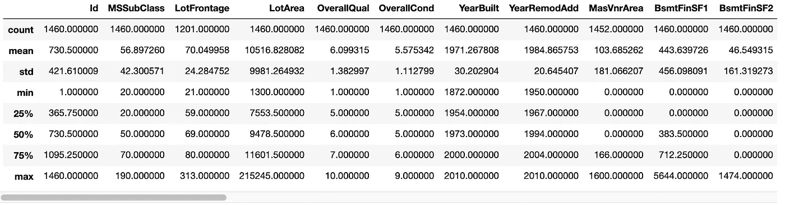

```
train.dtypes
```

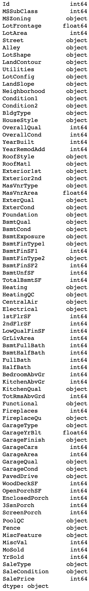

```
train.isnull().sum()
```

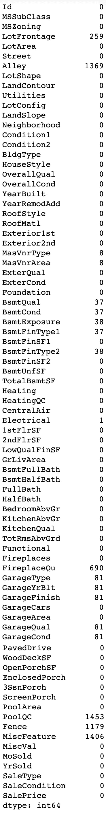

我们只能处理数值。

```
train._get_numeric_data().shape, test._get_numeric_data().shape
((1460, 38), (1459, 37))
```

有几种方法可以降低维数(减少特征/列的数量)。一种方法是提取数据集中前 6 个相关要素。

```
top_6_w_target = train.corr()['SalePrice'].sort_values(ascending = False).keys()[0:7]print(top_6_w_target)
```

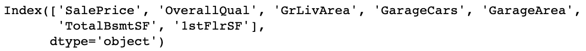

```
top_6_df = train.loc[:, top_6_w_target].copy()top_6_df.head()
```

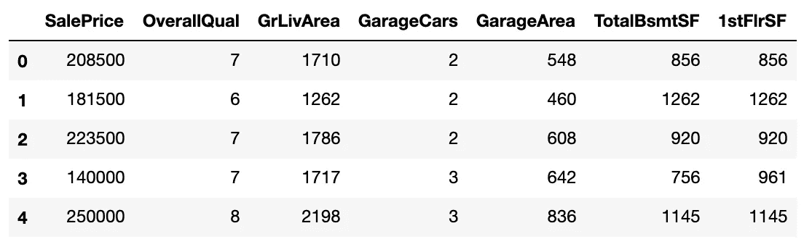

## 步骤 4:探索性数据分析(EDA)

现在我们的数据已经清理干净，我们可以尝试闪烁一些见解。我们还有 38 个功能，还是太多了。让我们看看有多少特性与“销售价格”有很高的相关性。

```
train.corr()['SalePrice'].sort_values(ascending=False)
```

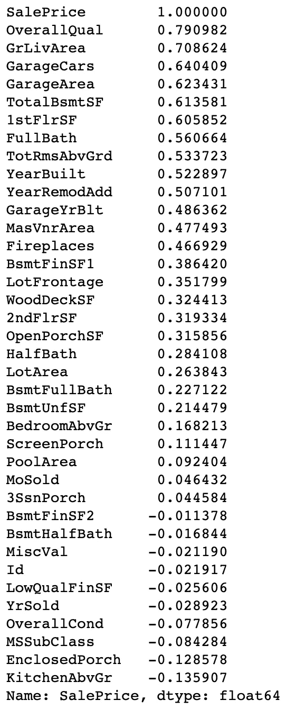

```
plt.figure(figsize = (12,10))
train.corr()['SalePrice'].sort_values(ascending=True).plot(kind='barh')
```

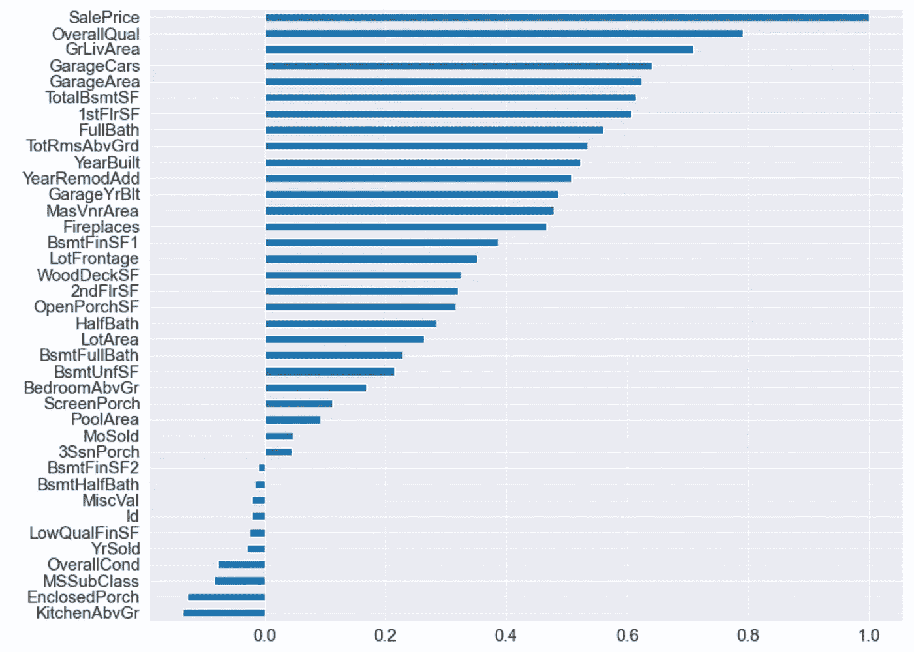

```
sns.pairplot(top_6_df)
```

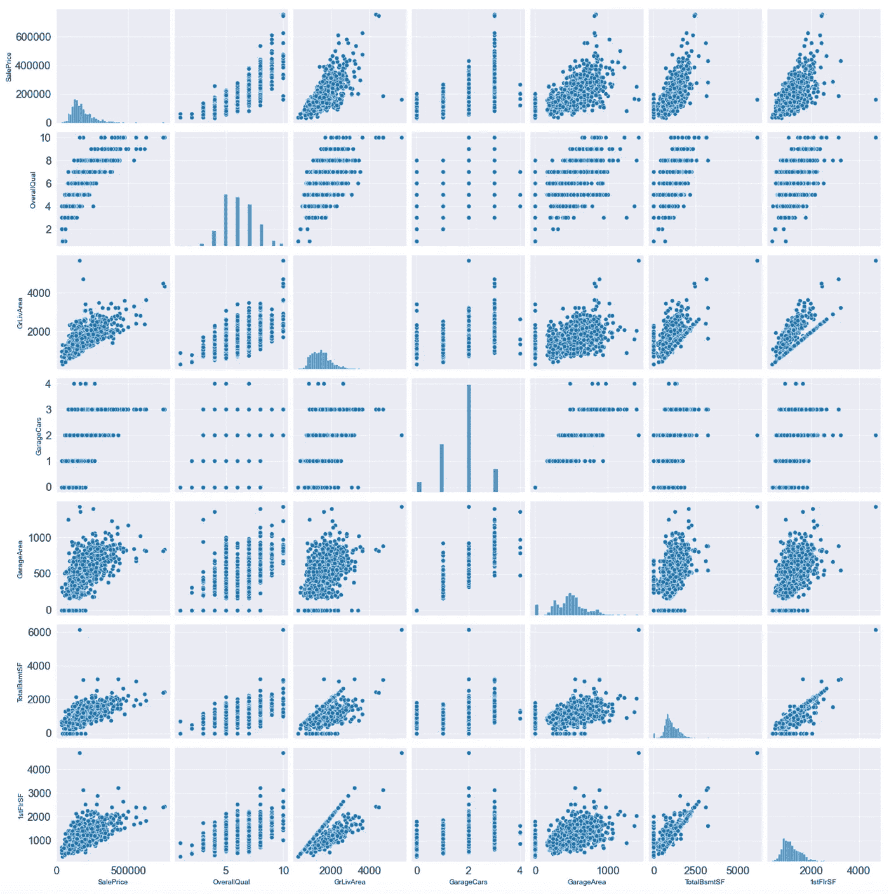

```
top_6_df['SalePrice'].hist(bins=40)
```

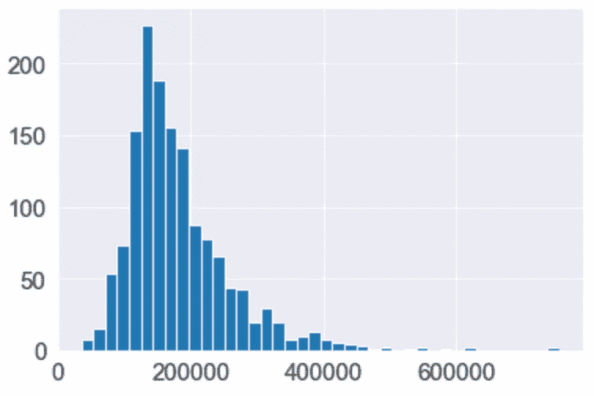

```
top_6_df.describe()
```

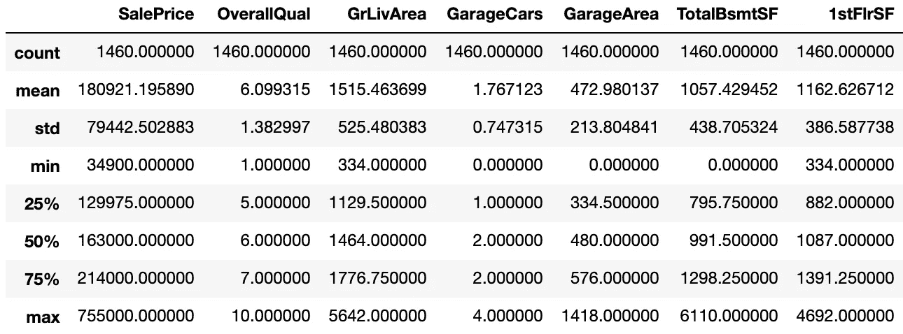

```
sns.regplot(data=train, x='OverallQual', y='SalePrice')
```

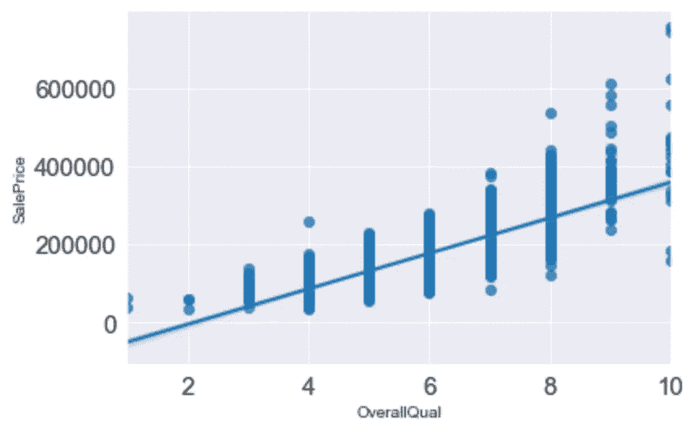

```
top_6_df['GrLivArea'].hist(bins=30)
```

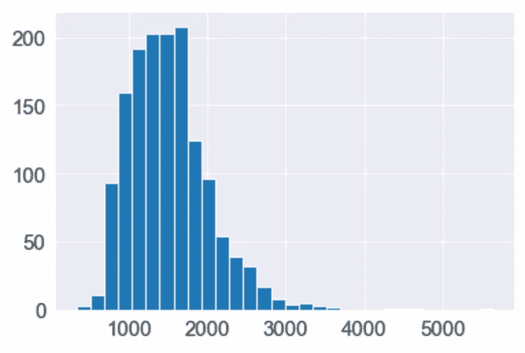

```
sns.regplot(data=train, x='GrLivArea', y='SalePrice')
```

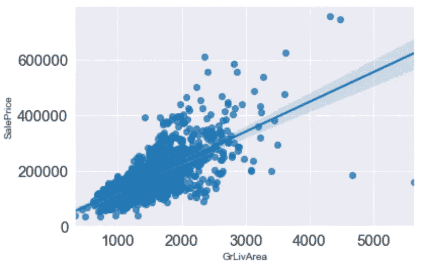

```
top_6_df['GarageCars'].hist(bins=4)
```

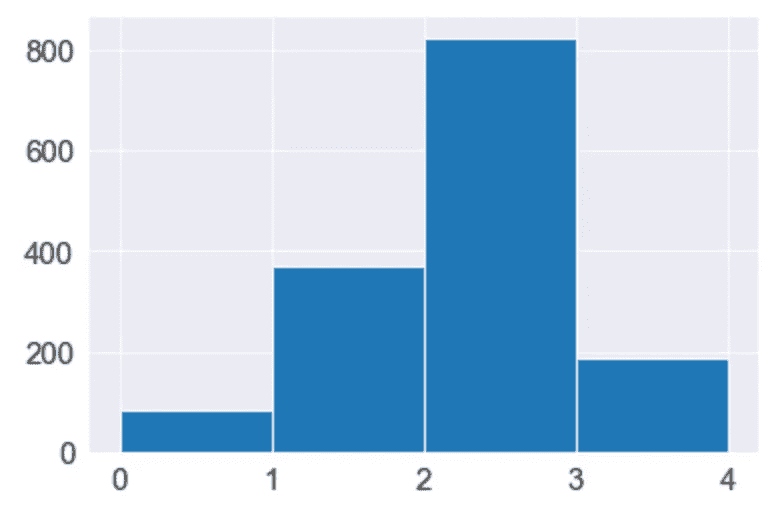

```
sns.regplot(data=train, x='GarageCars', y='SalePrice')
```

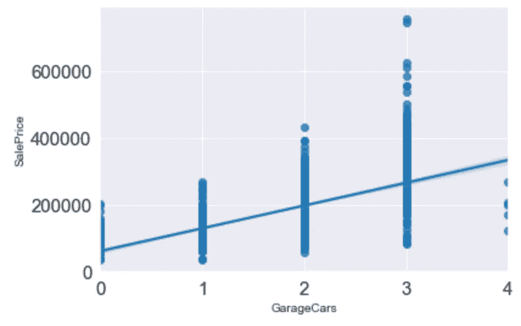

```
top_6_df['TotalBsmtSF'].hist(bins=20)
```

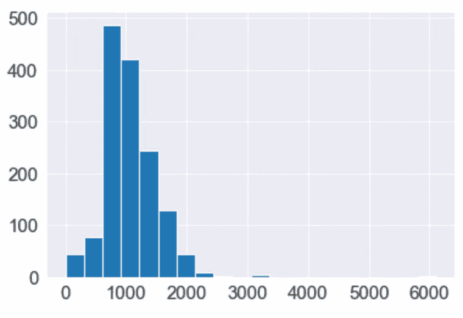

```
sns.regplot(data=train, x='TotalBsmtSF', y='SalePrice')
```

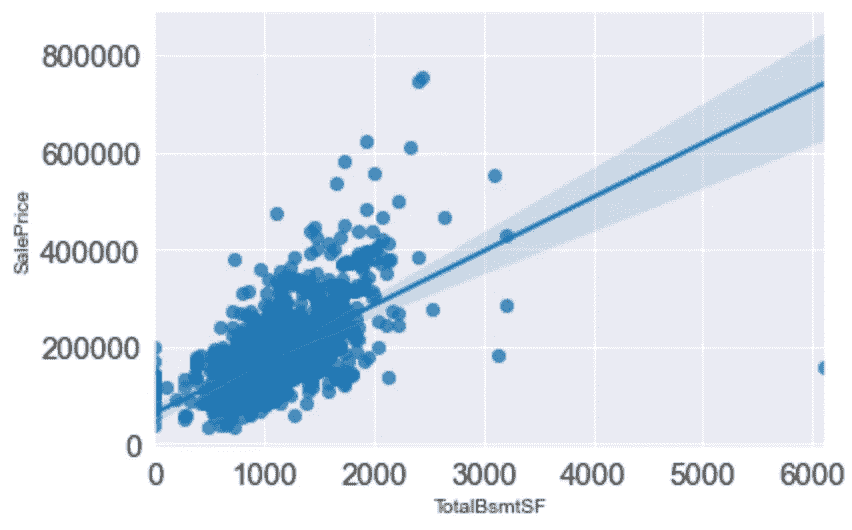

## 步骤 5:建立数据模型

## 线性回归

```
from sklearn.model_selection import train_test_split
from sklearn.linear_model import LinearRegression
from sklearn.metrics import mean_squared_error
```

创建我们的“ **X** ”和“ **y** ”轴，拆分出我们的“**训练**”和“**测试**”集合，对数据进行缩放，进行“**线性回归**”，做一些预测，最后计算“**训练**”和“**测试**”分数。

```
X = top_6_df.drop('SalePrice', axis=1)
y = top_6_df['SalePrice']X_train, X_test, y_train, y_test = train_test_split(X, y, test_size=0.3, random_state=5)
```

数据集中的每个数字要素都有不同的比例。由于回归模型是基于距离的，您可能希望公平地比较所有特征。

```
# train
scaler = preprocessing.StandardScaler().fit(X_train)
X_scaled = scaler.transform(X_train)
X_train = pd.DataFrame(X_scaled, columns=[X_train.columns])
X_train# test
scaler = preprocessing.StandardScaler().fit(X_test)
X_scaled = scaler.transform(X_test)
X_test = pd.DataFrame(X_scaled, columns=[X_test.columns])
X_test
```

这是一个例子，展示了我们的缩放数据现在的样子。

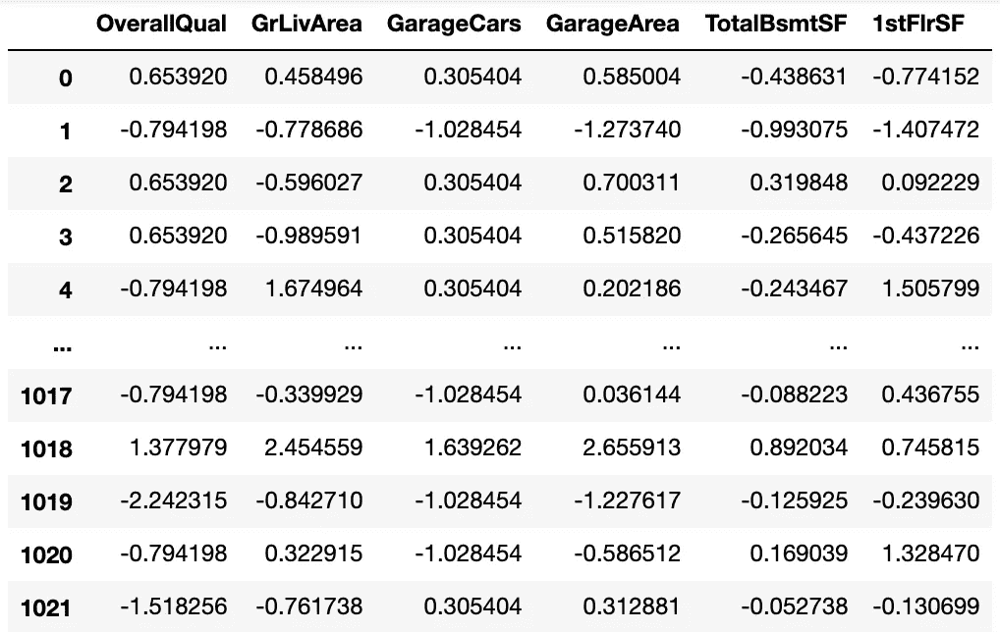

符合我们的线性回归模型。

```
linreg = LinearRegression()
linreg.fit(X_train, y_train)
```

做一些预测:)

```
y_train_predicted = linreg.predict(X_train)
y_test_predicted = linreg.predict(X_test)
```

对我们的“**训练**和“**测试**”结果进行评分。

```
linreg_train_r2 = linreg.score(X_train, y_train)
linreg_test_r2 = linreg.score(X_test, y_test)print("Training R^2")
print(linreg_train_r2)
print("Test R^2")
print(linreg_test_r2)**Training R^2
0.7632504749539565
Test R^2
0.7546592040484126**
```

均方根误差(RMSE)是衡量模型在预测定量数据时的误差的标准方法。有其他方法可以做到这一点，但我喜欢这个方法，因为它的结果与你试图预测的结果是一样的。

```
linreg_train_rmse = np.sqrt(mean_squared_error(y_train, y_train_predicted))
linreg_test_rmse = np.sqrt(mean_squared_error(y_test, y_test_predicted))print("Training RMSE, Test RMSE")
print(linreg_train_rmse, linreg_test_rmse)**Training RMSE, Test RMSE
39456.44162219146 37312.96843897494**
```

上面的意思是，训练集是 39，456 美元，测试集是 37，312 美元。在其他作品中，预测可能会“超出”这个数量。

这里只是重新概括一下我们用作输入的不确定变量或特征。

```
X.columns
```

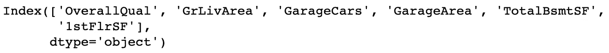

在线性回归中，系数是与预测值相乘的值。每个系数的符号表示预测变量和响应变量之间关系的方向。正号表示随着预测变量的增加，响应变量也增加。查看这些系数的方式如下:

```
linreg.coef_
```

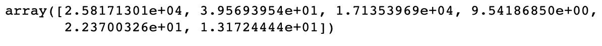

我们现在将基于“ **top_6_df** ”的副本创建一个新的结果数据帧。这个新的数据框架将包含两个新列。" **y_predicted** "表示预测销售价格，" **y_diff** "表示实际销售价格与预测价格之间的差异。

```
result_df = top_6_df.iloc[top_6_df.index.isin(X_train.index),:].copy()
result_df['y_predicted'] = np.round(linreg.predict(X_train))
result_df['y_diff'] = result_df['SalePrice'] - result_df['y_predicted']result_df.columns
```

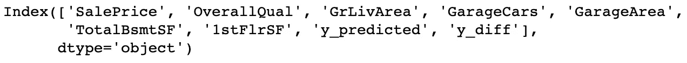

```
result_df.loc[:, ['OverallQual', 'GrLivArea', 'GarageCars', 'GarageArea', 'TotalBsmtSF', '1stFlrSF', 'SalePrice', 'y_predicted', 'y_diff']].head(20)
```

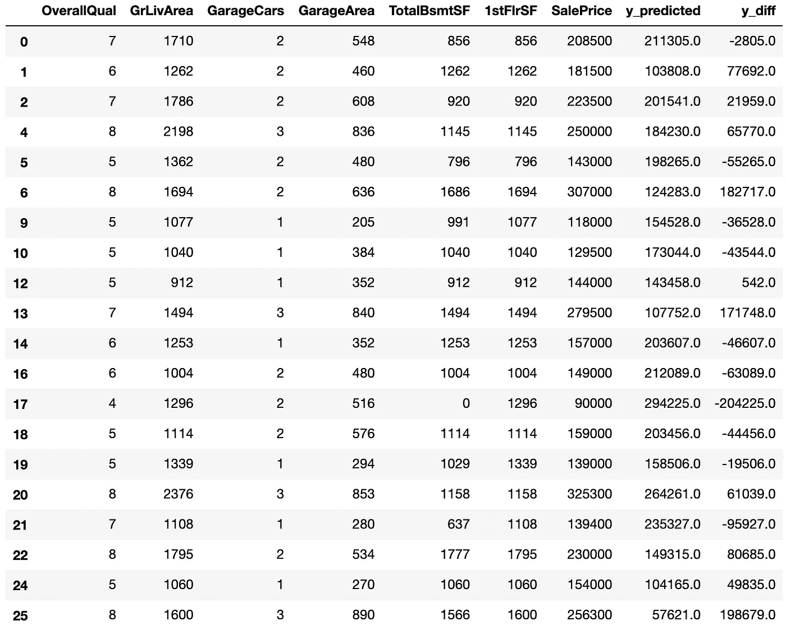

结果:

*   我们可以假设总性能的 70 ~ 80%
*   从 RMSE，我们可以预期我们所做的每个预测将提供 35，000 美元到 40，000 美元。

## 套索和岭回归

```
from sklearn.preprocessing import StandardScaler
from sklearn.linear_model import Ridge, RidgeCV, Lasso, LassoCV
```

在上一节中，我们手动将维度减少到 6 个特征。在本节中，我们将需要制作一份完整的“**系列**”副本。

```
train_df = train._get_numeric_data().copy()train_df.drop('Id', axis = 1, inplace = True)
train_df.dropna(inplace = True, axis = 0)X = train_df.drop("SalePrice", axis=1)
y = train_df['SalePrice']X_train, X_test, y_train, y_test = train_test_split(X, y, test_size=0.3, random_state=5)
```

我们需要定义一组 alphas 来测试山脊和套索模型。

```
test_alphas = [0.001, 0.01, 0.1, 1, 10, 100, 300, 500, 700, 1000, 10000, 100000]
```

使用 RidgeCV 和 LassoCV 调整 alpha hyper 参数。这些“CV”模型将选择在预测中产生最小误差的α。

```
ridge = RidgeCV(alphas=test_alphas, cv=3)
lasso = LassoCV(alphas=test_alphas, cv=3)
```

我们希望像线性回归一样进行标准缩放。

```
ss = StandardScaler()
ss.fit(X_train)
ss.fit(X_test)
```

## 里脊回归

现在我们想让数据符合我们的模型。

```
ridge.fit(X_train_scaled, y_train)
```

模型选择了什么样的 alpha 值为最佳值？

```
ridge.alpha_
**100.0**
```

岭回归做的怎么样？

```
ridge_train_r2 = ridge.score(X_train_scaled, y_train)
ridge_test_r2  = ridge.score(X_test_scaled, y_test)print("Ridge Results\n Training R^2 : {} \n Test R^2     : {}\n".format(round(ridge_train_r2,2),
                                                                       round(ridge_test_r2,2)))ridge_train_pred = ridge.predict(X_train_scaled)
ridge_test_pred = ridge.predict(X_test_scaled)print("Ridge Train RMSE:", round(np.sqrt(mean_squared_error(y_train, ridge_train_pred))) )     
print("Ridge Test RMSE:", round(np.sqrt(mean_squared_error(y_test, ridge_test_pred))))**Ridge Results
 Training R^2 : 0.8 
 Test R^2     : 0.81

Ridge Train RMSE: 37907
Ridge Test RMSE: 33659**
```

组装一个数据框架来比较系数。

```
pd.DataFrame(data = {
    "features" : X.columns,
    "coefs"    : ridge.coef_
}).sort_values(by = 'coefs', ascending = False)
```

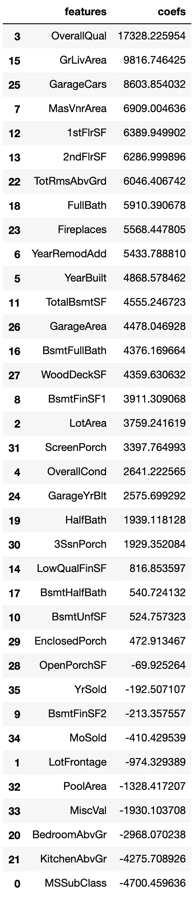

可视化 alpha 与系数趋势(当我们增加 alpha 时，我们增加正则化强度，迫使可变系数更接近零)。

```
alphas_list = np.linspace(1,5000, 30)
coefs_list = []
for i in alphas_list:
    model = Ridge(alpha = i)
    model.fit(X_train_scaled, y_train)
    coefs_list.append(model.coef_)

plt.figure(figsize = (10,10))
plt.plot(alphas_list, coefs_list, lw = '3')
plt.title("Regularization (Ridge)", fontsize = 15)
plt.legend(X.columns, loc='right', bbox_to_anchor= (1.2, 0.5));
```


## 套索回归

现在我们想让数据适合我们的下一个模型。

```
lasso.fit(X_train_scaled, y_train)
```

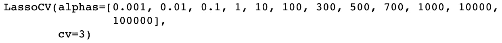

模型选择了什么样的 alpha 值为最佳值？

```
lasso.alpha_
**700.0**
```

套索回归做的怎么样？

```
lasso_train_r2 = lasso.score(X_train_scaled, y_train)
lasso_test_r2  = lasso.score(X_test_scaled, y_test)print("LASSO Results\n Training R^2: {} \n Test R^2    : {}\n".format(round(lasso_train_r2,2),round(lasso_test_r2,2)))lasso_train_pred = lasso.predict(X_train_scaled)
lasso_test_pred = lasso.predict(X_test_scaled)print("LASSO Train RMSE:", round(np.sqrt(mean_squared_error(y_train, lasso_train_pred))) )     
print("LASSO Test RMSE:", round(np.sqrt(mean_squared_error(y_test, lasso_test_pred))))**LASSO Results
 Training R^2: 0.8 
 Test R^2    : 0.8

LASSO Train RMSE: 37797
LASSO Test RMSE: 33830**
```

组装一个数据框架来比较系数。请注意 Lasso 是如何将许多不太重要的变量减少到 0 的，因为我们使用了一个大的 alpha(这是更高的正则化强度)

```
pd.DataFrame(data = {
    "features" : X.columns,
    "coefs"    : lasso.coef_
}).sort_values(by = 'coefs', ascending = False)
```

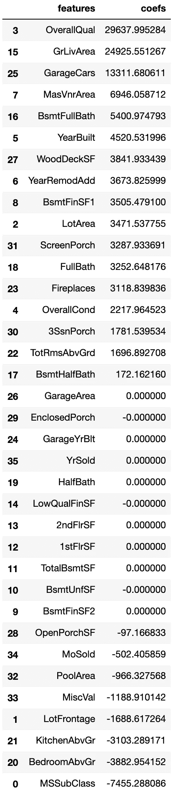

可视化阿尔法与拉索系数，以查看系数，因为他们得到正则化为 0。

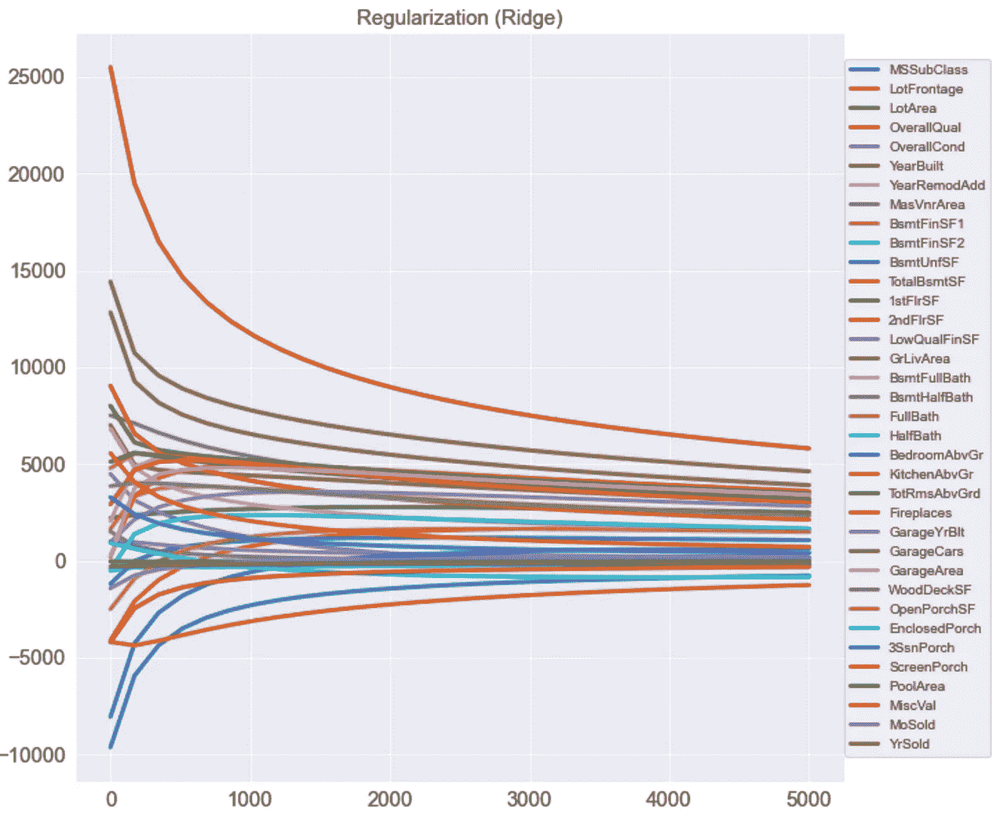

## 模型比较

我们来看一下作为模型对比。

```
print("LinReg Results\n Training R^2: {} \n Test R^2    : {}\n".format(
    round(linreg_train_r2,2),round(linreg_test_r2,2)))
print("LinReg Train RMSE:", round(linreg_train_rmse)) 
print("LinReg Test RMSE:", round(linreg_test_rmse))
print("------------------------------\n")
print("Ridge Results\n Training R^2: {} \n Test R^2    : {}\n".format(round(ridge_train_r2,2),round(ridge_test_r2,2)))
print("Ridge Train RMSE:", round(np.sqrt(mean_squared_error(y_train, ridge_train_pred))) )     
print("Ridge Test RMSE:", round(np.sqrt(mean_squared_error(y_test, ridge_test_pred))))
print("------------------------------\n")
print("\nLASSO Results\n Training R^2: {} \n Test R^2    : {}\n".format(round(lasso_train_r2,2),round(lasso_test_r2,2)))
print("LASSO Train RMSE:", round(np.sqrt(mean_squared_error(y_train, lasso_train_pred))) )     
print("LASSO Test RMSE:", round(np.sqrt(mean_squared_error(y_test, lasso_test_pred))))
print("------------------------------")**LinReg Results
 Training R^2: 0.76 
 Test R^2    : 0.75

LinReg Train RMSE: 39456
LinReg Test RMSE: 37508
------------------------------

Ridge Results
 Training R^2: 0.8 
 Test R^2    : 0.81

Ridge Train RMSE: 37907
Ridge Test RMSE: 33659
------------------------------

LASSO Results
 Training R^2: 0.8 
 Test R^2    : 0.8

LASSO Train RMSE: 37797
LASSO Test RMSE: 33830
------------------------------**
```

Rob 的一些有趣的收获…

*   我们的“幼稚”线性回归方法在只有几个高度相关变量的情况下表现惊人地好。
*   Ridge 在测试集上具有最低的 RMSE，但是有点“过拟合”(测试集性能优于训练集，通常“过拟合”在训练分数高于测试分数的情况下是常见的)
*   总的来说，正则化的实现比标准线性回归有所改进。
*   可能影响结果的因素可能是我们使用的 random_site，也可能是由于采样。

## 模型持久性

在模型上花了很多时间之后，你可能想要保存你的进度。

```
from joblib import dump, load
dump(lasso,  './lasso.joblib')
dump(ridge,  './ridge.joblib')
dump(linreg, './linreg.joblib')
```

您可以按如下方式加载它们。

```
loaded_lasso = load('./lasso.joblib')
print(loaded_lasso)
print("\nUsing the loaded model to generate predictions:\n", loaded_lasso.predict(X_train_scaled)[:10])**LassoCV(alphas=[0.001, 0.01, 0.1, 1, 10, 100, 300, 500, 700, 1000, 10000,
                100000],
        cv=3)

Using the loaded model to generate predictions:
 [108052.00073693  75944.45975011 228875.9011433  345470.07560924
 215239.85926407 113736.22360514 125167.70342725 193878.73499501
 236425.08656162 115124.0657801 ]**
```

我希望您对此感兴趣，并再次特别感谢 Robert Manriquez 的出色培训和课程支持。

我希望你喜欢这篇文章。如果你这样做了，请考虑关注我以后的文章，并为这篇文章鼓掌，因为这有助于回报我的努力:)

# 迈克尔·惠特尔

*   ***如果你喜欢这个，请*** [***跟我上媒***](https://whittle.medium.com/)
*   ***更多有趣的文章，请*** [***关注我的刊物***](https://medium.com/trading-data-analysis)
*   ***对通敌感兴趣？*** [***我们上 LinkedIn***](https://www.linkedin.com/in/miwhittle/) 连线吧
*   ***支持我和其他媒体作者*** [***在此报名***](https://whittle.medium.com/membership)
*   ***请别忘了为文章鼓掌:)←谢谢！***