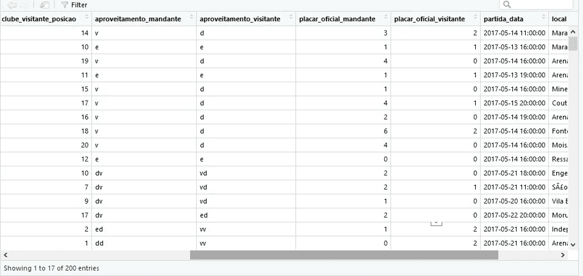
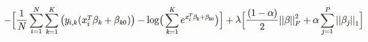
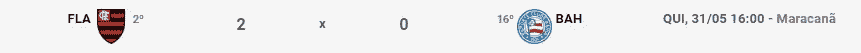

# 用机器学习预测足球比赛

> 原文：<https://levelup.gitconnected.com/predicting-real-soccer-matches-using-fantasy-game-scouts-a3b388edb8aa>


Jannes Glas 在 [Unsplash](https://unsplash.com?utm_source=medium&utm_medium=referral) 上的照片

巴西人热爱足球！对这里的一些人来说，足球就像是一种宗教。每周日下午 4 点，这个国家会停下来观看每周一次的足球比赛和最受欢迎的锦标赛:Campeonato Brasileiro。Campeonato Brasileiro 或巴西联赛(意甲)是巴西最大的锦标赛，为期 9 个月。冠军赛有 20 支队伍，38 轮。

在这个伟大的锦标赛中，我们有 11 名球员和教练在球场的每一边比赛，每个人都以自己的表现和效率试图以一场胜利和联盟+3 分结束比赛。

知道了这个事实，我们开始问一些问题:

*   我们能在足球比赛开始前预测结果吗？
*   球员的表现对比赛结果的影响有多大？
*   我们可以建立一个机器学习算法来预测游戏的最终结果吗？
*   一个人工智能的预测能力能走多远？

为了回答这个问题，我决定开发一个机器学习模型，该模型基于 Globo 的幻想游戏 CartolaFC 生成的每个球员的表现数据，以及影响每场比赛的条件。对于我的代码，我使用了 R Studio 中的 R 编程语言和 H2O 包，这是一个非常强大的库，只为开发人工智能领域的项目而准备。链接:[https://www.h2o.ai/](https://www.h2o.ai/)

完整的代码在我的 GitHub 存储库中:

[](https://github.com/octaviobomfim/Real-Soccer-Game-Score-Predictor) [## octaviobfmim/真实足球比赛分数预测器

### 预测一些足球比赛分数使用水的 R，ML 和 fatansy 游戏统计…

github.com](https://github.com/octaviobomfim/Real-Soccer-Game-Score-Predictor) 

所以，让我们开始吧！

## 下载数据集

首先，我们必须找到一个好的数据集，包含 Cartola FC 生成的俱乐部、比赛和得分。我能够在 Kaggle 上得到一个组织良好的数据集:[https://www.kaggle.com/schiller/cartolafc](https://www.kaggle.com/schiller/cartolafc)

## 导入包和读取数据

导入库后的第一个阶段是将 csv 数据读入两个数据集，称为“mydata”(包含所有匹配的数据集)和“scouts”(包含球员 scouts 的数据集)。

```
library(h2o)
library(plyr)
h2o.init()
library(dplyr)mydata <- read.csv("CartolaFC Predict/Datasets/2017_partidas.csv", header=TRUE, 
                   sep=",")

scouts <- read.csv("CartolaFC Predict/Datasets/2017_scouts.csv", header=TRUE, 
                   sep=",")
```

## 数据转换


卢卡·布拉沃在 [Unsplash](https://unsplash.com?utm_source=medium&utm_medium=referral) 上拍摄的照片

在将 CSV 作为数据集导入后，我意识到数据不包含比赛的胜负结果，只包含分数。因此，我必须在数据中进行这种转换，生成一个列，显示与主队相关的每场比赛的结果，“v”表示胜利，“d”表示失败，“e”表示平局。



```
matchResults <- data.frame("resultado" =ifelse(mydata$placar_oficial_mandante > mydata$placar_oficial_visitante,"v", ifelse(mydata$placar_oficial_mandante == mydata$placar_oficial_visitante,"e","d")))
```

现在，我们有了一个包含要素和标注的数据框，这些要素和标注将作为匹配的结果。

只有有了这个数据框架，我们才能开始制作一个具有一些有趣特征的模型，比如球队、俱乐部在积分榜上的位置，以及它是在主场还是客场比赛。然而，我们可以通过将它与玩家的数据集状态合并来获得一个有趣得多的数据集。

我们将在这里做一些工作，在球探数据集中，每条线代表一名球员，他在场上的位置，他在最后一场比赛中的得分，得分的变化，他的购买价值，他的平均得分，回合和他的球队。

其理念是通过各队的**防守**、**进攻、**和**技术人员**来凝聚队员。首先，我们将该区域的球员的统计数据汇总在一起，这样攻击者多的球队比攻击者少的球队的攻击得分更高，例如量化球队的攻击性。

我们从主队和客场队获得了这些统计数据的数据集，并与初始数据集进行了连接，现在我们有更多的特征来训练模型。现在我们有了代表游戏当前状况的特征，以及在进攻、防守和技术上组合起来的队伍中每个球员的历史。

所有这些过程都在下面的代码中:

```
*#generate data for defense ,attack and Technician for each team*
t0 <- data.frame("rodada"=0 ,"clube_id"=0,"cDefPonto"=0,"cDefPreco"=0,"cDefVar"=0,"cDefMedia"=0,
                 "cAtaPonto"=0,"cAtaPreco"=0,"cAtaVar"=0,"cAtaMedia"=0,
                 "cTecPonto"=0,"cTecPreco"=0,"cTecVar"=0,"cTecMedia"=0)
for(i in 1:19){
  for(j in 262:373){
    t1 <- filter(scouts,rodada_id==i & clube_id==j & (posicao_id == 1 |posicao_id == 2 |posicao_id == 3))
    t2 <- filter(scouts,rodada_id==i & clube_id==j & (posicao_id == 4 |posicao_id == 5))
    t3 <- filter(scouts,rodada_id==i & clube_id==j & (posicao_id == 6))
    t6 <- data.frame("rodada"=t1$rodada_id[1] ,"clube_id"=t1$clube_id[1],"cDefPonto"=sum(t1$pontos_num),"cDefPreco"=sum(t1$preco_num),"cDefVar"=sum(t1$variacao_num),"cDefMedia"=sum(t1$media_num),
                     "cAtaPonto"=sum(t2$pontos_num),"cAtaPreco"=sum(t2$preco_num),"cAtaVar"=sum(t2$variacao_num),"cAtaMedia"=sum(t2$media_num),
                     "cTecPonto"=sum(t3$pontos_num),"cTecPreco"=sum(t3$preco_num),"cTecVar"=sum(t3$variacao_num),"cTecMedia"=sum(t3$media_num))
    t0<-rbind(t0,t6)
  }

}
teste <- filter(t0,!is.na(rodada))

*#get all stats for teams in every match*
b0 <- data.frame("rodada"=0,"clube_casa_id"=0,"casaDef"= 0,"casaDefMedia"= 0,"casaDefPreco"=0,"casaDefVar"=0,
                 "casaAtk"= 0,"casaAtkMedia"= 0,"casaAtkPreco"=0,"casaAtkVar"=0,
                 "casaTec"= 0,"casaTecMedia"= 0,"casaTecPreco"=0,"casaTecVar"=0,
                 "visitanteDef"= 0,"visitanteDefMedia"= 0,"visitanteDefPreco"=0,"visitanteDefVar"=0,
                 "visitanteAtk"= 0,"visitanteAtkMedia"= 0,"visitanteAtkPreco"=0,"visitanteAtkVar"=0,
                 "visitanteTec"= 0,"visitanteTecMedia"= 0,"visitanteTecPreco"=0,"visitanteTecVar"=0)
dataset <- mydata
for(i in 1:19){
  b1 <- filter(mydata,rodada_id==i)
  for(j in 1:length(b1$clube_casa_id)){
    casa <- filter(teste,rodada==i,clube_id==b1$clube_casa_id[j])
    visitante <-filter(teste,rodada==i,clube_id==b1$clube_visitante_id[j])
    b5 <- data.frame("rodada"=b1$rodada[j],"clube_casa_id"=b1$clube_casa_id[j],"casaDef"= casa$cDefPonto,"casaDefMedia"= casa$cDefMedia,"casaDefPreco"=casa$cDefPreco,"casaDefVar"=casa$cDefVar,
                     "casaAtk"= casa$cAtaPonto,"casaAtkMedia"= casa$cAtaMedia,"casaAtkPreco"=casa$cAtaPreco,"casaAtkVar"=casa$cAtaVar,
                     "casaTec"= casa$cTecPonto,"casaTecMedia"= casa$cTecMedia,"casaTecPreco"=casa$cTecPreco,"casaTecVar"=casa$cTecVar,
                     "visitanteDef"= visitante$cDefPonto,"visitanteDefMedia"= visitante$cDefMedia,"visitanteDefPreco"=visitante$cDefPreco,"visitanteDefVar"=visitante$cDefVar,
                     "visitanteAtk"= visitante$cAtaPonto,"visitanteAtkMedia"= visitante$cAtaMedia,"visitanteAtkPreco"=visitante$cAtaPreco,"visitanteAtkVar"=visitante$cAtaVar,
                     "visitanteTec"= visitante$cTecPonto,"visitanteTecMedia"= visitante$cTecMedia,"visitanteTecPreco"=visitante$cTecPreco,"visitanteTecVar"=visitante$cTecVar
    )
    b0<-rbind(b0,b5)
  }
}

*#join with original table*
datasetFinal <- merge(mydata,b0,by.x=c("rodada_id","clube_casa_id"),by.y=c("rodada","clube_casa_id"))
```

现在我们可以开始训练模型了。

# 机器学习模型

O 数据科学中最重要的因素之一是提出正确的问题，在这个过程中引导你。

在这种情况下，我们要预测什么？比赛的结果。

分数？不，只要主队赢，平，或输。然后，由于我们不会量化，我们将初步有一个**分类模型。**

这场比赛的可能结果是什么？“V”代表胜利，“E”代表平局，“D”代表失败。于是我们有了一个**多项式分类模型**(因为它不是一个有二进制结果的标签)。

在 H2O 图书馆提供的模型中，我选择使用**广义线性模型(GLM)** 。

多项式模型是二项式模型的推广，用于几类响应变量。与二项式家族相似，GLM 对观察给定类别“c”x 的条件概率进行建模。每个输出类别都有一个系数向量，用矩阵β表示。

> 除了高斯(即正态)分布，还包括泊松、二项式和伽马分布，每种分布都有不同的用途，根据分布和链接函数，可用于预测或分类([http://docs . H2O . ai/H2O/latest-stable/H2O-docs/data-science/glm . html](http://docs.h2o.ai/h2o/latest-stable/h2o-docs/data-science/glm.html))

概率计算如下:



既然我们已经选择了模型，我们必须将数据集转换到 H2O 环境中，并将结果的标签列转换为因子。

```
*#combining our datasets*
matchResults <- data.frame("resultado" = ifelse(datasetFinal$placar_oficial_mandante > datasetFinal$placar_oficial_visitante,"v", ifelse(datasetFinal$placar_oficial_mandante == datasetFinal$placar_oficial_visitante,"e","d")))matchResults <- as.h2o(matchResults)
partidas <- as.h2o(datasetFinal)
partidas <- h2o.cbind(partidas, matchResults)*# convert response column to a factor*
partidas["resultado"] <- as.factor(partidas["resultado"])
```

我们用特征和标签创建了一个向量。

我们将数据集分为训练和验证两部分，训练和测试各占 80%。

我们用标准参数运行模型。

```
# set the predictor names and the response column name
predictors <- c("clube_casa_posicao","clube_visitante_posicao","clube_casa_id","clube_visitante_id",
                "casaDef","casaDefMedia", "casaDefPreco", "casaDefVar", "casaAtk","casaAtkMedia","casaAtkPreco", "casaAtkVar", "casaTec",
                "casaTecMedia", "casaTecPreco","casaTecVar", "visitanteDef", "visitanteDefMedia", "visitanteDefPreco", "visitanteDefVar",
                "visitanteAtk", "visitanteAtkMedia", "visitanteAtkPreco", "visitanteAtkVar", "visitanteTec", "visitanteTecMedia", "visitanteTecPreco",
                "visitanteTecVar")
response <- "resultado"

# split into train and validation sets
partidas.split <- h2o.splitFrame(data = partidas,ratios = 0.80, seed = 1234)
train <- partidas.split[[1]]
valid <- partidas.split[[2]]

#run GLM model
partidas_glm <- h2o.glm(family= "multinomial", x= predictors, y=response, training_frame=train)
```

## 确认

运行模型后，我们可以看到混淆矩阵，并了解模型在训练中的表现。

```
> h2o.confusionMatrix(partidas_glm)

Confusion Matrix: Row labels: Actual class; Column labels: Predicted class
        d  e  v  Error       Rate
d      47  2  2 0.0784 =   4 / 51
e       7 15 12 0.5588 =  19 / 34
v       1  1 67 0.0290 =   2 / 69
Totals 55 18 81 0.1623 = 25 / 154
```

我们可以看到，该模型具有良好的性能，准确率超过 83%，误差约为 16%。该模型设法很好地定义了什么是胜利和失败，但在预测抽签时却有 56%的误差，这是意料之中的，因为这是最难预测的。

为了进行验证，我们将执行以下代码:

```
> h2o.performance(partidas_glm, newdata = valid, train = FALSE, valid = TRUE,
                xval = FALSE)

Test Set Metrics: 
=====================

MSE: (Extract with `h2o.mse`) 0.2233906
RMSE: (Extract with `h2o.rmse`) 0.4726422
Logloss: (Extract with `h2o.logloss`) 0.6190762
Mean Per-Class Error: 0.2820513
Null Deviance: (Extract with `h2o.nulldeviance`) 79.43712
Residual Deviance: (Extract with `h2o.residual_deviance`) 43.33533
R^2: (Extract with `h2o.r2`) 0.627175
AIC: (Extract with `h2o.aic`) NaN
Confusion Matrix: Extract with `h2o.confusionMatrix(<model>, <data>)`)
=========================================================================
Confusion Matrix: Row labels: Actual class; Column labels: Predicted class
        d e  v  Error      Rate
d       8 0  0 0.0000 =   0 / 8
e       5 2  6 0.8462 = 11 / 13
v       0 0 14 0.0000 =  0 / 14
Totals 13 2 20 0.3143 = 11 / 35
```

由于这是一个多项式模型，我们将分析验证的信心矩阵。

在这一时刻，有 31%和 69%的正确率的误差，这一因素再次受到预测抽签的难度的“偏见”。所有的胜利和失败都是可以预测的。该模型的 R^2 为 0.627。

## 特征选择

特征选择是一个过程，旨在选择最重要的变量来降低维数，从特征中获得更有价值的信息，删除只会为模型产生噪声的变量，在某些情况下避免维数灾难，等等。

在 H2O，我们可以选择使用变量重要性函数来量化模型中每个变量的重要性。

```
h2o.varimp(partidas_glm)

Standardized Coefficient Magnitudes: standardized coefficient magnitudes
         names coefficients sign
1 visitanteTec     0.829742  POS
2      casaDef     0.741036  POS
3      casaTec     0.672827  POS
4 visitanteDef     0.628416  POS
5      casaAtk     0.459256  POS

---
               names coefficients sign
24 visitanteAtkMedia     0.000000  POS
25 visitanteAtkPreco     0.000000  POS
26   visitanteAtkVar     0.000000  POS
27 visitanteTecMedia     0.000000  POS
28 visitanteTecPreco     0.000000  POS
29                             NA   NA
```

我们可以看到，在这个模型中，**客场的蔻驰**、**主场** **防守**和**主场** **蔻驰、** **客场球队防守**和**主场球队进攻**这几个变量是最重要的变量，平均、价格、变异这些变量并不影响模型的准确性，为了简化模型可以排除这些变量。

## 预言；预测；预告

为了测试这个模型，我访问了 https://www.cartolafcbrasil.com.br 网站，并在 2018 年巴西锦标赛第八轮预测了弗拉门戈和巴伊亚之间的比赛。



我从上一场比赛(第 7 轮)中的两支球队那里获得了数据，并为预测建立了一个数据集。

注意:价格、变化和平均值的数据我留为 0 或得到相同的分数值，因为这些变量不影响模型，现在这应该不是太大的问题。

```
# predictin on validation data
predict(partidas_glm,valid)
x <- data.frame("clube_casa_posicao"=2,"clube_visitante_posicao"=16,"clube_casa_id"=262,"clube_visitante_id"=265,
                "casaDef"=37.7,"casaDefMedia"=37.7, "casaDefPreco"=0, "casaDefVar"=0, "casaAtk"=37.6,"casaAtkMedia"=37.6,"casaAtkPreco"=0, "casaAtkVar"=0, "casaTec"=6.33,
                "casaTecMedia"=6.33, "casaTecPreco"=0,"casaTecVar"=0, "visitanteDef"=38.7, "visitanteDefMedia"=38.7, "visitanteDefPreco"=0, "visitanteDefVar"=0,
                "visitanteAtk"=40.4, "visitanteAtkMedia"=40.4, "visitanteAtkPreco"=0, "visitanteAtkVar"=0, "visitanteTec"=7.19, "visitanteTecMedia"=7.19, "visitanteTecPreco"=0,
                "visitanteTecVar"=0)
newdata <- as.h2o(x)
predict(partidas_glm, newdata)
```

所以我们得到了结果:

```
predict         d         e         v
1       v 0.3668072 0.2423011 0.3908917
```

主场获胜——弗拉门戈——39%的概率。

令我惊讶的是，这场比赛的预测是正确的！我在其他比赛中测试过，结果非常令人满意。

## 结论

初始模型表现出良好的预测能力，令人满意的训练和验证性能表明，它可以被改进并用于使用幻想游戏 CartolaFC 数据作为输入来预测足球比赛。该模型可用于娱乐，甚至用于赌博。我将继续完善模型，并在其他比赛中测试预测。我也可以提供建议、见解和问题。我希望我在数据科学和机器学习的旅程中有所帮助，这里有一些可以在未来的文章中做出的改进。

## 丰富

*   作为模型的改进，我们可以用一个平均值更好地代表球队每个区域的数据，因为球队可以换人。
*   我们还可以获得一种方法来量化球队在最后一场比赛中的表现，考虑分数、最后 3 场比赛的平均值、积分表中的积分、失球数、失球数、进球余额、胜场数、平局数和输球数。
*   使用更大的数据集，包括 2014、2015 和 2016 年的冠军数据。
*   使用更符合数据并减少误差的模型，如一些神经网络、朴素贝叶斯或随机森林。使用主成分分析进行降维也很有趣。
*   使用更多的外部数据，如体育场、比赛时间、refree、两支球队的新闻，甚至天气，可以添加更多的信息。