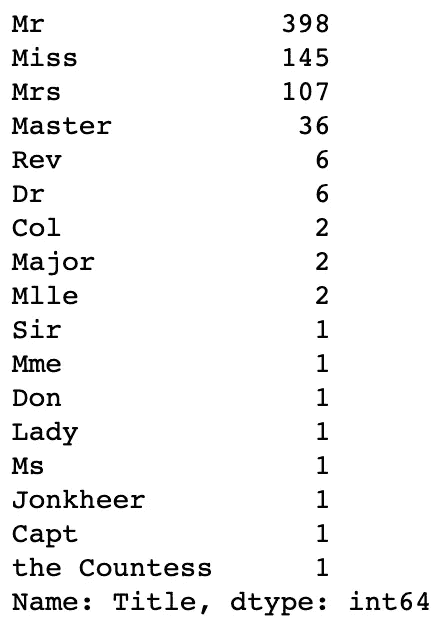

# 使用机器学习预测泰坦尼克号幸存者

> 原文：<https://levelup.gitconnected.com/predicting-titanic-survivors-using-ml-8570ef4e89e8>

## 使用机器学习预测泰坦尼克号幸存者的数据科学方法


我通过退休一直在哥伦比亚工程学习[应用机器学习](https://online-exec.cvn.columbia.edu/applied-machine-learning)。这是一个为期 5 个月的课程，我真的很喜欢，并会推荐。

教练都很好，很有帮助，尤其是罗伯特·曼里克兹和普内特·萨拉斯瓦特。他们举办“办公时间”网络研讨会，帮助完成复杂的作业，同时也提供我们所学内容的实际演练。

有一个很棒的数据科学和机器学习资源叫做 [Kaggle](https://www.kaggle.com/) 。他们为数据科学家提供免费的数据集进行实践。还有比较机器学习的分析和建模的比赛。

在一些“办公时间”的网络研讨会中，Robert 向我们展示了“[泰坦尼克号——灾难中的机器学习](https://www.kaggle.com/c/titanic/data)”数据集。目标是预测谁在泰坦尼克号上幸存。

我将提供数据科学和机器学习的实用介绍，而不是深入幕后的数学(数学很复杂！).虽然这些名字听起来很花哨，但实际上它们分别是统计学家和统计学的现代名称。我们不要在这里自欺欺人，这主要是复杂的数学。

## 步骤 1:确定项目范围

这个项目的目标是确定谁是泰坦尼克号的幸存者。那将是我们的"**决定因素**"变量(我们正试图预测的)。我们将使用一个或多个"**不确定的**变量或"**特性**is 输入。

理解我们的数据很重要。除了实际数据，Kaggle 还提供了数据集的描述。这对于分析和特征工程来说肯定会派上用场。


例如" **sipsp** "和" **parch** "如果没有描述可能不明显，但可以肯定的是，将这两个相加将为您提供一个家庭的规模。这可能是一个有用的功能，可以设计和包含。

## 第二步:收集数据

在这种特殊情况下，这是非常容易的。Kaggle 上已经提供给我们了，所以你只需要下载文件。我们将大部分使用“ **train.csv** ”进行工作。

## 步骤 3:清理数据

第一步是加载我们的数据。我正在使用 Python 3(带有 **pandas** 、 **numpy** 、 **seaborn** 、 **matplotlib** 和 **sklearn** 库)和 Jupyter notebooks "**jupyterlab**"如果你想继续的话。

加载必要的库。

```
import pandas as pd
import numpy as np
import seaborn as sns
import matplotlib.pyplot as plt
```

Jupyter 笔记本电脑的定制。

```
%matplotlib inlineplt.rc('xtick', labelsize=15)     
plt.rc('ytick', labelsize=15)
plt.rc('axes', titlesize=16)sns.set_style('darkgrid')
```

从 Kaggle 加载我们的" **train.csv** "和" **test.csv** "数据集。

```
train = pd.read_csv('./train.csv')
test = pd.read_csv('./test.csv')
```

让我们看看数据集的形状。

```
train.shape, test.shape
((891, 12), (418, 11))
```

“**训练**数据集具有 891 行和 12 列/特征。这包括我们将要预测的“**确定性**”变量“**幸存**”。“**测试**数据集具有 418 行和 11 列/特征。这是我们的数据集，没有我们的“**幸存**特征。看起来**训练/测试**的比例大致是 **70/30%** 。

```
train.describe()
```


我们首先要检查的事情之一是是否有空值。这会给我们带来问题，所以我们需要想出在每种情况下该怎么做。处理这种情况的三种常用方法是:为缺失值分配平均值，完全删除行，或者使用机器学习来预测缺失值:)

我们可以看到“**年龄**”特征对我们来说是个问题。它应该有 891 个完整的条目，但只有 714 个。

```
train.isnull().sum()
```


我们可以看到，我们有 177 个数字空值需要进行排序。有一个名为“ **Cabin** ”的“**object**”(string/text)特征有大量的缺失值。这个栏目对我们没有用，应该去掉。"**已装载**"类似，但只有两个值缺失。仅仅缺少两个条目就完全删除这个特性是没有意义的。删除这两行是有意义的。所以让我们现在就开始吧。

```
train.drop(columns=['Cabin'], inplace=True)
train.dropna(subset=['Embarked'], inplace=True)test.drop(columns=['Cabin'], inplace=True)
test.dropna(subset=['Embarked','Fare'], inplace=True)
```

您还会注意到我对“**训练**”数据集所做的更改，以及我对“**测试**”数据集所做的更改。如果我们不这样做，未处理的“**测试**”数据集将在我们的模型上表现糟糕，即使对“**训练**”数据集的测试看起来不错。

现在看起来怎么样？

```
train.isnull().sum()
```


我们仍然拥有“**年龄**特征中所有那些缺失的条目。我们不想删除该列或所有这些行。指定平均值(“**平均值**”)也没有用。我们将使用机器学习来计算出那些缺失值的合适年龄。我们将使用的机器学习模型是 K 近邻(KNN)，但这要求数据集中的所有值都是数字。我们将继续清理数据，并在最后回到“**时代**”功能，因为我们还有其他功能要先清理。

让我们看看我们的数据…

```
train.head()
```


```
train.dtypes
```


需要指出的是，在机器学习中，我们只能处理数字数据。如果它们是分类数据，上面的“ **object** ”类型特征可能仍然对我们有用，但是我们需要对它们做些什么才能使用它们。

是时候尝试一些**特色工程**。

“**oaked**”功能可能对我们有用，但我们应该详细说明这些字母的含义。

```
train['Embarked'].value_counts()
```


我们从 Kaggle 的描述中可以看出“ **S** 是“**南安普顿**”、“ **C** 是“**瑟堡**”、“ **Q** 是“**皇后镇**”所以我们会重新映射那些。

```
def convert_embarked(x):
    if x == "C":
        return "Cherbourg"
    elif x == 'Q':
        return "Queenstown"
    elif x == 'S':
        return "Southampton"train.Embarked = train.Embarked.map(convert_embarked)
test.Embarked = train.Embarked.map(convert_embarked)
```

为了确认它有效…

```
train['Embarked'].value_counts()
```


我们知道" **SibSp** "和" **Parch** "合在一起会组成一个" **FamilySize** "所以让我们为它创建一个新特性。

```
train['FamilySize'] = train['SibSp'] + train['Parch']
test['FamilySize'] = test['SibSp'] + test['Parch']train.groupby('FamilyCount').agg({"FamilyCount" : 'count', "Survived" : 'mean'}).sort_index()
```


```
train.groupby('FamilySize').agg({"Survived" : 'mean'}).plot(kind='bar')
```


有趣的是，如果你是一个三口之家，你很有可能在泰坦尼克号上幸存。

我将删除“ **PassengerId** ”和“ **Ticket** ”功能，因为我看不到任何保留它的明显理由。它既不是数字的，也不是分类的，似乎没有增加任何实际价值。

```
train.drop(columns=['PassengerId','Ticket'], inplace=True)
test.drop(columns=['PassengerId','Ticket'], inplace=True)
```

乘客姓名对我们来说是个问题。这不是数字或分类，但我们能从中看出什么有用的东西吗？过去，每个人似乎都有一个头衔，所以如果我们能从名字中提取出来，我们就可以把它作为一个分类特征。

```
train['Title'] = train['Name'].map(lambda x: x.split(',')[1].split('.')[0].strip())
test['Title'] = test['Name'].map(lambda x: x.split(',')[1].split('.')[0].strip())
```

让我们来看看…

```
train['Title'].value_counts()
```



那看起来真的很有趣。我现在要删除“ **Name** ”功能。

```
train.drop(columns=['Name'], inplace=True)
test.drop(columns=['Name'], inplace=True)
```

我们现在看起来怎么样？

```
train.head()
```


" **Pclass** "是一个有趣的特性，因为它是数字，但实际上是分类的。我们应该相应地调整数据类型。

```
train['Pclass'] = train['Pclass'].astype(str)
test['Pclass'] = test['Pclass'].astype(str)
```

我们看起来相当不错，但正如我提到的，我们不能使用"**性别**"、"**着手**、"**职业**"或"**头衔**"分类特征的当前形式。我们需要执行一个名为“ **One-Hot Encoding** ”的函数，将这些分类特征转换成数字二进制形式。

```
train = pd.get_dummies(train, columns=['Sex','Embarked','Pclass','Title'], drop_first=True)
test = pd.get_dummies(test, columns=['Sex','Embarked','Pclass','Title'], drop_first=True)
```

所有的分类特征现在应该被扩展成二元特征，并且原始特征应该被丢弃。

```
train.dtypes
```


既然我们所有的特征都是数字，我们可以看看如何使用 K-最近邻来预测缺失的“**年龄**”值。

```
from sklearn.neighbors import KNeighborsRegressor# trainimpute_train = train[train.Age.isnull()].drop(['Age'], axis=1)
impute_train.describe()# testimpute_test = test[test.Age.isnull()].drop(['Age'], axis=1)
impute_test.describe()
```

这是我们缺少“**年龄**”的 177 行…


```
# trainknr = KNeighborsRegressor()titanic_knn_train = train[train.Age.notnull()]
X_train = titanic_knn_train.drop(['Age'], axis = 1)
y_train = titanic_knn_train.Ageknr.fit(X_train, y_train)imputed_train_ages = knr.predict(impute_train)
imputed_train_ages# testknr = KNeighborsRegressor()titanic_knn_test = test[test.Age.notnull()]
X_test = titanic_knn_test.drop(['Age'], axis = 1)
y_test = titanic_knn_test.AgeX_test.isnull().sum()knr.fit(X_test, y_test)imputed_test_ages = knr.predict(impute_test)
imputed_test_ages
```

"**titanic _ KNN _ train**"将是我们的具有"**年龄**"的 712 行，而" **imputed_train_ages** "将是具有预测"**年龄**的 177 行。

以下是缺失的“**年龄**”值的预测年龄。

```
array([47.8, 31.2, 18.4, 32.5, 17.6, 28.6, 21.584, 17.6,
       24.6, 28.7, 28.1, 31.4, 17.6, 26\. , 49.4, 43.1,
        8.334, 28.6, 28.1, 17.6, 28.1, 28.1, 28.6, 28.6,
       22\. , 28.1, 47.8, 13.4, 27\. , 28.1, 22.6, 39\. ,
       29.2, 58.8, 12.8, 39\. , 40\. , 45.4, 28.8, 47.8,
       17.6, 39\. , 47.8, 28.6, 13.8, 26.6, 16.9, 18.9,
       34.1, 33.8, 47.8, 21.5, 45.6, 17.6, 36.6, 58.8,
       43.1, 43.4, 17.6, 29.6, 29.9, 28.1, 25.6, 39\. ,
       24.4, 40.4, 28.6, 29.6, 50.4, 32.5, 17.6, 17.6,
       31.4, 18.4, 17.6, 36.4, 28.6, 37.8, 13.8, 28.6,
       33.5, 36.6, 25.4, 28.7, 34.1, 47.8, 29.6, 26\. ,
       26\. , 28.1, 40.6, 47.8, 28.1, 36.6, 35.9, 34.1,
       41\. , 36.6, 13.8, 26\. , 22.4, 30.3, 20.3, 41.2,
       28.1, 41.6, 32.5, 26.8, 30.8, 26.8, 28\. , 33.5,
       39\. , 47.8, 30.8, 47.8, 28.1, 24.2, 26.8, 17.6,
       29.5, 32.8, 28.1, 18.484, 37.2, 32.5, 28.6, 34.4,
       25.8, 18.9, 47.8, 34.8, 36.6, 30\. , 29.8, 29.8,
       28.6, 17.6, 28.6, 31\. , 40.6, 36.6, 21.5, 29.8,
       17.6,  8.334, 61.8, 25.5, 17.6, 36.6, 28.6, 28.6,
       43.4, 33.5, 41.4, 31.4, 32.5, 47.8, 34.8, 20.8,
       47.8, 39\. , 47\. , 36.6, 33.5, 33.6, 40.6, 26.8,
       28.1, 46.2, 39\. , 34.8, 26.8, 39\. , 26.6, 28.6,
       16.8  ])
```

我们的“ **imputed_train_ages** ”数据帧现在是这样的。

```
# testimpute_test['Age'] = imputed_test_ages# trainimpute_train['Age'] = imputed_train_agesimpute_train.head(10)
```


最后一步是连接两个数据帧。

```
# traintitanic_train_imputed = pd.concat([titanic_knn_train, impute_train], sort=False, axis=0)
train = titanic_train_imputed# testtitanic_test_imputed = pd.concat([titanic_knn_test, impute_test], sort=False, axis=0)
test = titanic_test_imputed
```

现在看起来怎么样？

```
train.isnull().sum()
```


没有缺失值。

```
train['Age'].describe()
```


看起来没错。我们开始时有 891 行，现在有 889 行。这是 891 行减去我们删除的缺少“**abowed**”的两行。

我现在唯一不太喜欢的是生成的“**年龄**”现在是浮点数(不是整数)。

```
# traintrain['Age'] = np.round(train['Age']).astype(int)# testtest['Age'] = np.round(test['Age']).astype(int)
```

让我们来看看“**年龄**特征…

```
train['Age'].value_counts()
```


此时保存我们处理过的数据通常是一个好的做法。这将使我们以后不必重复所有这些步骤。

```
# traintrain.to_csv('./train_processed.csv')# testtest.to_csv('./test_processed.csv')
```

## 步骤 4:探索性数据分析(EDA)

现在我们的数据已经清理干净，我们可以尝试闪烁一些见解。

```
plt.figure(figsize = (12,10))
train.corr()['Survived'].sort_values(ascending = True).plot(kind = 'barh')
```


```
df.corr()['Survived'].sort_values(ascending = False)
```


```
top_6 = train.corr()['Survived'].sort_values(ascending = False).keys()[0:7]print (top_6)
```


```
top_6_train = train.loc[:,top_6].copy()
top_6_train.head()
sns.pairplot(top_6_train)
top_6_train['Survived'].hist(bins=40)
top_6_train.describe()
```


## 步骤 5:建立数据模型

```
from sklearn.linear_model import LogisticRegression
from sklearn.tree import DecisionTreeClassifier
from sklearn.model_selection import train_test_split
from sklearn import preprocessing
```

我们现在要创建" **X** "和" **y** "数据集。" **y** "将是我们的"**确定的**"变量为"**幸存下来的**"(我们正在努力预测的)和" **X** "将是我们所有的特征输入。

```
train.columns
```


```
y = train['Survived']X = train.loc[:, ['Age', 'SibSp', 'Parch', 'Fare', 'FamilySize', 'Sex_male', 'Embarked_Queenstown', 'Embarked_Southampton', 'Pclass_2', 'Pclass_3', 'Title_Col', 'Title_Don', 'Title_Dr', 'Title_Jonkheer', 'Title_Lady', 'Title_Major', 'Title_Master', 'Title_Miss', 'Title_Mlle', 'Title_Mme', 'Title_Mr', 'Title_Mrs', 'Title_Ms', 'Title_Rev', 'Title_Sir', 'Title_the Countess']]
```

我们现在想要将我们的数据分成“**训练**”和“**测试**”数据集。这将以 70/30 的比例完成。“ **random_state** ”只是让我们能够稍后准确地再现这个输出。

```
X_train, X_test, y_train, y_test = train_test_split(X, y, test_size=0.3, random_state=1)
```

原始形状。

```
X.shape, y.shape
((889, 28), (889,))
```

火车形状。

```
X_train.shape, y_train.shape
((622, 28), (622,))
```

测试形状。

```
X_test.shape, y_test.shape
((267, 26), (267,))
```

我们先试试**逻辑回归**模型。

它是一种基于**距离的**型号。我们的“**年龄**”和“**费用**”特征会给我们带来问题，因为数值比其他特征大得多。

我们希望调整所有的功能，使它们使用相同的比例。

```
scaler = preprocessing.StandardScaler().fit(X_train)
X_scaled = scaler.transform(X_train)
X_train = pd.DataFrame(X_scaled, columns=[X_train.columns])X_train
```


```
scaler = preprocessing.StandardScaler().fit(X_test)
X_scaled = scaler.transform(X_test)
X_test = pd.DataFrame(X_scaled, columns=[X_test.columns])
```

既然我们的“ **X_train** ”和“ **X_test** ”特性已经被适当地缩放，我们可以继续了。

```
lr = LogisticRegression(max_iter=500)
lr.fit(X_train, y_train)
```

并检查准确度分数。

```
lr.score(X_train, y_train), lr.score(X_test, y_test)
(0.8263665594855305, 0.8389513108614233)
```

训练时准确率为 82%，测试时准确率为 83%。

现在来做一些预测…

```
y_hat = lr.predict(X_test)X_test_display = X_test.copy()
X_test_display['Predicted_Survived'] = y_hat
X_test_display['Survived_True'] = y_test.to_numpy()X_test_display.head()
```


你会看到在最后增加了“**预测 _ 幸存**”和“**幸存 _ 真实**”列。

接下来我们来看一个“**混淆矩阵**”。

```
from sklearn.metrics import confusion_matrix, classification_report, plot_confusion_matrixconfusion_matrix(y_test, y_hat)array([[147,  24],
       [ 19,  77]])
```

*   147 是我们真正的阳性。换句话说，我们预测的是真的，这是真的。
*   77 是我们真正的负片。换句话说，我们预测是错误的，这是错误的。
*   24 是我们的假阳性。换句话说，我们预测是积极的，但它不是。
*   19 是我们的假阴性。换句话说，我们预测是负面的，但事实并非如此。

```
print(classification_report(y_test, y_hat))
```


“**f1-得分**”用于衡量测试的准确性。“**f1-得分**”是精度和召回率之间的调和平均值。“**f1-得分**的范围为[0，1]。它告诉您您的分类器有多精确(它正确分类了多少个实例)，以及它有多健壮(它不会遗漏大量实例)。

```
plot_confusion_matrix(lr, X_test, y_test)
plt.show()
```


```
train['Survived'].value_counts(normalize=True)
```


验证我们模型的第一个测试是将它与基于最常见类的“**猜测**”进行比较。在我们的例子中，我们的模型比仅仅“**猜测**”要好，这是一个好的开始。

接下来我们将尝试**决策树分类器**模型。

```
dtc = DecisionTreeClassifier(max_depth=3)
dtc.fit(X_train, y_train)
```

检查准确性。

```
dtc.score(X_train, y_train), dtc.score(X_test, y_test)
(0.8344051446945338, 0.8239700374531835)
```

看起来它在训练中表现更好，但在测试中表现更差。

```
print(classification_report(y_test, y_hat))
```


**ROC(受试者操作特征)**和 **AUC(曲线下面积)**是检验模型性能的重要评价指标。也可以写成 **AUROC(接收机工作特性下的区域)**

ROC 是概率曲线，AUC 代表可分性的程度或度量。它们告诉我们模型能够区分多少特征。AUC 越高(最接近 1)，模型预测真阳性和真阴性就越好。

```
from sklearn.metrics import roc_curve
from sklearn.metrics import roc_auc_score# generate a no skill prediction (majority class)
ns_probs = [0 for _ in range(len(y_test))]# predict probabilities
lr_probs = lr.predict_proba(X_test)# keep probabilities for the positive outcome only
lr_probs = lr_probs[:, 1]# calculate scores
ns_auc = roc_auc_score(y_test, ns_probs)
lr_auc = roc_auc_score(y_test, lr_probs)# calculate scores
ns_auc = roc_auc_score(y_test, ns_probs)
lr_auc = roc_auc_score(y_test, lr_probs)# summarise scores
print('No Skill: ROC AUC=%.3f' % (ns_auc))
print('Logistic: ROC AUC=%.3f' % (lr_auc))# calculate roc curves
ns_fpr, ns_tpr, _ = roc_curve(y_test, ns_probs)
lr_fpr, lr_tpr, _ = roc_curve(y_test, lr_probs)# plot the roc curve for the model
plt.plot(ns_fpr, ns_tpr, linestyle='--', label='No Skill')
plt.plot(lr_fpr, lr_tpr, marker='.', label='Logistic')# axis labels
plt.xlabel('False Positive Rate')
plt.ylabel('True Positive Rate')# show the legend
plt.legend()# show the plot
plt.show()
```

左上方是“**真阳性率**”，右下方是“**假阳性率**”。橙色线越靠近左上角越好。左上方(1.0)表示“**真正**”和“**真负**”之间没有重叠，这是最完美的情况。随着错误越来越多，橙色线将越来越靠近蓝色线。

在下图中，ROC AUC 为 **0.876** 。这意味着该模型有 87.6%的机会能够区分正类和负类。

如果 ROC AUC 为 0.5，则意味着该模型不能区分“**真阳性**和“**真阴性**”。如果橙色线下降到蓝色线以下，并移向右下角，这意味着模型预测完全不正确。


他们看起来都很相似，但是**逻辑回归**表现稍好。

我希望您对此感兴趣，并再次特别感谢 Robert Manriquez 的出色培训和课程支持。

我希望你喜欢这篇文章。如果你这样做了，请考虑关注我以后的文章，并为这篇文章鼓掌，因为这有助于回报我的努力:)

# 迈克尔·惠特尔

*   ***如果你喜欢这个，请*** [***跟我上媒***](https://whittle.medium.com/)
*   ***更多有趣的文章，请*** [***关注我的刊物***](https://medium.com/trading-data-analysis)
*   ***有兴趣合作吗？*** [***我们上 LinkedIn***](https://www.linkedin.com/in/miwhittle/) 连线吧
*   ***支持我和其他媒体作者*** [***在此报名***](https://whittle.medium.com/membership)
*   ***请别忘了为文章鼓掌:)←谢谢！***