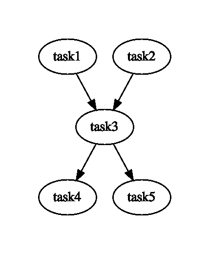

# 完美:轻松编排您的数据 ETL 管道

> 原文：<https://levelup.gitconnected.com/prefect-orchestrate-your-data-etl-pipeline-easily-e18e673556f>

## “自动化数据的最简单方法！”

高效地编排数据 ETL 管道总是让我感到不舒服。我做数据工程师已经很多年了，花了很多时间寻找最有效的方法来实现这一点，但是还没有找到一个完整的解决方案。

许多工具可以帮助管理数据管道，例如 ETL 框架、数据仓库等。然而，这些工具中的大多数不能有效地处理数据管道，并且仅提供一组工具和一个过程来遵循。

我最近发现了一个可以自动创建数据管道的工具，它让我很高兴与您分享。

这个工具叫做**提督。**本文将介绍我们如何使用 Prefect 建立数据管道。

# 长官

Prefect 是一个开源的、基于云的 ETL 管道工具。它可以处理所有数据管道阶段，包括数据接收、转换、暂存和数据加载。

> “自动化数据的最简单方法！”

# 先决条件

我们需要首先安装以下工具。

*   [**提督**](https://docs.prefect.io/core/getting_started/install.html#basic-installation)—python 数据 ETL 包。
*   [**Graphviz**](https://graphviz.org/) —可视化流程的开源图形可视化工具。

# 编写编排管道

这里我们将假设一个类似下图的工作流。我们有五个任务按特定的顺序执行。有些是相互依赖的。

*   *任务 1* 和*任务 2* 是没有依赖关系的独立任务。
*   *任务 3* 依赖于*任务 1* 和*任务 2*
*   *任务 4* 和*任务 5* 依赖于*任务 3*

流向图

**依赖关系是指如果 A 依赖于 B，那么 B 必须在 A 之前执行。**

下面是完整的代码:

任务就像一个函数:它有选择地接受输入，执行一个动作，并产生一个可选的结果。创建任务最简单的方法是通过修饰 Python 函数。

一个**流**是任务的容器。它通过描述任务之间的依赖关系来表示整个工作流或应用程序。流是有向无环图或“有向无环图”这是描述某些组织原则的数学方法:

这里有几点需要提一下:

*   `Flow`类带有一个用于检查 DAG 的内置`visualize`方法
*   `flow`类的`run`方法执行该流程。
*   `flow`的`result`属性存储所有任务结果。

# 结论

如果您决定为您的数据 ETL 管道选择一个编排解决方案，我强烈推荐**提督**。

我希望你喜欢读这篇文章😄。如果你想支持我☕作为一个作家，考虑报名参加[成为一个媒体成员](https://jerryan.medium.com/membership)。你还可以无限制地访问媒体上的每个故事。