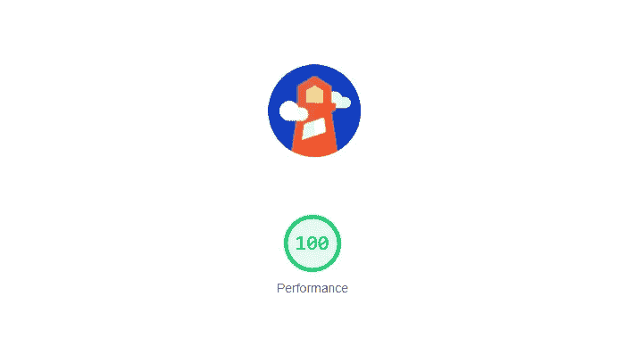
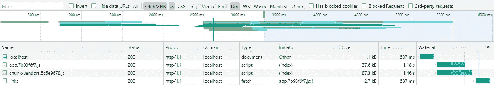
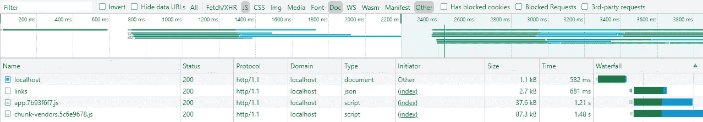
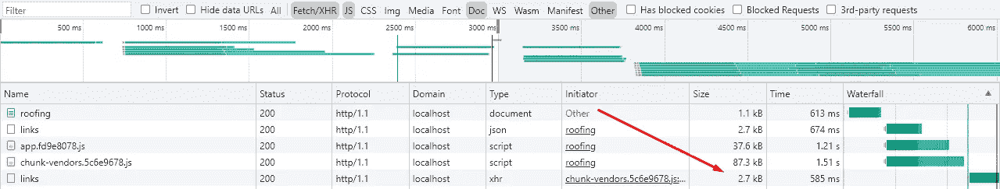
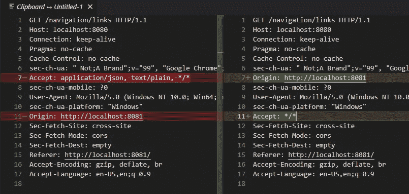
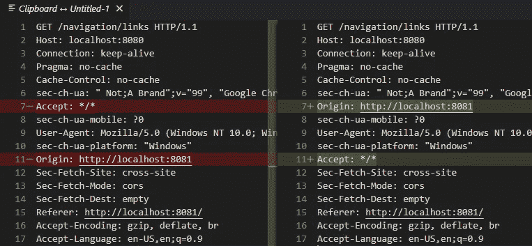
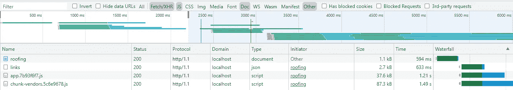
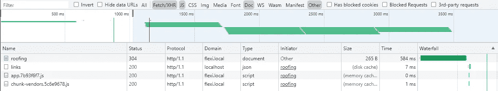

# 预加载 JSON 来更快地加载网站(灯塔，搜索引擎优化)

> 原文：<https://levelup.gitconnected.com/preload-json-to-load-websites-faster-lighthouse-seo-880a31815913>

## 使用<link rel="”preload”">时避免问题

# 介绍

也许您的 web 应用程序在打开页面时会加载一个单独的 JSON 文件(用于配置、动态站点范围的资源等。)这对于单页应用程序来说尤其常见。如果你是为了更快的加载时间而优化它，那么在需要资源之前下载它会有所帮助。

考虑一个真实世界的例子:一个(客户端呈现的)Vue.js 应用程序绘制了一个导航栏，但是链接是动态的而不是静态的——它们是从后端内容管理系统中检索的。CMS 通过`GET /navigation/links`提供链接。一旦应用程序的逻辑被加载，它就请求这些链接。让我们在 Chrome DevTools 中看到它:

Links JSON 仅在应用程序逻辑之后下载(见右边的瀑布专栏)

我们可以注意到请求是批处理的:

1.  html 文档
2.  文档请求应用程序逻辑(。js 捆绑包)
3.  申请请求`/navigation/links`

在我们的例子中，请求并没有在这里结束:文件包含元数据，让应用程序知道它在哪个页面上，以及进一步请求什么资源。因此，之后有第四批请求拉各种其他资源(例如，产品列表，类别信息)和第五批下载图像。有这么多请求阶段的网站会不必要地降低用户体验。

# 用<link>预压

无论我们在哪个页面，我们的 JSON 文件都是必需的，因此我们知道它会一直被使用。这是预压的重要条件。

我们将聪明地使用`[<link rel=”preload”>](https://developer.mozilla.org/en-US/docs/Web/HTML/Link_types/preload)`，而不是重新发明轮子。这个声明要求我们指定如何使用资源。我们检查 MDN 的可靠文档:

> [可以预加载哪些类型的内容？](https://developer.mozilla.org/en-US/docs/Web/HTML/Link_types/preload#what_types_of_content_can_be_preloaded)
> 
> `audio`:音频文件，通常在`<audio>`中使用。
> `document`:由`<frame>`或`<iframe>`嵌入的 HTML 文档。
> `embed`:嵌入`<embed>`元素内部的资源。
> `fetch`:由 fetch 或 XHR 请求访问的资源，如 ArrayBuffer 或 JSON 文件。
> `font`:字体文件。
> `image`:图像文件。
> `object`:嵌入`<object>`元素内部的资源。
> `script` : JavaScript 文件。
> `style` : CSS 样式表。
> `track` : WebVTT 文件。
> `worker`:JavaScript web worker 或者共享 worker。
> `video`:视频文件，通常用于`<video>`。

所以我们用`as="fetch"`。

我们还必须指定 CORS 行为，不管我们的后端是否托管在同一个域/端口上(source [1](https://developer.mozilla.org/en-US/docs/Web/HTML/Link_types/preload#cors-enabled_fetches) ， [2](https://developer.mozilla.org/en-US/docs/Web/HTML/Element/link#attr-crossorigin) )。我们的文件是公共资源，我们设置`crossorigin="anonymous"`。

额外赠送`type=”application/json”`。

现在我们的完整标签是:`<link rel=”preload” href=”[host]/navigation/links” as=”fetch” type=”application/json” crossorigin=”anonymous”>`。将其放入文档的`<head>`中。再次加载页面。我们得到:

Links JSON 现在和 Javascript 一起下载。下载完成得更早，这意味着应用程序可以立即绘制导航栏。(见瀑布栏。)

太好了！但是当我们请求时，Chrome 会使用这个存储的文档吗？

# 检索问题

检查文件的第二个请求的大小列(底部)。如果文件被缓存，它将显示*内存缓存*或*磁盘缓存*，而不是其完整的传输大小。这意味着 Chrome 下载了该文件两次，因此任何有意义的渲染都会被延迟。控制台选项卡向我们发出警告:

> 找到了“[https://localhost:8080/navigation/links”](https://localhost:8080/navigation/links')的预加载，但由于请求头不匹配而未使用。

我们下载两个请求的头(右键单击->复制->复制请求头)并区分它:

标题顺序是混合的，但只有*接受*标题不同。

我们的应用程序使用了 [axios](https://www.npmjs.com/package/axios) ，所以覆盖*接受*头看起来像这样:

编译，刷新，它仍然不工作。控制台给我们同样的警告，但是标题现在是一样的:

Axios 由 XHR 驱动。请注意，在最后一个网络记录中，两个请求具有不同的类型。

# 解决方案

修改应用程序以使用本机[获取 API](https://developer.mozilla.org/en-US/docs/Web/API/Fetch_API) 而不是 axios/XHR。Fetch 比 XHR 更新，链接标签的`as=”fetch"`属性表明这可能是解决方案。

再次点击刷新:

终于！我们知道它起作用了，因为第三批请求拉取了没有被 JSON 文件延迟的其他资源(没有显示在所选范围内)。应用程序的实际调用并没有显示为请求。

MDN 文档建议使用带有 *XHR* 和 *fetch()* 的预加载资源的方式相同(特别是在使用`as=”fetch”`时)。所以还不清楚问题是什么。这也是不幸的，因为潜在的大量代码将需要重写以使用 Fetch(取决于您的情况)。例如，`axios.create()`对于保持干燥非常有用，而 Fetch 没有这样的预配置选项。

# 额外:缓存 JSON

预加载有助于减少新访客的启动时间。缓存 JSON 响应可以进一步改善回访者的体验。

为此我们包含了一个 [*缓存控制*](https://developer.mozilla.org/en-US/docs/Web/HTTP/Headers/Cache-Control) 头。因为我们的特定文件对于任何用户都是一样的，所以我们使用了`public`指令。更重要的是，我们用`max-age`设置了它的生存期(以秒为单位)。不要忘记指令是用逗号分隔的。在 Express.js 应用程序中，它看起来像这样:

打开网站，然后刷新:

更好的是，我们完全取消了这个请求。对于较慢的网络来说，这是一个巨大的胜利(本文使用了快速 3G 节流)。现在，真正重要的请求已经转移到第二批。

对比网络审计结果，我们可以看到 JSON 文件是如何从在启动的第四个*秒内加载到第一个*秒内加载的。**

看到解决方案如此有效，您可能会受到启发，去寻找更多可以预加载和缓存的站点范围的资源。

# 额外:使用自签名证书进行测试

如果你用无效的证书运行 HTTPS，Chrome 仍然不会缓存你的文件([来源](https://stackoverflow.com/a/35328096/3722143))。通过 HTTP 或有效证书验证解决方案。

# 浏览器

这个解决方案已经在 Chrome 和 Firefox 上测试过了。