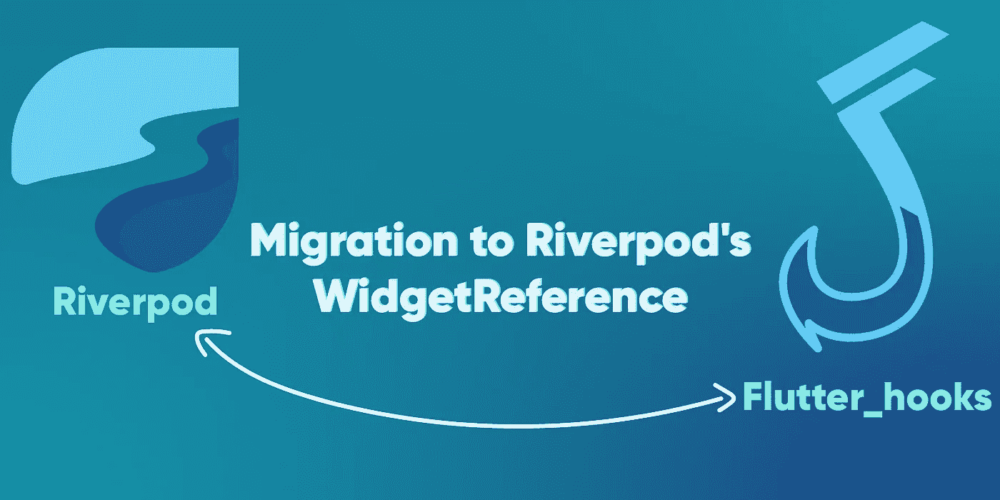

# 为 RiverPod 的 WidgetRef 实现准备您的 Flutter 代码

> 原文：<https://levelup.gitconnected.com/prepare-your-flutter-code-for-the-widgetreference-implementation-of-riverpod-ebf8af4e8d00>

2021 年 6 月 19 日，在开发该功能的过程中，`WidgetReference`被重命名为`WidgetRef`

RiverPod 是一个针对 Dart 的编译安全依赖注入器，它与 Remi Rousselet 开发的 Flutter 完美配合。尽管作为一个状态管理器很强大，但它将在接下来的几周内遭受一些突破性的变化(这些变化仍在开发中)。



变更的完整解释在 GitHub 库的 RFC 335 中。

[](https://github.com/rrousselGit/river_pod/issues/335) [## [RFC]监听提供者的统一语法(v2)问题#335 rrousselGit/river_pod

### 本 RFC 是#246 的后续，提案略有不同。问题是一样的:Riverpod 需要一种方法来…

github.com](https://github.com/rrousselGit/river_pod/issues/335) 

基本上，主要的更新是`ConsumerWidget`、`Consumer`和`useProvider`将如何工作。

```
class MyWidget extends ConsumerWidget {
  const MyWidget({Key? key}) : super(key: key); @override
  Widget build(BuildContext context, WidgetRef ref) {
    final counter = ref.watch(myCounterProvider);
    return Text('$counter');
  }
```

因此，`Consumer`小部件将按如下方式工作:

```
Consumer(
  builder: (context, ref, child) {
    final counter = ref.watch(counterProvider);
    return GestureDetector(
      onTap: () => ref.read(counterProvider.notifier).increment(),
      child: Column(
        children: [
          child,
          Text('$counter),
        ],
      ),
    );
  },
  child: Text('Tap me'),
}
```

并且`useProvider`将会消失，而`HookConsumerWidget`和`HookConsumer`将会被创建。这些将分别作为`ConsumerWidget`和`Consumer`工作，但支持`hook` s。

您还可以在 GitHub 中看到 WIP 实现:

[](https://github.com/rrousselGit/river_pod/pull/462) [## 通过 rrousselGit 拉请求#462 rrousselGit/river_pod 实施 RFC 335

### implements # 335 TODO:Update Consumer/Consumer widget Remove use provider Add hook Consumer/hook Consumer widget Update docs…

github.com](https://github.com/rrousselGit/river_pod/pull/462) 

如果您在您的项目中使用`RiverPod`，您可能更喜欢现在进行迁移，因为稍后它将代表更多的工作。如果是的话，我为你准备了下面的代码。

不导入`hooks_riverpod`或`flutter_hooks`，而是导入该文件。下一个版本发布时，您只需编辑这个文件，删除所有代码，只导出两个包中的一个。🎉

```
//export 'package:flutter_riverpod/flutter_riverpod.dart';
export 'package:hooks_riverpod/hooks_riverpod.dart';
```

在 GitHub 中跟随我😃

[](https://github.com/kranfix/) [## kranfix -概述

### 一个用 C 和 Java 写的扩展卡尔曼滤波器。五月六月七月八月九月十月十一月…

github.com](https://github.com/kranfix/)