# Prerender Angular 并将其部署为 AWS S3 的静态网站，使其速度提高 42 倍

> 原文：<https://levelup.gitconnected.com/prerender-angular-and-deploy-it-as-a-static-website-on-aws-s3-to-make-it-42-times-faster-115fadcf8614>


通过预渲染加速您的角度

从上一篇[帖子](/deploy-your-serverless-server-side-rendering-ssr-angular-app-on-aws-lambda-a01a3aab6ef6)中，我们已经了解了如何在 AWS Lambda 上部署无服务器的服务器端渲染(SSR) Angular 应用程序，我们还了解了 SSR 网站如何具有更好的 SEO 性能和相对更低的价格。

因为页面内容是在运行时在服务器上动态生成的，然后被发送回浏览器，所以不可避免地会有副作用:等待第一个字节(TTFB)的时间更长。

> 到达第一个字节的时间(TTFB)是用户请求特定 URL 时从 web 服务器接收第一个字节所需的时间。

在下面的截图中，你可以看到上一篇[帖子](/deploy-your-serverless-server-side-rendering-ssr-angular-app-on-aws-lambda-a01a3aab6ef6)中我们在 AWS Lambda 上部署的两页网站的`830ms` TTFB。

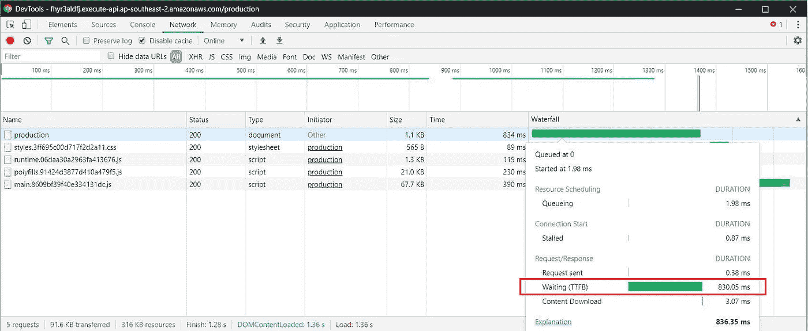

两页 SSR 网站的 TTFB

您可能会问:我们能够在不损失 SEO 性能的情况下降低 TTFB 吗？今天的主题:预渲染静态站点。

下面的截图是我们预渲染静态网站的 TTFB，快了 42 倍！

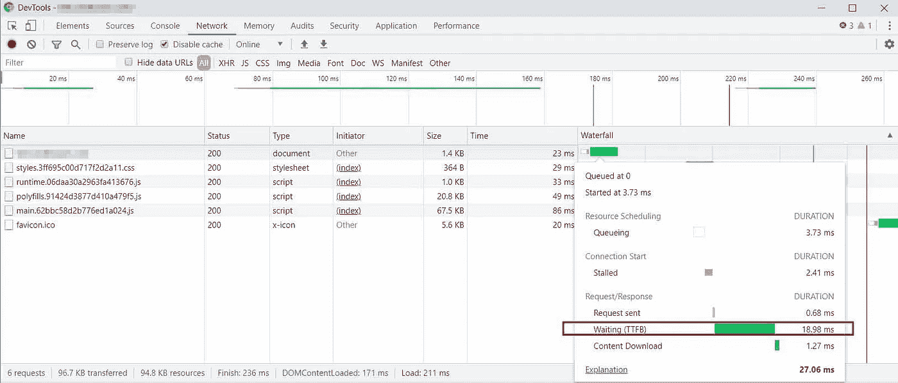

两页静态网站的 TTFB

在本帖中，我们将介绍:

1.  如何在构建时将 Angular 预渲染成静态文件
2.  托管您的静态文件在 AWS S3 与自定义域使用 HTTPS
3.  部署定价

你可以从我的 Github repo 下载代码: [angular-prerender](https://github.com/theideasaler/angular-prerender) 。

# 1.在构建时将角度预呈现到静态文件中

因为我们最终将在 AWS S3 部署我们的静态文件，所以 S3 唯一的路由系统是基于目录结构的。例如，如果你想访问' www.example.com/contact '，那么你必须在根目录下创建一个名为' contact '的文件夹，并在其中创建一个`index.html`文件。所以最终的目录结构将如下所示:

```
|---root
|---index.html
|---/home
    |---index.html
|---/contact
    |---index.html
```

在这种情况下，我们需要创建一个 Node.js 应用程序，在其中，我们将把每个可能的路径作为 param 和 Angular 应用程序一起传递给渲染引擎，以生成`index.html`文件。流程图如下所示:

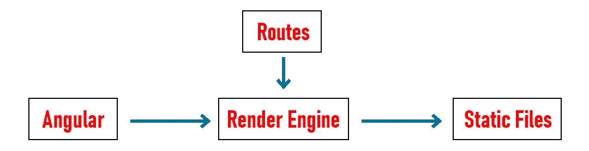

预 render 流程图

所以我们的想法是:

(1)在我们项目的根路径下创建一个`prerender.ts`文件，它将包含我们的 Angular app、route params 和 render engine。

(2)在`webpack.server.config.js`中加入`prerender.ts`作为切入点，将 TypeScript 编译成 commonjs，对于 Nodejs 来说是可以理解的。

(3)将相关配置/脚本添加到`angular.json`和`package.json`中，生成相关文件。

让我们看看代码。

1.  **根/先决条件. ts**

project/prerender.ts

路线参数定义了可能的路线:

```
const staticRoutes = [
  "/",
  "/home",
  "/contact"
];
```

Angular app 是从`root/dist/server/main.js`加载的

```
const { AppServerModuleNgFactory, LAZY_MODULE_MAP } = require('./dist/server/main');
```

渲染引擎正在调用`@angular/platform-server`提供的`renderModuleFactory`函数。

> `[*renderModuleFactory*](https://angular.io/api/platform-server/renderModuleFactory)*()*`函数将一个*模板* HTML 页面(通常是`*index.html*`)、一个包含组件的角度*模块*和一个决定显示哪些组件的*路径*作为输入。

```
renderModuleFactory(AppServerModuleNgFactory, {
  document: index,
  url: route,
  extraProviders: [provideModuleMap(LAZY_MODULE_MAP)]
}).then( html => writeFileSync(
  join(folderPath, 'index.html'),
  html
));
```

**2。webpack.server.config.js**

```
module.exports = {
  mode: 'none',
  entry: {
    server: './server.ts',
    prerender: './prerender.ts' // new entry point for prerendering
  },
  ...
}
```

**3。angular.json &包. json**

angular.json:

```
{
  "$schema": "./node_modules/@angular/cli/lib/config/schema.json",
  "version": 1,
  "newProjectRoot": "projects",
  "projects": {
    "angular-pre": {
      ...
      "architect": {
        "build":{
          ...
        },
        "static":{
          ...,
          "options":{
            "outputPath": "dist/static", 
            "index": "src/index.html", 
            "main": "src/main.ts",
            ...
          },
          "configurations": {
            ...
          }
        },        
        "serve":{
          ...
        },
        ...
      }
    },
    ...
  }
  "defaultProject": "angular-pre"
}
```

package.json:

```
...
"scripts":{
  ...,
  "build:pre": "ng run angular-pre:server:production && npm run compile:server && ng run angular-pre:static:production && node dist/prerender.js",
  "serve:pre": "http-server dist/static",
  ...
},
...
```

让我们来看看这个新剧本:

(1) `ng run angular-pre:server:production`生成服务器端角度

(2) `npm run compile:server`运行 webpack 编译`prerender.ts`

(3) `ng run angular-pre:static:production`预生成*等静态文件。js，*。资产文件夹中的 css 和图像

(4) `node dist/prerender.js`将编译后的`prerender.js`作为节点应用程序运行

现在运行`npm run build:pre`来生成我们的静态文件。`dist`文件夹结构将类似于下面的截图:

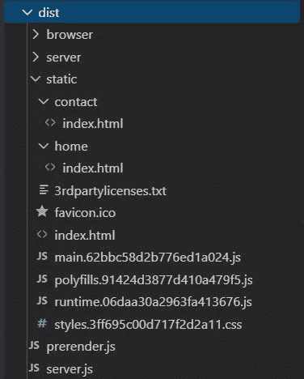

静态网站目录结构

如果想在本地环境下看到静态网站，可以通过运行`npm install --save-dev http-server@0.9.0`安装`http-server`，使用 http-server: `npm run serve:pre`提供生成的静态文件。现在，打开`localhost:8080`，你会看到这个网站看起来和我们在[上一篇文章](/deploy-your-serverless-server-side-rendering-ssr-angular-app-on-aws-lambda-a01a3aab6ef6)中部署的一样。

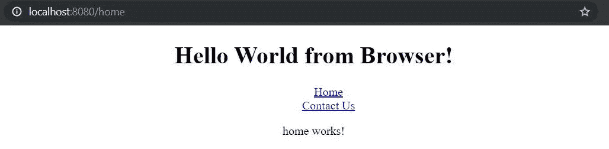

http 服务器服务的静态网站

感到失落？随时下载[回购](https://github.com/theideasaler/angular-prerender)。

# 2.托管您的静态文件在 AWS S3 与自定义域使用 HTTPS

**2.1 压缩静态资产文件**

在我们在 AWS S3 上部署静态文件之前，我们需要压缩(gzip)我们的。js 和。css 文件，以减少带宽负担。如果你使用的是 windows，你可以安装 [git bash](https://gitforwindows.org/) 来使用 Linux cli。

> *注意:我们也可以通过为* `**.js*` *和* `**.css*` *路径模式创建 AWS CloudFront 行为规则来动态压缩静态文件，但这将增加 TTFB，并且不会帮助我们节省 S3 出站限制。*

导航到静态文件夹`cd dist/static`，运行:

```
gzip main.*.js
gzip poly.*.js
gzip runtime.*.js
gzip styles.*.css
```

**2.2 创建两个 S3 桶并上传您的静态文件**

使用默认设置创建两个桶，并使用您的根域名**yourdoamin.com**和子域名**www.yourdoamin.com**。现在你有两个桶:

第一桶:example.com

第二桶:www.yourdoamin.com

**按以下步骤配置铲斗 1:**

(1)打开 bucket 1 >权限>阻止公共访问>取消勾选'阻止*所有*公共访问'**复选框**保存

(2)打开存储桶 1 >权限>存储桶策略>复制并粘贴以下策略>保存

```
{
   "Version":"2012-10-17",
   "Statement":[
      {
         "Sid":"PublicReadGetObject",
         "Effect":"Allow",
         "Principal":"*",
         "Action":[
            "s3:GetObject"
         ],
         "Resource":[
            "arn:aws:s3:::**yourdoamin.com**/*"
         ]
      }
   ]
}
```

(3)打开存储桶 1 >属性>静态网站托管>使用此存储桶托管网站>在索引文档>保存中键入“index.html”

**按照以下步骤配置铲斗 2:**

打开桶 2 >属性>静态网站托管>重定向请求>目标桶或域:键入' yourdomain.com ' >协议:键入' https ' >保存

**重命名。js 和。css 文件并添加元数据**

完成配置后，您可以将静态文件上传到 bucket 1 中，但是您需要通过 remove 来重命名那些先前的 gzipped 文件。gz 后缀。

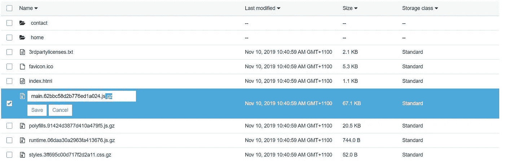

移除。压缩文件的 gz 后缀

此外，您需要为您的静态`*.js`和`*.css`文件添加相关元数据:选择文件>动作>更改元数据>保存

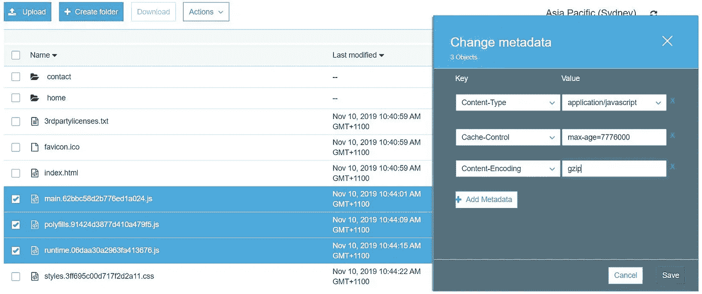

更改 gzipped 文件的元数据

现在，如果你打开你的桶 1 的端点(打开桶 1 >属性>静态网站托管>点击 S3 端点)，你将能够看到你的网站与 http 协议。

**2.3 使用 AWS 证书管理器创建证书**

因为 S3 不支持 HTTPS，所以我们需要创建一个 CloudFront 发行版作为我们的 S3 bucket 的前门。

通过以下步骤创建证书:

(1)在您的 AWS 控制台>中，将您的地区更改为**美国东部(北弗吉尼亚)**

(2)查找服务>证书管理器>请求证书>请求公共证书>添加域名:添加 yourdomain.com 和 www.yourdomain.com > DNS 验证>确认和请求>继续>状态面板:单击“创建 53 号路线记录”按钮

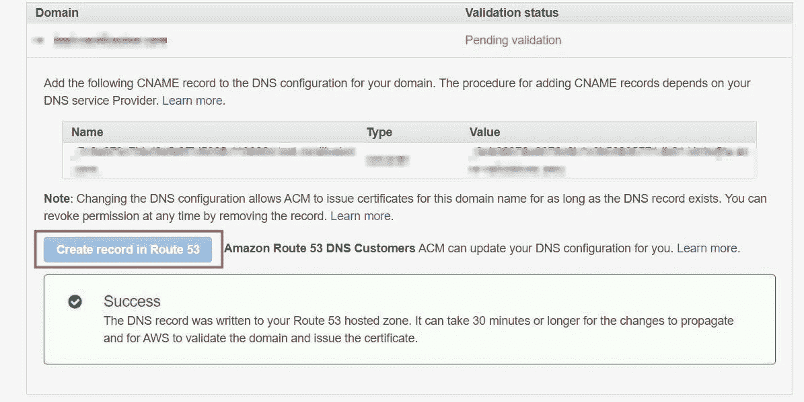

创建证书

**2.4 创建 CloudFront 分布**

通过以下步骤创建一个 CloudFront 发行版:

(1)查找服务> CloudFront >创建分发> Web:入门

(2)原点设置>原点域名>复制粘贴桶 S3 端点 URL

**注意:* ***不要用 s3 桶名的自动补全，要用你的 S3 桶 1 的端点*** *，应该类似于:your domain . com . S3-website-your-region-region id . Amazon AWS . com，否则 index.html 默认的 S3 目录路由不行。*

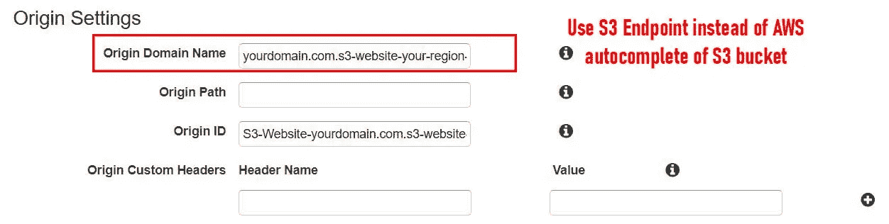

原始域名的配置

(3)默认缓存行为设置>查看器协议策略>将 HTTP 重定向到 HTTPS

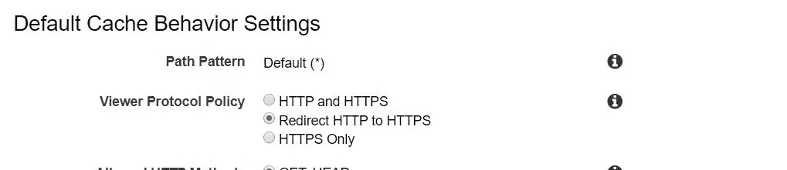

(4)分发设置>备用域名和 SSL 证书

在备选域名中添加 yourdomain.com 和 www.yourdomain.com。选择您为您的域创建的证书。

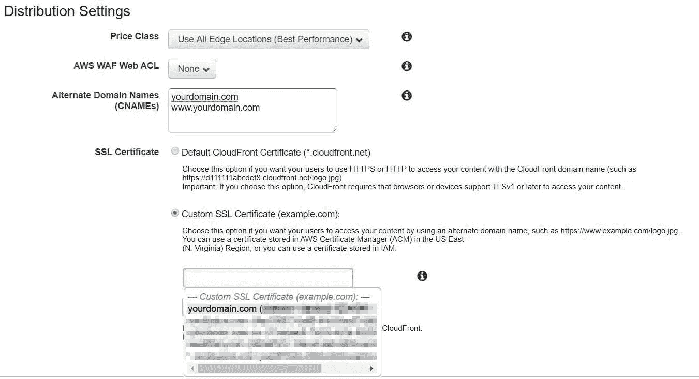

(5)分布设置>默认根对象>类型:index.html

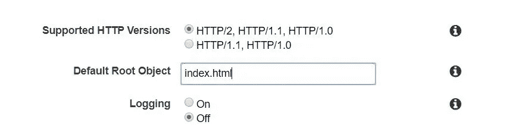

(6)将其他设置保留为默认设置>单击“创建分发”

**2.5 配置 53 路**

使用以下步骤在 53 号公路上创建指向 CloudFront 配送的 2 A 记录:

(1)查找服务> Route 53 >托管区域>单击 yourdomain.com >创建记录集>键入以下设置

```
Name: yourdomain.com
Type: A - IPv4 Address
Alias: Yes
Alias Target: yourcloudfrontdistribution.cloudfront.net.
Routing Policy: Simple
```

(2)重复第一步，为 www.yourdomain.com 子域创建一条记录。

```
Name: www.yourdomain.com
Type: A - IPv4 Address
Alias: Yes
Alias Target: yourcloudfrontdistribution.cloudfront.net.
Routing Policy: Simple
```

**2.6 使用您的自定义域名打开您的静态网站**

一旦您的 CloudFront 发行版成功部署，您将能够看到您的静态网站和您的自定义域。现在，打开 yourdomain.com，你会看到你的网站:


预渲染静态网站

**2.7 TTFB 比较**

现在，如果您打开浏览器并通过 DevTools 检查网络，您将看到预渲染静态网站的 TTFB:


预渲染静态网站 TTFB

相比我们 SSR 网站部署在 AWS Lambda 上的 830ms TTFB，现在速度快了 42 倍。

# 3.部署定价

在 AWS S3 上托管轻量级网站比在 AWS Lambda 上部署要贵一些，但与 EC2 相比，价格仍然相对较低。AWS 标准存储、AWS S3 GET 请求、CloudFront 请求、CloudFront 数据转出将向您收费。作为 [AWS 自由层](https://aws.amazon.com/free/?all-free-tier.sort-by=item.additionalFields.SortRank&all-free-tier.sort-order=asc)的一部分，AWS 为您提供:

*   AWS S3 的 5GB 标准存储
*   每月收到 20000 份 AWS S3 *的请求*
*   每月 2 亿次对 CloudFront *的请求*
*   每月从 CloudFront *传输 50 GB 数据*

假设我们的简单网站每月有 10000 次访问，每次访问将需要来自 CloudFront 的 100 万个数据和 6 个对 S3 的 GET 请求。然后，每个月我们的 S3 bucket 会收到 60000 个 GET 请求，并从 CloudFront 传输 10GB 数据。在这种情况下，我们将只收取 AWS S3 额外的 40000 GET 请求。

在澳大利亚悉尼，AWS GET 请求的价格为:[【每 1000 个请求 0.00044 美元](https://aws.amazon.com/s3/pricing/?nc=sn&loc=4)。

计算:0.00044 * (40000/1000) = 0.0176。

然后，我们估计每月静态网站的总成本约为 0.0176 美元。

# 包扎

预渲染可以在很大程度上解决我们 SSR 网站中的长 TTFB，同时又不会牺牲 SEO 性能。此外，用 CloudFront 在 AWS S3 上托管我们的网站的价格相对较低。那么为什么不开始使用它呢？

下一篇文章将讨论如何使用 nodemailer & Gmail 创建一个无服务器电子邮件机器人，并将其部署在 AWS Lambda 上。

其他职位:

*   [优化角度性能的 9 个终极技巧](https://neowei.medium.com/9-ultimate-tips-to-improve-angular-performance-dbedb0ec4e2d)
*   [以最简单的方式创建一个可调整大小和可拖动的角度组件](https://medium.com/@neowei/create-a-resizable-and-draggable-angular-component-in-the-easiest-way-bb67031866cb)
*   [小心将异步函数作为参数传递](https://medium.com/@neowei/be-careful-of-passing-an-async-function-as-a-parameter-4f421f8e7e9d)
*   [在 AWS Lambda 上部署无服务器的服务器端渲染 Angular。](/deploy-your-serverless-server-side-rendering-ssr-angular-app-on-aws-lambda-a01a3aab6ef6)
*   [使用 Gmail、Node 和 AWS Lambda 创建一个免费的无服务器联系表单](/create-a-free-serverless-email-bot-using-gmail-nodejs-and-aws-lambda-8e56dbfde7a7)
*   [将 Angular 从 CSS 升级到 SCSS 的分步指南](https://medium.com/@neowei/step-by-step-guide-to-upgrade-your-angular-app-from-css-to-scss-fb347330fe28)