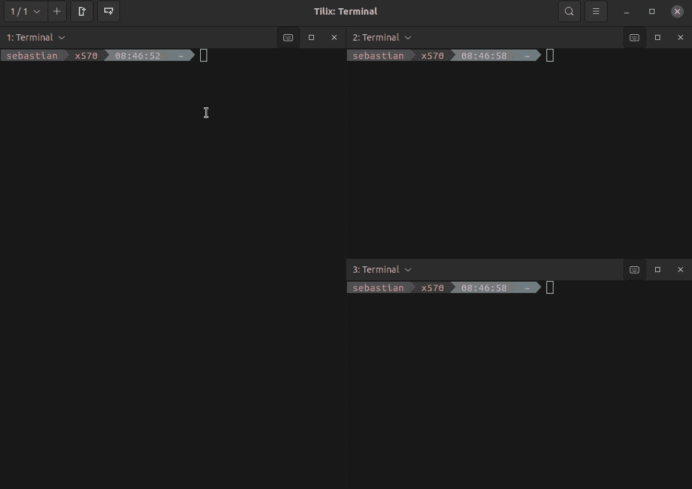
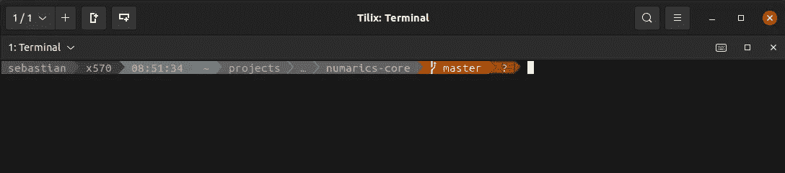
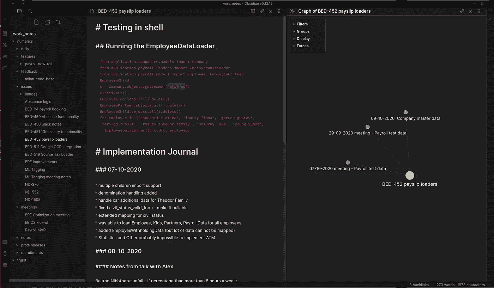
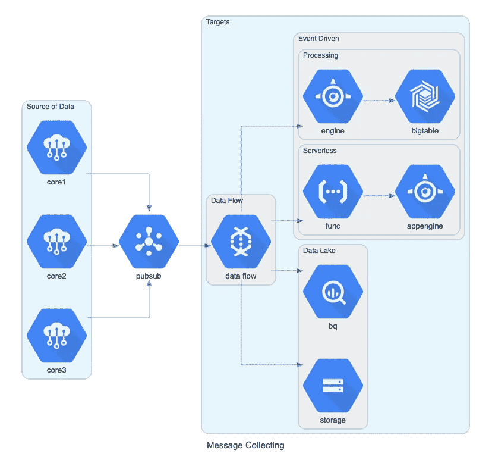
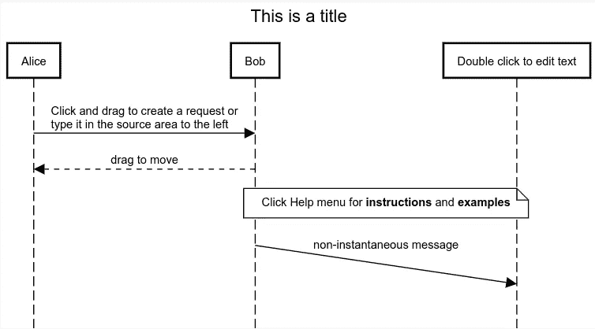
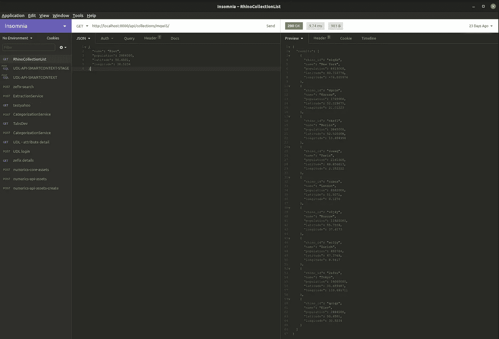
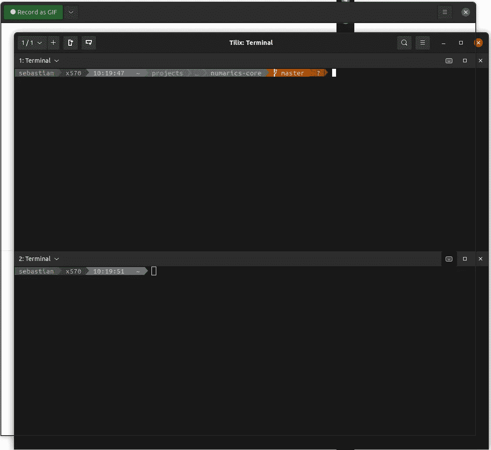

# 展示我的编码工具带

> 原文：<https://levelup.gitconnected.com/presentation-of-my-tool-belt-b3cde5d73784>


最好是为正确的工作使用正确的工具——图片由作者提供。

我可以假设每个程序员都有自己喜欢的工具。在我的职业生涯中，我收集了很多工具，并把它们放在了我的工具带上。有些我已经用了很久了，不打算换。有些工具仅用于特定的工作。我非常坚持寻找更好的工具，所以如果我意识到他们以更好的方式完成工作，我会毫不犹豫地更换他们。

这篇文章是为了让你找到一些灵感来尝试你不知道的新工具。

我给这里展示的每个工具分配了一个主要类别:编程、笔记和文档、实用工具、通信和其他。

> 你要注意，我是 Linux 用户，我说这个不是为了吹牛。情况是，在 Linux 生态系统中，选择工具有点复杂，也更具挑战性。2021 年要比 2010 年好得多，但是，有时候还是很难找到合适的工具。如果它们是免费的——通常不工作(但是我们有很多很棒的开源工具),如果它们是付费的——Linux 不被支持，等等，但是即使考虑到 Linux 生态系统上的工具带的局限性，它也可能是强大的。

# 编程；编排

## [**PyCharm 职业**](https://www.jetbrains.com/pycharm/)

**为了什么**

*   集成开发环境
*   用于用 Python 编码的工具(但不仅如此，我还在这里写 JavaScript 和 HTML)
*   富有成效

**我喜欢什么**

*   包括所有电池——有了这个 IDE，不需要额外的配置，works OOB:自动导入、重构工具、语法高亮、检查、错误高亮、拼写检查、Python profiler、对其他语言的支持、web 框架支持、科学工具支持等等。我是这个 IDE 的忠实用户，我仍然发现了新的特性:)
*   大屏幕上的面板排列
*   它可以在 Linux 上工作
*   JetBrains 的节奏与 IDE 更新和新功能

**更多语境**

*   有趣的事实:这个工具带中我唯一付费的工具(GSuite 除外)
*   我不会说那是最好的 Python IDE，原因很简单，每个开发人员都有自己最喜欢的。如果有人已经掌握了这个工具，改变它几乎没有意义——如果它解决了同样的问题。

## [Tilix](https://gnunn1.github.io/tilix-web/)

**干什么用的**

*   终端仿真器

**我喜欢什么**

*   瓷砖！都很神奇。您可以将终端窗口分成多个小块，同步输入，并同时操作各种节点(例如，在 EC2 实例上)。这里有一个例子:



带有三个同步瓷砖的 Tilix。

*   它在 Linux 上工作:)

## [书呆子字体](https://github.com/ryanoasis/nerd-fonts)和[脑浆单声道](https://www.jetbrains.com/lp/mono/)

**为了什么**

*   拥有漂亮的字体和作为开发人员的良好体验。

**我喜欢什么**

*   Nerd Font 提供的自定义字符与[*power line-shell*](https://github.com/b-ryan/powerline-shell)配合得非常好，在 Tilix 中提供了很好的体验，如上所述，在内置的 PyCharm 终端中也是如此。在这里，您可以看到 git 项目的漂亮提示示例:



电力线-外壳在行动

*   正如您在上面的例子中看到的，我在提示中显示了时间、路径、分支名称，甚至存储库状态——红色的问号意味着我有一些未被跟踪的文件。书呆子字体可以修补任何字体，使其工作得很好——它只需将*书呆子*字形添加到您的字体中。

**更多语境**

*   第一次我花了半天时间学习如何用 NerdFont 修补 JetBrains Mono 字体，但结果非常好，值得。
*   我认为(只是假设)不要去关注所用的字体，我对这个话题的看法是程序员应该使用为程序员设计的字体。它使代码更具可读性，并提高了生产率。
*   在 JetBrains Mono 之前，我用的是源代码 Pro——也是一种完美的字体。
*   永远不要低估字体:)一个好的字体可以节省你大量的编码时间。一个不好的可以把你带到崩溃的边缘:)

## [原子](https://atom.io)

**干什么用的**

*   用于概念的快速代码验证
*   对于便笺——但更像是临时便笺，此类便笺的寿命通常不会超过一天
*   使用文本格式的文本和数据—调试、搜索模式、编辑

**我喜欢什么**

*   它很轻
*   并且在 Linux 上工作:)

**更多语境**

*   Atom 很可能会被 JetBrains 舰队取代，真的很快，因为我已经签署了封闭预览。

## [纳米](https://www.nano-editor.org)

**为了什么**

*   在终端中编辑文本文件，包括本地和远程节点

**我喜欢什么**

*   很简单
*   比 VIM 简单多了
*   键盘快捷键和简洁界面的设计

# 注释和文档

## [简单注释](https://simplenote.com)

**为了什么**

*   做临时笔记，如想法、会议总结、高级计划等。

**我喜欢什么**

*   它可以在 Linux、MacOSX(我有 Macbook Air 在自助餐厅工作)、Windows 和移动设备上运行。
*   它会将你的笔记推送到云端，因此笔记可以在所有设备上同步。
*   它有标记功能！许多人讨厌标记(根据我的观察)，但我认为这是将笔记组织成桶的最简单的方法之一。

## [降价](https://en.wikipedia.org/wiki/Markdown)

**为了什么**

*   对于写作来说，它毕竟是一种标记语言。
*   你可以用 Markdown 创建 HTML、PDF、好看的笔记、文档；可能性是无限的。你唯一需要做的就是学习语法。

**我喜欢什么**

*   创造好看内容的速度。你会发现有很多工具可以将 Markdown 转换成 PDF 演示或 HTML 页面。如果你能熟练使用 Markdown，你可以使用其他工具，如 PowerPoint、GSlides 等，在很短的时间内创建这些材料。
*   也有博客平台支持 Markdown 作为第一公民——这意味着 Markdown 语法可以很好地转换成博客帖子，与 WYSIWYG 编辑器相比，它节省了大量时间。我的[博客平台](https://github.com/opalczynski/simple-blog-platform)使用了这种技术。

**更多语境**

*   有些人会声称 Markdown 是一个糟糕的工具，因为它没有标准化。而且他们是对的——Markdown 有多个标准:)GitHub 有自己的，BitBucket 有自己的，等等。在我看来，这没什么大不了的，因为降价的核心在任何地方都是一样的，你可以学会忍受这些怪癖。
*   在我看来，与其他工具相比，Markdown 引入的开销是最小的(如果不是最小的话)。我在这里是什么意思？比较:

降价 vs HTML vs 重组文本

```
-> Markdown# Title* Sample list
* Second element-> HTML<h1>Title</h1><ul>
    <li>Sample list</li>
    <li>Second element</li>
</ul> -> reStructuredTextTitle
=====- Simple list
- Second element
```

正如您在上面看到的，Markdown 使用最少的特殊字符来处理格式(这意味着更少的输入和更快的输出)。

## [黑曜石](https://obsidian.md)

**干什么用的**

*   对于高级笔记和大脑过程组织。
*   它允许你创建和管理多个文件时，工作在大规模的东西。

**我喜欢什么**

*   图形窗口！这是一个窗口，向你展示你的文档是如何相互联系的，如果你有一些原则，你可以使用这个工具建立完整的思维导图，有很多上下文。



我的黑曜石工作笔记

*   正如你在上图中看到的，你在左边有一个所有文档的列表。中间是 Markdown 编辑器，您可以在其中编辑和预览文件(您也可以将模式切换到仅预览)。在右边，你可以看到文档是如何连接的。您可以在右侧面板中导航，并在文档之间移动。挺酷的:)为了实现这种联系，*黑曜石*有一个独特的标签:`[[link-to-document]]`
*   它使用降价。
*   是啊！它可以在 Linux 上运行。

**更多语境**

*   从我的经验来看，它不适用于小的、不相关的上下文——对于这一点，Simplenote 可以，但它是为更重要的特性或项目收集文档和数据的一个很好的工具。

## [Diagrams.net](https://www.diagrams.net)(之前为 draw.io)

**为了什么**

*   为了创建各种各样的图表，pro 用户可以在这里创建非常好看的图表，以后可以在演示文稿、文档或团队研讨会中使用。

**我喜欢什么**

*   简单的网络界面。
*   它可以在任何地方使用。
*   直观的 UI。

**更多内容**

*   图像胜过千言万语:)所以在你的工作流程中创建图表。图表让你更好地理解事物，也让你更容易与团队合作。

## [图表](https://diagrams.mingrammer.com)

**干什么用的**

*   使用 Python 代码生成基础设施图
*   它功能强大，并且内置了大多数服务的图标(你可以使用 AWS、GCP、Azure、Redis 等开源软件的图标)。)

**我喜欢什么**

*   代码优先方法
*   易于学习和使用

**更多语境**

*   可以被 git 跟踪
*   下面是一个例子:



由图表库创建的示例图表。

## [序列图](https://sequencediagram.org)

**为了什么**

*   用于创建序列图(真是一个惊喜)。

**我喜欢什么**

*   它是一个将特定语法转换成好看的序列图的工具，您可以在文档、会议和其他需要它的地方使用它。
*   由于这是一个基于语法的工具，您可以跟踪代码库中的变化。

**更多语境**

*   您还可以使用 API 并将该工具集成到您的流程中。
*   示例(页面中的默认示例):

```
title This is a titleAlice->Bob:Click and drag to create a request or\ntype it in the source area to the left
Alice<--Bob:drag to move
note over Bob,Double click to edit text:Click Help menu for **instructions** and **examples**
Bob->(3)Double click to edit text:non-instantaneous message
```

上面的代码将生成如下图像:



序列图示例

# 公用事业

## [GSuite](https://workspace.google.com)

**为了什么**

*   电子邮件、日历、表单、文档、幻灯片、驱动器、会议
*   这是一个统治所有人的工具。对你的生意来说就像一把瑞士军刀。假设你和我一样，是一个 solopreneurship，几乎是必备。其他大公司也提供类似的工具，微软或苹果，或多或少他们都在做同样的事情，所以使用哪一个是个人偏好。

**我喜欢什么**

*   它在工作(不算上一次大停机)。
*   它在 Linux 上运行——因为大多数工具都是基于网络的。
*   通常，它很容易使用，不言自明，我们可以讨论谷歌 UX/用户界面，但一般来说，它做的工作。

**更多语境**

*   我想我们都知道 GSuite。这里补充一下只是礼貌。
*   我听起来像是没有感情的人吗？如果是这样的话——是的，那是真的，GSuite 它就像一把锤子。它完成了工作，但你并不激动，因为你钉了钉子。

## [失眠](https://insomnia.rest)

**干什么用的**

*   玩你的 API
*   测试 API 并确保它们正常工作
*   了解 API 是如何工作的——尤其是当您需要与第三方 API 集成时

**我喜欢什么**

*   直觉的
*   使用起来非常简单
*   支持 GraphQL

**更多语境**

*   以前，我主要使用 Postman 来做这种工作，但是当 Postman 开始转向更多的团队/测试方向，并且开始几乎需要登录(不确定这里的状态如何)才能使用它时，我就开始失眠了。
*   示例:



失眠应用。

*   在上图中:左边是所有已定义的请求，中间是请求和请求参数，右边是响应和响应参数。

## [偷看](https://github.com/phw/peek)

**干什么用的**

*   我最近发现的最好的工具——它允许记录 gif
*   录制 gif

**我喜欢什么**

*   它在 Linux 上工作！
*   非常容易使用

**更多语境**

*   我用 Peek 制作我在 Medium 上创作的故事的 GIFs 上面用 Tilix 制作的 gif 就是一个很好的例子。
*   我应该为这个杰作的创造者买一杯咖啡。
*   我也在我的工作流程中使用 GIFs 我只是在拉动请求、时差或其他交流中分享它们，我请求对正在进行的工作的反馈，或者我只是分享我的工作结果或解决方案的建议。这很有效，让团队更加了解。
*   我提到过它可以在 Linux 上工作吗？
*   Peek 是这样的:



在 Tilix 上偷看。

*   您有一个窥视窗口，它可以覆盖在其他窗口上。你可以调整它的大小并对齐，当你准备好了，你点击*记录为 GIF* ，然后 counter kicks in(从 3 开始)，当它达到 0 时，你的记录就开始了。单击“停止”后，您的 GIF 将自动保存。💥沟通

## [松弛](https://slack.com)

**为了什么**

*   用于文字交流。
*   对于迷因。
*   与团队紧密相连。

**我喜欢什么**

*   有大量的集成:GitHub，BitBucket，Atlassian，ClickUp，你能想到的。如果有一个网络工具，它与 Slack 整合的机会是相当高的。
*   线程组织。
*   渠道管理。
*   它完成了任务。

**更多语境**

*   有趣，但最近，我慢慢切换到不和谐在这个遥远的时代，因为我认为它有更好的视频工具。

## [不和](https://discord.com)

**干什么用的**

*   用于文本通信
*   对于迷因
*   对于视频通话
*   用于屏幕共享

**我喜欢什么**

*   视频通话
*   基于角色配置用户权限的可能性非常大
*   大量的整合

**更多语境**

*   专为游戏玩家设计，但我注意到越来越多其他行业的人开始使用 Discord。
*   **我不喜欢的:**线程管理(24 小时不活动后默认存档)。这种行为可以通过升级服务器来改变，但最长是一周(以我的理解)，使 Discord 成为不能用于基于项目的工作的工具。或者你需要弄清楚如何组织沟通。

# 其他的

## [Toggl 轨道](https://toggl.com/track/)

**为了什么**

*   跟踪项目时间。
*   与多个承包商合作时非常有用。

**我喜欢什么**

*   好用。
*   在手机和网络上工作。
*   免费版本已经提供了很多价值——管理项目、客户、报告和时间跟踪。

感谢阅读。我希望我能激发你对上面提到的一些工具的兴趣。如果是这样——请毫不犹豫地鼓掌并跟我来。