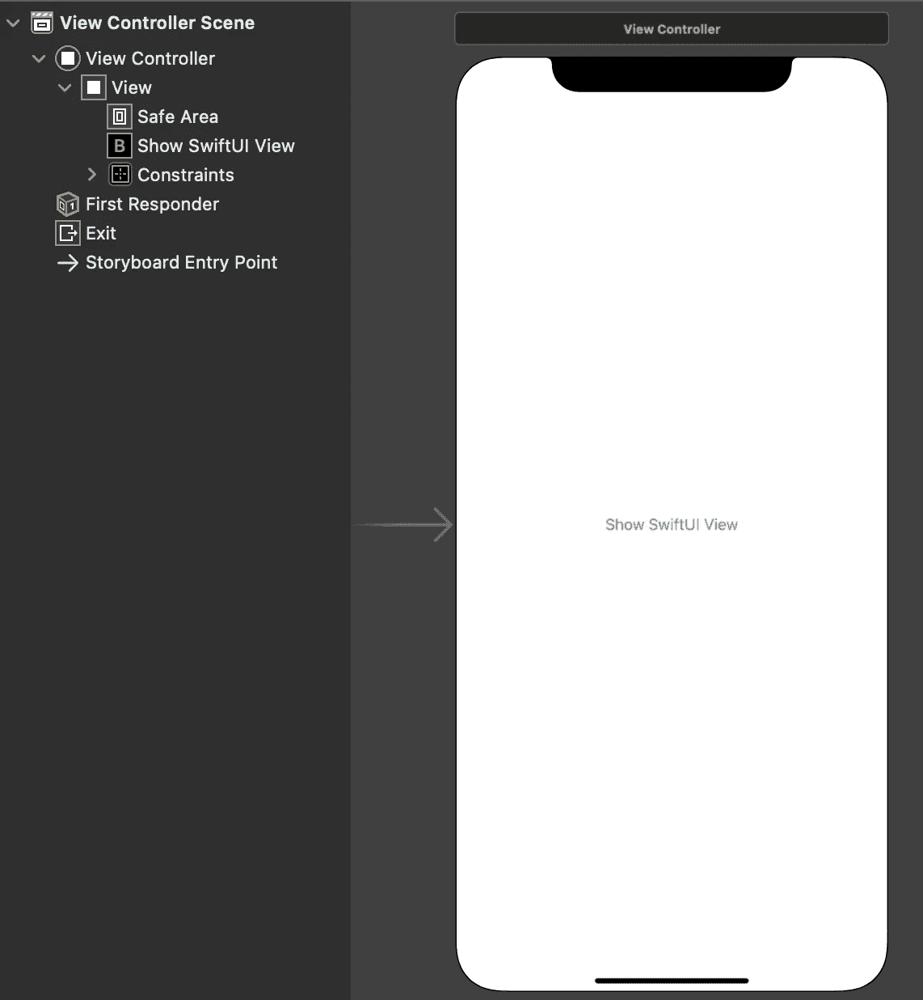

# 从 ObjectiveC 呈现 SwiftUI 视图

> 原文：<https://levelup.gitconnected.com/presenting-swiftui-views-from-objectivec-12f49f88716e>

泰勒·拉斯托维奇在 [Unsplash](https://unsplash.com?utm_source=medium&utm_medium=referral) 上拍摄的照片

如果你和我一样，你会发现自己几乎每天都在使用 ObjectiveC，但是希望将 SwiftUI 集成到你的项目中。我使用一个大型的已建立的代码库，所有的新代码都是用 Swift 编写的，但是代码库的规模和复杂性使得对 Swift 的完全重构成为禁止。毕竟，如果它没有坏掉…

无论出于什么原因，您仍然使用 ObjectiveC，您将需要在某个时候将 SwiftUI 集成到您的代码中。今天我们将讨论如何在 ObjectiveC 中显示 SwiftUI 视图。

我们从一个简单的包含单个按钮的 ObjectiveC view 控制器开始。

故事板

按钮有一个连接到视图实现的`IBAction`出口:

ViewController.m

我们还拥有全新的 SwiftUI 视图。✨

SwiftUIView.swift

这是一个包含一些文本和一个按钮的基本视图。没有像`@objc`这样的客观碎片或任何东西来分散视图的目的。

然而，有一件重要的事情需要注意，那就是`dismiss`的关闭。在一个纯 SwiftUI 应用程序中，您可以使用环境的`presentationMode`来消除模态视图，但是因为我们的视图是由 UIKit 呈现的，所以在这里不适用。有一些不同的解决方法，但是对于这个例子，我们将提供一个闭包，ObjectiveC 视图控制器将使用它来传递关闭视图所必需的代码。正如您在第 10 行中看到的，当点击按钮时，它调用这个闭包。稍后您会看到更多相关内容。

因为 ObjectiveC 本身不能显示 SwiftUI 视图，所以我们的视图需要包装在一个`UIViewController`中。这是在`UIHostingController`的帮助下完成的。不幸的是，主机控制器对 ObjectiveC 不友好。为了解决这个问题，我们将创建一个用 Swift 编写的中间对象。没错，我们将协同使用所有三种语言来完成这项任务。这才是团队合作！🏅

SwiftUIViewFactory.swift

我们需要导入`SwiftUI`来使用`UIHostingController`，并且这个类需要是一个`NSObject`，因为它将被 ObjectiveC 使用。对于这个例子，我们使用工厂模式创建并返回包装在`UIViewController`中的 SwiftUI 视图。

我们快完成了。回到 ObjectiveC 视图控制器，是时候向按钮的`IBAction`添加代码了:

showSwiftUIView:(id)发件人

我们使用工厂来制作 SwiftUI 包装的视图控制器，并传递给它以消除代码。最后，我们介绍了视图控制器。

这就是全部了。现在，即使您的旧 ObjectiveC 代码库也可以利用新的 SwiftUI 热点。🔥

你在路上的某个地方被困住了吗？[从 GitHub 下载整个项目](https://github.com/CoreyWDavis/ObjCSwiftUI),查看所有代码。

## 进一步阅读

*   查看[我的其他 Swift 和 SwiftUI 文章](https://medium.com/@CoreyWDavis)。
*   [GitHub 上的完整项目](https://github.com/CoreyWDavis/ObjCSwiftUI)
*   [苹果的 UIHostingController 文档](https://developer.apple.com/documentation/swiftui/uihostingcontroller)