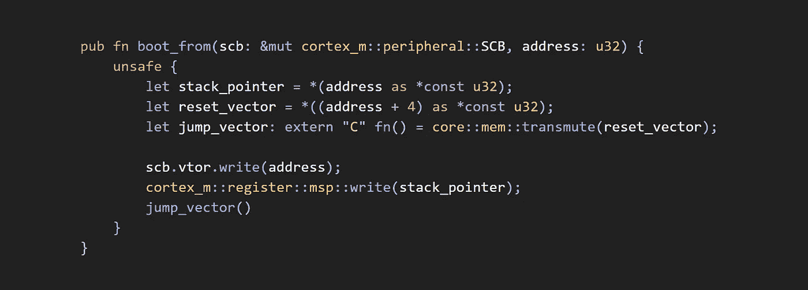
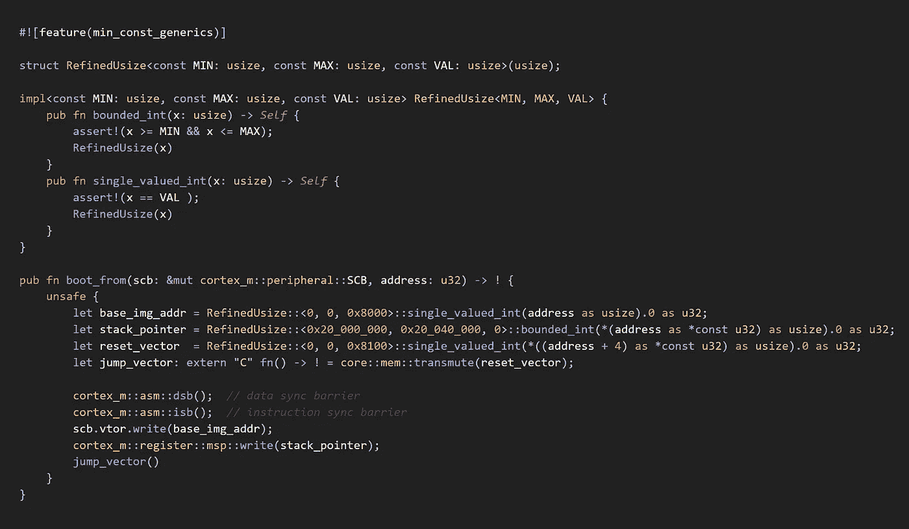
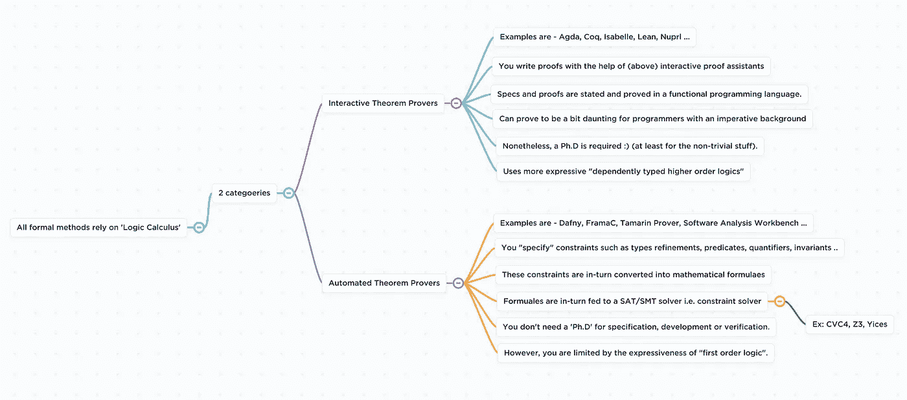

# 在不安全的 Rust 中保护程序员的“意图”

> 原文：<https://levelup.gitconnected.com/preserving-the-programmers-intent-in-unsafe-rust-beaa3266f43f>

几周前，我碰巧重访了我的一个“Rust”项目——一个准系统嵌入式引导加载程序，希望能够重用和扩展它。我选择‘rust-lang’(而不是 C)来编写一个专注于安全的‘cortex-m’引导加载程序，这样我就可以利用 rust 的内存安全属性(其他考虑因素如大小和性能相同)。

我对引导加载程序的要求如下——引导系统，与硬件信任根接口，使用 ECC 验证签名的引导映像，并执行“下载的软件升级”(或 DSU)。

乍一看，这似乎相对简单，因为我已经有了一个概念验证，但很快就意识到这里有很多出错的地方。举个例子，下面的代码片段，它是我最初的 PoC 的一小部分，当提供了应用程序的起始地址时，它控制从引导装载程序到应用程序映像的执行流。

ARM Cortex-M 系统的基本启动跳跃序列。

在测试的时候，我没有太注意它，但是这个实现**可以**做我不打算让它做的事情。

1.  解引用 2 个原始指针，即`stack_pointer` 和`reset_vector`可能导致未定义的行为(即解引用可能产生任何值)。
2.  如果我们传入一个无效的值，那么 32 位整数到`extern C fn()` 类型的转换也是未定义的。
3.  2 寄存器写操作有明显的副作用**如果你传入一个无效的、空的或者其他疯狂的值**是未定义的。
4.  以及一个变形的函数调用— `jump_vector()`，它实际上是发散的(即从不返回)，但在其函数签名中没有明确这样说。

以上大部分可能看起来像是使用“不安全铁锈”的后果。这在一定程度上是正确的，但在大多数情况下，你无法避免这一点，因为没有办法让代码安全地改变硬件，也就是说，代码无法判断读/写等硬件操作实际上是否安全。

> 还需要注意的是——在 Rust 中，所有未定义的行为都被[限制在范围内，并且可以被限制在“不安全的 Rust”中](https://doc.rust-lang.org/1.18.0/nomicon/meet-safe-and-unsafe.html),这是一件好事。

因此，尽管上面的代码片段在一组测试运行中工作正常，但我实际上不能声称或提供关于实现的保证，因为它涉及到安全性。换句话说，这段代码可能适用于也可能不适用于每次引导调用。

> *我最初的(假设很简单)目标是扩展引导装载程序。

那么，我们如何确保我们不会在运行时出现未定义的行为。ARM Cortex-M 有一个平面内存(即无虚拟寻址)模型，你必须通过一个`memory.x` 文件明确说明你的程序的内存布局。我们可以利用我们对 ARM Cortex-M 系统的内存布局的了解来**定义一个规范**，并让我们的实现遵守该规范。

例如，我们可以在每个 2 derefs 后面添加一些防御检查，比如 assert 语句，来检查边界，但是一个更好的解决方案(在我看来)是**让你的类型来做‘检查’**。

*   对于堆栈指针——我们可以使用 rust 的`const_generics`特性构建一个名为‘RefinedUsize’的类型，并在运行时应用边界检查。在某种程度上，这是一个精化类型的例子(即带有谓词的类型)。

> 如果我们有办法在 rust 代码中访问链接器脚本值，这可能会更好，这意味着我们可以避免使用具体的界限或值。在撰写本文时，我还不知道这样做的选择。
> 
> 此外，在这个特定的例子中，我们假设 RAM 大小为 256KB(零大小。数据，。bss 部分+无堆),我们使用[翻转链接](https://github.com/knurling-rs/flip-link)来避免堆栈溢出。

*   对于重置向量 RefinedUsize 可以将 u32 细化为单值 u32。
*   将`integer type` 的可能输入限制为单个不可空值，并对其进行转化是安全的，即`reset_vector`是一个 u32，它只能有一个可能值。Rust 的固有函数— `transmute()`现在可以将一个不可空的、大小合适的、正确对齐的 u32 转换成一个函数指针。
*   在两次易失性(寄存器)写操作之前添加数据和指令同步屏障，以确保没有可能干扰我们寄存器写操作的未决存储器访问或指令。

> 注意——这仍然不意味着您的易失性写操作一定会成功。但是现在，我们可以说它不是未定义的行为，如果它没有成功的话。

*   最后，更改`jump_vector()`和`boot_from()`的类型签名以反映分歧，这意味着它决不能返回(但可能会由于一些硬件寄存器写错误而死机),如果它确实返回了，那么我们就知道出错了。(即未定义的行为)

使用 Rust 的 const_generics 特性重构 impl，使我们的类型更加精确。

现在，这个`implementation` 比最初的 PoC 好得多，或者至少它给了我更高程度的信心，我的代码将坚持我的规范(以类型细化的形式提供)。

我们仍然不能断言这种类型丰富的实现保证(或实际的数学证明)在上面的代码片段中没有未定义的行为。为了这种保证，我们需要以完全的功能正确性为目标，这只能通过“形式方法”来实现。

是一个巨大的领域。这实际上有点疯狂，所以 ***这是从一个程序员的角度总结的图片*** 。

从程序员的角度看形式方法世界的 20k 英尺视图。

## **简而言之，正式方法允许你指定属性，并通过以下方式验证其一致性:**

*   **丰富类型—** 例如，细化/约束传递给函数和的参数类型，让自动定理证明器解决所有约束——与我们上面所做的很相似，不同之处在于自动定理证明器生成的证明在所有可能的条件下(即前置、后置条件和所有不变量)都成立。
*   **或者为你的函数写一个单独的证明(正式术语是引理)**使用类似证明助手的工具，在那里你陈述属性并为它建立一个证明。

这种属性的一个例子是—

`**(append (append xs ys) zs == append xs (append ys zs))**`

其中`append`是一个附加 2 个列表的函数，`xs, yz, sz`是任何类型的列表。该属性必须对所有列表始终有效(永久有效:)。这个属性的证明非常简单，但是有了证明助手，你可以利用更多奇特的类型，比如*依赖类型、高阶逻辑、归纳证明*等等。来解决更棘手的问题。

# 愿望清单和结论:

*   我认为扩展 Rust 的类型系统，使之更容易用更好看的语法精炼原始类型(如 int，char，bool)——就像`x: int { x > 0 } ,`而不是让开发者/库来做这项工作，将是 const_generics 稳定化后合乎逻辑的下一步。

> 更棒的是 rust-analyzer 可以显示 VSCode 中的改进。

*   一个支持`*pre + post conditions, invariants and variants*`的静态 rust 验证器将会是一个天赐之物，它可以安全和不安全的 Rust 一起工作。事实上，Rust 可能已经在朝着这个目标前进了；我们有几个人正致力于将自动推理能力引入 Rust。这里有两个。

> [**【Crux-mir**](https://crux.galois.com/):我们可以执行基于属性的测试，使用符号模拟对给定函数的所有可能输入进行详尽的测试。
> 
> Haybale**:这在底层技术方面是相似的，但是它使用符号执行来帮助你推理 Rust 代码。**

*   **我计划在另一篇文章中探讨这两个问题。严格来说，这两者并不完全属于`formal verification`的范畴。我们可以把它们看作是`testing on steroids`的一种形式。它们可以用来彻底地探索一个程序的状态空间，也就是说，你可以彻底地测试你的代码是否有错误。然而，`*“testing can only find bugs, not prove their absence”*`、*、*这就是形式验证的用武之地；它提供了实际证据。**

**总之，就学习而言，整个练习是非常有益的，我学到了一些经验和技术，以帮助我在更深的层次上“推理代码”，并回答了关于如何保持我(即程序员)的“意图”的问题，这样它就不会被各种各样的实现级别的细节所削弱。例如，从最基本的问题开始总是好的—**

> **我的代码到底有多安全？**
> 
> **我可以或应该提出什么主张？**
> 
> **我能提供什么保证？**

**这将允许您清楚地陈述关于您的代码的简单属性，这些属性可以相对容易地被证明(使用自动证明程序)，然后通过组合的力量，您可以将所有这些属性(和证明)链接起来，从而使您能够做出不可辩驳的(即数学上可证明的)声明。**

**也许，我可以在我的下一篇文章中展示一个更具体的例子，在那里我重写了一个 AES crypto impl，以匹配在 [Cryptol](https://cryptol.net/) 中实现的一个，Cryptol 是一种用于指定和验证加密算法的领域特定语言。**