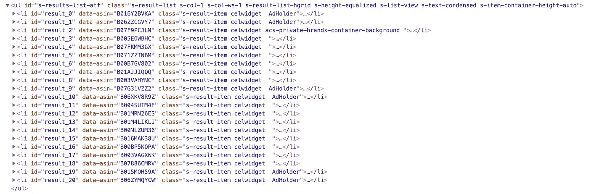

# 用 JavaScript 漂亮地打印你的网站

> 原文：<https://levelup.gitconnected.com/pretty-print-your-site-with-javascript-d69f63956529>

## 让您的打印功能更上一层楼


[银行 Phrom](https://unsplash.com/@bank_phrom?utm_source=medium&utm_medium=referral) 在 [Unsplash](https://unsplash.com?utm_source=medium&utm_medium=referral) 上拍摄的照片

访问您最喜欢的网站之一，打印页面，并检查打印预览的格式。很可能它的格式不是很好。可以理解的是，从网上打印东西可能不是你的用户经常做的事情，但是对于有打印确认页面、项目列表、报价等的用户的网站来说。有一个更好的方法用 JavaScript 美化你的站点！

# **TLDR；**

仅使用 JavaScript，我将向您展示如何从任何页面的 DOM 中的当前元素创建一个漂亮的打印页面。不需要进行任何额外的网络请求，也不需要进行任何服务器端的开发。通过简单地克隆您想要打印的页面元素，您可以无缝地重建您漂亮的打印页面。

此过程不能覆盖默认的浏览器打印功能，但它为您的用户提供了更加定制和有用的打印体验。

# 传统的方法

准确地打印出页面上的内容，然后让浏览器来决定该怎么做通常不是最好的方法。解决这个问题的一般方法是使用一个 **print.css** 文件，隐藏足够的元素，使你的页面看起来像样。print.css 方法可能是一个麻烦，而且经常只能让你实现一半的目标。

# 升级您的打印功能

## 创建一个空白画布

首先，您需要创建一个“画布”来进行绘制，因为您想要打印的页面已经有了自己的 DOM，其中填充了您可能需要或不需要的元素。像页眉、页脚、行动号召按钮、未使用的过滤器、导航栏、标签栏、背景和大图片等元素。在打印页面上可能没有多大用处。有两种传统的方法可以使页面打印就绪:

1)在现有的 CSS 文件中添加一个`@media print`媒体查询，隐藏页面上所有不需要的元素。

```
@media print {
   /* This media query only applies itself to the page during printing */
   header, footer, nav, .btn--call-to-action { 
     display: none !important; 
   }
}
```

2)在现有的 CSS 文件中添加一个`@media print`媒体查询，隐藏页面上所有不需要的元素。

```
<link href="styles/print.css" rel="stylesheet" media="print" type="text/css">
```

我不建议把这两个选项作为你唯一的选择，原因如下:

*   为打印而修改 DOM 对于基本页面来说可能没问题，但是这个解决方案是不可伸缩的。如果页面的布局不仅仅是几个简单的元素，那么 print.css 文件的大小和复杂性都会迅速增加。
*   网站内容通常必须留在相同的打印区域。您可以使用类似 Flexbox 的 order 和 flex-direction 属性来移动项目，但是我们很快就会遇到限制。
*   除了页面之外，您还必须维护您的打印样式。如果您向页面添加新元素，您的打印样式也必须考虑它们。

我们现在可以超越传统的方法，继续创造这片“空白画布”创建空白画布的第一个选择是用`window.open()`弹出一个新窗口。这种方法可能有效，但我们现在必须考虑弹出窗口拦截器、新窗口的大小和位置，以及在用户完成后销毁窗口的需要。让我们努力实现更无缝的用户体验。如果我们不能使用新窗口，那么好的 ole iframe 怎么样？

创建一个对象来存放您的功能:

*我用普通的 JavaScript 写了这个，以避免任何依赖，并避免由于缺乏 IE 支持而使用模板文字和箭头函数。为了简单起见，我还使用了字符串连接。在你的项目中，你应该使用*[](https://handlebarsjs.com/)**(或者其他一些模板引擎)并考虑你需要支持的浏览器。**

*让我们在这里分解所有的内部方法。*

*   ***nsprettyprintpage . print()**—这个函数通过创建一个空的/隐藏的 iframe 并执行 print 命令来打印当前页面*
*   ***nsprettyprintpage . generateprintlayout()**—动态收集要注入 iframe 的正文和页脚 html*
*   ***nsprettyprintpage . generateheaderhtml()**—从当前 DOM 导入 CSS 以应用于 iframe 头*
*   ***nsprettyprintpage . generateglobalcss()**—添加要在每一页上显示的全局类，如边距、图像尺寸和表格分隔*
*   ***nsprettyprintpage . generatefooterhtml()**—为每一页添加一个全局页脚*
*   ***NsPrettyPrintPage . prettyprintcodeforsamplepagetype()**—NsPrettyPrintPage。{ {您的 FN 姓名在此处}}()允许您自定义网站上的每个页面，以便根据页面类型进行漂亮的打印*

## *确定打印页面上需要的元素*

*这就是传统的“print.css”方法发生 180 度大转变的地方。不要从当前的 DOM 开始，隐藏或重新排列我们不想显示的部分，让我们拿起“空白画布”并从那里创建新的漂亮的打印页面。*

*让我们假设我们的产品管理团队发现，当使用我们的打印功能时，我们的用户只想在易于扫描的列中看到产品图像、标题、价格和评级。*

> *我们需要将我们的思维从用户在网上冲浪时有用的东西转移到对拥有我们信息的物理打印副本的用户有用的东西上。*

*在构建新页面时，请记住这里的用例。为什么用户真的需要打印这个页面？他们拿纸做什么？他们需要空间来写笔记吗？网页上的页面在纸上可能不太有用。没有按钮会起作用，背景图片也只会浪费墨水。*

*下面是一个在 Amazon.com 上搜索“keyboard”的打印预览示例，它返回了 16 个结果。*

**

*这是一个打印的亚马逊结果页面的截图。它包括广告、过滤器、大量空白空间和不能交互的导航项目。*

*上面打印输出的一些注意事项:*

*   *我们的用户将需要**七张**纸来打印这个视图*
*   *“添加到购物车”按钮已被隐藏，但我们仍然有几个对我们的打印过程没有好处的元素，如过滤器、导航和空白空间，我们可以用它们来显示更多的商品*
*   *这对于想要轻松扫描和比较项目的用户来说不是很有用*

*深入这个页面的 html，我们看到结果列表是一个 id 为`#s-results-list-atf`的无序列表。*

**

*在 Amazon.com 搜索单词“keyboard”的结果列表的 HTML 源代码。*

*我们需要从每个列表项中提取内容，所以让我们尝试找到一个唯一的选择器，但不要太个性化。如果我们检查类别，你会注意到所有的`li`标签都有类别`s-result-item`，广告有类别`AdHolder`，并且有一个顶级品牌部分有类别`acs-private-brands-container-background`。使用 CSS querySelector，我们可以用选择器提取所有不是广告或杂项的项目:`#s-results-list-atf li.s-result-item:not(.AdHolder):not(.acs-private-brands-container-background)`。*

*将该页面添加到我们的打印功能需要一个新函数，以及在我们的`generatePrintLayout()`函数中对它的引用。因为我们将打印这些内容，并且不像通常那样担心响应性，所以让我们坚持使用一个简单的表。*

```
*amazonSearchResults: function() {
    let html = '';// reference to all result items that are not ads
    let resultItems = document.querySelectorAll('#s-results-list-atf li.s-result-item:not(.AdHolder):not(.acs-private-brands-container-background)');

    html += '<table>';

    // iterate over result items
    resultItems.forEach(function(item) {
     html += '<tr>';

     // product image 
     html += '<td>' + item.querySelector('.s-access-image').outerHTML + '</td>';

     // product title
     html += '<td style="max-width: 400px;">' + item.querySelector('.s-access-title').innerHTML + '</td>';

     // product price
     html += '<td>' + item.querySelector('.sx-price-currency').innerHTML;
     html += item.querySelector('.sx-price-whole').innerHTML + '.';
     html += item.querySelector('.sx-price-fractional').innerHTML + '</td>';

     // product rating
     html += '<td style="min-width: 150px;">' + item.querySelector('.a-spacing-mini .a-icon-alt').innerHTML + '</td>';

     html += '</tr>';
    });

    html += '</table>';

    return html;
  }*
```

*我们只需要提取我们的“产品管理团队”要求的有用项目，这将我们的新打印输出精简到两页！*

**

*从 DOM 中提取所需信息后，用户现在可以轻松地从头到尾扫描打印的文档，还可以节省纸张。*

*这是一个简单的例子，说明了如何在不使用庞大的解决方案的情况下转变您的自定义打印功能，因为庞大的解决方案会增加另一个依赖性。如果您已经在使用 jQuery 或任何其他库，它将非常适合这个解决方案。例如，简单地用`$('.myClass')`替换`document.querySelectorAll('.myClass')`并继续。为了方便起见，您的 DOM 元素可能需要重要元素的“数据”属性，以使它们更容易识别，但是您可以使用任何 JavaScript/HTML 来定位和提取您需要的内容。还要注意当需要一个标签的内容时使用 innerHTML，但是如果你也想保留标签，就使用 outerHTML，比如当目标是一个标题`<h2>My site header</h2>`时。`outerHTML`将标签按原样放入漂亮的打印页面。*

## *缺点*

*该功能可以作为您网站上的(自定义)“打印”按钮来实现，但它将**而不是**涵盖通过默认浏览器方法`right click > print`和`File > Print`进行打印。`window.onbeforeprint()`方法可以在打印作业开始前应用更改，但是无法取消或覆盖默认的浏览器打印作业。*

## *亲自测试一下*

*如果你想在一个预先存在的页面甚至是一个直播网站上尝试这个功能，我推荐使用一个叫做[用户 JavaScript 和 CSS](https://chrome.google.com/webstore/detail/user-javascript-and-css/nbhcbdghjpllgmfilhnhkllmkecfmpld) 的 Chrome 扩展。另一个选择是简单地将`NsPrettyPrint`粘贴到你的浏览器控制台。这已经在 Chrome、Safari、Firefox 和 Edge 的现代版本中进行了测试，IE 11+的性能有所下降。*

# *包扎*

*现在您已经有了一个有用的漂亮的打印方法，您可以随意扩展这个设置，以适合您的站点。很容易立即启动并运行。此打印功能旨在提供与默认浏览器功能相同的体验。请确保正确确定此功能的范围，或者将其与您预先存在的打印按钮或命令功能相集成。如有任何问题或意见，请留言或发邮件给我。*

***快乐印刷！***

*本教程最初发布于 neroscript . io—[https://neroscript.io/pretty-printing-site-javascript](https://neroscript.io/pretty-printing-site-javascript/)*

*[](https://levelup.gitconnected.com)**[](https://gitconnected.com/learn/javascript) [## 学习 JavaScript -最佳 JavaScript 教程(2019) | gitconnected

### 前 65 名 JavaScript 教程-免费学习 JavaScript。课程由开发人员提交并投票，从而实现…

gitconnected.com](https://gitconnected.com/learn/javascript)*