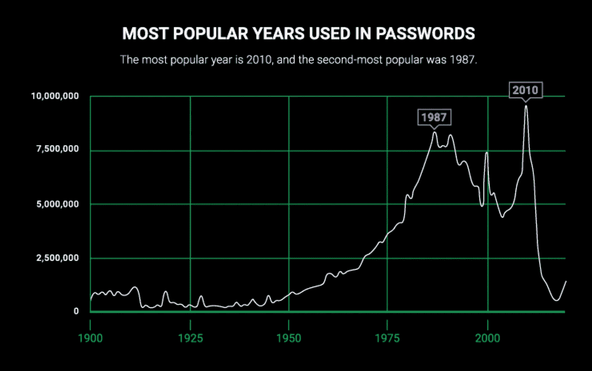
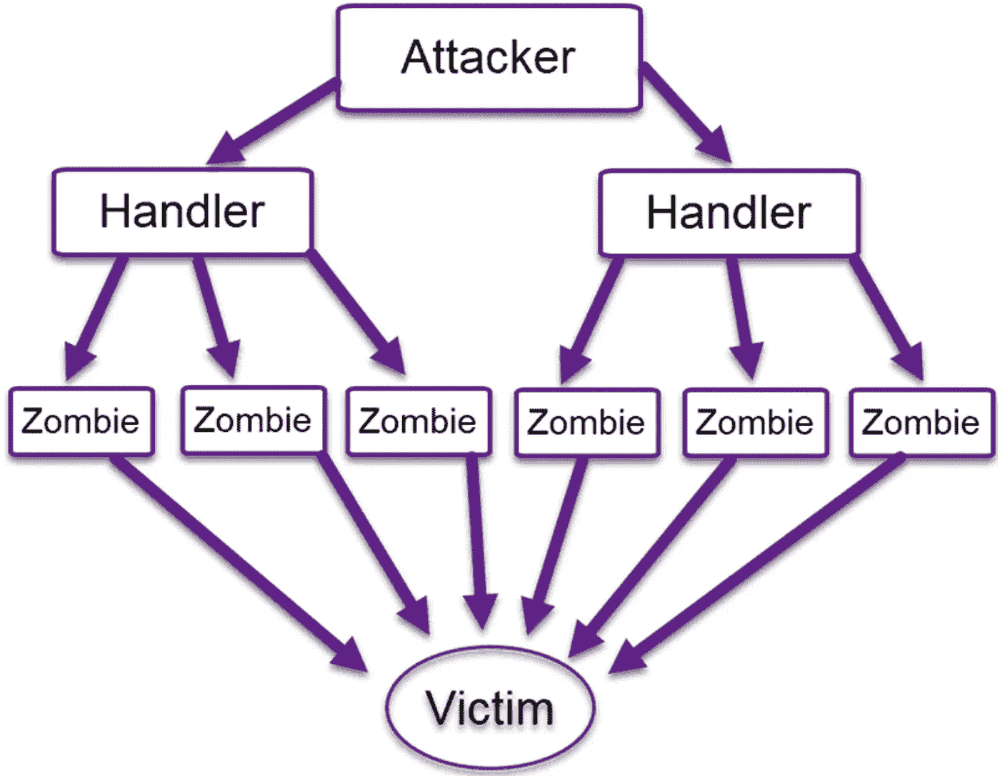

# 防止节点中的暴力攻击。射流研究…

> 原文：<https://levelup.gitconnected.com/prevent-brute-force-attacks-in-node-js-419367ae35e6>


暴力攻击

# 什么是暴力攻击？

当你有一个需要用户认证的应用程序时，有人可以尝试所有可能的字母、数字和符号的组合，然后一个接一个地发送它们，找出特定用户的密码。简单来说这就是暴力攻击。

# 什么是字典攻击或者混合蛮力攻击？

通常尝试所有可能的字母、数字、符号组合并不是获取用户密码的快速方法。为了提高速度，攻击者通常使用字典中的单词，大多数时候人们选择容易回忆的密码，因此大多数密码是有效单词和简单数字的组合。还有一些常见的密码数据库被攻击者用作字典。

为了感受这个问题，让我们用一些从网络新闻中提取的有用数据来谈谈。

## 十大最常见的密码:

```
123456
123456789
qwerty
password
12345
qwerty123
1q2w3e
12345678
111111
1234567890
```

## 密码中最常用的年份:



密码中最常用的年份

## 在哪里可以找到用于测试的密码字典？

在[这个网站](https://web.archive.org/web/20120207113205/http://www.insidepro.com/eng/download.shtml)，你可以找到字典列表。

# 暴力攻击的不同情况以及我们可以预防的方法

## 1.从一个 IP 强制一个特定的用户

在这种情况下，攻击者只从一个特定的 IP 尝试特定用户的可能密码。防止这种暴力很容易。我们可以简单地通过基于 IP 的速率限制器来防止这种情况:

如果你使用 express，有各种各样的软件包可以做到这一点，其中之一就是 [express-rate-limit](https://github.com/nfriedly/express-rate-limit)

快速速率限制

正如我们在 limiter 配置中看到的，每个 IP 每 10 分钟只能发送 5 个。

它仍然不完美，我们将在接下来的步骤中改进它。

## 2.从不同的 IP 强制一个特定的用户

在这种情况下，攻击者有许多僵尸，他试图通过从这些僵尸发送请求来暴力破解用户的密码，或者攻击者可以访问不同的代理，因此我们无法通过仅关注 IP 来识别这种暴力破解。

解决方案是限制登录尝试的次数。让我们实现最简单的方法，我们可以存储这些登录尝试，并根据情况采取行动，在这之后，我们将看到一个奇特的包。

逻辑非常简单，如果用户登录失败，我们将在 **Redis** 中存储一个密钥，每次用户尝试登录失败时，我都会增加这个数字。如果这个数字大于“**maxnumberofiledlogins**”，我不会让用户尝试登录。同样，每次我将 Redis 密钥的到期时间设置为**1 小时**，所以如果攻击者想要再次发送登录请求，他/她应该等待一个小时。

另一个深思熟虑的方法是用**动态持续时间**来阻止用户的登录尝试，这样即使机器人有麻烦，但也可能让你的用户感到不安。

*根据您的应用和业务，向用户发送电子邮件*或*禁用账户*是另一个不错的选择。

我们看到的实现很简单，肯定有一些缺陷，因此更好的处理方式是使用灵活的[节点速率限制器](https://github.com/animir/node-rate-limiter-flexible/wiki/Overall-example#minimal-protection-against-password-brute-force)。

## 3.大规模暴力攻击

此方法试图绕过帐户锁定。通过这种方法，攻击者发送来自僵尸的请求，并尝试不同的用户和密码。



僵尸发送请求

**您的应用会发生什么情况？**如果你的应用经常受到攻击，数百个用户账户可能会被锁定或无法登录。

这是一种拒绝服务，因为找到用户密码的概率不高(他们既没有用户名也没有密码)。我们可以尝试 [DDoS 防范技术](https://phoenixnap.com/blog/prevent-ddos-attacks)。

防止这些请求的另一个有效方法是拥有一个**验证码。**

你是机器人吗？:)

有了验证码，您就可以防止这些登录尝试，因此，您的用户能够正常登录您的服务并做出反应，即使在攻击期间也是如此。

如果你想在 Nodejs 上实现谷歌验证码，看看这篇文章。

## 让暴力攻击者日子更难过的其他方法

**要求使用强密码**

强制用户使用数字、符号、大写字母，并防止用户在密码中使用 2 或 3 个以上的连续数字或字符。

[check-password-strength](https://www.npmjs.com/package/check-password-strength)包可以帮你。

检查密码强度

**使用双因素认证**

通过在电子邮件或短信中发送密码旁边的代码，你就很难进入用户的账户。即使您没有对所有用户都这样做，也应该考虑对具有特殊权限的用户进行双因素身份验证。

**不同的登录网址**

这不是防止暴力攻击的好方法，但是大多数自动化工具都不是为处理这种设计而设计的。在 Nodejs 中，您可以很容易地实现这一点:

**为高级用户使用允许的 IP 地址**

让具有特殊访问权限的高级用户设置一些允许的 IP，并且只让他们从这些特定的 IP 登录。

**使用 cookies 检测未知浏览器和设备**

防止用户试图从未知设备和浏览器登录，或者像谷歌一样让他们知道有人试图从未知设备登录。您可以使用 express [设备捕获](https://www.npmjs.com/package/express-device)来捕获设备信息。

**未给出登录失败的额外信息**

如果登录尝试失败，不要让他们知道用户是否存在。大多数网站告诉你**密码或用户不正确。**

如果您让攻击者知道该用户是否存在，那么他们就可以收集您的用户列表以进行进一步的攻击。

# 防止对您的应用程序进行暴力攻击的操作摘要

*   有限次失败的登录尝试
*   限制从指定的 IP 地址登录
*   双因素认证
*   强密码
*   验证码
*   不同的登录 URL
*   为特殊用户使用允许的 IP
*   检测来自未知浏览器和设备的登录尝试
*   没有给出登录失败的额外信息

[](https://cybernews.com/best-password-managers/most-common-passwords/) [## 最常见的密码 2022 -你的在名单上吗？网络新闻

### 数据泄露和网络攻击变得越来越普遍。为了保持您的在线身份和隐私…

cybernews.com](https://cybernews.com/best-password-managers/most-common-passwords/) [](https://owasp.org/www-community/controls/Blocking_Brute_Force_Attacks) [## 阻挡暴力攻击

### 作者:Esheridan 供稿人:KirstenS，Paul McMillan，Raesene，Adedov，Dinis。克鲁兹、乔、丹尼尔·沃勒、金索林……

owasp.org](https://owasp.org/www-community/controls/Blocking_Brute_Force_Attacks)