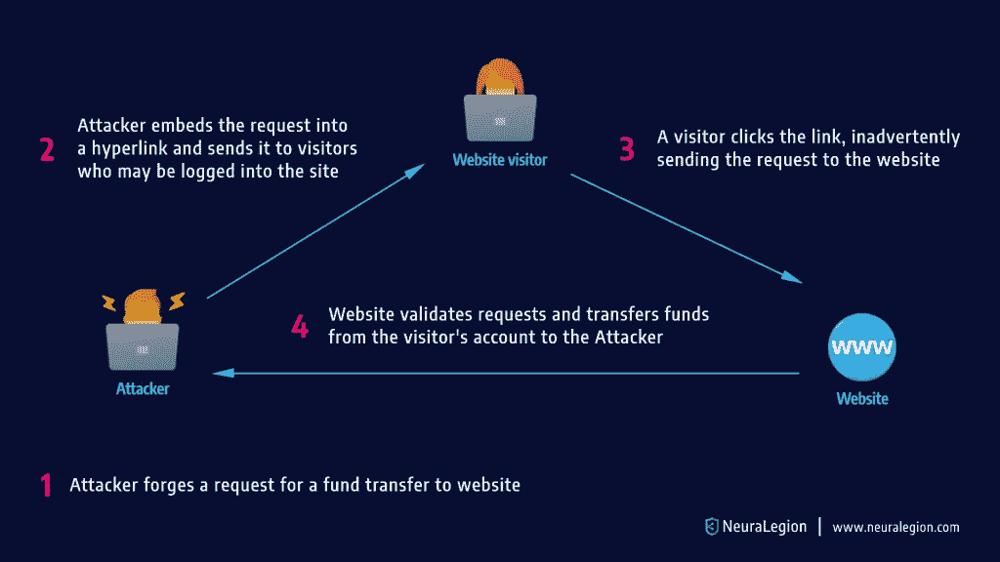
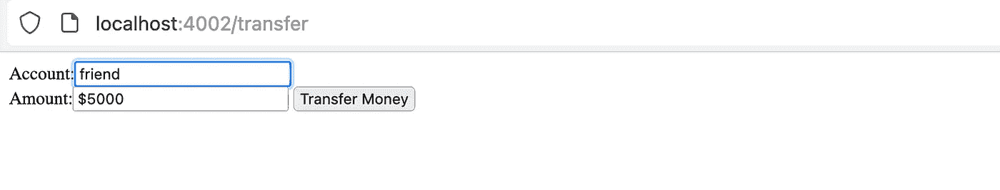
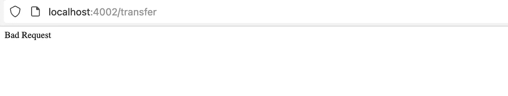
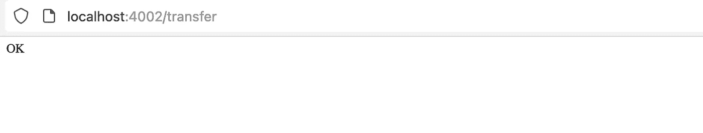
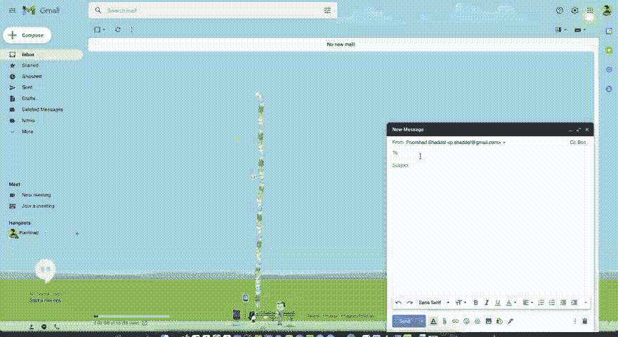
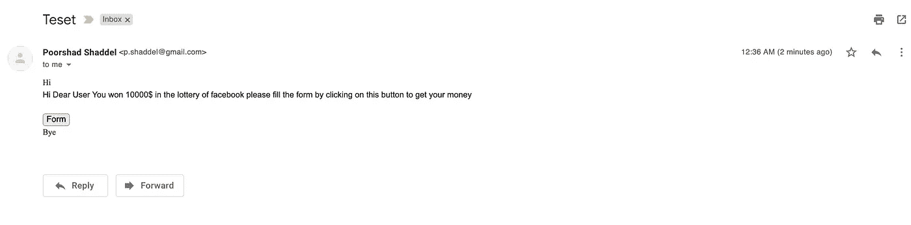
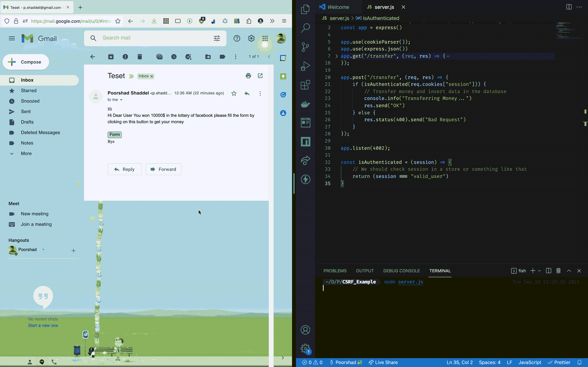
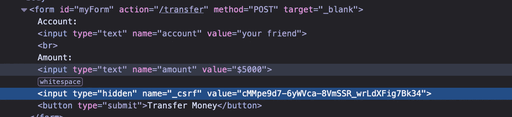
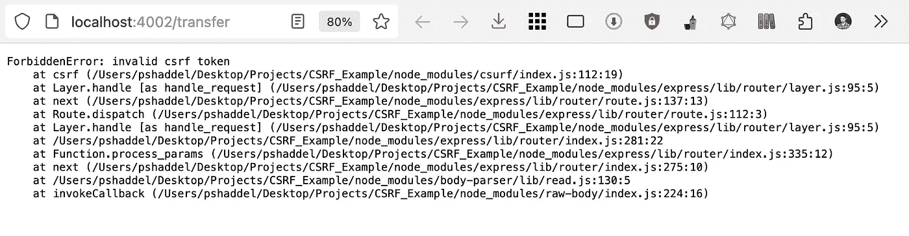

# 防止节点中的 CSRF 攻击。JS 应用程序

> 原文：<https://levelup.gitconnected.com/prevent-csrf-attacks-in-node-js-application-d71df3704944>

在本文中，我们将了解为什么我们应该了解这种攻击，这种攻击到底是什么，执行一个简单的 CSRF 攻击来了解它是如何工作的，最后我们如何保护我们的应用程序免受 CSRF 攻击。

# 为什么我们应该知道 CSRF 袭击事件？

在开始了解这种攻击是什么之前，我们应该知道这种攻击有多危险。

如果有人对一个普通用户(没有管理权限)成功执行了 **CSRF 攻击**，这个人就能够执行状态更改请求，比如删除账户、转移资金和更改电子邮件地址。

如果用户拥有管理权限，攻击者就可以危害整个 web 应用程序。

所以我认为我们有足够的线索来挖掘更多关于这次袭击的信息。让我们来看看什么是 CSRF 攻击。

# 什么是跨站点请求伪造(CSRF)？

> 基于 OWASP:跨站点请求伪造(CSRF)是一种攻击，它迫使最终用户在他们当前已通过身份验证的 web 应用程序上执行不需要的操作。

这种攻击也被称为**一键式攻击**或**会话骑**

通常这些攻击与[社会工程攻击](https://en.wikipedia.org/wiki/Social_engineering_(security))相结合。例如，他们给我发了一封电子邮件，其中包含一个链接，说你在一次彩票中赢得了 10000 美元(你知道你没有参与:)，我们需要获得你的信息，请点击下面的链接。该链接将与另一个网站(即您的网站，这里特指 Node.js 应用程序)进行交互。

这是 CSRF 攻击的过程:



CSRF 的进攻是如何完成的

理解这种攻击的最好方法是执行一个简单的 CSRF 攻击。

# 简单的 CSRF 攻击

我们有一个节点。JS 应用程序，它有两个途径让用户通过 post 请求转账:

节点。易受 CSRF 攻击的 JS 应用程序

我们有两条路线。第一个是`GET /transfer`,这是一个让我们转账的表单，第二个是`POST /transfer`,它通过一个名为`isAuthenticated`的简单函数验证用户身份，并将钱转账到目的地。

`isAuthenticated`功能只是检查一个名为`session`的 cookie 是否与标题一起发送，以及会话是否是“有效用户”。(这不是我们在产品中所做的，但是你可以在一些库中很容易地找到，比如 [passportjs](https://www.passportjs.org/) )

如果用户通过身份验证，我们可以执行传输操作，如果用户没有通过身份验证，我们会收到一个错误的请求作为响应。

## 创建一个 Cookie 作为经过身份验证的用户

这里我们没有实现登录过程，相反，我们可以手动生成一个 cookie 来完成这项工作:

运行您的节点。使用此命令的 JS 应用程序:

```
node server.js
```

现在，应用程序正在端口`4002`中运行

我们需要去这条路线:`http://localhost:4002/transfer`查 app。

在添加任何 cookie 之前，如果我们尝试发布此表单:



没有 CSRF 令牌的 HTML 表单

我们得到这样的结果:



未经验证的用户的结果

为了手动生成 cookie，您需要打开您的浏览器开发工具，右击并点击`inspect`，然后打开`console`选项卡并运行这行 Javascript 代码:

```
document.cookie="session=valid_user";
```

在这之后，我们在`localhost`域中有一个 cookie，后端认为我们的用户通过了验证，如果我们再次发布该表单，我们会得到以下结果:



认证用户的结果

因此，在这一点上，我们是一个经过身份验证的用户，我们能够通过将一个表单发送到这个路径来转移资金:`POST /transfer`

## 创建包含表单的电子邮件

发送带有所需 HTML 的电子邮件的简单方法我们可以打开 Gmail 网站，然后我们需要右键单击电子邮件正文并单击`inspect`现在我们可以通过右键单击元素并选择`edit as HTML`来编辑电子邮件正文。在这里我们可以输入我们的 HTML 元素。

这是我们要发送给受害者的电子邮件正文:

包含隐藏表单的电子邮件正文

正如你可能注意到的，我们有两个**隐藏输入和一个**按钮来发布表单。同样在名称为`account`的输入中我们可以看到我们输入了`attacker_wallet`。

以下是编辑电子邮件正文的方法:



向电子邮件正文添加 HTML 元素

最后这是受害者收到的电子邮件。



引发 CSRF 攻击的电子邮件

现在，如果我(作为一个经过身份验证的用户)单击该按钮，它会将我重定向到浏览器中的一个新选项卡，并将钱转移到攻击者的钱包中:



受害者点击邮件正文中的按钮

现在你知道了 CSRF 攻击是如何工作的，是时候看看我们如何阻止它了

# 通过基于令牌的缓解来防止 CSRF 攻击

这是我们可以用来防止 CSRF 袭击的最流行和推荐的方法之一。

我们将在服务器端生成一个令牌，可以为每个用户会话或每个请求生成一次。每请求令牌比每会话令牌更安全，因为攻击者利用被盗令牌的时间范围是最小的。

正如 **OWASP** 文件所述:

CSRF 代币应该是:

*   *每个用户会话都是唯一的。*
*   *秘密*
*   *不可预测(由* [*安全方法*](https://cheatsheetseries.owasp.org/cheatsheets/Cryptographic_Storage_Cheat_Sheet.html#rule---use-cryptographically-secure-pseudo-random-number-generators-csprng) *产生的大随机值)。*

这里我们不打算实现一个 CSRF 保护库。我们使用`csurf`包来生成 CSRF 令牌，并在后端验证它们。

这个库不再被维护了，但幸运的是在撰写本文时它没有任何漏洞。

我们将像这样改变我们的后端:

CSRF 保护节点。JS 应用程序

正如你在第 6 行看到的，我们添加了`csrfProtection`，这里 cookie 是`true`，它也在 cookie 中传输 csrf 令牌。

在第 12 行，我们添加了`csrfProtection`作为中间件，之后我们能够为表单生成一个 CSRF 令牌。

我们需要在`_csrf`输入中传递 CSRF 令牌。

现在，我们可以通过使用`csrfProtection`中间件在第 26 行验证这个令牌。

默认情况下，如果您将用户会话存储在`session` cookie 中，CSRF 保护会将其令牌与用户会话绑定，从而使您的应用更加安全。

让我们看看新的表格和 CSRF 令牌:



CSRF 代币

现在是时候再次点击链接了，点击后我们会看到:



无效的 CSRF 令牌

# CSRF 令牌实现中的弱点

**验证取决于令牌的存在**

在某些应用中，如果令牌不存在，则跳过验证过程。

**CSRF 令牌未与用户会话关联**

如果您没有将 CSRF 令牌与用户会话绑定，某人可以使用另一个人的 CSRF 令牌来执行恶意操作。在我们使用的库中，如果将 cookies 中的会话作为`session`传递，库会将其绑定到 CSRF 令牌。如果您使用不同的名称存储会话，您需要在 CSRF 保护的配置中设置`sessionKey`。

**令牌验证随 HTTP 方法变化**

您应该检查您令牌验证是否适用于所有 HTTP 方法。

**CSRF 令牌被复制到 cookie 中**

您必须记录已经使用的令牌。相反，攻击者可以将与每个令牌相关联的请求参数复制到用户的 cookie 中。在这种设置中，攻击者可以使用应用程序的预期格式创建一个包含令牌的 cookie，将其放在用户的浏览器中，然后执行 CSRF 攻击

# 结论

CSRF 攻击是可以通过发送电子邮件和执行社会工程技术来影响许多用户的攻击之一，因此了解这种攻击并通过简单地使用 CSRF 令牌来防止它是至关重要的。如果您想让它更安全，您需要使用生成此令牌的最佳实践。

[](https://www.neuralegion.com/blog/cross-site-request-forgery-csrf/) [## 跨站点请求伪造(CSRF):影响、实例和预防

### 跨站点请求伪造(CSRF/XSRF)，也称为海上冲浪或会话骑是一个 web 安全漏洞，它…

www.neuralegion.com](https://www.neuralegion.com/blog/cross-site-request-forgery-csrf/) [](https://owasp.org/www-community/attacks/csrf) [## 跨站点请求伪造(CSRF)

### 作者:KirstenS 供稿人:戴夫·威彻斯，戴维斯纽，保罗·皮特菲什，阿达尔·魏德曼，迈克尔·布鲁克斯，阿赫桑·米尔，Dc…

owasp.org](https://owasp.org/www-community/attacks/csrf)