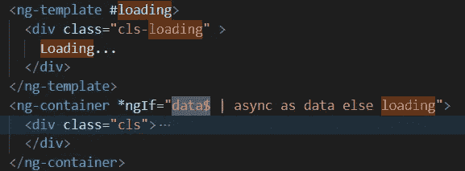

# 防止角度观测值中的内存泄漏

> 原文：<https://levelup.gitconnected.com/prevent-memory-leaks-in-angular-observables-eb48cad9eadb>

最近，我在我的 Angular 项目中遇到了一个问题，每次我找到相同的页面时，内存的大小都会增加。

由于内存没有被释放，页面在后续请求中的速度越来越慢。内存泄漏的原因之一是那些未被取消订阅的可观察对象。

这里我们将讨论取消订阅可观测量的四种方法。

1.  将每个订阅存储在单独的变量中，并在 ngOnDestroy 上取消订阅，如下所示。

2.现在，为每个可观察对象声明一个订阅是一项乏味的任务。如果我们完全去掉所有这些变量，只使用下面的一个变量会怎么样。

3.另一种方法是使用主语。

4.最好的方法是使用异步管道。一旦组件被破坏，observable 就会自动退订。在这里，数据$是可观察的。

希望你会觉得有用。

任何反馈都将不胜感激。

我在 Udemy 上创建了一个 Angular 课程，涵盖了 Angular 中的许多实际问题和解决方案，包括这个。这可能是你职业生涯的垫脚石。 [***请看一看。***](https://www.udemy.com/course/angular-practicals/?couponCode=F48E50E6ECF6D99AD500)

角实践

也可以观看/订阅我的免费 [**YouTube 频道**](https://www.youtube.com/channel/UC30-Z9Lz8DWe_Vq93dOs-Gw) **。**

请订阅/关注/喜欢/鼓掌。