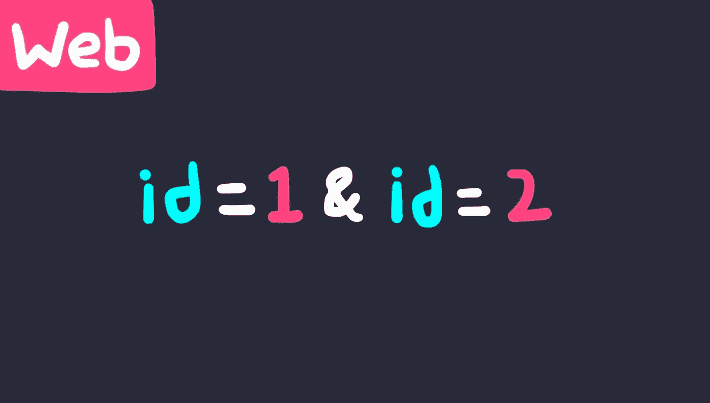
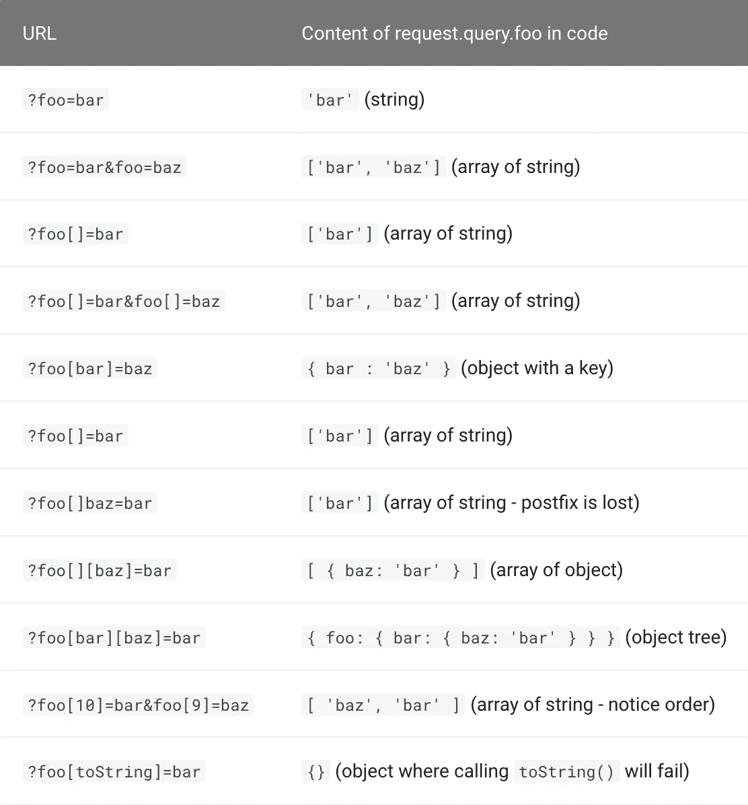
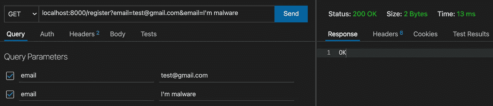
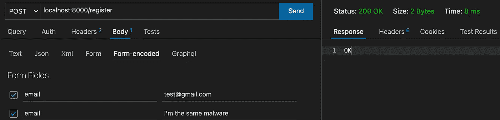
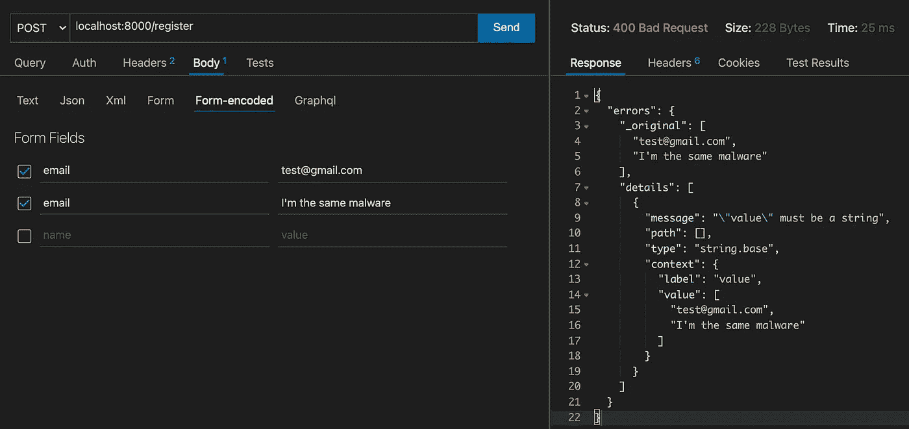
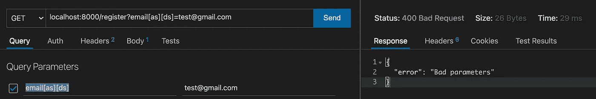
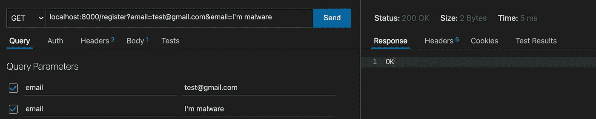

# 防止节点中的参数污染。射流研究…

> 原文：<https://levelup.gitconnected.com/prevent-parameter-pollution-in-node-js-f0794b4650d2>

HTTP 参数污染(简称 HPP)是由于传递多个同名参数而导致的漏洞。



参数污染

## 什么是参数污染？

**HTTP 参数污染**或 **HPP** 简而言之就是由于传递多个同名参数而出现的漏洞。没有 RFC 标准规定当传递多个参数时应该做什么。(维基百科)

## 如何节点。JS (Express)对参数污染做出反应

有各种传递参数的方法来引起问题，我们可以在下表中看到一些可能的方法:



传递参数的不同方式

既然我们已经认识到了某些人通过传递参数可能导致的各种形式和问题，我们可以说我们必须认真对待它。让我们看看验证器如何应对参数污染:

# 两个节点。JS 验证器对参数污染的反应

## 1-[**express-validator**](https://github.com/express-validator/express-validator)

这个库是最常见的 Javascript 库之一，它构建在 [validatorjs](https://github.com/validatorjs) 库之上。

我们有一个简单的快递服务器，我们想发送电子邮件，并在验证后，我们想做一些事情:

简单快捷的应用程序来检查 HPP

**当我们试图污染参数时会发生什么？**



请求的结果

正如你所看到的，如果我们传递第一个参数一个有效的电子邮件，我们可以绕过验证，猜猜我的控制台上有什么(代码的第 9 行)？


控制台日志结果

现在我们有一封可能保存到数据库中的无效电子邮件。让我们希望攻击者发送的是`I'm malware`或类似`<script>alert("I'm a happy hacker")</script>`的消息。

你可能会说我们要发送`POST`方法而不是 get，所以这是 POST 方法的例子:

过帐方法 HPP

让我们看看这次的结果是什么:



发布请求 HPP 结果

正如你所料，邮件日志是{ email:['[test@gmail.com](mailto:test@gmail.com)'，"我是同一个恶意软件"] }

## 2- [**Joi**](https://github.com/sideway/joi)

Joi 是另一个流行的验证库。让我们看看 Joi 在相同情况下的反应:

使用 Joi 进行 POST 方法验证

让我们看看结果



Joi 验证结果

我们可以看到 **Joi** 理解这不是一个字符串。同样，如果我们直接使用 **validator.js** ，我们将会看到这样的结果，而前面例子的问题是 **express-validator。**

# 如何才能防止参数污染？

我们有两种方法:

*   **使用库**
*   **实现我们自己的功能**

有一个很有用的库(可惜好像没有定期维护)叫做 [**hpp**](https://github.com/analog-nico/hpp)

使用它就像在公园里散步，我们可以将它作为中间件添加到我们的 express 应用程序中:

```
app.use(hpp());
```

添加这一行后，如果我们不止一次传递一个参数，它会将查询更改为:

```
GET /search?firstname=John&firstname=Alice&lastname=Doe=>req: {
    query: {
        firstname: 'Alice',
        lastname: 'Doe',
    },
    queryPolluted: {
        firstname: [ 'John', 'Alice' ]
    }
}
```

它将该参数移动到`queryPolluted`并取最后一个值。

你也可以添加一个异常，因为有时我们想要传递一个数组。

## 我们可以实现什么来防止参数污染？

让我们实现一个简单的中间件:

HPP 保护者示例

**hppProtector** 是负责处理 hpp 的中间件。我们简单地迭代参数，如果类型不是 string，我们检查，如果类型是 array，我们选择第一个(我们也可以选择最后一个)，如果类型是 object，我们发送一个错误的请求错误，因为用户发送类似这样的消息:`email[as][ds]=something`。 ***这只是一个简单的例子，不要依赖那个。***

让我们看看发送请求时会发生什么:



简单的 HPP 实现结果

在这种情况下，参数生成一个对象，我们发送错误的参数错误。

让我们多次发送一个参数:



将一个参数多次传递给我们的 HPP 实现

因为我们使用了数组的第一个元素，`req.query.email`的结果是`test@gmail.com`。

# 摘要

参数污染是由于传递多个同名参数而导致的漏洞。一些验证库容易受到这种攻击，所以我们应该使用库或我们自己的实现来处理这种攻击。

 [## Nodejs 安全- OWASP 备忘单系列

### 这个备忘单列出了开发人员在开发安全的 Node.js 应用程序时可以采取的措施。每个项目都有一个简短的…

cheatsheetseries.owasp.org](https://cheatsheetseries.owasp.org/cheatsheets/Nodejs_Security_Cheat_Sheet.html)