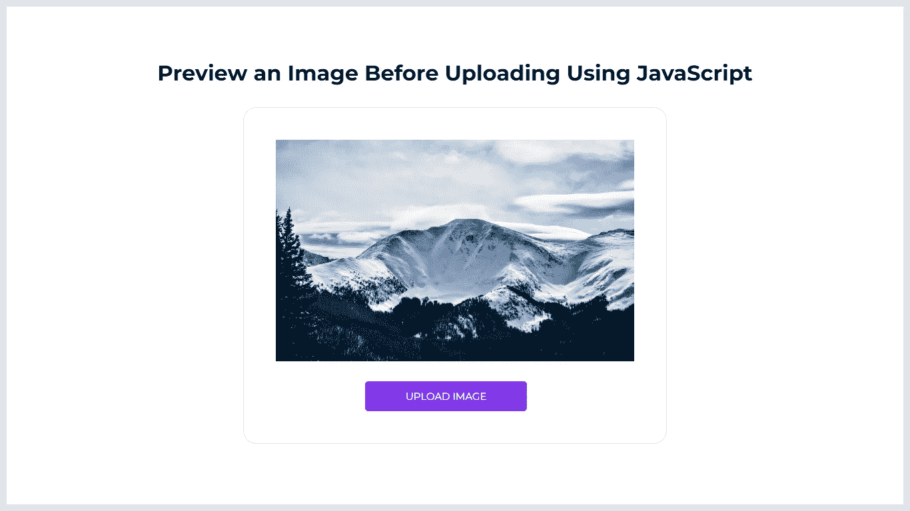

# 使用 JavaScript 上传前预览图像

> 原文：<https://levelup.gitconnected.com/preview-an-image-before-uploading-using-javascript-953557f54154>

## 学会在上传之前显示任何选中图像的预览。

在本文中，我将逐步演示如何从客户机上选择一幅图像，并在 HTML 元素中显示所选图像的预览。所有这些都将在 HTML、JavaScript 和 CSS(用于设计显示预览的元素)的帮助下发生。

# 预览图像的 3 个步骤

1.  使用 HTML 创建图像预览的基本布局。
2.  使用 CSS 设计图像预览部分。
3.  使用 JavaScript 显示图像的预览。

# 步骤 1:使用 HTML 创建图像预览的基本布局

添加一个带有名为`image-preview-container`的类的 div 元素。在其中，添加另一个 div 元素，并使用一个名为`preview`的类。这个元素将包含一个 ID 名为`preview-selected-image`的`img`标签。这将用于显示所选图像的预览。接下来，添加一个`label`和`input`类型的文件，从文件系统中选择一个图像。在 CSS 的帮助下，`label`元素将作为一个按钮。单击它时，将会打开一个弹出框来浏览图像的文件系统。当您选择一幅图像并按下`OK`按钮时，将会调用一个名为`previewImage()`的函数来捕捉所选图像。

将下面的代码片段添加到要显示图像预览的文件中，并保存它。

# 步骤 2:使用 CSS 设计图像预览部分

现在，我们需要设计将显示图像预览的部分。将以下代码片段添加到页面上的`style`元素或外部 CSS 文件中，并保存它。

# 步骤 3:使用 JavaScript 显示图像的预览

现在，我们需要创建一个箭头函数来捕获选中的图像并显示它的预览。请参考下面的代码片段，了解如何使用 JavaScript 显示图像预览。

# 结果

太棒了。您已经通过 3 个简单的步骤学习了如何使用 JavaScript 预览图像。

> 如果你喜欢阅读这篇文章，并发现它对你有用，那么请鼓掌，与你的朋友分享，并关注我以获得我即将发布的文章的更新。你可以在 [LinkedIn](https://www.linkedin.com/in/tararoutray/) 上联系我。