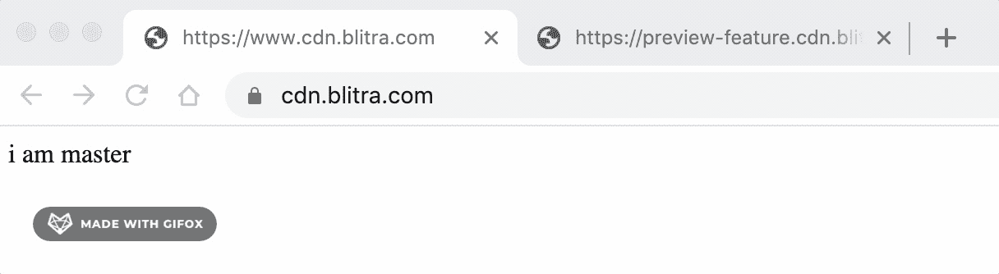
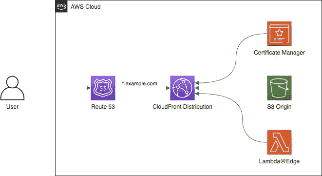
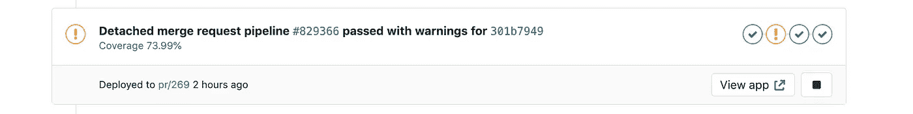
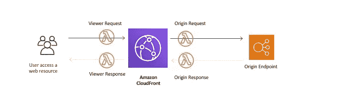

# 用 Lambda@Edge 在 AWS 中创建无限预览环境

> 原文：<https://levelup.gitconnected.com/preview-environments-in-aws-with-cloudfront-and-lambda-edge-7acccb0b67d1>

## 针对托管在 CloudFront/S3 上的静态站点，在每个分支机构轻松部署一个环境


大多数 web 开发团队的目标是转移到[持续部署](https://semaphoreci.com/community/tutorials/elements-of-a-continuous-deployment-workflow)，有一件事可以带来巨大的不同，那就是每个特性分支都有自己的部署 URL(例如 my-feature.example.com)。

任何熟悉 [Vercel](https://vercel.com) 的人都知道这些预览环境对开发团队有多有用。Vercel ， [AWS Amplify Console](https://aws.amazon.com/amplify/console/) 和其他，在大多数项目中都做得很好，但是，一旦你有了越来越多的需求，比如多个来源，不同的缓存行为等等，你可能需要自己管理一个 CloudFront 实例。

> 对于拥有 QA 团队的大型项目，拥有一个“每个特性”的专用 URL 意味着你不会受到一些静态环境的限制，比如“测试”和“试运行”。您可以扩展您的开发团队，而不会影响您严格的 QA 需求。

使用 Terraform，我将向您展示，我认为这是一种使用 AWS 实现预览 URL 的好方法，无需额外的资源——无需构建新的 CloudFront 发行版，也无需为每个功能分支创建新的 DNS 记录。



这就是我们将要建造的。使用 AWS 的简单预览环境。

我们将使用以下资源。

*   [我们 CDN 的亚马逊 CloudFront](https://aws.amazon.com/cloudfront/)
*   [亚马逊 S3](https://aws.amazon.com/s3/) 为对象存储
*   [Lambda@Edge](https://aws.amazon.com/lambda/edge/) 用于 URL 重写
*   [Route 53](https://aws.amazon.com/route53/) 获取我们的 DNS 记录

# 方法

我将使用通配符域。首先，我们将使用 ACM 创建 SSL 证书，然后将通配符域附加到 CloudFront，并在 Route 53 中创建别名记录，最后添加 Lambda@Edge 函数将我们的动态子域重定向到 S3 上的正确路径。



为简单起见，我们将对所有阶段和环境使用单一 AWS 帐户。

> 这种设计的真正内容是在 Lambda 函数中，所以如果你熟悉 CloudFront 的设置，可以跳过这篇文章的前半部分。

# 通配符 SSL 证书

我将用 terraform 创建这个。

```
**resource "aws_acm_certificate" "main"** {
  domain_name               = local.cdn_domain_name
  subject_alternative_names = [local.wildcard_domain]
  validation_method         = **"DNS"

  lifecycle** {
    create_before_destroy = **true** }
}
```

这创建了证书，但是 Amazon 需要验证我们拥有这个域名，我们可以通过用 Route 53 添加 DNS 记录来自动完成。

```
**resource "aws_route53_record" "validation"** {
  name    = aws_acm_certificate.main.domain_validation_options[0].resource_record_name
  type    = aws_acm_certificate.main.domain_validation_options[0].resource_record_type
  records = [aws_acm_certificate.main.domain_validation_options[0].resource_record_value]

  zone_id         = data.aws_route53_zone.external.zone_id
  ttl             = 60
  allow_overwrite = **true** }
```

最后增加一个验证步骤。

```
**resource "aws_acm_certificate_validation" "main"** {
  certificate_arn = aws_acm_certificate.main.arn
  validation_record_fqdns = [
    aws_route53_record.validation.fqdn
  ]

  **timeouts** {
    create = **"10m"** }
}
```

# 亚马逊 S3

亚马逊 S3 是存储 HTML/CSS/JS 等静态对象的绝佳场所。我们只需要一个基本的网站托管桶打开。你可以选择使用一个[源访问身份](https://docs.aws.amazon.com/AmazonCloudFront/latest/DeveloperGuide/private-content-restricting-access-to-s3.html)来进一步保护你的文件，然而在大多数情况下，网站托管在 S3 是完全可以的。

```
**resource "aws_s3_bucket" "bucket"** {
  bucket = local.bucket_name
  acl    = **"public-read"** policy = data.aws_iam_policy_document.bucket.json

  **website** {
    index_document = **"index.html"** error_document = **"error.html"** }
}
**data "aws_iam_policy_document" "bucket"** {
  **statement** {
    actions = [**"s3:GetObject"**]
    resources = [
      **"arn:aws:s3:::${local.bucket_name}"**,
      **"arn:aws:s3:::${local.bucket_name}/*"** ]
    **principals** {
      identifiers = [**"*"**]
      type        = **"*"** }
  }
}
```

# 部署管道

这里没有提到的是 CI 渠道。您的构建过程应该正常运行，但是您的部署应该使用 git branch slug 作为 bucket 中的关键字前缀。

GitLab 的部署作业示例如下。

```
**deploy:
  stage**: deploy
  **script**:
    - S3="s3://example-bucket/$CI_COMMIT_REF_SLUG"
    - aws s3 rm $S3 --recursive
    - aws s3 cp $S3 --recursive
  **environment**:
    **name**: $CI_COMMIT_REF_SLUG
    **url**: [https://$CI_COMMIT_REF_SLUG.example.com](/$CI_COMMIT_REF_SLUG.example.com)
```

请注意我们是如何动态设置环境 url 的[，这对于拉请求来说是一个很好的特性，因为您可以看到部署历史，并且包含了一个方便的链接。](https://docs.gitlab.com/ee/ci/environments/)



在本例中，我将环境设置为 PR 号

# λ@边缘

这是关键部分，如果你不熟悉 Lambda@Edge，它实际上是一个 Lambda 函数，可以自动全局复制。然后，您可以将它附加到 CloudFront 上的 4 个不同事件中。



为了将请求定向到正确的特性，我们需要检查请求，以确定将请求定向到的 S3 文件夹。

假设我们希望所有的特征环境都以 *preview 为前缀。S* o 对于我们的*开发*目录，这可能是`preview-develop.example.com` **，**但是对于所有不以*预览*(例如`www.example.com`)开始的子域，我们应该将它们指向主目录。

为此，我们需要创建一个 Lambda 并将其附加到 CloudFront 的 Origin 请求事件。我选择这样做的方法是，通过用分支名称作为前缀来覆盖原始路径。

```
exports.handler = (event, context, callback) => {
  **const** { request } = event.Records[0].cf;

  **try** {
    **const** host = request.headers[**'x-forwarded-host'**][0].value;
    **const** branch = host.match(/^preview-([^\.]+)/)[1];
    request.origin.*custom*.path = **`/**${branch}**`**;
  } **catch** (e) {
    request.origin.*custom*.path = **`/master`**;
  }

  **return** callback(**null**, request);
};
```

这还不行，因为请求对象需要一个名为`x-forwarded-host`的头，默认情况下，这个头在原始请求中不可用，但是可以在查看器请求事件 lambda 中写入这个头。所以我们需要为这个阶段创建一个 lambda。

```
exports.handler = (event, context, callback) => {
  **const** { request } = event.Records[0].cf;

  request.headers[**'x-forwarded-host'**] = [
    {
      key: **'X-Forwarded-Host'**,
      value: request.headers.host[0].value
    }
  ];

  **return** callback(**null**, request);
};
```

为了简洁起见，我在这里没有包括 Terraform 代码，但是我创建了一个简单的 git repo，您可以自己挖掘并运行它。检查一下我的 lambda 模块，看看它需要哪些权限才能让 CloudFront 运行 lambdas。

[](https://github.com/eknowles/aws-cloudfront-preview-domains) [## eknowles/AWS-cloudfront-预览-域

### 此报告包含 Terraform 代码，用于构建具有特征分支子域的 CDN。我已经将 HCL 代码设置为…

github.com](https://github.com/eknowles/aws-cloudfront-preview-domains) 

# 亚马逊云锋

亚马逊 CloudFront 是一个快速内容交付网络(CDN)，它非常适合将 web 应用缓存到边缘位置。在我们的例子中，我们将创建一个 CloudFront 发行版，它只有一个 S3 源。

```
**resource "aws_cloudfront_distribution" "cdn"** {
  enabled             = **true** default_root_object = **"index.html"** price_class         = **"PriceClass_100"** aliases             = [local.cdn_domain_name, local.wildcard_domain]

  **viewer_certificate** {
    acm_certificate_arn      = aws_acm_certificate.main.arn
    ssl_support_method       = **"sni-only"** minimum_protocol_version = **"TLSv1.1_2016"** }

  **origin** {
    domain_name = aws_s3_bucket.bucket.website_endpoint
    origin_id   = **"app"

    custom_origin_config** {
      http_port              = 80
      https_port             = 443
      origin_protocol_policy = **"http-only"** origin_ssl_protocols   = [**"TLSv1"**, **"TLSv1.1"**, **"TLSv1.2"**]
    }
  }

  **default_cache_behavior** {
    target_origin_id       = **"app"** allowed_methods        = [**"DELETE"**, **"GET"**, **"HEAD"**, **"OPTIONS"**, **"PATCH"**, **"POST"**, **"PUT"**]
    cached_methods         = [**"GET"**, **"HEAD"**]
    min_ttl                = 0
    default_ttl            = 0 # 3600
    max_ttl                = 0 # 86400
    viewer_protocol_policy = **"redirect-to-https"

    lambda_function_association** {
      event_type   = **"origin-request"** lambda_arn   = module.origin_request_lambda.qualified_arn
      include_body = **false** }

    **lambda_function_association** {
      event_type   = **"viewer-request"** lambda_arn   = module.viewer_request_lambda.qualified_arn
      include_body = **false** }

    **forwarded_values** {
      query_string = **false** headers      = [**"x-forwarded-host"**]

      **cookies** {
        forward = **"none"** }
    }
  }

  **restrictions** {
    **geo_restriction** {
      restriction_type = **"none"** }
  }
}
```

这里有很多东西需要理解，CloudFront 是一个很大的资源，可能需要 10 分钟来更新，我只包括了需要的东西。根据您的应用，您可以根据自己的喜好设置 CDN，为不同的路由设置不同的缓存行为，但是请注意`forwarded_values` 部分，务必将`x-forwarded-host` 报头列入白名单，以便请求 lambda 可以看到这些值。

关于别名，我已经包括了裸域名`example.com`和通配符域名`*.example.com`，这很重要，所以你的 CDN 将解析这些请求。

我已经假设你在一个非生产 AWS 帐户中运行这个，所以我已经将 TTL 设置为`0`

# 使用 Route53 添加 DNS 记录

最后，要将这一切联系在一起，你需要确保用户可以路由到你的 CDN。在这里，我们简单地添加两个 A 记录，它们是您的 CloudFront 发行版的别名，一个用于通配符，一个用于裸域。

```
**resource "aws_route53_record" "wildcard_cdn"** {
  zone_id = data.aws_route53_zone.external.zone_id
  name    = local.wildcard_domain
  type    = **"A"

  alias** {
    name                   = aws_cloudfront_distribution.cdn.domain_name
    zone_id                = aws_cloudfront_distribution.cdn.hosted_zone_id
    evaluate_target_health = **false** }
}
**resource "aws_route53_record" "naked_cdn"** {
  zone_id = data.aws_route53_zone.external.zone_id
  name    = local.cdn_domain_name
  type    = **"A"

  alias** {
    name                   = aws_cloudfront_distribution.cdn.domain_name
    zone_id                = aws_cloudfront_distribution.cdn.hosted_zone_id
    evaluate_target_health = **false** }
}
```

# 包扎

所以我们有它！现在，您应该对如何使用通配符域为您的 web 应用程序创建无限预览环境有了很好的理解。下一步是什么？通过对照白名单检查请求 IP，您可以使用查看器请求 lambda 来保护您的预览环境。在 AWS 博客上了解更多关于 Lambda@Edge 的信息。

[](https://aws.amazon.com/blogs/networking-and-content-delivery/category/networking-content-delivery/lambdaedge/) [## Lambda@Edge |网络和内容交付

### 游戏技术基础设施和自动化物联网机器学习管理工具媒体消息传递和定位…

aws.amazon.com](https://aws.amazon.com/blogs/networking-and-content-delivery/category/networking-content-delivery/lambdaedge/) 

我希望你已经发现这是有用的。有许多方法可以安排您的非生产环境，这只是其中一种，如果您有任何问题、顾虑或改进，请留下评论或在 Twitter 上关注我。 [@NedKnowles](https://twitter.com/nedknowles) 。

所有的 terraform 源代码和测试数据都可以在 GitHub 上找到。

[](https://github.com/eknowles/aws-cloudfront-preview-domains) [## eknowles/AWS-cloudfront-预览-域

### 此报告包含 Terraform 代码，用于构建具有特征分支子域的 CDN。我已经将 HCL 代码设置为…

github.com](https://github.com/eknowles/aws-cloudfront-preview-domains)