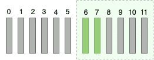

# 光标分页的上一页标记

> 原文：<https://levelup.gitconnected.com/previous-page-token-for-cursor-pagination-d32429f1ea3b>


图片来源:[https://www . qwertee . io/blog/PostgreSQL-b-tree-index-explained-part-1/](https://www.qwertee.io/blog/postgresql-b-tree-index-explained-part-1/)

在我们开始之前，重要的是要注意，通过甚至不包括前一页按钮的 GUI(图形用户界面)设计，可以消除对前一页遍历的需要。无限卷轴就是一个例子。另一个是机器接口设计，其中客户机只是想运行整个结果集。**如果光标分页是一个陌生的话题，请访问下面的帖子，因为这是一个扩展**:

*   [如何像 Pro](https://medium.com/swlh/how-to-implement-cursor-pagination-like-a-pro-513140b65f32) *一样实现光标分页(注 1:本帖底部的时间复杂度分析对于 1 列光标比链接中的更精确。注 2:我将对他们关于 2 列光标时间复杂度分析的准确性的帖子发表评论)*
*   [在空闲时发展 API 分页](https://slack.engineering/evolving-api-pagination-at-slack/)
*   [基于光标的多列分页](https://stackoverflow.com/questions/38017054/mysql-cursor-based-pagination-with-multiple-columns)

第一个链接很好地解释了如何实现前一页遍历，然而，不同的外观可以帮助一些人更好地理解发生了什么。

# 问题是

游标分页 SQL 查询依赖于*索引列*和比较运算符，而不是`OFFSET`子句。当遍历递增(`ASC`)结果集的*下一页*时，这是非常简单的:

```
SELECT * FROM entries WHERE (myCol > 5) ORDER BY myCol ASC LIMIT 2;
```



下一页:

```
SELECT * FROM entries WHERE (myCol > 7) ORDER BY myCol ASC LIMIT 2;
```


当遍历递减(`DESC`)结果集的*下一页*时，这也很简单:

```
SELECT * FROM entries WHERE (myCol < 5) ORDER BY myCol DESC LIMIT 2;
```


下一页:

```
SELECT * FROM entries WHERE (myCol < 3) ORDER BY myCol DESC LIMIT 2;
```


然而，遍历*前几页*变得很棘手，因为当你在 SQL 查询中提供一个约束(例如`>`、`<`)，SQL 数据库引擎(例如 Postgres)会返回最左边的结果:

```
SELECT * FROM entries WHERE (myCol < 8) ORDER BY myCol ASC LIMIT 2;
```


我们想要 6 和 7！

# 解决方案

正确实现前一页遍历的解决方案是颠倒结果集的顺序(ASC vs DESC ),这样你想要的结果就在光标的右边。然后，一旦应用了限制，再次反转排序，使其与请求的排序相匹配:

```
SELECT pagination.* FROM(SELECT * FROM entries WHERE (myCol < 8) ORDER BY myCol DESC LIMIT 2) AS pagination ORDER BY myCol ASC;
```

*注意:CTE(公共表表达式)也可以作为嵌套查询的替代。*


再次返回上一页:

```
SELECT pagination.* FROM(SELECT * FROM entries WHERE (myCol < 6) ORDER BY myCol ASC LIMIT 2) AS pagination ORDER BY myCol DESC;
```


# 时间复杂性分析

**前一页遍历**与**下一页遍历**相比的性能开销可以忽略不计——这是`O(log(N) + 2L)`与`O(log(N) + L)`的区别，其中`N`是表的大小，`L`是限制的大小(从技术上讲，如果`N <= LIMIT` ，`L`可能等于`N`)。此外，`L`甚至可以被认为是一个常量，而不是一个无限的变量，因为页面大小在它迅速突破消息/有效负载大小限制之前只能有这么大。`Log(N)`是 DB 引擎遍历索引树以找到满足`WHERE`子句的叶节点所花费的时间。在`L`非常小而`N`非常大的情况下，`log(N)`可能大于`L`。值得注意的是，在这些查询中不需要排序，因为索引已经以排序的方式维护了数据(在索引树的叶节点中)。在前面的页面遍历中，由于上面提到的问题，需要进行与限制大小相等的第二次扫描来实现所需的顺序。